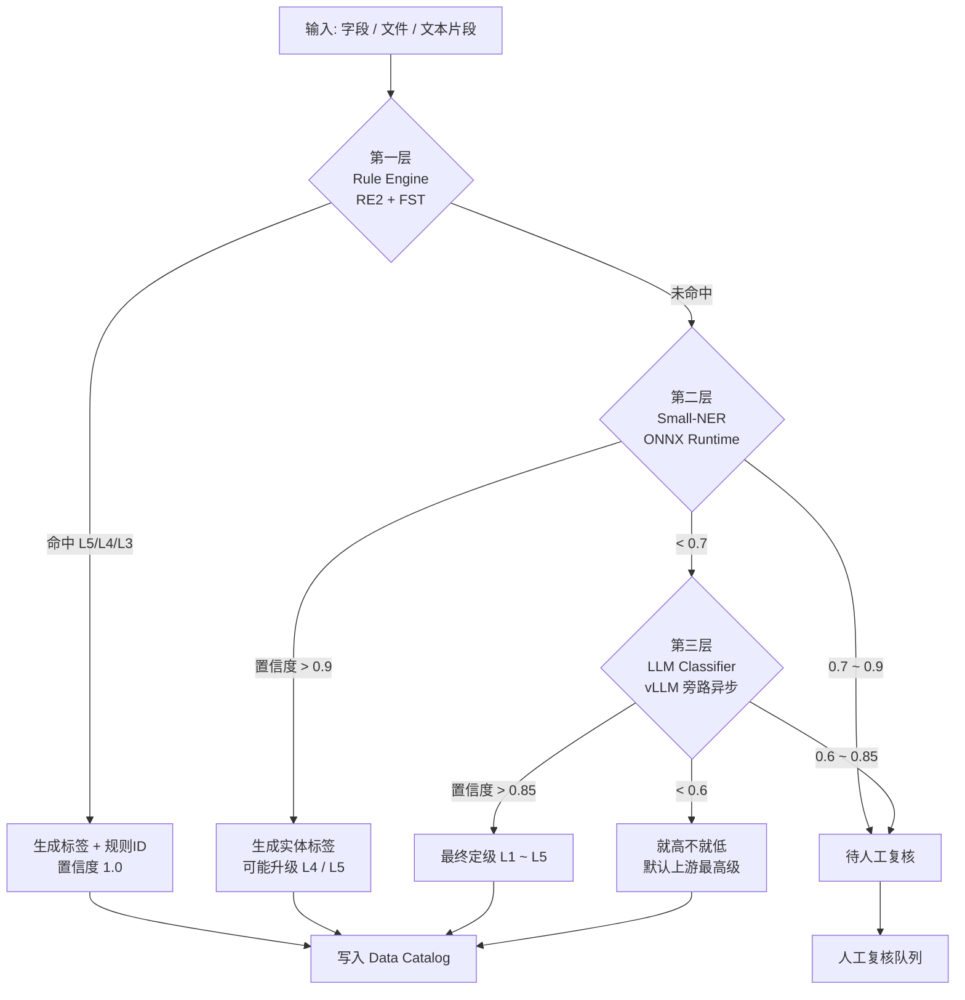
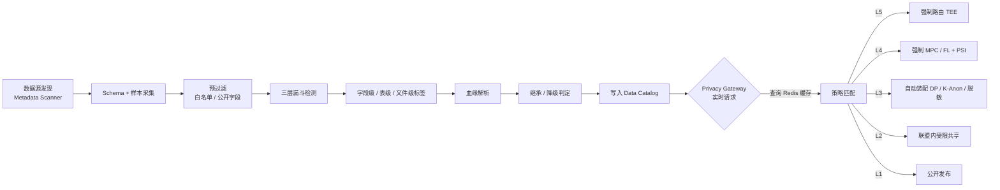
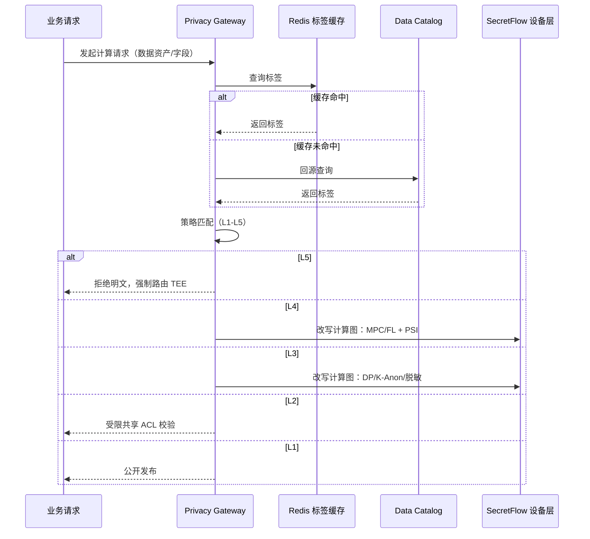
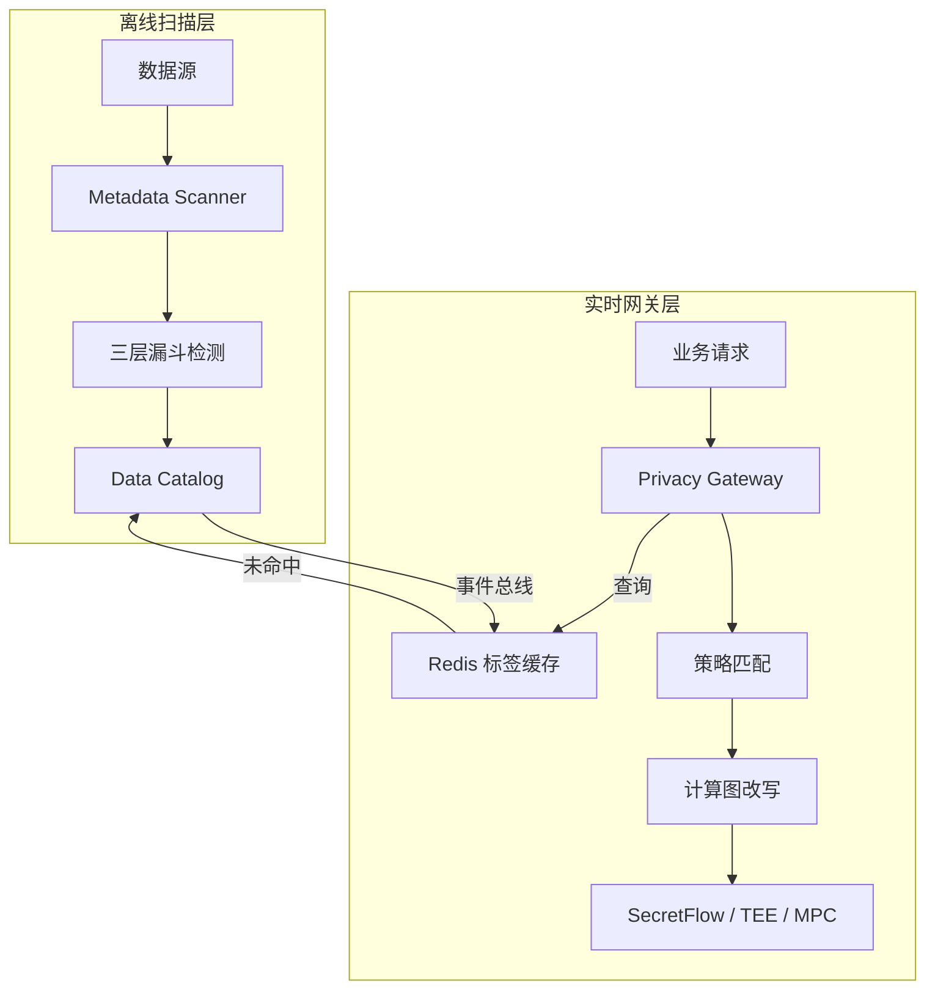
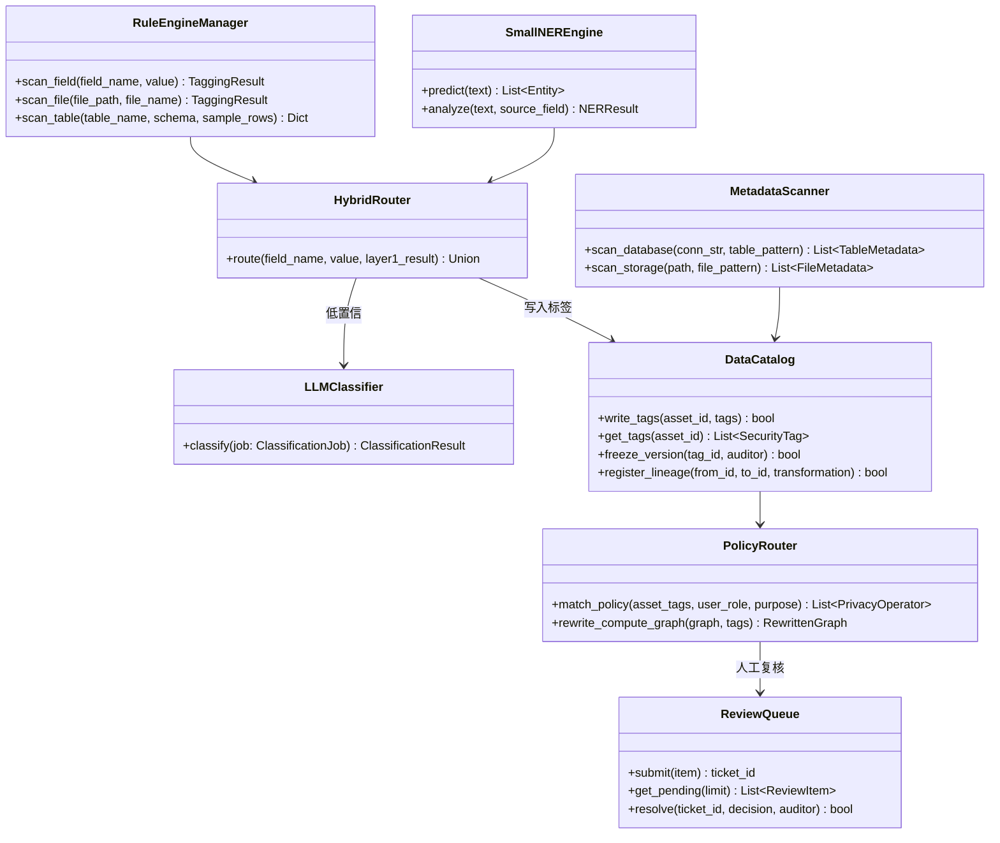

#  **总体设计原则**

1. **字段级打标，表/文档级就高不就低**：最小识别单元为字段（列）或文件片段，向上聚合时取最高敏感等级。
2. **高召回优先，低误报兜底**：第一层规则引擎追求**100%召回**（宁可错标不可漏标），后续层逐步精修降低误报。
3. **标签即策略（Tag-as-Policy）**：分类分级标签必须可被底层计算调度器（RayFed/TEE Device Layer）直接消费，实现策略自动下发。
4. **血缘继承与版本冻结**：数据衍生关系中的标签自动继承，且标签一旦通过人工审计确认即版本冻结，防止漂移。

------

#  五级分类标准矩阵（Policy Matrix）

| 敏感等级        | 数据类型                                         | 典型示例                                                     | 自动化识别规则                                               | 下游计算路由策略                                             |
| --------------- | ------------------------------------------------ | ------------------------------------------------------------ | ------------------------------------------------------------ | ------------------------------------------------------------ |
| **L5 极高风险** | 基因序列、遗传信息、罕见病原始样本、生物特征模板 | 基因测序文件（BAM/VCF/FASTQ）、BRCA1/TP53突变位点、SNP芯片数据、原始脑电/指纹模板 | ① 文件格式哈希匹配（BAM/VCF头信息）；② 字段名/列名匹配基因字典（BRCA1, rs编号）；③ 序列模式匹配（ATCG重复长度>50）；④ 大模型语义推断基因相关罕见病 | **强制入TEE（Intel SGX/TDX/AMD SEV）**，端到端全链路加密（TLS 1.3 + 内存加密）；禁止联邦学习明文聚合；必须出具远程证明（Remote Attestation） |
| **L4 高风险**   | 敏感病种完整病历、高精度个人标识、精神类疾病     | HIV（ICD-10: B20-B24）、精神分裂症（F20-F29）、完整住院病历（病程记录+医嘱）、高精度轨迹数据 | ① ICD-10/ATC/LOINC编码区间匹配（如B20→L4）；② NLP语义识别敏感病史（"抗逆转录病毒治疗"、"阳性"）；③ 多字段组合判定（姓名+病种+时间=完整病历） | **联邦学习（FL）/ MPC（安全多方计算）**，数据可用不可见；禁止明文导出；计算节点需通过准入审计 |
| **L3 中风险**   | PII（个人身份信息）、基础诊疗记录、检验指标数值  | 身份证号、手机号、医保卡号、血常规/生化指标、门诊处方（不含敏感病种） | ① 正则匹配+校验和验证（身份证Luhn校验、手机号号段）；② 字典匹配常规化验单表头（WBC/RBC/ALT）；③ 轻量NER识别患者姓名、地址 | **差分隐私（DP）加噪**（ε≤1.0）或 **k-匿名（k≥5）**；脱敏/掩码后输出；允许在受控VPC内明文计算 |
| **L2 低风险**   | 去标识化后的统计级数据、科室运营数据             | 脱敏后的病种分布（无个体特征）、药品库存量、设备使用率       | ① 匹配非个人属性字段（病床周转率、财务科目）；② 反识别风险评估（K-匿名/ L-多样性检验通过） | **明文受限共享**，仅限院内或联盟内授权节点访问；可参与常规联邦学习 |
| **L1 公开级**   | 医院公开运营数据、完全脱敏的统计指标             | 年度门诊总量、公开财务报告、科普文章                         | ① 白名单字典匹配（公开报表字段）；② 人工审核确认发布         | **公开发布**，无限制                                         |

------

#  混合检测引擎架构（Hybrid Detection Engine）

采用**三层漏斗式**架构，按**速度由快到慢、成本由低到高**逐级过滤。



### 3.1 第一层：高速规则与字典引擎（Rule & Regex Engine）

**定位**：处理结构化数据（RDBMS表、CSV、标准HL7/FHIR消息），追求**微秒级延迟**。

**技术栈**：

- 正则引擎：基于 **RE2**（Google）或 **Rust regex crate** 编写，保证线性时间复杂度，防止ReDoS。
- 字典匹配：本地加载 **ICD-10/ATC/LOINC/SNOMED CT** 标准字典，采用 **Double Array Trie** 或 **Perfect Hash（FST）** 结构，实现O(1)或O(长度)匹配。

**识别目标与规则**：

| 数据类型         | 规则示例                                                     | 分级映射 |
| ---------------- | ------------------------------------------------------------ | -------- |
| 中国大陆身份证号 | `^[1-9]\d{5}(18|19|20)\d{2}(0[1-9]|1[0-2])(0[1-9]|[12]\d|3[01])\d{3}[\dXx]$` + 加权校验和 | L3       |
| 手机号           | 号段字典（13x-19x）+ 正则                                    | L3       |
| 医保卡号         | 各地医保卡校验规则（如上海医保卡9位+1位校验）                | L3       |
| ICD-10编码       | 区间匹配：`B20-B24`→L4；`F20-F29`→L4；`C**`（恶性肿瘤）→L4；其余常规编码→L3 | L3/L4    |
| 基因相关字段名   | 列名/文件名匹配字典：`BRCA1`, `TP53`, `rs\d+`, `SNP`, `CNV`, `genome` | L5       |
| 基因文件头信息   | BAM文件头（`^@SQ` + 序列名）、VCF文件头（`##fileformat=VCF`） | L5       |

**输出**：为每个字段/文件生成**初始标签集合**（如 `{L3_PII, L3_Medical}`），并附带**规则命中ID**（用于溯源）。

------

### 3.2 第二层：轻量级 NLP 模型（Small-NER）

**定位**：处理半结构化文本（出院小结、手术记录、病理报告）和规则漏报的非结构化文本。

**技术栈**：

| 情况                                  | 推荐模型               | 推荐部署方式                             | 单条延迟   |
| ------------------------------------- | ---------------------- | ---------------------------------------- | ---------- |
| **无标注数据，想直接上线**            | **RaNER** (ModelScope) | ONNX → MindSpore Lite / Paddle Inference | **<<30ms** |
| **无标注数据，需灵活schema**          | **UIE-medical-base**   | Paddle Inference（原生）或 ONNX          | **<<20ms** |
| **有CCKS/CHIP标注数据，追求极限精度** | **MedBERT** + 自研CRF  | Paddle Inference + MKL-DNN               | **<<35ms** |
| **昇腾NPU信创环境**                   | 上述任一模型           | CANN ATC 编译为 OM                       | **<<15ms** |

#### **阿里达摩院 RaNER（医疗NER已微调）**

- 模型：damo/nlp_raner_named-entity-recognition_chinese-base-cmeee 
- 底座：StructBERT（与BERT-base同规模，约102M参数） 
- 特点：已经在CMeEE（中文医疗命名实体识别数据集）上完成端到端微调，直接输出疾病、药物、解剖部位等实体。 
- 使用方式：通过 ModelScope 或 AdaSeq 一行命令调用，也可导出 ONNX 后接入国产部署工具。
- 部署：导出 ONNX → 用 MindSpore Lite 或 Paddle Inference 加载，INT8量化后体积约 90MB，单条延迟 <<30ms。

RaNER（ModelScope）

```
from modelscope.pipelines import pipeline
from modelscope.utils.constant import Tasks

ner_pipeline = pipeline(
    Tasks.named_entity_recognition,
    model='damo/nlp_raner_named-entity-recognition_chinese-base-cmeee'
)
result = ner_pipeline("患者因持续性胸痛入院，诊断为急性心肌梗死。")
```

#### **百度UIE-medical-base（PaddleNLP）**

- **模型**：`uie-medical-base`
- **底座**：ERNIE 3.0（12-layer, 768-hidden，约**110M参数**）
- **特点**：百度在医疗领域数据上专门预训练+微调的通用信息抽取模型，支持**零样本医疗NER**。只需定义 schema（如 `['疾病', '药物', '手术']`）即可直接抽取，无需再训练。
- **性能**：在医疗测试集上，5-shot微调后 F1 可达 **74.55%**，0-shot 也有 **70.92%**。
- **部署**：原生支持 **Paddle Inference** 服务端部署，也可通过 `paddle2onnx` 导出 ONNX 后转 **CANN OM**（昇腾）或 **RKNN**（瑞芯微）。FP16 推理单条延迟 **<<20ms**。

```
from paddlenlp import Taskflow

# 零样本直接抽取医疗实体
schema = ['疾病', '药物', '解剖部位', '手术']
ie = Taskflow('information_extraction', 
              schema=schema, 
              model='uie-medical-base')
result = ie("患者口服阿司匹林，行冠状动脉支架植入术。")
```


- 实体标签体系：
  - `[PII_NAME]`：患者姓名、医生姓名
  - `[PII_ID]`：规则未覆盖的模糊身份证号（如"身份证号：略"）
  - `[SENSITIVE_DISEASE]`：HIV、精神分裂症、毒品依赖等
  - `[GENOMIC_HINT]`：非标准格式描述的基因信息（如"BRCA1突变阳性"）
  - `[MEDICATION]`：用药记录（用于ATC编码映射）

**解释：****PII** 是 **Personally Identifiable Information** 的缩写，中文译为**个人可识别信息**（或**个人身份信息**）。

在医疗NER（命名实体识别）的标签体系中，**PII 泛指任何能够单独或与其他信息结合后识别出特定自然人身份的数据**

**识别逻辑**：

- 若文本中 `[SENSITIVE_DISEASE]` 实体出现，且与 `[PII_NAME]` 或 `[PII_ID]` 同段落 → **升级为L4**。
- 若 `[GENOMIC_HINT]` 出现 → **标记为L5待确认**（送入第三层）。

**置信度机制**：

- 模型输出每个实体的 **BIO概率** 和 **实体分类概率**。
- 若某实体分类概率 **>0.9**，直接采纳并打标。
- 若概率在 **0.7~0.9** 之间，标记为**待人工复核**（进入审计队列）。
- 若概率 **<<0.7**，送入第三层大模型进行二次判别。

------

### 3.3 第三层：大模型语义判别器（LLM Classifier）

**定位**：处理**疑难杂症**——极度非结构化长文本（OCR后的影像报告、手写病历扫描件）、跨段落语义推断、以及第一二层置信度不足的数据。

**技术栈**：

- 模型：本地私有化部署的 Medical-Qwen3-14B 或 **Baichuan-Med**（医疗垂类大模型）。
- 部署方式：**旁路异步调用**（非阻塞），通过消息队列（Kafka/RabbitMQ）解耦，避免拖慢主流程。
- 提示工程（Prompt）：要求模型输出**结构化JSON**，禁止自由文本。

**判别场景**：

1. **复杂影像报告**：OCR文本中无明确关键词，但描述"右乳肿块，BI-RADS 5级，建议BRCA基因检测" → 推断含L5基因测序建议。
2. **跨段落关联**：第一段写"患者长期抗病毒治疗"，第二段写"CD4计数200" → 推断为HIV（L4），即使未出现"HIV"字样。
3. **罕见病推断**：描述"反复低血糖、巨舌、内脏肥大" → 推断为BWS综合征（L5级遗传相关）。

**输入输出格式**：

```
// 输入（片段）
{
  "text": "患者女性，35岁，BRCA1突变携带者，建议行预防性乳腺切除...",
  "context": "病理报告",
  "upstream_confidence": 0.65,
  "upstream_labels": ["L5_Genomic_HINT"]
}

// 输出（结构化）
{
  "final_level": "L5",
  "sub_category": "Genomic_Predisposition",
  "confidence": 0.94,
  "reasoning": "文本明确提及BRCA1突变携带者，属于遗传易感性信息",
  "suggested_action": "TEE_MANDATORY",
  "needs_human_review": false
}
```

**降级策略**：

- 若大模型置信度 **>0.85**，直接采纳，更新元数据目录。
- 若置信度 **0.6~0.85**，标记为**"L?-待人工定级"** ，冻结该数据流转，触发人工审计工单。
- 若大模型无法判别（置信度 **<<0.6**），默认**就高不就低**（按上游最高标签执行，或暂定为L3），并加入低优先级复核队列。

------

#  自动化执行流水线（Execution Pipeline）

分类分级是**伴随数据全生命周期**的持续过程，而非一次性扫描。



### 4.1 元数据发现（Metadata Discovery）

**扫描器（Scanner）**：

- **数据源适配器**：支持 MySQL、PostgreSQL、Oracle、SQL Server、Hadoop（Hive/Impala）、对象存储（S3/OSS/HDFS）、Kafka Topic。
- **采样策略**：
  - 结构化数据：抽取表结构（Schema）+ 前 **1000 行**样本 + 随机抽样 **5%** 行。
  - 非结构化文件：按文件类型（PDF/DICOM/TXT）采样，优先扫描**新建/修改**文件。
- **Schema 解析**：自动识别列名语义（如 `patient_name` → 预标L3）、文件扩展名（`.bam` → 预标L5）。

### 4.2 异步扫描与打标（Scanning & Tagging）

**流水线步骤**：

1. **预过滤**：基于文件头/列名快速排除明显公开数据（如 `hospital_public_report` → 预标L1）。
2. **三层漏斗检测**：按 L1→L2→L3→L4→L5 顺序匹配，一旦命中高等级即停止向下（但保留低等级标签作为附加属性）。
3. **标签生成**：
   - **字段级标签**：`L3_PII_ID`、`L4_DISEASE_HIV`、`L5_GENOMIC_BRCA1`
   - **表级标签**：取该表所有字段的最高等级（如含一个L4字段 → 整张表标记为L4，但元数据保留字段级明细）。
   - **文件级标签**：对非结构化文件，按段落/切片打标后取最高等级。

**质量门控**：

- 每张表/文件必须经过至少**两层引擎**确认（规则+NER，或规则+LLM）。
- 单引擎命中的高敏感标签（如仅规则命中L5）必须触发**二次确认**（NER或LLM）。

### 4.3 血缘与继承（Lineage & Inheritance）

**血缘图谱构建**：

- 通过 SQL 解析（Apache Calcite）、Spark 执行计划分析、或 ETL 作业日志，自动构建 `表A → 算子 → 表B` 的血缘关系。
- 支持字段级血缘（Column-Level Lineage），识别 `表A.身份证号 → 表B.脱敏身份证号` 的变换路径。

**继承规则**：

| 场景                      | 继承规则                                                     |
| ------------------------- | ------------------------------------------------------------ |
| 直接复制/子查询           | 子表自动继承父表最高等级标签                                 |
| 经过官方脱敏算子          | 若通过 `K-Anonymity`、`差分隐私`、`哈希加盐` 等白名单算子处理，且通过**反识别风险评估**（K≥5, L-多样性≥2），可降级（如L3→L2） |
| 聚合统计（COUNT/SUM/AVG） | 若聚合粒度满足K-匿名（如按科室月度聚合），可降级至L2或L1     |
| 人工审核覆盖              | 数据管理员可手动调整标签，但需留痕审计，且调整后的标签版本冻结 |

**反识别风险评估（Re-identification Risk Assessment）**：

- 对降级后的数据运行 **K-匿名、L-多样性、T-接近性** 检验。
- 若检验失败，拒绝降级，保持原标签。

### 4.4 元数据注册中心（Data Catalog）

**架构**：

- 采用 **Apache Atlas** 或自研元数据服务，存储数据资产的安全视图。
- 核心数据模型：
  - `Asset`（表/文件/Topic）→ 包含 `SecurityTags[ ]`
  - `SecurityTag`（标签）→ 包含 `level`, `category`, `confidence`, `source_engine`, `version`, `auditor`
  - `LineageEdge`（血缘边）→ 包含 `transformation_type`, `de_identification_proof`

**API 接口**：

- `GET /catalog/asset/{id}/tags`：查询某数据资产的标签
- `GET /catalog/field/{id}/tags`：查询字段级标签
- `POST /catalog/audit`：人工审核接口，确认或修正标签

------

#  与底层计算基座的联动（Actionable Routing）

分类分级的最终目的是**自动化管控**。标签必须被计算调度器实时消费。

### 5.1 动态策略下发（Dynamic Policy Enforcement）

**网关拦截逻辑**： 当上层业务发起计算请求（如 SQL 查询、联邦学习作业、模型训练任务）时，**Privacy Gateway** 执行以下流程：



1. **解析请求**：提取请求中涉及的数据资产ID/字段列表。
2. **查询 Catalog**：获取这些资产/字段的当前最高安全等级。
3. **策略匹配**：

| 触碰的最高等级 | 网关动作                                                     |
| -------------- | ------------------------------------------------------------ |
| L5             | **拒绝明文计算**；强制路由至TEE节点；要求远程证明；仅允许TEE内预置的受信算子（如SGX enclave内的MPC协议） |
| L4             | 拒绝普通联邦学习明文聚合；强制启用 **MPC/FL+DP** 模式；输出侧启用 **PSI（私有集合求交）** 保护 |
| L3             | 在计算图中自动插入 **DP Primitives**（拉普拉斯/高斯加噪，ε≤1.0）或 **PII掩码算子**（身份证号掩码为 `110***********1234`） |
| L2             | 允许明文计算，但限制输出节点为**联盟内授权节点**（基于证书/ACL） |
| L1             | 无限制，允许公开发布                                         |

### 5.2 自动化脱敏装配（Auto-Assembly of De-identification）

**计算图改写（Compute Graph Rewriting）**：

- 在任务下发至 Python Device / RayFed Worker 之前，网关在逻辑计算图中插入脱敏算子节点。
- 示例：

**算子白名单**：

- 只有经过安全审计的脱敏算子（如 `LaplaceNoise`, `KAnonymize`, `HashMask`）才能被自动装配。
- 算子本身以**容器镜像**形式签名发布，TEE环境需验证镜像哈希。

### 5.3 硬件隔离触发（Hardware Isolation）

**TEE 节点池管理**：

- 底层基础设施维护一个 **TEE节点池**（Intel TDX/AMD SEV/ARM TrustZone）。
- 调度器（如 Kubernetes + Kata Containers）为 L5 任务分配 TEE 节点，并执行：
  1. **远程证明（Remote Attestation）**：验证TEE环境完整性（CPU微码、BIOS、OS内核）。
  2. **安全启动**：仅加载经过签名的Enclave镜像。
  3. **内存加密**：数据在TEE内存中解密，出TEE即密文。

------

# 架构模式选择：旁路离线 vs 实时网关

**推荐方案：旁路离线扫描为主，实时网关拦截为辅的混合架构。**



| 维度         | 旁路离线扫描（Batch）                | 实时网关拦截（Inline）                  | 推荐组合                                     |
| ------------ | ------------------------------------ | --------------------------------------- | -------------------------------------------- |
| **定位**     | 全局数据资产盘点、初始打标、定期复核 | 请求级动态策略执行、实时脱敏            | **离线负责"打标"，实时负责"用标"**           |
| **性能影响** | 无（异步后台运行）                   | 有（增加API延迟 5~50ms）                | 实时层仅做标签查询+策略匹配，不做重检测      |
| **准确性**   | 可调用大模型，深度分析，高准确       | 仅基于已打标签做路由，不重新识别内容    | 实时层信任离线标签（+版本校验）              |
| **覆盖范围** | 全量历史数据                         | 仅当前请求涉及数据                      | 离线全量扫描，实时增量同步                   |
| **适用场景** | 数据入库、ETL产出新表、定期合规审计  | 在线查询、联邦学习作业提交、API数据导出 | **离线扫描生成Catalog，实时网关消费Catalog** |

**具体设计**：

1. **离线扫描层（T+1 或实时触发）**：
   - 新数据接入时，触发扫描流水线（三层漏斗），结果写入 Data Catalog。
   - 存量数据每周全量复核一次，重点复核 L4/L5 数据。
   - 血缘图谱每日增量更新。
2. **实时网关层（Inline Middleware）**：
   - 不执行内容识别（避免延迟和性能抖动）。
   - 仅执行：**请求解析 → Catalog查询（缓存）→ 策略匹配 → 计算图改写/路由拒绝**。
   - 若请求涉及的数据**无标签**（新数据未扫描完），默认按 **L3** 处理（保守策略），并触发优先级扫描。
3. **增量同步机制**：
   - 离线扫描完成新标签后，通过 **事件总线（Event Bus）** 实时推送至网关缓存（Redis/etcd），保证网关策略秒级生效。

------

#  **性能指标与 SLA**

| 指标         | 目标值          | 说明                     |
| ------------ | --------------- | ------------------------ |
| 规则引擎延迟 | <1ms/字段       | 基于RE2/FST              |
| NER模型延迟  | <50ms/文本片段  | 100M级模型，GPU推理      |
| 大模型延迟   | <2s/请求        | 旁路异步，不阻塞主流程   |
| 全库扫描吞吐 | >10,000 表/小时 | 分布式Scanner集群        |
| L5/L4 召回率 | ≥99.9%          | 不允许漏报基因/敏感病种  |
| L3 误报率    | ≤5%             | 通过人工反馈持续优化规则 |
| 标签同步延迟 | <5s             | 离线标签→网关缓存        |
| 人工复核队列 | <24h 处理完毕   | L5/L4 首次命中的二次确认 |

------

#  **安全与审计**

1. **扫描引擎自身安全**：
   - 扫描器运行在独立安全域（VPC隔离），样本数据**不落盘**或落盘即加密（AES-256）。
   - 扫描结果（含敏感标签）传输采用 **mTLS + 证书双向认证**。
2. **审计日志**：
   - 记录每次标签变更：`who`（引擎/人工）、`when`、`why`（规则ID/模型版本）、`from`→`to`。
   - 人工审核操作需 **双人复核**（Four-Eyes Principle）方可修改L5/L4标签。
3. **模型可解释性**：
   - 大模型输出必须附带 `reasoning` 字段（见3.3节JSON示例）。
   - NER模型输出需保留 **注意力热力图** 或 **SHAP值**，供审计时追溯判定依据。
4. **合规报告生成**：
   - 自动生成 **数据资产分级分布报告**（各等级数据量、存储位置、访问频次）。
   - 自动生成 **敏感数据流转报告**（L5/L4数据的血缘路径、计算节点、导出记录）。

------

# AI-Native 开发计划

以下是基于四大隐私保护技术（DP / K-匿名 / 脱敏 / 查询混淆）底座就绪后，**1 个月（4 周）借助 AI Code Agent** 完成数据分类分级系统开发的完整计划。该计划严格遵循 MVP 原则，优先保证第一层 100% 召回与标签即策略的闭环落地。

## 总体策略

**前置假设**：四大隐私保护技术（DP / K-匿名 / 脱敏 / QOL）已完成工程化，作为下游算子待命。数据分类分级的核心任务是**"生产标签"**，供这些算子消费。

| 策略                   | 说明                                                         |
| ---------------------- | ------------------------------------------------------------ |
| **三层漏斗，逐层降级** | 第一层（Rule Engine）必须完整可用；第二层（Small-NER）直接接入预训练模型（RaNER / UIE-medical），不做微调；第三层（LLM）接入本地 vLLM，重点做 Prompt 工程与 JSON 结构化输出 |
| **标签即策略闭环**     | 分类分级的唯一交付物是**标签**，必须能直接触发四大隐私算子的自动装配 |
| **旁路离线为主**       | 1 个月内优先实现离线扫描（T+1），实时网关拦截仅做标签缓存消费 |
| **AI 生成最大化**      | 规则引擎、字典加载、Catalog Schema、Scanner 适配器、Prompt 模板、审计日志全部由 AI 生成；人类聚焦医疗参数校准与策略路由设计 |

------

## 4 周详细排期

### Week 1：第一层 Rule Engine + Data Catalog 骨架

**目标**：实现微秒级规则引擎，建立标签存储与查询能力。

| 任务                  | 人类架构师（每天 2h）                                        | AI Agent（每天 6h）                                          | 产出                               |
| --------------------- | ------------------------------------------------------------ | ------------------------------------------------------------ | ---------------------------------- |
| **RE2 正则引擎**      | 定义医疗规则库（身份证、手机号、医保卡号、基因文件头、VCF/BAM 魔数） | 生成 RE2 预编译正则类、校验和验证器（身份证 Luhn、医保卡号）、单元测试（100+ 用例） | `RegexMatcher`（<<1ms/字段）       |
| **FST 字典引擎**      | 定义 ICD-10 区间映射（B20-B24→L4 等）、基因字段字典（BRCA1/TP53/rs/SNP/CNV） | 生成 Double Array Trie / FST 加载器、区间匹配器、字典预编译脚本 | `DictMatcher`（O(长度) 匹配）      |
| **文件头检测器**      | 定义 BAM/VCF/FASTQ 魔数、DICOM 头信息                        | 生成二进制文件头流式读取器（前 4KB）、魔数匹配器             | `FileHeaderDetector`               |
| **Data Catalog 骨架** | 设计标签数据模型（Asset/SecurityTag/LineageEdge）、API 接口  | 生成 SQLAlchemy 模型、CRUD API、血缘边表、标签版本控制       | `DataCatalog`（SQLite/PostgreSQL） |
| **第一层集成测试**    | 设计 50 组医疗测试数据（含边界值）                           | 生成测试脚本、性能基准（1 万字段/秒）                        | 测试报告                           |

**Week 1 验收**：

- 身份证号、手机号、医保卡号、ICD-10、基因字段名、BAM/VCF 头 100% 召回
- Catalog 支持标签写入、查询、版本冻结
- 规则引擎延迟 <1ms/字段

------

### Week 2：第二层 Small-NER + 第三层 LLM 接入

**目标**：接入预训练医疗 NER 与本地大模型，实现三层联动。

| 任务                   | 人类架构师（每天 2h）                                        | AI Agent（每天 6h）                                          | 产出                            |
| ---------------------- | ------------------------------------------------------------ | ------------------------------------------------------------ | ------------------------------- |
| **Small-NER 模型接入** | 选定模型（RaNER 或 UIE-medical-base），定义实体标签映射（PII_NAME / PII_ID / SENSITIVE_DISEASE / GENOMIC_HINT / MEDICATION） | 生成 ONNX 导出脚本（如未导出）、ONNX Runtime 推理封装、BIO 解码器、置信度计算、医疗场景测试脚本 | `SmallNEREngine`（<<50ms/片段） |
| **LLM 判别器接入**     | 设计 Prompt 模板（含五级分类标准、判别场景、JSON Schema）、配置 vLLM 参数（temperature=0.1, guided decoding） | 生成 Pydantic 输出 Schema（`LLMClassificationOutput`）、Prompt 构建器、Kafka 旁路任务封装、降级策略实现 | `LLMClassifier`（旁路异步）     |
| **三层联动路由**       | 设计路由逻辑：Rule 命中且置信度=1.0 → 跳过 NER；NER 置信度>0.9 → 跳过 LLM；LLM 置信度<<0.6 → 就高不就低 | 生成 `HybridRouter` 类、置信度阈值配置、人工复核队列接口     | `HybridDetectionEngine`         |
| **审计队列**           | 设计复核工单数据结构（低置信度 / L5 待确认）                 | 生成 SQLite 复核表、工单创建/查询/关闭 API                   | `ReviewQueue`                   |

**Week 2 验收**：

- Small-NER 可识别姓名、敏感病种、基因暗示、用药记录
- LLM 返回合法 JSON（
- 三层路由逻辑跑通：Rule → NER → LLM 的降级路径正确

------

### Week 3：自动化流水线 + 血缘继承 + 网关联动

**目标**：实现从元数据发现到标签写入的全自动流水线，以及标签对四大隐私算子的驱动。

| 任务                        | 人类架构师（每天 2h）                                        | AI Agent（每天 6h）                                          | 产出                |
| --------------------------- | ------------------------------------------------------------ | ------------------------------------------------------------ | ------------------- |
| **元数据扫描器（Scanner）** | 设计数据源适配器接口（MySQL/Hive/对象存储）、采样策略（Schema + 前 1000 行 + 5% 随机） | 生成 SQLAlchemy 反射器、Hive 客户端、文件采样器、Schema 语义预标（如 `patient_name` → L3） | `MetadataScanner`   |
| **异步流水线**              | 设计流水线状态机（发现 → 采样 → 预过滤 → 三层检测 → 标签生成 → 写入 Catalog） | 生成 Celery/Ray 异步任务链、重试机制、死信队列、进度追踪     | `ScanningPipeline`  |
| **血缘与继承**              | 定义继承规则（直接复制→继承、经 K-Anon/DP/脱敏→降级、聚合统计→降级） | 生成血缘解析器（SQL 解析或 Spark 计划）、继承规则引擎、反识别风险评估触发器 | `LineageEngine`     |
| **网关策略联动**            | 设计策略匹配表（L5→TEE、L4→MPC/FL+DP、L3→DP/掩码、L2→受限共享、L1→公开） | 生成网关策略配置 YAML、计算图改写逻辑（自动插入 DP/K-Anon/脱敏算子）、Redis 标签缓存同步 | `PolicyRouter`      |
| **四大技术联动**            | 明确标签到算子的映射（`L3_PII_ID` → 脱敏掩码、`L3_MEDICAL` → K-Anon + DP、`L4_SENSITIVE` → MPC + QOL） | 生成自动装配器（Auto-Assembly）、算子白名单校验、镜像签名验证 | `ActionableRouting` |

**Week 3 验收**：

- 新表接入后，T+1 自动完成扫描并写入 Catalog
- 标签变更后，网关 Redis 缓存 5 秒内同步
- L3 标签自动触发脱敏 + K-Anon；L4 标签自动触发 MPC + QOL

------

### Week 4：医疗场景验证 + 集成测试 + 文档

**目标**：端到端跑通医疗数据全生命周期，代码冻结。

| 任务                         | 人类架构师（每天 2h）                                        | AI Agent（每天 6h）                                        | 产出     |
| ---------------------------- | ------------------------------------------------------------ | ---------------------------------------------------------- | -------- |
| **场景验证**                 | 设计 3 个端到端场景                                          | 生成测试数据、执行脚本、断言验证                           | 场景报告 |
| **场景 1：结构化数据出域**   | 原始 HIS 表（含身份证号、ICD-10、基因字段）→ 扫描 → 标签 L3/L4/L5 → 自动脱敏 + K-Anon + DP → 输出 L2 数据 | 完整流水线脚本                                             | 验证通过 |
| **场景 2：出院小结非结构化** | 文本上传 → NER 识别敏感病种 → LLM 推断基因风险 → 标签 L4/L5 → 触发 MPC/TEE | 完整流水线脚本                                             | 验证通过 |
| **场景 3：血缘继承**         | 表 A（L4）→ ETL 清洗 → 表 B → 自动继承 L4 → 经 K-Anon 后降级为 L2 | 完整流水线脚本                                             | 验证通过 |
| **性能压测**                 | 定义 SLA（全库扫描 1 万表/小时、标签同步 <5s）               | 生成压测脚本（Locust/自定义）、性能报告                    | 性能报告 |
| **文档与冻结**               | 审核白皮书、API 文档                                         | 自动生成《数据分类分级白皮书》、《API 手册》、《运维手册》 | 文档交付 |
| **版本冻结**                 | 打 tag、锁定依赖                                             | 生成 requirements.txt、Dockerfile、docker-compose          | 发布版本 |

**Week 4 验收**：

- 3 个医疗场景端到端通过
- 性能达标：扫描吞吐 >1 万表/小时，标签同步 <5s
- 文档齐全，代码冻结

------

## 接口设计（4 周交付版）

###  核心类接口



| 类                  | 职责                      | 关键方法                                                     |
| ------------------- | ------------------------- | ------------------------------------------------------------ |
| `RuleEngineManager` | 第一层：高速正则+字典匹配 | `scan_field(field_name, value) -> TaggingResult``scan_file(file_path, file_name) -> TaggingResult``scan_table(table_name, schema, sample_rows) -> Dict[str, TaggingResult]` |
| `SmallNEREngine`    | 第二层：医疗 NER 推理     | `predict(text) -> List[Entity]``analyze(text, source_field) -> NERResult`（含 L4/L5 升级逻辑） |
| `LLMClassifier`     | 第三层：大模型语义判别    | `classify(job: ClassificationJob) -> ClassificationResult`（旁路异步）<输出强制 JSON Schema：`final_level`, `confidence`, `reasoning`, `suggested_action` |
| `HybridRouter`      | 三层路由决策              | `route(field_name, value, layer1_result) -> Union[TaggingResult, NERResult, str]`（str 为 LLM job_id） |
| `MetadataScanner`   | 元数据发现                | `scan_database(conn_str, table_pattern) -> List[TableMetadata]``scan_storage(path, file_pattern) -> List[FileMetadata]` |
| `DataCatalog`       | 标签注册中心              | `write_tags(asset_id, tags) -> bool``get_tags(asset_id) -> List[SecurityTag]``freeze_version(tag_id, auditor) -> bool``register_lineage(from_id, to_id, transformation) -> bool` |
| `PolicyRouter`      | 网关策略匹配              | `match_policy(asset_tags, user_role, purpose) -> List[PrivacyOperator]``rewrite_compute_graph(graph, tags) -> RewrittenGraph` |
| `ReviewQueue`       | 人工复核                  | `submit(item) -> ticket_id``get_pending(limit) -> List[ReviewItem]``resolve(ticket_id, decision, auditor) -> bool` |

### 输入输出规范

**第一层输出（TaggingResult）**：

```
field_name: "patient_records.id_card"
field_value: "11010119900101123X"
tags: ["L3_PII_PII_ID_CARD", "L3_PII_PII"]
rule_ids: ["RULE_ID_001", "RULE_ID_002"]
confidence: 1.0
engine_layer: "L1_RULE"
needs_human_review: false
```

**第二层输出（NERResult）**：

```
text: "患者张三，诊断为HIV阳性..."
entities: [{text: "张三", label: "PII_NAME", confidence: 0.95}, {text: "HIV", label: "SENSITIVE_DISEASE", confidence: 0.92}]
tags: ["L4_SENSITIVE_MEDICAL_SENSITIVE_DISEASE_WITH_PII"]
confidence: 0.935
needs_human_review: false
upgrade_reason: "同段落出现敏感病种与PII，升级为L4"
```

**第三层输出（ClassificationResult）**：

```
job_id: "llm-8a7f3e2d"
final_level: "L5"
sub_category: "Genomic_Predisposition"
confidence: 0.94
reasoning: "文本明确提及BRCA1突变携带者"
suggested_action: "TEE_MANDATORY"
needs_human_review: false
status: "adopted"  # adopted / pending_review / fallback
```

------

## 与 SecretFlow 的集成方案

### 集成定位

数据分类分级系统作为 **Privacy Gateway 的核心子系统**，与 SecretFlow 的集成体现在三个层面：

```
┌─────────────────────────────────────────────────────────────┐
│  Privacy Gateway（数据分类分级 + 策略路由）                    │
│  ┌─────────────┐  ┌─────────────┐  ┌─────────────────────┐  │
│  │  Scanner    │  │  Hybrid     │  │  Policy             │  │
│  │  (PYU本地)  │  │  Detection  │  │  Router             │  │
│  │             │  │  Engine     │  │  (标签→算子)         │  │
│  └──────┬──────┘  └──────┬──────┘  └──────────┬──────────┘  │
│         │                │                      │              │
│         └────────────────┴──────────────────────┘              │
│                              ↓                                │
│  ┌─────────────────────────────────────────────────────────┐│
│  │  Data Catalog（元数据注册中心）                             ││
│  │  标签存储 → 血缘追踪 → 版本冻结                             ││
│  └─────────────────────────────────────────────────────────┘│
│                              ↓                                │
│  ┌─────────────────────────────────────────────────────────┐│
│  │  SecretFlow 设备层（四大隐私技术待命）                     ││
│  │  PYU: 脱敏 / K-匿名 / DP本地加噪 / Scanner               ││
│  │  SPU: MPC / PSI / 密态混排（QOL增强）                     ││
│  │  HEU: FPE密钥分片                                         ││
│  │  TEE: L5硬件隔离                                          ││
│  └─────────────────────────────────────────────────────────┘│
└─────────────────────────────────────────────────────────────┘
```

### 与四大隐私技术的联动（标签即策略）

| 标签             | 触发算子                    | 集成点                                                      |
| ---------------- | --------------------------- | ----------------------------------------------------------- |
| `L5_GENOMIC_*`   | **拒绝明文**，强制路由 TEE  | Gateway 直接拒绝，调度器分配 TEE 节点，要求远程证明         |
| `L4_SENSITIVE_*` | **MPC/FL + QOL(k=5)**       | SPU 执行联邦聚合，Gateway 装配 QOL 查询混淆                 |
| `L3_PII_ID_CARD` | **脱敏（掩码/哈希/FPE）**   | PYU 执行 `StaticDeidTransformer`，身份证号掩码或 FPE        |
| `L3_MEDICAL_*`   | **K-匿名(K=5) + DP(ε≤1.0)** | PYU 先执行 `KAnonymityTransformer`，再执行 `DPPreprocessor` |
| `L2_*`           | **受限共享**                | Gateway ACL 校验，仅联盟内节点可访问                        |
| `L1_*`           | **公开发布**                | 无限制                                                      |

**自动装配示例**：

```
原始请求: 查询 patient_records 表用于科研共享
Catalog 标签: 
  - id_card: L3_PII_ID_CARD
  - diagnosis: L4_SENSITIVE_DISEASE
  - age: L3_PII_GENERAL
  - cost: L3_MEDICAL

Gateway 自动装配:
  1. 脱敏: id_card → mask_middle(6,4,*)
  2. K-匿名: age → generalize(10-year), zipcode → prefix-3
  3. DP: cost → laplace_noise(ε=1.0)
  4. 路由: 因含 L4，强制 SPU 密态聚合，禁止明文导出
```

### SecretFlow 组件封装

**Scanner 组件**：`MetadataScanner` 封装为 PYU 组件，定期扫描本地数据源。

```
component_name: metadata_scanner
domain: discovery
input_artifacts: {}
output_artifacts: 
  - catalog_update: JSON  # 标签变更集
parameters:
  - data_source: str      # 连接字符串
  - table_pattern: str    # 表名正则
  - sample_size: int      # 采样行数
  - schedule: str         # cron 表达式（T+1）
```

**标签同步机制**：

- 离线扫描完成后，通过 **Event Bus（Kafka/Redis PubSub）** 推送标签变更事件
- Gateway 订阅事件，更新本地 Redis 缓存（TTL 5 秒）
- 若 Gateway 缓存未命中，回源查询 Catalog（保守策略：无标签 → 默认 L3）

------

## 人机分工与 AI 生成清单

### 4 周 AI 生成代码预估

| 类别                       | 数量      | AI 生成比例 | 人类审查重点                                |
| -------------------------- | --------- | ----------- | ------------------------------------------- |
| 规则引擎（RE2/FST）        | ~800 行   | 90%         | 医疗正则边界（身份证号校验和、ICD-10 区间） |
| NER 推理封装（ONNX）       | ~600 行   | 95%         | 模型输出解码、置信度阈值、实体标签映射      |
| LLM 旁路封装（Kafka）      | ~500 行   | 90%         | Prompt 医疗场景准确性、JSON Schema 合法性   |
| Data Catalog（SQLAlchemy） | ~400 行   | 95%         | 标签数据模型、版本冻结逻辑                  |
| Scanner 适配器             | ~600 行   | 90%         | 数据库连接安全、采样随机性                  |
| 血缘/继承引擎              | ~500 行   | 85%         | 继承规则优先级、反识别触发条件              |
| 网关策略路由               | ~400 行   | 90%         | 策略匹配优先级、L5 强制拒绝逻辑             |
| 审计/复核队列              | ~300 行   | 95%         | 工单状态机、双人复核流程                    |
| 单元测试                   | 300+ 用例 | 100%        | 医疗边界值（如空身份证号、模糊 ICD-10）     |
| 部署脚本                   | 10+ YAML  | 100%        | 资源限制、网络安全策略                      |

### 每周时间分配

| 角色              | 每周投入 | 职责                                                         |
| ----------------- | -------- | ------------------------------------------------------------ |
| **人类架构师**    | 10-15h   | 医疗规则校准（ICD-10 区间、基因字典）、策略路由设计（L5→TEE 强制拒绝）、Prompt 医疗场景审核、Code Review |
| **AI Code Agent** | 40-50h   | 代码生成（规则引擎、Catalog、Scanner、NER 封装、LLM 客户端、测试、部署脚本）、文档生成 |

------

## 风险与应对

| 风险                         | 概率 | 应对                                                         |
| ---------------------------- | ---- | ------------------------------------------------------------ |
| Small-NER 模型推理延迟 >50ms | 中   | 改用 UIE-medical-base（Paddle Inference，<<20ms）或 RaNER INT8 量化；若仍不达标，Week 2 降级为仅 Rule Engine + LLM 两层 |
| LLM JSON 输出格式不稳定      | 中   | 启用 vLLM GuidedDecoding（xgrammar）强制 JSON Schema；若 vLLM 未就绪，Week 2 改用 Pydantic 后处理校验 + 失败回退 |
| 血缘解析复杂（SQL 方言差异） | 中   | Week 3 简化血缘：仅支持 `CREATE TABLE AS SELECT` 和 `INSERT INTO SELECT` 两种模式，复杂 ETL 先手动标注血缘 |
| 标签同步延迟 >5s             | 低   | Gateway 缓存默认 L3 保守策略，Catalog 异步更新不影响主流程   |

------

## 交付物清单（1 个月后）

| 交付物                        | 状态       | 说明                                            |
| ----------------------------- | ---------- | ----------------------------------------------- |
| `RuleEngineManager`（第一层） | ✅ 生产可用 | RE2 正则 + FST 字典，延迟 <1ms，召回率 ≥99.9%   |
| `SmallNEREngine`（第二层）    | ✅ 生产可用 | ONNX 推理，延迟 <50ms，5 类医疗实体识别         |
| `LLMClassifier`（第三层）     | ✅ 旁路可用 | vLLM 结构化输出，三级降级策略，异步非阻塞       |
| `HybridRouter`（三层联动）    | ✅ 生产可用 | 置信度路由，人工复核队列                        |
| `MetadataScanner`（扫描器）   | ✅ 生产可用 | MySQL/Hive/对象存储适配，Schema+采样            |
| `DataCatalog`（注册中心）     | ✅ 生产可用 | 标签 CRUD、血缘注册、版本冻结                   |
| `PolicyRouter`（策略路由）    | ✅ 生产可用 | L5→TEE/L4→MPC/L3→DP+K-Anon+脱敏/L2→受限/L1→公开 |
| 四大隐私技术联动              | ✅ 闭环验证 | 标签自动触发算子装配，端到端 3 场景通过         |
| 审计与复核系统                | ✅ 可用     | 操作留痕、双人复核、合规报告                    |
| 文档                          | ✅ 完整     | 白皮书、API 手册、运维手册                      |

------

**总结**：借助 AI Code Agent 的批量生成能力，在四大隐私技术底座就绪后，单人架构师可在 **1 个月（4 周）** 内完成数据分类分级系统的工程化落地。关键在于 **Week 1 的规则引擎质量**（决定召回率）和 **Week 3 的策略联动设计**（决定标签是否能真正驱动四大隐私算子）。第二层与第三层采用"接入预训练模型 + Prompt 工程"的轻量策略，避免训练瓶颈，确保 4 周可交付。