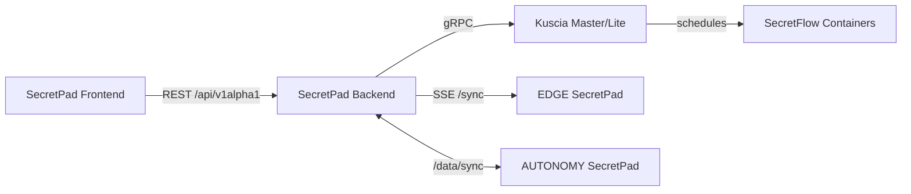

# 02 部署模式与角色

## 2.1 运行模式

后端通过配置 `secretpad.platform-type` 区分运行模式。

| 模式 | 定位 | 数据存储 | 同步方式 |
|---|---|---|---|
| **CENTER** | 中心管理平台 | 全量数据 | 作为 SSE 服务端，向 EDGE 推送数据 |
| **EDGE** | 边缘节点 | 本地相关数据 | 通过 SSE 接收 CENTER 同步；主动向 CENTER 推送投票、路由数据 |
| **AUTONOMY** | P2P 自治机构 | 本地相关数据 | 点对点主动同步（`/data/sync`），投票本地闭环 |
| **TEST** | 测试模式 | 内存/SQLite | 关闭认证，便于自动化测试 |

## 2.2 角色与账号

| 账号类型 | 所属模式 | 说明 |
|---|---|---|
| CENTER 管理员 | CENTER | 管理节点与项目 |
| CENTER 下的 EDGE 子账号 | CENTER | 只能管理被授权的项目 |
| EDGE 账号 | EDGE | 持有实际数据与节点 |
| AUTONOMY 账号 | AUTONOMY | P2P 机构，可切换节点 |
| 节点用户 | 任意 | 用于节点级别的账号密码管理 |

## 2.3 模式差异对产品能力的影响

| 能力 | CENTER | EDGE | AUTONOMY |
|---|---|---|---|
| 节点注册 | ✅ | ❌ | 仅本地节点管理 |
| 项目管理 | ✅ 全部 | 本地相关 | 本地相关 |
| 数据管理 | 可见授权数据 | 本地节点数据 | 本地节点数据 |
| DAG 编排 | ✅ | ✅ | ✅ |
| 投票审批 | 直接落库 | 推送到 CENTER | 本地闭环 + 同步 |
| 数据同步 | SSE 服务端 | SSE 客户端 | 点对点 Push |
| 模型发布 | ✅ | 受权限限制 | 仅 owner 可操作 |

## 2.4 前端-后端-基础设施关系

