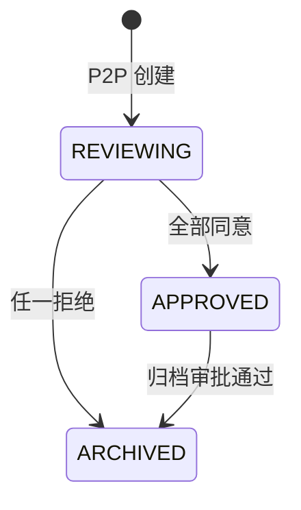
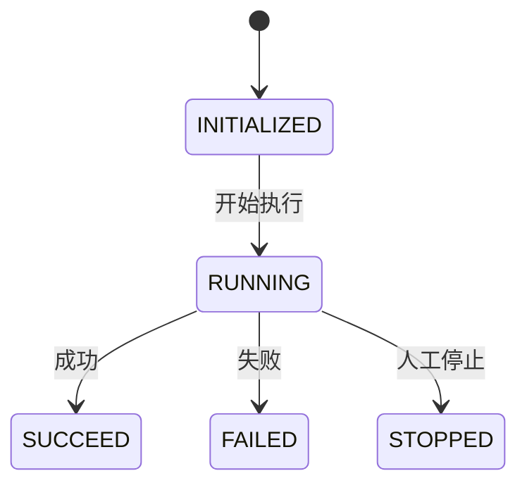
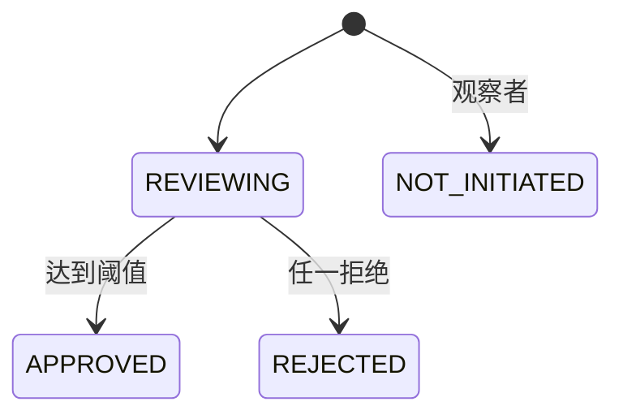
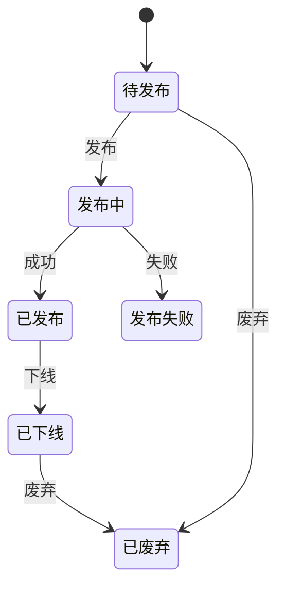

# 03 领域模型

## 3.1 核心领域划分

```mermaid
flowchart TD
    subgraph 组织域
        Inst[Inst 机构]
        Node[Node 节点]
        NodeRoute[NodeRoute 节点路由]
    end

    subgraph 项目域
        Project[Project 项目]
        ProjectInst[ProjectInst 项目-机构]
        ProjectNode[ProjectNode 项目-节点]
        ProjectDatatable[ProjectDatatable 项目-数据表]
    end

    subgraph 画布域
        Graph[ProjectGraph 训练流]
        GraphNode[ProjectGraphNode 节点]
        GraphEdge[边]
        Job[ProjectJob 作业]
        Task[ProjectTask 任务]
    end

    subgraph 数据域
        Datatable[DomainData 数据表]
        Datasource[DomainDataSource 数据源]
        FeatureTable[FeatureTable 特征表]
    end

    subgraph 结果域
        Result[ProjectResult 结果]
        Report[ProjectReport 报告]
        Model[ProjectModel 模型]
        ModelPack[ProjectModelPack 模型包]
        Serving[ProjectModelServing 服务]
        Rule[ProjectRule 规则]
    end

    subgraph 审批域
        VoteRequest[VoteRequest 投票请求]
        VoteInvite[VoteInvite 投票邀请]
        ApprovalConfig[ApprovalConfig 审批配置]
    end

    subgraph 用户域
        Account[Accounts 账号]
        Token[Tokens 会话]
        Role[SysRole 角色]
        Resource[SysResource 资源]
    end

    Inst --> Node
    Node --> NodeRoute
    Project --> ProjectInst
    Project --> ProjectNode
    Project --> ProjectDatatable
    Project --> Graph
    Graph --> GraphNode
    Graph --> GraphEdge
    Graph --> Job
    Job --> Task
    Node --> Datatable
    Datasource --> Datatable
    Project --> Result
    Project --> Report
    Project --> Model
    Project --> ModelPack
    ModelPack --> Serving
    Project --> Rule
    Project --> VoteRequest
    VoteRequest --> VoteInvite
    Account --> Token
    Account --> Role
    Role --> Resource
```

## 3.2 关键实体说明

| 实体 | 业务含义 | 核心属性 |
|---|---|---|
| `Project` | 隐私计算项目 | name、mode、owner、status、computeFunction |
| `Node` | Kuscia Domain 在 SecretPad 的映射 | nodeId、name、address、protocol、token、instId、masterNodeId |
| `NodeRoute` | 两个 Domain 之间的路由 | srcNodeId、dstNodeId、status、address |
| `ProjectGraph` | 训练流/画布 | projectId、graphId、nodes、edges、maxIndex |
| `ProjectJob` | 一次训练执行 | projectId、jobId、status、tasks、edges、errorMsg |
| `ProjectTask` | 作业中的单个任务 | projectId、jobId、taskId、status、graphNodeId、progress |
| `ProjectDatatable` | 项目授权的数据表 | projectId、nodeId、datatableId、columnConfig |
| `VoteRequest` | 跨机构审批请求 | initiatorId、voteType、threshold、status、signature |
| `VoteInvite` | 被邀请方的投票记录 | voteId、participantId、action、reason、signature |

## 3.3 状态机

### 项目状态机

### 画布节点任务状态机

### 投票状态机

## 3.4 模型包生命周期

