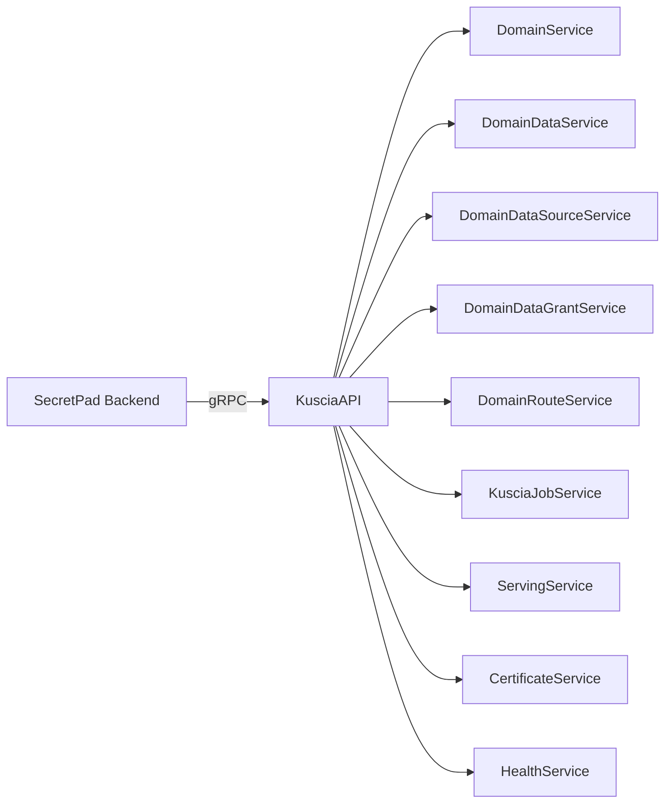
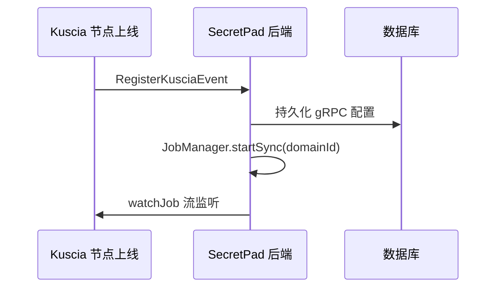
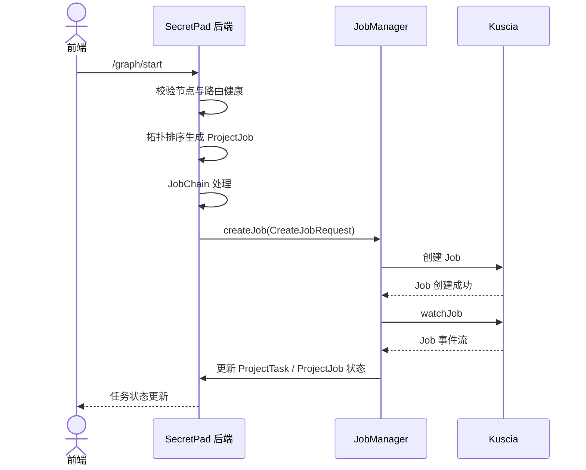

# 05 集成需求

## 5.1 Kuscia 集成总览

SecretPad 后端通过 gRPC 调用 KusciaAPI，所有调用通过 `DynamicKusciaChannelProvider` 按 Domain 动态创建 Channel。

## 5.2 Kuscia 服务映射

| Kuscia 服务 | SecretPad 用途 |
|---|---|
| `DomainService` | 创建/更新/删除/查询 Domain（节点） |
| `DomainDataService` | 创建/更新/删除/查询/批量查询 DomainData（数据表） |
| `DomainDataSourceService` | 数据源生命周期管理 |
| `DomainDataGrantService` | 数据授权（Grant）管理 |
| `DomainRouteService` | 创建/删除/查询/批量查询 DomainRoute（节点路由） |
| `KusciaJobService` | 创建/查询/停止/删除/审批/挂起/重启/取消 Job；Watch 任务流 |
| `ServingService` | 模型在线 Serving 创建/更新/删除/查询 |
| `CertificateService` | 生成节点证书与密钥 |
| `HealthService` | 健康检查 |

## 5.3 节点注册与注销事件

### 注册事件

### 注销事件

- 清理本地配置与 P2P 同步列表。
- 停止该 Domain 的 watchJob。

## 5.4 作业提交流程

### JobChain 三阶段

1. **JobPersistentHandler**（order=1）：持久化任务，内置 SecretPad 组件直接标记为 SUCCEED。
2. **JobRenderHandler**（order=2）：渲染输入输出、处理数据表引用、SF 组件依赖、裁剪内置组件。
3. **JobSubmittedHandler**（order=3）：转换为 `Job.CreateJobRequest`，调用 Kuscia 创建 Job（TEE 模式使用 `KusciaTrustedFlowJobConverter`）。

## 5.5 数据同步机制

| 场景 | 方向 | 机制 | 说明 |
|---|---|---|---|
| CENTER ↔ EDGE | CENTER → EDGE | SSE | 边缘节点通过 `EdgeDataSyncServiceImpl` 建立 SSE 连接到 `/sync` |
| EDGE → CENTER | EDGE → CENTER | 主动 Push | `VoteSyncController`、`DbSyncUtil.dbDataSyncToCenter` |
| P2P | 双向 | 主动 Push | `DataSyncController` 接收 `SyncDataDTO`，`DataSyncConsumerTemplate` 写入本地 |

### 同步数据范围

项目、节点、路由、数据表、作业、任务、结果、投票、审批配置等。

### 增量同步

- `JpaSyncDataService.syncByLastUpdateTime` 按 `gmtModified` 增量推送。
- 同步冲突以 `gmtModified` 较晚者为准或按业务规则合并。

## 5.6 认证与安全

### 认证机制

- **外部端口**：从 Header 读取 `User-Token`，校验 `TokensDO` 是否存在且未过期（默认 24 小时，滑动更新）。
- **内部端口**：视为节点间 RPC，从 `kuscia-origin-source` Header 读取节点 ID，构建虚拟用户上下文。
- **测试模式**：`secretpad.auth.enabled=false` 时提供临时用户。

### 授权机制

- **接口级**：`@ApiResource(code = "...")`。
- **数据级**：`@DataResource(field = "...", resourceType = ...)`。
- **RBAC**：`sys_role`、`sys_resource`、`sys_user_permission_rel`。

### 投票签名

- 投票请求与回复使用 RSA-SHA256 签名。
- 证书链校验确保参与方身份可信。
- `CertificateService` 调用 Kuscia `GenerateKeyCerts` 生成临时证书。

## 5.7 数据源代理（P2P）

P2P 模式下新节点注册时，`DataProxyService` 将数据源切换为 DataProxy 数据源，保证跨机构数据访问走统一代理。

## 5.8 日志集成

- 任务日志优先从 Kuscia 查询。
- 对接 SLS/ELK 等外部日志系统时，通过 `CloudLogController` 透传查询参数。
