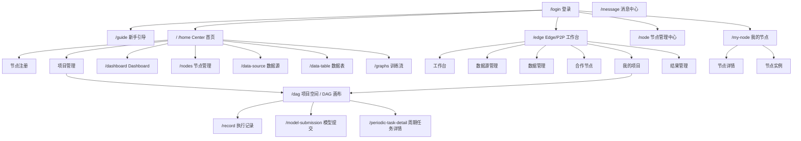

# 03 信息架构

## 3.1 站点地图



## 3.2 顶层路由与权限映射

| 路由 | 页面 | 权限包装器 | 主要用户 |
|---|---|---|---|
| `/`、`/home` | Center 首页 | `center-auth` | CENTER 管理员 |
| `/dashboard` | Dashboard | `center-auth` | CENTER 管理员 |
| `/data-source` | 数据源列表 | `center-auth` | CENTER 管理员 |
| `/data-source/:id` | 数据源详情 | `center-auth` | CENTER 管理员 |
| `/data-table` | 数据表列表 | `center-auth` | CENTER 管理员 |
| `/nodes` | 节点列表 | `center-auth` | CENTER 管理员 |
| `/graphs` | 训练流列表 | `center-auth` | CENTER 管理员 |
| `/dag` | DAG 画布 | `p2p-center-auth` + `component-wrapper` | 建模工程师、项目发起方 |
| `/record` | 执行记录 | `p2p-center-auth` + `component-wrapper` | 建模工程师 |
| `/model-submission` | 模型提交 | `p2p-center-auth` + `component-wrapper` | 建模工程师 |
| `/periodic-task-detail` | 周期任务详情 | `p2p-center-auth` + `component-wrapper` | 建模工程师 |
| `/node` | 节点管理中心 | `edge-auth` + `component-wrapper` | EDGE 数据管理员 |
| `/my-node` | 我的节点 | `basic-node-auth` + `p2p-edge-center-auth` | AUTONOMY/EDGE 机构 |
| `/message` | 消息中心 | `basic-node-auth` + `p2p-edge-center-auth` + `component-wrapper` | 项目参与方 |
| `/edge` | Edge/P2P 工作台 | `basic-node-auth` + `p2p-login-auth` | EDGE/AUTONOMY 用户 |
| `/guide` | 新手引导 | `theme` + `login` + `guide-auth` | 首次登录用户 |
| `/login` | 登录页 | `theme` + `login-wrapper` | 所有用户 |

## 3.3 Center 首页菜单

左侧菜单支持折叠/展开快捷键。

```
Center 首页（/ /home）
├── 节点注册
│   └── 节点列表（ManagedNodeListComponent）
└── 项目管理
    └── 项目卡片列表（ProjectListComponent）
```

## 3.4 Edge/P2P 工作台菜单

```
Edge/P2P 工作台（/edge?ownerId=xxx）
├── 工作台（workbench）
├── 数据源管理（data-source）
├── 数据管理（data-management）
├── 合作节点（connected-node）
├── 我的项目（my-project）
└── 结果管理（result）
```

## 3.5 节点管理中心菜单

```
节点管理中心（/node?ownerId=xxx&tab=table|result）
├── 数据管理（table）
└── 结果管理（result）
```

## 3.6 项目空间（DAG）顶部二级菜单

仅 CENTER / AUTONOMY 可见，且受部署模式影响。

```
项目空间（/dag）
├── 项目数据
├── 模型训练
├── 模型管理（仅 MPC）
└── 周期任务（仅 MPC）
```

## 3.7 左侧面板 Tab（DAG 内）

```
左侧面板
├── 训练流（Pipeline 树）
├── 组件库（Component 树）
└── 数据集（Data Table 树）
```

## 3.8 全局 Header

- Logo / 产品名称
- 当前平台类型与节点切换（如适用）
- 消息铃铛 + 未处理消息数
- 用户头像下拉：修改密码、登出
- 新手引导入口
