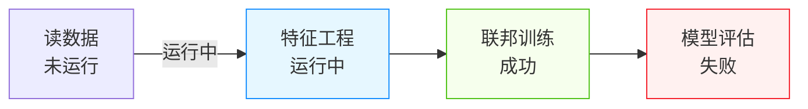

# 05 界面原型（线框图）

> 本节使用文本框图和 Mermaid 描述关键页面的布局与信息层级，供 UI 设计阶段参考。

---

## 1. 全局布局（含 Header + 左侧菜单）

```textn+------------------------------------------------------------------+
|  Logo    平台名称                          🔔 消息  [头像 ▼]        |
+----------+-------------------------------------------------------+
|          |                                                       |
|  左侧菜单 |                                                       |
|          |                   主内容区                            |
|  - 首页   |                                                       |
|  - 节点   |                                                       |
|  - 数据   |                                                       |
|  - 项目   |                                                       |
|  - 消息   |                                                       |
|          |                                                       |
+----------+-------------------------------------------------------+
```

---

## 2. Dashboard（/dashboard）

```textn+------------------------------------------------------------------+
|  Dashboard                                          [刷新]         |
+------------------------------------------------------------------+
|  +----------+  +----------+  +----------+  +----------+          |
|  | Projects |  |  Nodes   |  |DataTables|  |  Graphs  |          |
|  |   128    |  |   12     |  |   356    |  |   89     |          |
|  +----------+  +----------+  +----------+  +----------+          |
+------------------------------------------------------------------+
|  +----------------------+    +--------------------------------+  |
|  | Recent Projects      |    | Recent Nodes                   |  |
|  | - 反欺诈联邦建模      |    | - alice (healthy)              |  |
|  | - 广告联合统计        |    | - bob   (healthy)              |  |
|  | - 医疗数据 TEE 计算   |    | - tee   (warning)              |  |
|  +----------------------+    +--------------------------------+  |
|  +--------------------------------------------------------------+|
|  | System Health                                                ||
|  | CPU 45% | Memory 60% | Disk 75% | Network OK                 ||
|  +--------------------------------------------------------------+|
+------------------------------------------------------------------+
```

---

## 3. 项目列表（/home）

```textn+------------------------------------------------------------------+
|  首页：节点注册 | 项目管理                                        |
+------------------------------------------------------------------+
|  项目管理                                    [创建项目]            |
|  [搜索项目...]  [计算模式 ▼]                                      |
+------------------------------------------------------------------+
|  +----------------------+  +----------------------+              |
|  | 反欺诈联邦建模         |  | 广告联合统计         |              |
|  | MPC 管道              |  | TEE 枢纽             |              |
|  | 参与节点: 3           |  | 参与节点: 2          |              |
|  | 训练流: 5  任务: 12   |  | 训练流: 2  任务: 8   |              |
|  | 2024-01-15            |  | 2024-01-10           |              |
|  | [进入] [编辑] [删除]  |  | [进入] [编辑] [删除] |              |
|  +----------------------+  +----------------------+              |
+------------------------------------------------------------------+
```

---

## 4. 节点管理（/nodes）

```textn+------------------------------------------------------------------+
|  Nodes                                        [Add] [Refresh]      |
|  [Search...]                                                       |
+------------------------------------------------------------------+
|  Node ID | Name     | Address        | Type | Status  | Actions   |
|  --------|----------|----------------|------|---------|-----------|
|  alice   | Alice    | 127.0.0.1:8083 | MPC  | Healthy | Edit Del  |
|  bob     | Bob      | 127.0.0.1:8084 | MPC  | Healthy | Edit Del  |
|  tee     | TEE Hub  | 127.0.0.1:8085 | TEE  | Healthy | Edit Del  |
+------------------------------------------------------------------+
```

---

## 5. DAG 画布（/dag）

```textn+------------------------------------------------------------------+
|  项目：反欺诈联邦建模    项目数据 | 模型训练 | 模型管理 | 周期任务  |
+------+------------------------------------------+------------------+
| 左侧  |                                          | 右侧抽屉（组件配置）|
| 面板  |           DAG 画布                        |                  |
|       |                                          | 组件：样本读取     |
| 训练流 |    +---------+      +---------+         | - 数据表: user   |
| 组件库 |    | 读数据   |----->| 特征工程 |         | - 列选择...      |
| 数据集 |    +---------+      +---------+         |                  |
|       |          |              |               | [保存] [取消]    |
|       |          v              v               |                  |
|       |    +---------+      +---------+         |                  |
|       |    | 联邦训练 |----->| 模型评估 |         |                  |
|       |    +---------+      +---------+         |                  |
|       |                                          |                  |
|       |  [保存] [运行] [停止] [撤销] [适应] [+/-] |                  |
+------+------------------------------------------+------------------+
```

### 画布节点状态示意



---

## 6. 消息中心（/message）

```textn+------------------------------------------------------------------+
|  消息中心                                                          |
|  [我处理的] [我发起的]                                             |
|  类型：[全部 ▼]  状态：[全部 ▼]                                     |
+------------------------------------------------------------------+
|  标题                  | 发起方 | 接收方 | 时间       | 状态 | 操作 |
|  ---------------------|--------|--------|-----------|------|------|
|  邀请你加入项目 A       | Alice  | Bob    | 2024-01-15| 待处理| 同意 拒绝 |
|  请求授权数据表 user    | Bob    | Alice  | 2024-01-14| 已同意| 查看 |
|  节点合作请求           | Alice  | Tee    | 2024-01-13| 已拒绝| 查看 |
+------------------------------------------------------------------+
```

---

## 7. 数据管理（/data-table）

```textn+------------------------------------------------------------------+
|  Data Tables                                  [Add] [Refresh]      |
|  [Search...]                                                       |
+------------------------------------------------------------------+
|  Name    | Data Source | Node | Description | Created      | Actions |
|  --------|-------------|------|-------------|--------------|---------|
|  user    | local_csv   | alice| 用户特征     | 2024-01-15   | Auth Del|
|  order   | mysql_ds    | bob  | 订单表       | 2024-01-14   | Auth Del|
+------------------------------------------------------------------+
```

---

## 8. 模型管理（/dag → 模型管理）

```textn+------------------------------------------------------------------+
|  模型管理                                                          |
+------------------------------------------------------------------+
|  Name        | ID | Status      | Submit Time | Actions            |
|  ------------|----|-------------|-------------|--------------------|
|  联邦 LR 模型 | m1 | 已发布      | 2024-01-15  | 下线 废弃 删除 服务 |
|  XGB 反欺诈   | m2 | 待发布      | 2024-01-14  | 发布 废弃 删除      |
+------------------------------------------------------------------+
```
