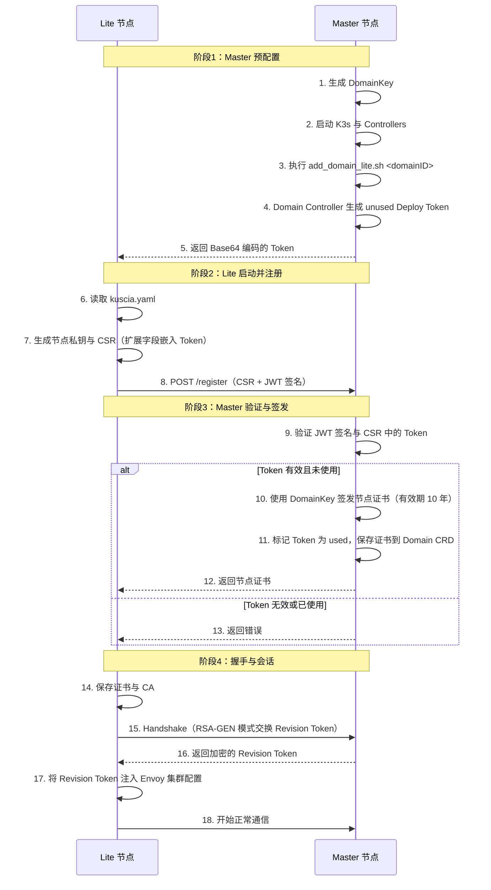
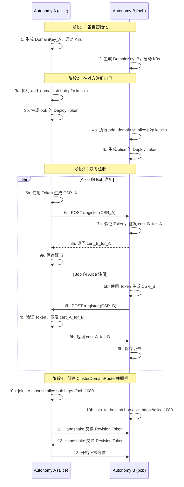

# 1 组网模式

Kuscia 提供了灵活的组网方案，可以根据不同的业务场景和组织架构选择合适的部署模式。

| 组网模式 | 控制平面 | 节点类型 | 适用场景 |
| ---------- | ---------- | ---------- | ---------- |
| **中心化组网** | 多个 Lite 节点共享一个 Master | Lite 节点 | 大型机构内部，统一运维，资源成本低 |
| **P2P 组网** | 每个节点自带独立控制平面 | Autonomy 节点 | 小型机构、安全性要求高、无中心信任方 |
| **混合组网** | Master + Autonomy 混合部署 | Lite + Autonomy | 复杂组织架构，部分集中部分对等 |
| **K8s 部署** | 外部 K8s 集群提供控制能力 | K8s Deployment | 已有成熟 K8s 基础设施的机构 |
| **互联互通** | 跨平台协议适配 | InterConn Adapter | 与第三方隐私计算平台协作 |

Kuscia 支持 **中心化与 P2P 混合组网**，以及 **与第三方厂商节点互联互通**。

---

# 2 节点角色与部署方式

## 2.1 节点角色

| 角色 | 说明 | 运行模式 |
| ------ | ------ | ---------- |
| **Master** | 控制平面，负责任务调度、资源管理、路由控制 | `master` |
| **Lite** | 无控制平面的工作节点，依赖 Master 调度 | `lite` |
| **Autonomy** | 自带控制平面的 P2P 节点，可同时承担控制与计算 | `autonomy` |

## 2.2 基础设施部署方式

| 部署方式 | 说明 | 适用场景 |
| ---------- | ------ | ---------- |
| **Docker 模式** | 以 Docker 容器方式部署控制平面和节点 | 物理机/虚拟机 |
| **K8s 模式** | 将控制平面和节点以 K8s 应用方式部署 | 公有/专有 K8s 集群 |
| **K8s 控制器模式** | 将 Kuscia Controllers、Storage、Envoy 部署在 K8s 控制平面 | 专有 K8s 集群 |

---

# 3 运行模式核心差异

## 3.1 模块化架构与模式白名单

Kuscia 采用**单一二进制、多模块组合**的架构。同一个 `kuscia` 程序根据 `kuscia.yaml` 中的 `mode` 字段启动不同的模块集合。

```text
不是启动不同的软件程序，而是同一个 Kuscia 程序启动不同的模块组合
```

- **Master 模式** = 控制平面模块集合（k3s + controllers + scheduler + reporter + ...）
- **Lite 模式** = 工作节点模块集合（agent + datamesh + transport + ...）
- **Autonomy 模式** = 全部模块集合（Master + Lite 的所有模块）

在 `cmd/kuscia/start/start.go` 中，每个模块注册时声明支持的模式：

```go
master, lite, autonomy := common.RunModeMaster, common.RunModeLite, common.RunModeAutonomy

mm.Regist("k3s", modules.NewK3s, autonomy, master)
mm.Regist("agent", modules.NewAgent, autonomy, lite)
mm.Regist("controllers", modules.NewControllersModule, autonomy, master)
mm.Regist("scheduler", modules.NewScheduler, autonomy, master)
mm.Regist("datamesh", modules.NewDataMesh, autonomy, lite)
mm.Regist("transport", modules.NewTransport, autonomy, lite)
mm.Regist("envoy", modules.NewEnvoy, autonomy, lite, master)
mm.Regist("kusciaapi", modules.NewKusciaAPI, autonomy, lite, master)
mm.Regist("domainroute", modules.NewDomainRoute, autonomy, master, lite)
mm.Regist("interconn", modules.NewInterConn, autonomy, master)
mm.Regist("reporter", modules.NewReporter, autonomy, master)
```

`ModuleManager` 根据当前运行模式过滤模块，并按依赖顺序启动。

## 3.2 模块启动矩阵

| 模块 | Master | Lite | Autonomy | 关键职责 |
| ------ | -------- | ------ | ---------- | ---------- |
| **k3s** | ✅ | ❌ | ✅ | 嵌入 K3s 作为控制平面，提供 Kubernetes API Server、etcd 数据存储 |
| **agent** | ❌ | ✅ | ✅ | Kubelet 替代，管理本地容器生命周期 |
| **containerd** | ❌ | ✅* | ✅* | 本地容器运行时，仅在 runc 模式下启动 |
| **controllers** | ✅ | ❌ | ✅ | 运行 Kuscia 自定义控制器（Domain、Task、Job、AppImage 等 CRD） |
| **coredns** | ✅ | ✅ | ✅ | 为 K3s 集群与 Pod 提供 DNS 服务 |
| **scheduler** | ✅ | ❌ | ✅ | 增强版 kube-scheduler，支持联邦调度策略 |
| **datamesh** | ❌ | ✅ | ✅ | 数据访问代理与 Arrow Flight 服务 |
| **transport** | ❌ | ✅ | ✅ | 节点间安全通信通道，处理跨域数据传输 |
| **domainroute** | ✅ | ✅ | ✅ | 维护跨域路由与证书交换 |
| **interconn** | ✅ | ❌ | ✅ | 互联互通协议适配器（BFIA 等） |
| **reporter** | ✅ | ❌ | ✅ | 任务状态上报/采集，同步跨域任务状态 |
| **kusciaapi** | ✅ | ✅ | ✅ | 对外暴露 Kuscia API（HTTP/gRPC） |
| **envoy** | ✅ | ✅ | ✅ | 七层网关，代理跨域与域内流量 |
| **confmanager** | ✅ | ✅ | ✅ | 配置中心，Lite 复用 Master 签发的域证书 |

> *注：containerd 是否启动取决于运行时配置；runp 模式不启动 containerd。*

## 3.3 控制平面与数据平面职责

| 维度 | Master | Lite | Autonomy |
| ------ | -------- | ------ | ---------- |
| **是否嵌入 K3s** | 是 | 否 | 是 |
| **K8s API 来源** | 本地 K3s | 远程 Master | 本地 K3s |
| **是否运行 Agent** | 否 | 是 | 是 |
| **是否运行 Scheduler** | 是 | 否 | 是 |
| **是否运行 Controllers** | 是 | 否 | 是 |
| **域证书来源** | 自签 CA | 由 Master 注册时签发 | 自签 CA |
| **典型部署位置** | 中心集群 | 参与方边缘节点 | 独立参与方全栈节点 |

## 3.4 运行时差异（runc / runk / runp）

| 运行时 | 说明 | 适用模式 | 网络特点 |
| -------- | ------ | ---------- | ---------- |
| **runc** | 标准 OCI 容器运行时，任务以 Docker/containerd 容器运行 | Lite/Autonomy | 每个任务 Pod 拥有独立网络命名空间，通过 Envoy 代理通信 |
| **runk** | 对接外部 Kubernetes 集群，任务调度到外部 K8s | Lite/Autonomy | 依赖外部 K8s 的 CNI 网络，需配置 DNS 与 ServiceAccount |
| **runp** | 进程模式，任务以本地进程运行，无需容器化 | Lite/Autonomy | 任务进程共享宿主机网络命名空间，依赖 Kuscia 内置网络代理 |

> **注意**：RunP 模式暂不支持 job 资源限制，且需要 `kuscia-secretflow` 等特殊镜像。

## 3.5 配置文件结构差异

配置文件路径：`/home/kuscia/etc/conf/kuscia.yaml`。

### CommonConfig（通用配置）

```yaml
mode: master              # master / lite / autonomy
domainID: alice           # 域标识，需符合 DNS_LABEL 规范
domainKeyData: <base64>   # RSA 私钥，用于 TLS 签名与证书签发
logLevel: INFO            # DEBUG / INFO / WARN / ERROR
protocol: MTLS            # NOTLS / TLS / MTLS
```

### Master 特有字段

```yaml
datastoreEndpoint: ""     # etcd 或 MySQL 数据存储地址
clusterToken: ""          # K3s 集群加入令牌（可选）
```

### Lite 特有字段

```yaml
liteDeployToken: <token>  # Master 返回的一次性部署令牌
masterEndpoint: https://<master>:1080
runtime: runc
```

### Autonomy 特有字段

Autonomy 配置是 Master 与 Lite 的并集，同时拥有 `datastoreEndpoint` 和 `liteDeployToken`/`masterEndpoint`（当接入 Master 时）。

完整配置说明请参考 [Kuscia 配置文件说明](./deployment/kuscia_config_cn.md)。

## 3.6 K3s 启动差异

`k3s` 模块仅存在于 Master/Autonomy。Kuscia 会启动精简版 K3s server，并关闭自带组件：

```bash
k3s server \
  --disable-agent \
  --disable-scheduler \
  --flannel-backend=none \
  --disable=coredns \
  --disable=traefik \
  --disable=servicelb
```

只保留 API Server 与数据存储，复用 Kuscia 自己的 scheduler、agent 和网络代理。

---

# 4 认证与密钥证书机制

## 4.1 认证架构概览

Kuscia 节点间通信采用 **基于 X.509 证书的双向 TLS（mTLS）** 机制。

| 组件 | 说明 |
| ------ | ------ |
| **DomainKey** | 域 RSA 私钥，作为该域的 CA 私钥，用于签发证书与 JWT 签名。 |
| **Domain Certificate** | 由本域 DomainKey 自签生成的 CA 证书，代表该域身份。 |
| **Node Certificate** | 节点/应用证书，由本域或对方域 CA 签发，用于 TLS 通信。 |
| **Deploy Token** | 一次性部署令牌，用于 Lite 节点或 P2P 伙伴节点首次注册。 |
| **Revision Token** | 握手成功后生成的会话 Token，注入 Envoy Header 用于跨域请求鉴权。 |

### 证书信任链

```text
DomainKey (本域 CA 私钥)
    ↓ 签发
Domain Certificate (本域 CA 证书)
    ↓ 签发
Node Certificate / 应用证书
    ↓ 用于
mTLS 双向认证
```

- **Master/Autonomy**：自己持有 DomainKey，自签 CA 证书，并为接入的 Lite/伙伴节点签发证书。
- **Lite**：本地生成节点私钥与 CSR，向 Master 提交注册请求，由 Master 签发节点证书。

## 4.2 Master-Lite 模式认证流程

### 架构特点

- **中心化认证**：Master 作为本机构内所有 Lite 节点的 CA。
- **单向注册**：Lite 节点主动向 Master 注册，Master 被动响应。
- **Deploy Token**：Lite 节点首次注册时使用一次性 Deploy Token 完成初始认证。

### 认证流程



### 详细说明

#### 1. Master 生成 Deploy Token

```bash
# 在 Master 容器内执行
scripts/deploy/add_domain_lite.sh alice

# 底层逻辑：
# 1. kubectl apply 创建 Domain alice（authCenter.tokenGenMethod=RSA-GEN）
# 2. Domain Controller 在 Domain.Status.DeployTokenStatuses 中生成 unused token
# 3. 脚本轮询等待 token 状态为 unused 后输出
```

生成的 Domain 资源示例：

```yaml
apiVersion: kuscia.secretflow/v1alpha1
kind: Domain
metadata:
  name: alice
spec:
  cert: ""
  authCenter:
    authenticationType: Token
    tokenGenMethod: RSA-GEN
status:
  deployTokenStatuses:
    - token: QTFBMkMzRDRFNUY2...
      state: unused
```

#### 2. Lite 节点配置

```yaml
mode: lite
domainID: alice
domainKeyData: <base64 RSA private key>
liteDeployToken: <token from master>
masterEndpoint: https://172.18.0.2:1080
protocol: MTLS
runtime: runc
```

#### 3. CSR 生成与注册

Lite 启动时：

1. 使用本地 `domainKeyData` 生成新的节点私钥对。
2. 创建 CSR，CN 为 `domainID`，并在扩展字段中嵌入 `liteDeployToken`。
3. 使用 DomainKey 对注册请求生成 JWT 签名（有效期 5 分钟）。
4. 向 Master 的 `/register` 接口提交 CSR。

Master 的 `registerHandle` 逻辑（`pkg/gateway/controller/register_node.go`）：

- 解析 CSR 与 JWT Token，验证签名。
- 从 CSR 扩展字段提取 Token，与 `Domain.Status.DeployTokenStatuses` 比对。
- 验证 Token 存在且状态为 `unused`。
- 使用本地 CA（DomainKey）签发节点证书，**有效期 10 年**（`NotAfter: t.AddDate(10, 0, 0)`）。
- 将证书写入 `Domain.Spec.Cert`，并将 Token 标记为 `used`。
- 返回签发的证书与 Master 公钥（用于后续握手）。

#### 4. Handshake（RSA-GEN 模式）

注册完成后，Lite 调用 `HandshakeToMaster`（`pkg/gateway/controller/handshake.go`）：

- Lite 生成随机 Token（16 字节）。
- 使用 Master 公钥加密后发送给 Master。
- Master 生成自己的随机 Token（16 字节），用 Lite 公钥加密返回。
- Lite 解密后，将双方 Token 拼接为 32 字节的 Revision Token。
- Revision Token 被注入 Envoy 的 `jwt-token` Header，用于后续跨域请求鉴权。

> 旧版 `UID-RSA` Token 生成方式已废弃，当前默认使用 `RSA-GEN`。

#### 5. 证书存储

Lite 节点证书存储在容器内 `/home/kuscia/var/certs/`：

```bash
/home/kuscia/var/certs/
├── ca.crt          # Master 域 CA 证书
├── domain.crt      # Lite 节点证书（Master 签发）
└── domain.key      # Lite 节点私钥（本地生成）
```

### 安全特性

- ✅ **一次性 Token**：Deploy Token 使用后标记为 `used`，防止重放攻击。
- ✅ **双向认证**：mTLS 确保通信双方身份均经过验证。
- ✅ **证书绑定**：证书 CN 为 DomainID，防止证书滥用。
- ✅ **长有效期证书**：节点证书默认 10 年。

## 4.3 P2P（Autonomy-Autonomy）模式认证流程

### 架构特点

- **对等认证**：两个 Autonomy 节点地位平等，互为 CA。
- **双向注册**：双方都需要向对方提交 CSR 并获取对方签发的证书。
- **同样使用 Deploy Token**：P2P 注册也需要 Token，由 `add_domain.sh` 创建 Domain 后由 Domain Controller 生成。

### 认证流程



### 与 Master-Lite 的关键差异

| 维度 | Master-Lite | P2P（Autonomy） |
| ------ | ------------- | ----------------- |
| CA 角色 | Master 是本机构唯一 CA | 每个 Autonomy 节点都是独立 CA |
| 认证方向 | 单向（Lite → Master） | 双向（A ↔ B） |
| Token 机制 | 使用 Deploy Token | 同样使用 Deploy Token |
| 证书签发 | Master 签发 Lite 节点证书 | 互相签发对方节点证书 |
| 路由 CRD | DomainRoute | ClusterDomainRoute |
| 部署脚本 | `add_domain_lite.sh` | `add_domain.sh` + `join_to_host.sh` |

### 实际部署命令

在 Alice 节点容器内：

```bash
# 1. 注册 Bob 为伙伴域
scripts/deploy/add_domain.sh bob p2p kuscia

# 2. 将 Bob 的 CA 证书复制到本地
# 实际一键部署中由 build_interconn 自动完成

# 3. 创建 Alice → Bob 的 ClusterDomainRoute
scripts/deploy/join_to_host.sh alice bob https://<bob-ip>:1080 -p kuscia
```

在 Bob 节点容器内执行对称操作。实际一键部署中，`kuscia.sh p2p` 会调用 `build_interconn` 自动完成上述步骤。

## 4.4 混合模式（Master + Autonomy）认证流程

### 架构特点

- **分层认证**：Master 与 Lite 之间使用中心化 Deploy Token 认证；Master 与 Autonomy 之间、Autonomy 与 Autonomy 之间使用 P2P 双向认证。
- **Master 双重角色**：既作为本机构 Lite 节点的 CA，又作为与其他 Autonomy 对等的节点。

### 认证流程

1. **Lite → Master**：与 4.2 节相同。
2. **Autonomy → Master**：Autonomy 既需要像 Lite 一样向 Master 注册（用于受 Master 管理），又需要 Master 向 Autonomy 注册（用于 P2P 双向认证）。
3. **Autonomy ↔ Autonomy**：与 4.3 节相同，互相注册并创建 ClusterDomainRoute。

实际部署可通过 `kuscia.sh cxc` 或 `kuscia.sh cxp` 一键完成。

## 4.5 密钥与证书管理

### 密钥类型总览

| 密钥/证书类型 | 用途 | 存储位置 | 生命周期 | 生成方式 |
| -------------- | ------ | --------- | --------- | ---------- |
| **DomainKey** | 域 CA 私钥 | `/home/kuscia/var/certs/domain.key` | 长期 | 启动时自动生成或手动提供 `domainKeyData` |
| **Domain Certificate** | 域 CA 证书 | `/home/kuscia/var/certs/domain.crt` | 长期 | 从 DomainKey 提取公钥自签 |
| **Deploy Token** | 一次性注册令牌 | `Domain.Status.DeployTokenStatuses` | 单次使用 | Domain Controller 自动生成 |
| **Node Certificate** | 节点/应用证书 | `/home/kuscia/var/certs/domain.crt` | 默认 10 年 | CA 签发 |
| **Node Private Key** | 节点私钥 | `/home/kuscia/var/certs/domain.key` | 与证书一致 | 本地生成 |
| **External CA Cert** | 外部域 CA 证书 | `/home/kuscia/var/certs/<domain>.domain.crt` | 长期 | 对端域提供 |

### 证书生命周期

#### 生成

```bash
# 方式1：Kuscia 启动时自动生成
docker run --rm ${KUSCIA_IMAGE} kuscia init --mode autonomy --domain alice > alice.yaml

# 方式2：使用 openssl 手动生成 DomainKey
openssl genrsa -out domain.key 2048
# 将 Base64 编码后的私钥填入 kuscia.yaml 的 domainKeyData
```

#### 验证

```bash
# 查看证书信息
openssl x509 -in /home/kuscia/var/certs/domain.crt -text -noout

# 验证证书链
openssl verify -CAfile /home/kuscia/var/certs/ca.crt /home/kuscia/var/certs/domain.crt

# 查看证书有效期
openssl x509 -in /home/kuscia/var/certs/domain.crt -enddate -noout
```

#### 轮换

Kuscia 当前未内置自动证书轮换模块。如需轮换，需重新生成域私钥与配置，重新部署节点并重建跨域路由。

> 注意：轮换 CA 会导致所有已签发证书失效，需要同步更新所有相关节点与路由。

#### 吊销

当前 Kuscia 暂未实现 CRL 或 OCSP 机制。如需阻止某节点通信：

```bash
# 方法1：删除对应的 DomainRoute/ClusterDomainRoute
kubectl delete clusterdomainroute alice-to-bob

# 方法2：删除 Domain 资源
kubectl delete domain bob
```

### 密钥安全措施

1. **文件权限**：

   ```bash
   chmod 600 /home/kuscia/var/certs/domain.key
   chmod 644 /home/kuscia/var/certs/domain.crt
   ```

2. **避免硬编码**：生产环境不要将 `domainKeyData` 明文写入版本控制，可通过环境变量或 Secret 注入。

3. **定期审计**：建议每年审计一次域私钥与证书，必要时重新部署。

## 4.6 跨域通信安全管理

### 外部 TLS（ExternalTLS）与 mTLS

跨域通信通过 Gateway（Envoy）完成，支持以下认证方式：

| 认证方式 | 说明 |
| ---------- | ------ |
| **MTLS**（默认） | 双向 TLS，双方互相验证证书，安全性最高。 |
| **Token** | 使用预共享 Token 认证，适用于特殊场景。 |
| **None** | 不启用 TLS，仅用于内部测试，**生产环境禁用**。 |

`join_to_host.sh` 默认使用 `MTLS` 创建 ClusterDomainRoute。可通过 `-a` 参数指定其他方式：

```bash
scripts/deploy/join_to_host.sh alice bob https://bob:1080 -a MTLS
```

### ClusterDomainRoute 资源示例

```yaml
apiVersion: kuscia.secretflow/v1alpha1
kind: ClusterDomainRoute
metadata:
  name: alice-to-bob
spec:
  source: alice
  destination: bob
  endpoint:
    host: bob.example.com
    ports:
      - name: http
        port: 1080
        protocol: TLS
  tokenConfig:
    genMethod: RSA-GEN
status:
  phase: Connected
```

### 防火墙与安全组

跨域节点之间需要开放以下端口（默认）：

| 端口 | 说明 | 是否需要暴露给合作方 |
| ------ | ------ | --------------------- |
| 1080 | Gateway 外部端口，用于跨域 HTTPS 通信 | 是 |
| 8082 | KusciaAPI HTTP 外部端口 | 视业务需求 |
| 8083 | KusciaAPI gRPC 外部端口 | 视业务需求 |
| 80 | 域内应用访问端口（如 Serving） | 否 |
| 9091 | Metrics 指标采集端口 | 否 |

## 4.7 故障排查

### 问题 1：Lite 注册失败 — Token 无效或已使用

```bash
# 查看 Domain 状态
docker exec -it <master> kubectl get domain <domainID> -o yaml

# 若 token 全部为 used，需重新生成
scripts/deploy/add_domain_lite.sh <domainID>

# 更新 Lite 配置中的 liteDeployToken 并重启
```

### 问题 2：mTLS 握手失败

```bash
# 检查证书有效期
openssl x509 -in /home/kuscia/var/certs/domain.crt -enddate -noout

# 验证证书链
openssl verify -CAfile /home/kuscia/var/certs/ca.crt /home/kuscia/var/certs/domain.crt

# 测试 TLS 连接
openssl s_client -connect <peer-ip>:1080 \
  -cert /home/kuscia/var/certs/domain.crt \
  -key /home/kuscia/var/certs/domain.key \
  -CAfile /home/kuscia/var/certs/ca.crt
```

### 问题 3：ClusterDomainRoute 无法建立

```bash
# 查看 ClusterDomainRoute 状态
kubectl get clusterdomainroute <name> -o yaml

# 检查网络连通性
curl -kv https://<peer-ip>:1080

# 查看 domainroute/envoy 日志
tail -f /home/kuscia/var/logs/domainroute/domainroute.log
tail -f /home/kuscia/var/logs/envoy/envoy.log
```

## 4.8 安全最佳实践

1. **密钥管理**
   - 生产环境使用 KMS/Vault 管理 `domainKeyData`。
   - 禁止将私钥提交到代码仓库。
   - 定期审计域私钥访问权限。

2. **证书管理**
   - 节点证书默认 10 年，但仍需建立证书到期监控。
   - 跨域通信强制使用 MTLS。
   - 证书中包含正确的 SAN（IP/域名）。

3. **网络安全**
   - 生产环境禁用 NOTLS。
   - 使用防火墙/安全组限制 1080/8082/8083 端口的访问来源。
   - 跨域流量优先走 VPN/专线。

4. **Token 管理**
   - Deploy Token 一次性使用，避免复用。
   - Token 传输过程使用安全通道。

---

# 5 跨域组合与管理机制

## 5.1 核心概念

| 概念 | 说明 |
| ------ | ------ |
| **Domain（域）** | 每个参与方的唯一标识，如 `alice`、`bob`，对应一个 Kubernetes Namespace。 |
| **Deploy Token** | 用于节点注册的临时令牌，由 Master/Autonomy 生成，一次性使用。 |
| **DomainRoute** | 命名空间级别的跨域路由配置，包含证书、Token、心跳等状态。 |
| **ClusterDomainRoute** | 集群级别的跨域路由，自动同步到源域和目标域的 Namespace。 |
| **Handshake（握手）** | 双向认证过程，交换加密 Token 并建立安全通信通道。 |
| **Revision Token** | 握手后生成的会话 Token，用于后续所有跨域请求的鉴权。 |

## 5.2 中心化组网（Master + Lite）流程

### 拓扑结构

```text
┌─────────────────────────────────────┐
│     Alice Master Node               │
│  - K3s (API Server + etcd)          │
│  - Controllers                      │
│  - Scheduler                        │
│  - Reporter                         │
└──────────┬──────────────────────────┘
           │ kubeconfig / gRPC
    ┌──────┼────────┐
    ▼      ▼        ▼
  Bob    Charlie   Dave
  Lite   Lite      Lite
  - Agent          - Agent
  - DataMesh       - DataMesh
  - Transport      - Transport
```

### Lite 注册流程

1. **Master 预配置**：执行 `add_domain_lite.sh <domainID>` 创建 Domain 并生成 Deploy Token。
2. **Lite 初始化**：读取 `kuscia.yaml`，使用 `liteDeployToken` 生成 CSR。
3. **Lite 注册到 Master**：通过 `/register` 接口提交 CSR，Master 验证 Token 后签发证书。
4. **握手建立会话**：Lite 与 Master 执行 Handshake，交换 Revision Token。
5. **Lite 之间通信**：Lite 之间不直接通信，所有任务调度与状态同步通过 Master 协调。

### Lite 之间任务通信

在中心化组网中，两个 Lite 节点（如 Bob 和 Charlie）的任务 Pod 之间需要直接通信时，由 Master 创建 `ClusterDomainRoute` 并下发到各自 Lite 节点。Lite 节点的 Envoy 使用该路由信息建立加密通道，任务 Pod 通过 Envoy Sidecar 代理通信。

## 5.3 P2P 组网（Autonomy）流程

### 拓扑结构

```text
┌──────────────┐     ┌──────────────┐     ┌──────────────┐
│  Alice Node  │◄────┤   Bob Node   │────►│ Charlie Node │
│  Autonomy    │     │  Autonomy    │     │  Autonomy    │
│  - K3s       │     │  - K3s       │     │  - K3s       │
│  - Agent     │     │  - Agent     │     │  - Agent     │
│  - CA        │     │  - CA        │     │  - CA        │
└──────────────┘     └──────────────┘     └──────────────┘
```

### P2P 互联流程

1. **各自初始化**：每个 Autonomy 节点生成自己的 DomainKey，启动 K3s 与 Controllers。
2. **创建伙伴 Domain**：在本地 K3s 中创建对方 Domain 对象，Domain Controller 自动生成 Deploy Token。
3. **双向注册**：双方使用 Deploy Token 生成 CSR，向对方 `/register` 接口提交，互相签发证书。
4. **创建 ClusterDomainRoute**：使用 `join_to_host.sh` 创建双向 ClusterDomainRoute。
5. **Handshake 建立会话**：双方交换 Revision Token，注入 Envoy 配置。
6. **正常通信**：后续跨域请求携带 Revision Token，经 Envoy 转发。

### 运行时管理

- **心跳检测**：DomainRoute Controller 定期检查 Token 心跳，超时后标记路由异常。
- **状态同步**：ClusterDomainRoute Controller 持续同步 Source Tokens 与 Destination Tokens，更新路由就绪状态。

## 5.4 混合组网（CxC / CxP）流程

### CxC（Center-to-Center）

两个机构各自拥有 Master + Lite 架构，两个 Master 之间建立 P2P 互联，Lite 节点通过各自 Master 与对方通信。

```text
Alice Org                    Bob Org
┌─────────┐                  ┌─────────┐
│ Master  │◄────────────────►│ Master  │
│  (P2P)  │                  │  (P2P)  │
└────┬────┘                  └────┬────┘
     │                            │
  Lite-Alice                  Lite-Bob
```

### CxP（Center-to-P2P）

一个机构使用 Master + Lite，另一个机构使用 Autonomy。Master 与 Autonomy 之间建立 P2P 互联，Lite 通过 Master 与对端 Autonomy 通信。

```text
Alice Org                    Bob Org
┌─────────┐                  ┌─────────┐
│ Master  │◄────────────────►│ Autonomy│
│         │                  │  (Bob)  │
└────┬────┘                  └─────────┘
     │
  Lite-Alice
```

### Transit 转发

在 CxC/CxP 中，当两个工作节点无法直接连通时，可以启用 `transit` 转发能力，由 Master/Autonomy 网关作为中转：

```bash
./kuscia.sh cxc -t   # 启用 transit
./kuscia.sh cxp -t   # 启用 transit
```

启用 transit 后，`join_to_host.sh` 会额外创建经中转域的路由规则。

## 5.5 互联互通协议（kuscia vs bfia）

Kuscia 支持两种互联协议：

| 协议 | 说明 | 适用场景 |
|------|------|----------|
| **kuscia** | Kuscia 原生协议，使用 Kuscia 自定义的 DomainRoute/ClusterDomainRoute 机制。 | Kuscia 节点之间互联。 |
| **bfia** | 北京金融科技产业联盟（BFIA）互联互通协议，参考 [InterOp](https://github.com/secretflow/InterOp)。 | Kuscia 与第三方隐私计算平台互联。 |

### 使用方式

```bash
# P2P 模式使用 BFIA 协议
./kuscia.sh p2p -P bfia -a none

# center/cxc/cxp 模式仅支持 kuscia 协议
./kuscia.sh center
```

> 注意：BFIA 协议需要额外的 AppImage 配置（如 `ic-ecdh.yaml`），且部分功能与原生 kuscia 协议存在差异。

## 5.6 任务调度与跨域通信概要

### 任务提交流程

1. 用户通过 KusciaAPI 提交 KusciaJob。
2. Master/Autonomy 的 KusciaJob Controller 创建 KusciaTask。
3. Scheduler 根据参与方信息将 Task 调度到对应节点。
4. 各参与方 KusciaTask Controller 创建 Pod。
5. Agent 拉取镜像并启动 Pod。
6. 任务引擎（如 SecretFlow）通过 DataMesh 读取数据，通过 Transport/Envoy 与其他参与方通信。
7. Pod 状态通过 Reporter 同步到各参与方控制平面。

### 跨域数据传输

- **控制面**：通过 DomainRoute/ClusterDomainRoute 建立的 mTLS 通道传输任务元数据。
- **数据面**：任务 Pod 之间通过 Envoy 代理的加密通道传输隐私计算数据。
- **DataMesh**：提供统一的数据访问接口，支持本地文件、OSS、数据库以及通过 DataProxy 访问外部数据源。

---

# 6 网络与端口

## 6.1 端口说明

| 协议 | 端口号 | 说明 | 是否暴露给合作方 | 部署脚本参数 |
| ------ | -------- | ------ | ----------------- | ------------- |
| HTTP/HTTPS | 1080 | 节点之间的认证鉴权端口 | 是 | `-p` |
| HTTP | 80 | 访问节点中应用的端口（如 Serving） | 否 | `-q` |
| HTTP/HTTPS | 8082 | KusciaAPI HTTP 访问端口 | 否 | `-k` |
| GRPC/GRPCS | 8083 | KusciaAPI gRPC 访问端口 | 否 | `-g` |
| HTTP | 9091 | Metrics 指标采集端口 | 否 | `-x` |
| HTTP/HTTPS | 8070 | DataMesh HTTP 端口 | 否 | - |
| GRPC/GRPCS | 8071 | DataMesh gRPC 端口 | 否 | - |

> 注：8070/8071 主要用于域内数据访问，通常不需要暴露给合作方。

## 6.2 网络要求与网关配置

### 机构网关要求

当节点之间存在机构网关（NAT、防火墙、Nginx 等）时，需满足：

- 支持 HTTP/1.1 协议。
- Keepalive 超时时间大于 20 分钟。
- 支持发送 Body <= 2MB 的内容。
- 不针对 Request/Response 进行缓冲。
- 关闭可能拦截隐私计算随机数的关键词过滤规则。
- 配置对外暴露 IP/端口与对端出口 IP 的白名单。

### 典型网络映射场景

| 场景 | 说明 | 授权地址填写 |
| ------ | ------ | ------------- |
| 场景 1 | 机构与外网直接 4 层通信 | 使用 SLB 对外 IP:Port 或宿主机 IP:Port |
| 场景 2 | 外部访问经 7 层网关进入 | 使用 Nginx/7 层 SLB 对外地址，如 `https://101.11.11.11:443` |
| 场景 3 | 进出均经 7 层网关 | 入向填 `https://101.11.11.11:443`，出向填代理内网地址 |

### Nginx 代理配置示例

```nginx
http {
    proxy_http_version 1.1;
    proxy_set_header Connection "";
    proxy_set_header Host $http_host;
    proxy_pass_request_headers on;
    ignore_invalid_headers off;
    keepalive_requests 1000;
    keepalive_timeout 20m;
    client_max_body_size 2m;
    proxy_buffering off;
    proxy_request_buffering off;

    upstream backend {
        server <kuscia-ip>:1080;
        keepalive 32;
        keepalive_timeout 600s;
        keepalive_requests 1000;
    }

    server {
        location / {
            proxy_read_timeout 10m;
            proxy_pass https://backend;
        }
    }
}
```

## 6.3 DNS 与服务发现

Kuscia 通过 **CoreDNS** 为 K3s 集群与任务 Pod 提供 DNS 服务：

- **域内服务**：Pod 可通过 `<service>.<namespace>.svc` 访问域内服务。
- **跨域服务**：通过 Envoy 路由与 `ClusterDomainRoute` 实现跨域服务发现。
- **DataMesh 解析**：任务 Pod 中通过 `datamesh` 域名访问 DataMesh 服务。

在 runk 模式下，需要正确配置外部 K8s 集群的 DNS，使其能够解析 Kuscia 应用域名。

## 6.4 Rootless 模式

Kuscia 支持以非 root 用户运行节点（rootless），适用于对安全性要求更高的场景：

- 仅在 **Lite/Autonomy 的 runp 模式** 或 **Master 模式** 下生效。
- 若当前用户为 root 或 runtime 为 runc，rootless 会自动关闭。
- 启用后，容器内用户为当前 UID，DNS 配置与权限模型有所变化。

启用方式：

```bash
./kuscia.sh start -c lite_alice.yaml -p 28080 --rootless
```

## 6.5 集群网络模式

在 `--cluster` 模式下，Kuscia 使用 Docker Swarm 的 **overlay** 网络（`kuscia-exchange-cluster`）：

- 仅支持 `runp` 或 `runk` 运行时，`runc` 不支持。
- 需要先创建 overlay attachable 网络：

  ```bash
  docker network create --driver overlay --attachable kuscia-exchange-cluster
  ```

- 该模式下不创建默认的 `kuscia-exchange` bridge 网络。

---

# 7 模式选择建议

| 场景 | 推荐模式 | 理由 |
| ------ | ---------- | ------ |
| 多方协作，由一方统一托管控制平面 | **Master + Lite** | Master 运行中心控制平面，各参与方部署 Lite 节点接入，运维边界清晰 |
| 单个机构独立部署，既要管理又要跑任务 | **Autonomy** | 一台节点即可完成控制与计算，减少部署组件数 |
| 已有外部 Kubernetes 集群，只想添加 Kuscia 能力 | **K8s 模式** | 不依赖 K3s，复用现有 K8s 控制平面 |
| 对资源极度敏感的边缘节点 | **Lite** | 不跑 K3s、scheduler、controllers，内存与 CPU 占用最低 |
| 多机构对等协作，无中心信任方 | **P2P（Autonomy）** | 各节点地位平等，双向认证，去中心化 |
| 复杂组织架构，部分集中部分对等 | **混合模式（CxC/CxP）** | 灵活组合，兼顾集中管理与对等协作 |
| 对接第三方隐私计算平台 | **互联互通（BFIA）** | 标准化协议适配，跨厂商系统协同 |

---

# 8 一键部署脚本参考

> 本节提供可直接运行的 Bash 脚本，用于在本地 Docker 环境快速部署 Kuscia 的不同组网模式。所有脚本基于 `kuscia/scripts/deploy/kuscia.sh`，假设当前工作目录为 `kuscia/scripts/deploy/`。

## 8.1 前置准备

```bash
#!/bin/bash
# prerequisites.sh

set -e

if ! command -v docker &>/dev/null; then
  echo "ERROR: docker is not installed"
  exit 1
fi

docker ps >/dev/null 2>&1 || {
  echo "ERROR: current user cannot access docker daemon"
  exit 1
}

export KUSCIA_IMAGE=${KUSCIA_IMAGE:-secretflow-registry.cn-hangzhou.cr.aliyuncs.com/secretflow/kuscia:latest}
export SECRETFLOW_IMAGE=${SECRETFLOW_IMAGE:-secretflow-registry.cn-hangzhou.cr.aliyuncs.com/secretflow/secretflow-lite-anolis8:1.11.0b1}

echo "Prerequisites check passed"
```

## 8.2 中心化组网（Center）

```bash
#!/bin/bash
# deploy_center.sh

set -e
SCRIPT_DIR=$(cd "$(dirname "$0")" && pwd)
cd "${SCRIPT_DIR}"

export KUSCIA_IMAGE=${KUSCIA_IMAGE:-secretflow-registry.cn-hangzhou.cr.aliyuncs.com/secretflow/kuscia:latest}
export SECRETFLOW_IMAGE=${SECRETFLOW_IMAGE:-secretflow-registry.cn-hangzhou.cr.aliyuncs.com/secretflow/secretflow-lite-anolis8:1.11.0b1}

./kuscia.sh center

echo "===================================="
echo "Center cluster deployed successfully"
echo "===================================="
docker ps --filter name=${USER}-kuscia --format "table {{.Names}}\t{{.Status}}\t{{.Ports}}"
```

## 8.3 P2P 组网

```bash
#!/bin/bash
# deploy_p2p.sh

set -e
SCRIPT_DIR=$(cd "$(dirname "$0")" && pwd)
cd "${SCRIPT_DIR}"

export KUSCIA_IMAGE=${KUSCIA_IMAGE:-secretflow-registry.cn-hangzhou.cr.aliyuncs.com/secretflow/kuscia:latest}
export SECRETFLOW_IMAGE=${SECRETFLOW_IMAGE:-secretflow-registry.cn-hangzhou.cr.aliyuncs.com/secretflow/secretflow-lite-anolis8:1.11.0b1}

INTERCONN_PROTOCOL=${INTERCONN_PROTOCOL:-kuscia}

./kuscia.sh p2p -P "${INTERCONN_PROTOCOL}"

echo "P2P cluster deployed successfully, protocol: ${INTERCONN_PROTOCOL}"
docker ps --filter name=${USER}-kuscia --format "table {{.Names}}\t{{.Status}}\t{{.Ports}}"
```

## 8.4 CxC（Center-to-Center）

```bash
#!/bin/bash
# deploy_cxc.sh

set -e
SCRIPT_DIR=$(cd "$(dirname "$0")" && pwd)
cd "${SCRIPT_DIR}"

export KUSCIA_IMAGE=${KUSCIA_IMAGE:-secretflow-registry.cn-hangzhou.cr.aliyuncs.com/secretflow/kuscia:latest}
export SECRETFLOW_IMAGE=${SECRETFLOW_IMAGE:-secretflow-registry.cn-hangzhou.cr.aliyuncs.com/secretflow/secretflow-lite-anolis8:1.11.0b1}

TRANSIT=${TRANSIT:-false}

if [[ "${TRANSIT}" == "true" ]]; then
  ./kuscia.sh cxc -t
else
  ./kuscia.sh cxc
fi

echo "CxC cluster deployed successfully, transit: ${TRANSIT}"
docker ps --filter name=${USER}-kuscia --format "table {{.Names}}\t{{.Status}}\t{{.Ports}}"
```

## 8.5 CxP（Center-to-P2P）

```bash
#!/bin/bash
# deploy_cxp.sh

set -e
SCRIPT_DIR=$(cd "$(dirname "$0")" && pwd)
cd "${SCRIPT_DIR}"

export KUSCIA_IMAGE=${KUSCIA_IMAGE:-secretflow-registry.cn-hangzhou.cr.aliyuncs.com/secretflow/kuscia:latest}
export SECRETFLOW_IMAGE=${SECRETFLOW_IMAGE:-secretflow-registry.cn-hangzhou.cr.aliyuncs.com/secretflow/secretflow-lite-anolis8:1.11.0b1}

TRANSIT=${TRANSIT:-false}

if [[ "${TRANSIT}" == "true" ]]; then
  ./kuscia.sh cxp -t
else
  ./kuscia.sh cxp
fi

echo "CxP cluster deployed successfully, transit: ${TRANSIT}"
docker ps --filter name=${USER}-kuscia --format "table {{.Names}}\t{{.Status}}\t{{.Ports}}"
```

## 8.6 单机多节点（Start）自定义部署

### Master

```bash
#!/bin/bash
# deploy_start_master.sh

set -e
SCRIPT_DIR=$(cd "$(dirname "$0")" && pwd)
cd "${SCRIPT_DIR}"

export KUSCIA_IMAGE=${KUSCIA_IMAGE:-secretflow-registry.cn-hangzhou.cr.aliyuncs.com/secretflow/kuscia:latest}

CONFIG_FILE="${SCRIPT_DIR}/kuscia_master.yaml"
docker run --rm "${KUSCIA_IMAGE}" kuscia init \
  --mode master \
  --domain kuscia-system \
  --runtime runc > "${CONFIG_FILE}" 2>&1 || cat "${CONFIG_FILE}"

./kuscia.sh start \
  -c "${CONFIG_FILE}" \
  -p 18080 \
  -q 13081 \
  -k 18082 \
  -g 18083 \
  -x 18084

echo "Master started with config: ${CONFIG_FILE}"
```

### Lite

```bash
#!/bin/bash
# deploy_start_lite.sh

set -e
SCRIPT_DIR=$(cd "$(dirname "$0")" && pwd)
cd "${SCRIPT_DIR}"

export KUSCIA_IMAGE=${KUSCIA_IMAGE:-secretflow-registry.cn-hangzhou.cr.aliyuncs.com/secretflow/kuscia:latest}

DOMAIN_ID=${1:-alice}
MASTER_CTR=${2:-${USER}-kuscia-master}
MASTER_ENDPOINT="https://${MASTER_CTR}:1080"
HOST_PORT=${3:-28080}
API_HTTP_PORT=${4:-28082}
API_GRPC_PORT=${5:-28083}
METRICS_PORT=${6:-28084}

TOKEN=$(docker exec -it "${MASTER_CTR}" scripts/deploy/add_domain_lite.sh "${DOMAIN_ID}" | tr -d '\r\n')
if [[ -z "${TOKEN}" ]]; then
  echo "ERROR: failed to get deploy token for ${DOMAIN_ID}"
  exit 1
fi

CONFIG_FILE="${SCRIPT_DIR}/kuscia_lite_${DOMAIN_ID}.yaml"
docker run --rm "${KUSCIA_IMAGE}" kuscia init \
  --mode lite \
  --domain "${DOMAIN_ID}" \
  --runtime runc \
  --master-endpoint "${MASTER_ENDPOINT}" \
  --lite-deploy-token "${TOKEN}" > "${CONFIG_FILE}" 2>&1 || cat "${CONFIG_FILE}"

./kuscia.sh start \
  -c "${CONFIG_FILE}" \
  -p "${HOST_PORT}" \
  -k "${API_HTTP_PORT}" \
  -g "${API_GRPC_PORT}" \
  -x "${METRICS_PORT}"

echo "Lite ${DOMAIN_ID} started with config: ${CONFIG_FILE}"
```

### Autonomy

```bash
#!/bin/bash
# deploy_start_autonomy.sh

set -e
SCRIPT_DIR=$(cd "$(dirname "$0")" && pwd)
cd "${SCRIPT_DIR}"

export KUSCIA_IMAGE=${KUSCIA_IMAGE:-secretflow-registry.cn-hangzhou.cr.aliyuncs.com/secretflow/kuscia:latest}

DOMAIN_ID=${1:-alice}
HOST_PORT=${2:-11080}
API_HTTP_PORT=${3:-11082}
API_GRPC_PORT=${4:-11083}
METRICS_PORT=${5:-11084}

CONFIG_FILE="${SCRIPT_DIR}/kuscia_autonomy_${DOMAIN_ID}.yaml"
docker run --rm "${KUSCIA_IMAGE}" kuscia init \
  --mode autonomy \
  --domain "${DOMAIN_ID}" \
  --runtime runc > "${CONFIG_FILE}" 2>&1 || cat "${CONFIG_FILE}"

./kuscia.sh start \
  -c "${CONFIG_FILE}" \
  -p "${HOST_PORT}" \
  -k "${API_HTTP_PORT}" \
  -g "${API_GRPC_PORT}" \
  -x "${METRICS_PORT}"

echo "Autonomy ${DOMAIN_ID} started with config: ${CONFIG_FILE}"
```

## 8.7 手动建立 P2P 互联

```bash
#!/bin/bash
# manual_p2p_interconnect.sh

set -e

SELF_DOMAIN=$1
HOST_DOMAIN=$2
HOST_ENDPOINT=$3

if [[ -z "${SELF_DOMAIN}" || -z "${HOST_DOMAIN}" || -z "${HOST_ENDPOINT}" ]]; then
  echo "Usage: $0 <self_domain> <host_domain> <host_endpoint>"
  echo "Example: $0 alice bob https://192.168.1.100:1080"
  exit 1
fi

SELF_CTR="${USER}-kuscia-autonomy-${SELF_DOMAIN}"
HOST_CTR="${USER}-kuscia-autonomy-${HOST_DOMAIN}"

# 1. 在 self 节点注册 host 域
docker exec -it "${SELF_CTR}" scripts/deploy/add_domain.sh "${HOST_DOMAIN}" p2p kuscia

# 2. 复制 host 的 CA 证书到 self
docker cp "${HOST_CTR}:/home/kuscia/var/certs/domain.crt" "/tmp/${HOST_DOMAIN}.domain.crt"
docker cp "/tmp/${HOST_DOMAIN}.domain.crt" "${SELF_CTR}:/home/kuscia/var/certs/${HOST_DOMAIN}.domain.crt"
rm -f "/tmp/${HOST_DOMAIN}.domain.crt"

# 3. 创建 self → host 的 ClusterDomainRoute
docker exec -it "${SELF_CTR}" scripts/deploy/join_to_host.sh \
  "${SELF_DOMAIN}" "${HOST_DOMAIN}" "${HOST_ENDPOINT}" -p kuscia

echo "Interconnection from ${SELF_DOMAIN} to ${HOST_DOMAIN} established"
```

## 8.8 停止与清理

```bash
#!/bin/bash
# cleanup.sh

set -e

echo "Stopping Kuscia containers..."
docker ps -aq --filter name=${USER}-kuscia | xargs -r docker rm -f

echo "Removing Kuscia networks..."
docker network ls -q --filter name=kuscia-exchange | xargs -r docker network rm || true

echo "Removing Kuscia volumes..."
docker volume ls -q --filter name=${USER}-kuscia | xargs -r docker volume rm || true

echo "Cleaning work directories..."
rm -rf "${USER}"-kuscia-*

echo "Cleanup completed"
```

> ⚠️ 警告：`cleanup.sh` 会删除所有 Kuscia 容器、网络、卷与工作目录，请谨慎执行。

## 8.9 脚本使用速查表

| 组网模式 | 命令 | 生成容器名示例 |
| ---------- | ------ | ---------------- |
| 中心化 | `./deploy_center.sh` | `${USER}-kuscia-master`、`${USER}-kuscia-lite-alice`、`${USER}-kuscia-lite-bob` |
| P2P | `./deploy_p2p.sh` | `${USER}-kuscia-autonomy-alice`、`${USER}-kuscia-autonomy-bob` |
| CxC | `./deploy_cxc.sh` | `${USER}-kuscia-master-cxc-alice`、`${USER}-kuscia-master-cxc-bob` 等 |
| CxP | `./deploy_cxp.sh` | `${USER}-kuscia-master-cxp-alice`、`${USER}-kuscia-lite-cxp-alice`、`${USER}-kuscia-autonomy-cxp-bob` |
| 自定义 Master | `./deploy_start_master.sh` | 由配置中的 domainID 决定 |
| 自定义 Lite | `./deploy_start_lite.sh alice ${USER}-kuscia-master 28080` | `${USER}-kuscia-lite-alice` |
| 自定义 Autonomy | `./deploy_start_autonomy.sh alice 11080` | `${USER}-kuscia-autonomy-alice` |
| 手动 P2P 互联 | `./manual_p2p_interconnect.sh alice bob https://<bob>:1080` | - |
