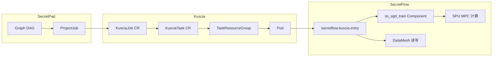
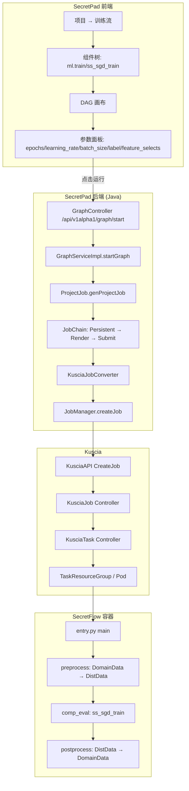
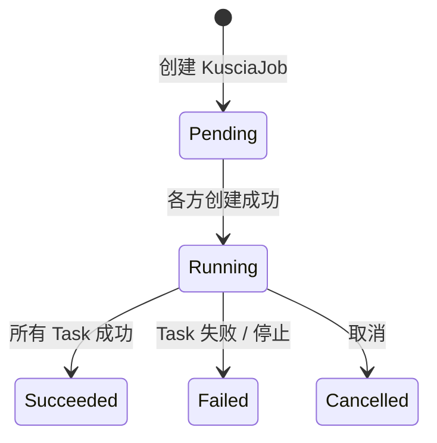
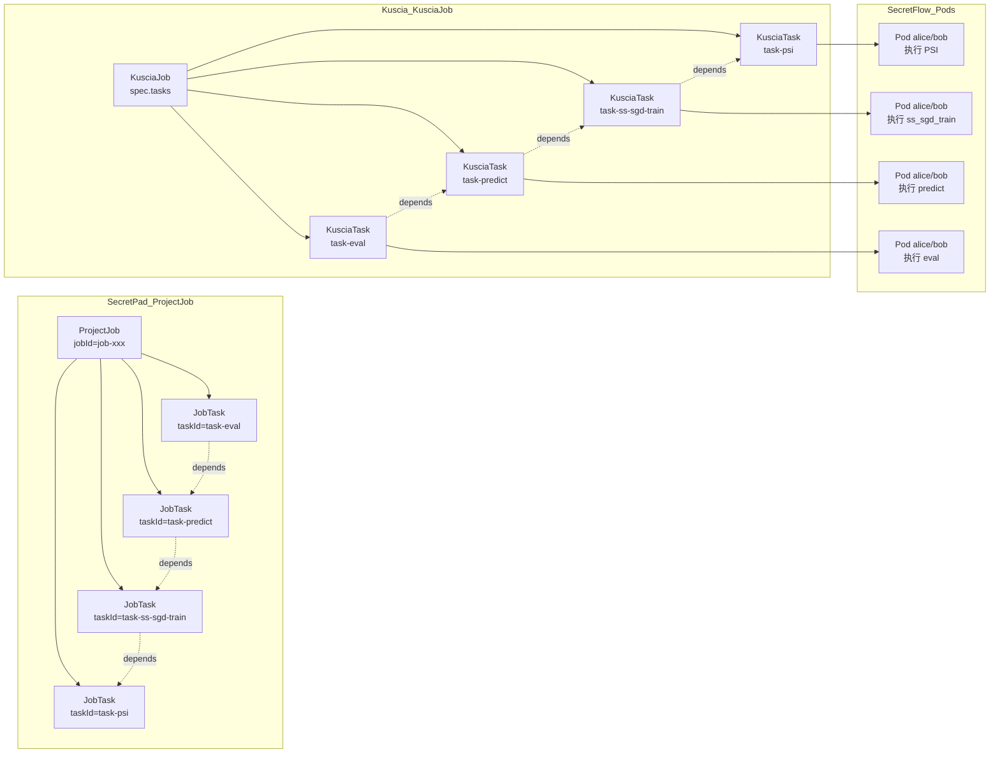
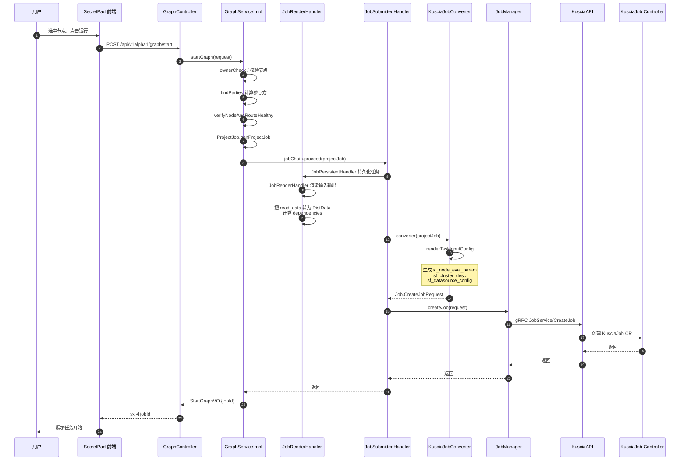
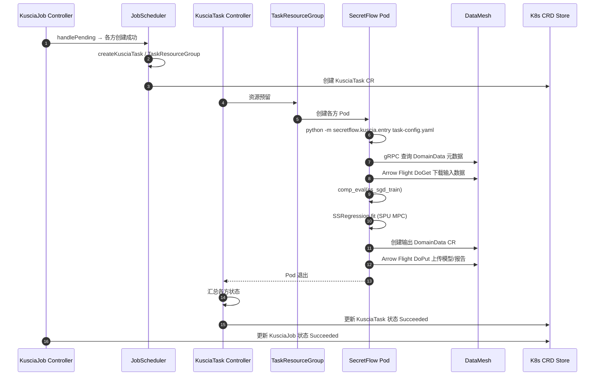
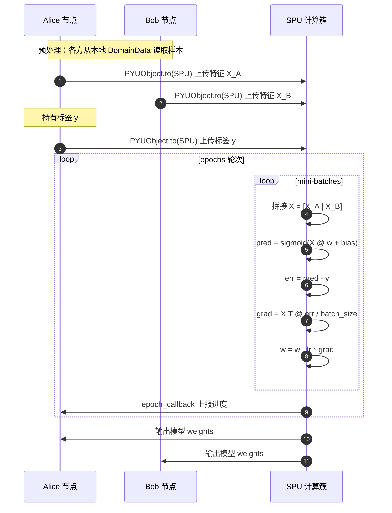

# SecretPad-Kuscia-SecretFlow 联邦逻辑回归全流程详解

> 范围：以 SecretPad 平台上的“联邦逻辑回归训练”为例，从前端拖拽组件、配置参数，到后端构建 DAG、提交 Kuscia Job，再到 Kuscia 调度任务、SecretFlow 执行 MPC 训练并回写结果，完整梳理一次联邦建模的生命周期。
> 版本依据：当前 workspace 中的 `secretpad`、`kuscia`、`secretflow` 源码。

---

## 1. 概述

### 1.1 联邦逻辑回归在 SecretFlow 中的实现

SecretFlow 中联邦逻辑回归训练由组件 `ml.train/ss_sgd_train` 提供：

- **算法**：基于 mini-batch SGD 的纵向（vertical）逻辑回归。
- **安全计算**：使用 SPU（Secure Processing Unit）进行安全多方计算（MPC），各方数据以秘密分享（secret sharing）方式参与训练，原始特征和标签不离开本地。
- **组件名**：`ss_sgd_train`（SS-SGD = Secret Sharing SGD）。
- **默认回归类型**：`reg_type = logistic`，即逻辑回归；也支持 `linear`（线性回归）。

### 1.2 一次完整流程的阶段划分

| 阶段 | 发生位置 | 关键动作 | 产物 |
| ------ | ---------- | ---------- | ------ |
| ① 数据准备 | SecretPad + Kuscia | 各方注册 DomainDataSource / DomainData | `DomainData` CR（样本表） |
| ② 画布编排 | SecretPad 前端 | 拖拽“读数据表”→“逻辑回归训练”→“预测/评估”组件，连线 | Graph（DAG）JSON |
| ③ 提交运行 | SecretPad 后端 | 校验、渲染、生成 ProjectJob，转 Kuscia CreateJobRequest | `KusciaJob` CR |
| ④ 任务调度 | Kuscia | Job Controller → Task Controller → Pod | 各方 SecretFlow 容器 |
| ⑤ 组件执行 | SecretFlow 容器 | 读取 DataMesh 数据 → `SSRegression.fit` → 输出模型/报告 | `DistData` / 新 `DomainData` |
| ⑥ 状态同步 | Kuscia → SecretPad | `watchJob` 事件流更新任务状态 | 前端展示运行进度与结果 |

### 1.3 核心概念



**关键概念说明**：

- **Graph / DAG**：SecretPad 前端画布，节点是组件（如 `read_data/datatable`、`ml.train/ss_sgd_train`），边表示数据依赖。
- **ProjectJob**：SecretPad 后端根据 DAG 生成的项目级作业，包含多个 `JobTask`。
- **KusciaJob**：Kuscia 侧作业 CRD，包含多个 `Task`，描述各参与方、依赖、任务输入配置。
- **KusciaTask**：Kuscia 侧任务 CRD，由 Job Controller 根据 KusciaJob 生成，对应一个组件的一次执行。
- **TaskInputConfig**：JSON 格式的任务输入配置，包含 `sf_node_eval_param`（组件参数）、`sf_cluster_desc`（SPU 集群描述）、`sf_input/output_ids`、`sf_datasource_config` 等。
- **DataMesh**：Kuscia 数据平面，SecretFlow 通过 Arrow Flight 读取/写入 DomainData 实际字节。

### 1.4 总体架构



---

## 2. 前置条件：数据准备

在画布上运行“逻辑回归训练”之前，各方必须先完成数据注册（参见 `通信与数据注册流程.md`）：

1. 各方在 SecretPad 上传 CSV 样本表，调用 `/api/v1alpha1/data/upload` 落盘。
2. 再调用 `/api/v1alpha1/datatable/create` 在 Kuscia 中创建 `DomainData` CR。
3. 在 SecretPad 项目中把各方的数据表授权给当前项目使用（生成 `project_datatable` 记录）。

> 联邦逻辑回归属于**纵向联邦学习（VFL）**：各方样本对齐（通常通过 ID 列，如 PSI 求交后），特征分散在不同参与方，只有一方持有标签。

---

## 3. 前端画布编排

### 3.1 入口与组件

**文件**：`secretpad/frontend-src/apps/platform/src/modules/main-dag/graph-request-service.tsx`

前端把 `ml.train/ss_sgd_train` 识别为支持进度展示的训练组件：

```typescript
const showProgressCodeNames = [
  'ml.train/sgb_train',
  'ml.train/ss_glm_train',
  'ml.train/ss_xgb_train',
  'ml.train/ss_sgd_train',
];
```

用户在画布上拖拽以下典型节点：

| 节点 | codeName | 作用 |
| ------ | ---------- | ------ |
| 样本表（Alice） | `read_data/datatable` | 读取 Alice 的 DomainData |
| 样本表（Bob） | `read_data/datatable` | 读取 Bob 的 DomainData |
| 隐私求交（可选） | `data_prep/psi` | 对齐双方样本 ID |
| 逻辑回归训练 | `ml.train/ss_sgd_train` | 联邦训练模型 |
| 逻辑回归预测 | `ml.predict/ss_sgd_predict` | 用模型预测 |
| 二分类评估 | `ml.eval/biclassification_eval` | 评估模型效果 |

### 3.2 逻辑回归训练组件参数

**文件**：`secretpad/frontend-src/apps/platform/src/modules/pipeline/templates/pipeline-template-risk.ts`

典型节点配置：

```typescript
{
  nodeDef: {
    domain: 'ml.train',
    name: 'ss_sgd_train',
    version: '1.0.0',
    attrPaths: ['input/input_ds/label', 'input/input_ds/feature_selects'],
    attrs: [
      { ss: ['y'], is_na: false },          // label
      { ss: ['x1','x2','x3'], is_na: false } // feature_selects
    ],
  },
  inputs: [`${graphId}-node-6-output-0`],  // 上游输出 port
  outputs: [`${graphId}-node-11-output-0`, `${graphId}-node-11-output-1`],
  codeName: 'ml.train/ss_sgd_train',
  label: '逻辑回归训练',
}
```

**组件完整参数**（来自 `secretflow/secretflow/component/ml/linear/ss_sgd_train.py`）：

| 参数 | 类型 | 默认值 | 说明 |
| ------ | ------ | -------- | ------ |
| `epochs` | int | 10 | 训练轮数 |
| `learning_rate` | float | 0.1 | 学习率 |
| `batch_size` | int | 1024 | 每批次样本数 |
| `sig_type` | string | t1 | Sigmoid 近似类型（real/t1/t3/t5/df/sr/mix） |
| `reg_type` | string | logistic | 回归类型：logistic 或 linear |
| `penalty` | string | None | 正则化：None / l2 |
| `l2_norm` | float | 0.5 | L2 正则化系数 |
| `eps` | float | 0.001 | 收敛阈值，0 表示不早停 |
| `report_weights` | bool | false | 是否输出明文权重报告 |
| `feature_selects` | string[] | - | 训练特征列 |
| `label` | string | - | 标签列 |
| `input_ds` | Input | - | 输入纵向表（vertical table） |

### 3.3 保存画布

用户点击“保存”时，前端调用：

```text
POST /api/v1alpha1/graph/update
```

请求体包含 nodes、edges，后端把 DAG 持久化到 `project_graph` 表。

### 3.4 启动运行

用户选中要运行的节点（通常从上游数据节点到训练节点），点击“运行”：

```text
POST /api/v1alpha1/graph/start
{
  "projectId": "...",
  "graphId": "...",
  "nodes": ["node-1", "node-6", "node-11"]
}
```

---

## 4. SecretPad 后端：从 DAG 到 Kuscia Job

### 4.1 入口：GraphController / GraphServiceImpl

**文件**：`secretpad/secretpad-web/src/main/java/org/secretflow/secretpad/web/controller/GraphController.java`

```java
@PostMapping("/graph/start")
public SecretPadResponse<StartGraphVO> startGraph(@RequestBody StartGraphRequest request) {
    return SecretPadResponse.success(graphService.startGraph(request));
}
```

**文件**：`secretpad/secretpad-service/src/main/java/org/secretflow/secretpad/service/impl/GraphServiceImpl.java`

```java
@Override
public StartGraphVO startGraph(StartGraphRequest request) {
    // 1. 校验项目/画布/节点存在性
    ProjectGraphDO graphDO = ownerCheck(request.getProjectId(), request.getGraphId());
    List<ProjectGraphNodeDO> selectedNodes = ...

    // 2. 计算每个任务涉及的参与方 parties
    Map<String, Set<String>> topNodes = findTopNodes(graphDO.getEdges(), selectedNodes);
    Map<String, Set<String>> parties = findParties(graphDO.getNodes(), topNodes, request.getProjectId(), partyList);

    // 3. 校验节点状态和网络路由
    verifyNodeAndRouteHealthy(parties.values().stream().flatMap(Set::stream).collect(Collectors.toSet()), request.getProjectId());

    // 4. 生成 ProjectJob
    ProjectJob projectJob = ProjectJob.genProjectJob(graphDO, selectedNodes, parties);

    // 5. 通过 JobChain 处理：持久化 → 渲染 → 提交
    jobChain.proceed(projectJob);
    return new StartGraphVO(projectJob.getJobId());
}
```

### 4.2 JobChain 三阶段

**文件**：`secretpad/secretpad-service/src/main/java/org/secretflow/secretpad/service/graph/JobChain.java`

```java
public JobChain(List<AbstractJobHandler> jobHandlers) {
    AbstractJobHandler.Builder builder = new AbstractJobHandler.Builder();
    jobHandlers.forEach(builder::addHandler);
    handler = builder.build();
}
```

按 `getOrder()` 顺序执行：

| 顺序 | Handler | 文件 | 职责 |
| ------ | --------- | ------ | ------ |
| 1 | JobPersistentHandler | `.../graph/chain/JobPersistentHandler.java` | 把 ProjectJob/ProjectTask 持久化到 DB，SecretPad 组件直接标记为 SUCCEED |
| 2 | JobRenderHandler | `.../graph/chain/JobRenderHandler.java` | 渲染每个任务的输入输出：把 `read_data/datatable` 转为 DistData，把上游 SF 输出替换为历史 task output id，计算 task dependencies |
| 3 | JobSubmittedHandler | `.../graph/chain/JobSubmittedHandler.java` | 调用 `KusciaJobConverter` 生成 `Job.CreateJobRequest`，调用 `jobManager.createJob` 提交到 Kuscia |

### 4.3 JobRenderHandler：输入输出渲染

**文件**：`secretpad/secretpad-service/src/main/java/org/secretflow/secretpad/service/graph/chain/JobRenderHandler.java`

对 `ss_sgd_train` 这种 SecretFlow 组件，执行逻辑：

1. 遍历 `graphNodeInfo.getInputs()`，找到上游节点。
2. 如果上游是 `read_data/datatable`：
   - 从 `project_datatable` 找到数据表。
   - 调用 `datatableManager.findById` 查询 Kuscia 中的 DomainData。
   - 构建 `DistData` 并加入 `nodeDef.inputs`。
3. 如果上游是 SecretFlow 组件：
   - 若在本次选中运行范围内，添加依赖 `dependencies.add(genTaskId(jobId, dependencyGraphNodeId))`。
   - 若已运行过，用历史输出 ID：`taskOutputId = genTaskOutputId(historyJobId, input)`。

### 4.4 KusciaJobConverter：生成 Kuscia CreateJobRequest

**文件**：`secretpad/secretpad-service/src/main/java/org/secretflow/secretpad/service/graph/converter/KusciaJobConverter.java`

```java
public Job.CreateJobRequest converter(ProjectJob job) {
    List<Job.Task> jobTasks = new ArrayList<>();
    for (ProjectJob.JobTask task : job.getTasks()) {
        List<Job.Party> taskParties = task.getParties().stream()
            .map(party -> Job.Party.newBuilder().setDomainId(party).build())
            .collect(Collectors.toList());

        TaskConfigResult taskConfigResult = renderTaskInputConfig(task, job, taskParties);

        Job.Task.Builder jobTaskBuilder = Job.Task.newBuilder()
            .setTaskId(taskId)
            .setAlias(taskId)
            .setAppImage(taskConfigResult.getAppImage())  // "secretflow/sf-dev-anolis8:latest"
            .addAllParties(taskParties)
            .setTaskInputConfig(taskConfigResult.getTaskInputConfig());
        if (!CollectionUtils.isEmpty(task.getDependencies())) {
            jobTaskBuilder.addAllDependencies(task.getDependencies());
        }
        jobTasks.add(jobTaskBuilder.build());
    }
    return Job.CreateJobRequest.newBuilder()
        .setJobId(job.getJobId())
        .setInitiator(initiator)
        .setMaxParallelism(job.getMaxParallelism())
        .addAllTasks(jobTasks)
        .build();
}
```

### 4.5 TaskInputConfig 内容

**文件**：`secretflow/secretflow/kuscia/task_config.py`

Kuscia 任务输入配置 JSON 包含：

```json
{
  "sf_node_eval_param": {
    "domain": "ml.train",
    "name": "ss_sgd_train",
    "version": "1.0.0",
    "attr_paths": ["epochs", "learning_rate", "batch_size", "sig_type", "reg_type", "penalty", "l2_norm", "eps", "report_weights", "input/input_ds/label", "input/input_ds/feature_selects"],
    "attrs": [...],
    "inputs": [{...DistData...}],
    "checkpoint_uri": "..."
  },
  "sf_cluster_desc": {
    "devices": [{
      "name": "spu",
      "type": "spu",
      "parties": ["alice", "bob"],
      "config": "{\"runtime_config\":{\"protocol\":\"SEMI2K\",...},\"link_desc\":{...}}"
    }],
    "parties": ["alice", "bob"]
  },
  "sf_datasource_config": {
    "alice": {"id": "default-data-source"},
    "bob": {"id": "default-data-source"}
  },
  "sf_input_ids": ["alice-table-id", "bob-table-id"],
  "sf_output_ids": ["output-model-id", "output-report-id"],
  "sf_output_uris": ["output-model-uri", "output-report-uri"],
  "table_attrs": [...]
}
```

### 4.6 JobManager：提交到 Kuscia

**文件**：`secretpad/secretpad-manager/src/main/java/org/secretflow/secretpad/manager/integration/job/JobManager.java`

```java
@Override
public void createJob(Job.CreateJobRequest request) {
    Job.CreateJobResponse response;
    if (PlatformTypeEnum.AUTONOMY.equals(getPlaformType())) {
        response = kusciaGrpcClientAdapter.createJob(request, request.getInitiator());
    } else {
        response = kusciaGrpcClientAdapter.createJob(request);
    }
    // 校验 response status
}
```

最终通过 gRPC 调用 KusciaAPI `JobService/CreateJob`。

### 4.7 DAG 在各阶段的保存位置与数据格式

以 1.2 节的六个阶段为线索，联邦逻辑回归的 DAG 在不同阶段会落地为不同的持久化形态，下面按阶段说明保存位置和数据格式。

#### 4.7.1 阶段 ①：数据准备

本阶段还没有形成“计算 DAG”，只产生**数据资产元数据**：

- **保存位置**：Kuscia 的 K8s apiserver / etcd
- **数据格式**：K8s CRD YAML/JSON
- **CRD 类型**：
  - `v1alpha1.DomainDataSource`：描述存储后端（localfs/oss/mysql 等）
  - `v1alpha1.DomainData`：描述具体数据表/文件

示例（简化）：

```yaml
apiVersion: kuscia.secretflow/v1alpha1
kind: DomainData
metadata:
  name: alice-customers
  namespace: alice
spec:
  name: 客户样本
  type: table
  relativeURI: customers.csv
  dataSource: default-data-source
  columns:
    - name: id
      type: str
    - name: age
      type: int
```

#### 4.7.2 阶段 ②：前端画布编排

用户在画布上拖拽组件、连线后，点击“保存”，DAG 被持久化到 SecretPad 数据库。

- **保存位置**：
  - `project_graph` 表：画布主表
  - `project_graph_node` 表：节点详情（OneToMany）
- **数据格式**：关系表 + JSON 列

**`project_graph` 表关键字段**（对应 `ProjectGraphDO`）：

| 字段 | 类型 | 说明 |
| ------ | ------ | ------ |
| `project_id` / `graph_id` | 联合主键 | 画布唯一标识 |
| `name` | varchar | 画布名称 |
| `edges` | JSON | `List<GraphEdgeDO>`，画布连线 |
| `owner_id` | varchar | 画布所有者 |
| `node_max_index` | int | 节点自增序号 |
| `max_parallelism` | int | 最大并行度 |

**`edges` JSON 示例**：

```json
[
  {
    "edgeId": "edge-1",
    "source": "node-1",
    "sourceAnchor": "output-0",
    "target": "node-6",
    "targetAnchor": "input-0"
  }
]
```

**`project_graph_node` 表关键字段**（对应 `ProjectGraphNodeDO`）：

| 字段 | 类型 | 说明 |
| ------ | ------ | ------ |
| `project_id` / `graph_id` / `graph_node_id` | 联合主键 | 节点唯一标识 |
| `code_name` | varchar | 组件名，如 `ml.train/ss_sgd_train` |
| `label` | varchar | 节点显示名称 |
| `x` / `y` | int | 画布坐标 |
| `inputs` | JSON | 上游输出 port id 列表 |
| `outputs` | JSON | 本节点输出 port id 列表 |
| `node_def` | JSON | 组件完整定义（domain/name/version/attrs/...） |

**`node_def` JSON 示例**：

```json
{
  "domain": "ml.train",
  "name": "ss_sgd_train",
  "version": "1.0.0",
  "attrPaths": ["epochs", "learning_rate", "input/input_ds/label", "input/input_ds/feature_selects"],
  "attrs": [...],
  "inputs": [{"name": "input_ds", "type": "sf.table.individual"}],
  "outputs": [{"name": "output_model", "type": "sf.model"}, {"name": "output_report", "type": "sf.report"}]
}
```

#### 4.7.3 阶段 ③：SecretPad 后端生成 ProjectJob

用户点击“运行”后，`GraphServiceImpl.startGraph` 生成 `ProjectJob`，由 `JobChain` 持久化。

- **保存位置**：
  - `project_job` 表：作业主表
  - `project_job_task` 表：作业任务表
- **数据格式**：关系表 + JSON 列

**`project_job` 表关键字段**（对应 `ProjectJobDO`）：

| 字段 | 类型 | 说明 |
| ------ | ------ | ------ |
| `project_id` / `job_id` | 联合主键 | 作业唯一标识 |
| `name` | varchar | 作业名称 |
| `status` | enum | RUNNING / SUCCEED / FAILED / STOPPED |
| `graph_id` | varchar | 关联画布 |
| `edges` | JSON | 从 `project_graph.edges` 复制，保留 DAG 拓扑 |
| `tasks` | 关联 Map | `Map<String, ProjectTaskDO>`，key 为 task_id |

**`project_job_task` 表关键字段**（对应 `ProjectTaskDO`）：

| 字段 | 类型 | 说明 |
| ------ | ------ | ------ |
| `project_id` / `job_id` / `task_id` | 联合主键 | 任务唯一标识 |
| `graph_node_id` | varchar | 关联的 `project_graph_node.graph_node_id` |
| `graph_node` | JSON | 节点完整信息（`ProjectGraphNodeDO` 序列化） |
| `parties` | JSON | 参与方列表，如 `["alice", "bob"]` |
| `status` | enum | INITIALIZED / RUNNING / SUCCEED / FAILED / STOPPED |
| `extra_info` | JSON | 扩展信息，如 `progress` |

> `ProjectJob` 中的 DAG 通过 `tasks` Map + `edges` JSON 表达：Map 的 key 对应节点/task，edges 表达依赖关系。

#### 4.7.4 阶段 ④：Kuscia 侧 KusciaJob / KusciaTask CRD

SecretPad 通过 `KusciaGrpcClientAdapter.createJob(...)` 把 `Job.CreateJobRequest` 提交给 KusciaAPI，Kuscia 创建 `KusciaJob` CRD，再由 Controller 拆分为多个 `KusciaTask` CRD。

**`KusciaJob` CRD**

- **保存位置**：K8s apiserver / etcd（namespace 为发起方 domain，如 `alice`）
- **数据格式**：K8s CRD YAML/JSON
- **关键 Spec 字段**（`kuscia/pkg/crd/apis/kuscia/v1alpha1/kusciajob_types.go`）：

```yaml
apiVersion: kuscia.secretflow/v1alpha1
kind: KusciaJob
metadata:
  name: job-xxx
  namespace: alice
spec:
  initiator: alice
  maxParallelism: 1
  scheduleMode: Strict
  tasks:
    - taskID: task-psi
      alias: task-psi
      appImage: secretflow/sf-dev-anolis8:latest
      parties:
        - domainID: alice
        - domainID: bob
      taskInputConfig: '{"sf_node_eval_param": {...}}'
      dependencies: []
    - taskID: task-ss-sgd-train
      alias: task-ss-sgd-train
      appImage: secretflow/sf-dev-anolis8:latest
      parties:
        - domainID: alice
        - domainID: bob
      taskInputConfig: '{"sf_node_eval_param": {...}}'
      dependencies:
        - task-psi
```

**`KusciaTask` CRD**

- **保存位置**：K8s apiserver / etcd（每个参与方 namespace 各一个，或按策略创建）
- **数据格式**：K8s CRD YAML/JSON
- **关键 Spec 字段**（`kuscia/pkg/crd/apis/kuscia/v1alpha1/kusciatask_types.go`）：

```yaml
apiVersion: kuscia.secretflow/v1alpha1
kind: KusciaTask
metadata:
  name: task-ss-sgd-train
  namespace: alice
spec:
  initiator: alice
  taskInputConfig: '{"sf_node_eval_param": {...}}'
  parties:
    - domainID: alice
      appImageRef: secretflow/sf-dev-anolis8:latest
    - domainID: bob
      appImageRef: secretflow/sf-dev-anolis8:latest
```

> DAG 在 Kuscia 侧通过 `KusciaJob.spec.tasks[].dependencies` 表达；每个 task 被实例化为一个 `KusciaTask` CR。

#### 4.7.5 阶段 ⑤：SecretFlow 容器内

KusciaTask Controller 为每个参与方创建 Pod，Pod 启动后执行：

```bash
python -m secretflow.kuscia.entry /etc/kuscia/task-config.conf --datamesh_addr=datamesh:8071
```

- **保存位置**：容器内 `/etc/kuscia/task-config.conf`（JSON 文件）
- **数据格式**：JSON，对应 `KusciaTaskConfig`
- **DAG 表达方式**：
  - 此时不再保存完整 DAG，只保存**当前任务**的执行配置。
  - 跨任务依赖由 Kuscia 调度器保证（先运行 `task-psi`，再运行 `task-ss-sgd-train`）。
  - 当前任务的输入输出关系通过 `sf_node_eval_param.inputs` / `sf_output_ids` / `sf_output_uris` 表达。

**TaskInputConfig 核心结构**（参见 4.5 节）：

```json
{
  "sf_node_eval_param": {
    "domain": "ml.train",
    "name": "ss_sgd_train",
    "version": "1.0.0",
    "attr_paths": [...],
    "attrs": [...],
    "inputs": [{...DistData...}],
    "checkpoint_uri": "..."
  },
  "sf_cluster_desc": {
    "devices": [{"name": "spu", "type": "spu", "parties": ["alice", "bob"], "config": "..."}],
    "parties": ["alice", "bob"]
  },
  "sf_datasource_config": {
    "alice": {"id": "default-data-source"},
    "bob": {"id": "default-data-source"}
  },
  "sf_input_ids": ["alice-table-id", "bob-table-id"],
  "sf_output_ids": ["output-model-id", "output-report-id"],
  "sf_output_uris": ["output-model-uri", "output-report-uri"],
  "table_attrs": [...]
}
```

#### 4.7.6 阶段 ⑥：状态同步

任务运行后，状态由 Kuscia 侧 CRD Status 承载，再同步回 SecretPad。

- **Kuscia 侧**：
  - `KusciaJob.status.phase`：Pending / Running / Succeeded / Failed / Cancelled
  - `KusciaJob.status.taskStatus`：Map[taskID]phase
  - `KusciaTask.status.phase` / `partyTaskStatus`
- **SecretPad 侧**：
  - `project_job.status`
  - `project_job_task.status`

SecretPad 通过 `JobService/WatchJob` gRPC 流监听 `KusciaJob` 状态变化，并更新本地 DB。

#### 4.7.7 各阶段 DAG 保存总结

| 阶段 | 保存位置 | 数据格式 | DAG / 依赖表达方式 |
| ------ | ---------- | ---------- | ------------------- |
| ① 数据准备 | K8s apiserver / etcd | CRD YAML/JSON | 无 DAG，仅 `DomainData` / `DomainDataSource` |
| ② 画布编排 | `project_graph` + `project_graph_node` | 关系表 + JSON 列 | `nodes` 表 + `edges` JSON |
| ③ 提交运行 | `project_job` + `project_job_task` | 关系表 + JSON 列 | `tasks` Map + `edges` JSON |
| ④ Kuscia 调度 | `KusciaJob` + `KusciaTask` CRD | K8s CRD YAML/JSON | `tasks[].dependencies` |
| ⑤ 组件执行 | Pod 内 `/etc/kuscia/task-config.conf` | JSON 文件 | 单任务 `sf_node_eval_param`，跨任务依赖由 Kuscia 调度保证 |
| ⑥ 状态同步 | `KusciaJob/KusciaTask.status` + `project_job/task` | JSON / 关系表 | `taskStatus` Map |

### 4.8 ProjectJob 数据结构详解与 DAG 执行逻辑

本节进一步展开**后端运行时模型 ProjectJob**以及**Kuscia 侧 DAG 调度**的细节。

#### 4.8.1 ProjectJob 运行时模型

**源码位置**：`secretpad/secretpad-service/src/main/java/org/secretflow/secretpad/service/model/graph/ProjectJob.java`

`ProjectJob` 是 SecretPad 后端描述“一次画布运行”的运行时对象，位于前端画布与 Kuscia Job 之间。

```java
public class ProjectJob implements Serializable {
    private String projectId;          // 项目 ID
    private String graphId;            // 画布 ID
    private String name;               // 作业名称（同画布名）
    private String jobId;              // 4 位随机 UUID
    private List<GraphNodeInfo> fullNodes; // 画布所有节点快照（用于渲染上游）
    private List<GraphEdge> edges;     // 画布边，保留 DAG 拓扑
    private List<JobTask> tasks;       // 本次运行的任务列表
    private Integer maxParallelism;    // 最大并行度

    public static class JobTask implements Serializable {
        private String taskId;                    // genTaskId(jobId, graphNodeId)
        private List<String> parties;             // 参与方节点，如 ["alice", "bob"]
        private GraphNodeTaskStatus status;       // INITIALIZED / RUNNING / SUCCEED / ...
        private List<String> dependencies;        // 上游 taskId 列表
        private GraphNodeInfo node;               // 对应画布节点（组件参数、inputs/outputs）
    }
}
```

**关键设计点**：

- `fullNodes` 保存画布**全部**节点，而 `tasks` 只保存用户**选中**的节点；渲染时需要根据 `fullNodes` 查找上游节点信息。
- `edges` 保留 DAG 拓扑，用于 `JobRenderHandler` 计算每个 `JobTask.dependencies`。
- `JobTask.taskId` 由 `JobUtils.genTaskId(jobId, graphNodeId)` 生成，保证同一画布节点在不同次运行中有稳定的可关联标识。

#### 4.8.2 ProjectJob → ProjectJobDO / ProjectTaskDO

`ProjectJob.toDO(...)` 把运行时模型转换为 JPA 实体，写入 SecretPad 数据库。

```text
ProjectJob
    │
    ├─ projectId / graphId / jobId / name / maxParallelism
    │     │
    │     ▼
    │  project_job 表（主表）
    │
    ├─ edges (List<GraphEdge>)
    │     │
    │     ▼
    │  project_job.edges JSON 列
    │
    └─ tasks (List<JobTask>)
          │
          ▼
       遍历每个 JobTask
          │
          ├─ taskId / parties / status
          │     ▼
          │  project_job_task.task_id / parties(JSON) / status
          │
          ├─ node (GraphNodeInfo)
          │     ▼
          │  project_job_task.graph_node JSON 列
          │     （通过 GraphNodeDetail.toDO 序列化）
          │
          └─ UPK = (projectId, jobId, taskId)
                ▼
             project_job_task 联合主键
```

**持久化后的数据结构**：

| 运行时字段 | 持久化位置 | 持久化形式 |
| ----------- | ----------- | ----------- |
| `projectId` / `jobId` / `name` / `graphId` / `maxParallelism` | `project_job` 表 | 普通列 |
| `edges` | `project_job.edges` | JSON：`List<GraphEdgeDO>` |
| `tasks` | `project_job_task` 表 | 多行，每行一个 JobTask |
| `JobTask.taskId` | `project_job_task.task_id` | 主键列 |
| `JobTask.parties` | `project_job_task.parties` | JSON 列：`["alice","bob"]` |
| `JobTask.status` | `project_job_task.status` | 枚举列 |
| `JobTask.node` | `project_job_task.graph_node` | JSON 列：`ProjectGraphNodeDO` |
| `JobTask.dependencies` | 不直接持久化 | 由 `JobRenderHandler` 在提交前动态计算 |

#### 4.8.3 Kuscia 侧数据结构

`KusciaJobConverter` 把 `ProjectJob` 转换为 Kuscia 的 `Job.CreateJobRequest`（proto），Kuscia 据此创建 `KusciaJob` CRD。

**KusciaJob Spec（DAG 描述）**：

```yaml
apiVersion: kuscia.secretflow/v1alpha1
kind: KusciaJob
metadata:
  name: <jobId>
  namespace: <initiator>
spec:
  initiator: alice
  maxParallelism: 1
  scheduleMode: Strict
  tasks:
    - taskID: task-psi
      alias: task-psi
      appImage: secretflow/sf-dev-anolis8:latest
      parties:
        - domainID: alice
        - domainID: bob
      taskInputConfig: '{...JSON...}'
      dependencies: []          # 无上游，可立即调度

    - taskID: task-ss-sgd-train
      alias: task-ss-sgd-train
      appImage: secretflow/sf-dev-anolis8:latest
      parties:
        - domainID: alice
        - domainID: bob
      taskInputConfig: '{...JSON...}'
      dependencies:
        - task-psi              # 依赖 PSI 任务成功
```

**KusciaTask Spec（单个任务实例）**：

```yaml
apiVersion: kuscia.secretflow/v1alpha1
kind: KusciaTask
metadata:
  name: <taskID>
  namespace: <party-domain>
spec:
  initiator: alice
  taskInputConfig: '{...JSON...}'   # 与 KusciaJob.tasks[].taskInputConfig 相同
  parties:
    - domainID: alice
      appImageRef: secretflow/sf-dev-anolis8:latest
    - domainID: bob
      appImageRef: secretflow/sf-dev-anolis8:latest
```

> DAG 在 Kuscia 侧仅由 `KusciaJob.spec.tasks[].dependencies` 表达；每个 task 被实例化为一个或多个 `KusciaTask` CR（每个参与方一个）。

#### 4.8.4 DAG 执行逻辑

Kuscia 内部通过 **KusciaJob Controller → JobScheduler → KusciaTask Controller** 三级结构驱动 DAG 执行。



**执行流程**：

1. **KusciaJob Controller**（`kuscia/pkg/controllers/kusciajob/controller.go`）
   - Watch `KusciaJob` CR 变化。
   - 按 `Pending → Running → Succeeded/Failed/Cancelled` 状态机推进。

2. **JobScheduler**（`kuscia/pkg/controllers/kusciajob/handler/scheduler.go`）
   - 解析 `KusciaJob.spec.tasks` 列表。
   - 对每个 task，检查其 `dependencies` 中所有上游 task 是否都已达到 `Succeeded`。
   - 若依赖满足且当前运行任务数小于 `maxParallelism`，则创建对应的 `KusciaTask` CR 和 `TaskResourceGroup`。

3. **KusciaTask Controller**（`kuscia/pkg/controllers/kusciatask/handler/running_handler.go`）
   - Watch `KusciaTask` CR。
   - 根据 `parties` 列表，为每个参与方创建 Pod。
   - Pod 中启动 SecretFlow 容器，执行 `python -m secretflow.kuscia.entry /etc/kuscia/task-config.conf`。
   - 汇总各方 Pod 状态，更新 `KusciaTask.status.phase`。

4. **依赖推进**
   - 当一个 `KusciaTask` 成功，KusciaJob Controller 将其状态更新到 `KusciaJob.status.taskStatus`。
   - JobScheduler 下一轮调度时，发现下游 task 的 dependencies 已满足，继续创建新的 `KusciaTask`。
   - 若任一 task 失败且 `scheduleMode = Strict`，整个 Job 立即失败；若为 `BestEffort`，则跳过下游任务继续执行其他可运行任务。

#### 4.8.5 联邦逻辑回归 DAG 执行示例

以“PSI 求交 → 逻辑回归训练 → 预测 → 评估”为例：



**执行时序**：

```text
T0: KusciaJob Controller 创建 KusciaJob，状态 Pending
T1: JobScheduler 发现 task-psi 无依赖，创建 KusciaTask(task-psi)
T2: KusciaTask Controller 为 alice/bob 创建 Pod，执行 PSI
T3: PSI 成功 → KusciaTask(task-psi) 状态 Succeeded
T4: KusciaJob.status.taskStatus[task-psi] = Succeeded
T5: JobScheduler 发现 task-ss-sgd-train 依赖已满足，创建 KusciaTask(task-ss-sgd-train)
T6: alice/bob Pod 执行 ss_sgd_train
T7: 训练成功 → 继续 predict → eval
T8: 全部任务成功 → KusciaJob 状态 Succeeded
```

#### 4.8.6 数据结构转换总图

```text
前端画布
   │
   ▼ 保存/更新
project_graph + project_graph_node
   │
   ▼ 用户点击运行
GraphServiceImpl.startGraph(...)
   │
   ▼ genProjectJob
ProjectJob (运行时模型)
   │  • tasks: List<JobTask>
   │  • edges: List<GraphEdge>
   │  • fullNodes: List<GraphNodeInfo>
   │
   ▼ ProjectJob.toDO
project_job + project_job_task
   │
   ▼ JobRenderHandler 渲染
ProjectJob (补充 dependencies / sf_node_eval_param)
   │
   ▼ KusciaJobConverter
Job.CreateJobRequest (protobuf)
   │
   ▼ gRPC JobService/CreateJob
KusciaJob CRD
   │
   ▼ KusciaJob Controller + JobScheduler
KusciaTask CRD(s)
   │
   ▼ KusciaTask Controller
Pod(s) per party → SecretFlow entry.py → 组件执行
```

---

## 5. Kuscia 侧：Job 创建与任务调度

### 5.1 KusciaAPI 接收 CreateJob

**Proto**：`kuscia/proto/api/v1alpha1/kusciaapi/job.proto`

```proto
service JobService {
  rpc CreateJob(CreateJobRequest) returns (CreateJobResponse);
  rpc QueryJob(QueryJobRequest) returns (QueryJobResponse);
  rpc DeleteJob(DeleteJobRequest) returns (DeleteJobResponse);
  rpc StopJob(StopJobRequest) returns (StopJobResponse);
  rpc WatchJob(WatchJobRequest) returns (stream WatchJobEventResponse);
}
```

```proto
message CreateJobRequest {
  RequestHeader header = 1;
  string job_id = 2;
  string initiator = 3;
  int32 max_parallelism = 4;
  repeated Task tasks = 5;
}

message Task {
  string task_id = 1;
  string alias = 2;
  string app_image = 3;
  repeated Party parties = 4;
  string task_input_config = 5;
  repeated string dependencies = 6;
}
```

### 5.2 KusciaJob Controller

**文件**：`kuscia/pkg/controllers/kusciajob/controller.go`

KusciaJob Controller 监听 `KusciaJob` CR 的变化，按阶段调度：


**阶段处理器**（`kuscia/pkg/controllers/kusciajob/handler/`）：

| 阶段 | Handler | 行为 |
| ------ | --------- | ------ |
| Pending | `PendingHandler` | 等待各方完成创建，创建成功后进入 Running |
| Running | `RunningHandler` | 调度 Task，监听 Task 状态 |
| Succeeded | `SucceededHandler` | 清理资源 |
| Failed | `FailedHandler` | 标记失败 |
| Cancelled | `CancelledHandler` | 取消运行中任务 |

### 5.3 JobScheduler：从 Job 到 Task

**文件**：`kuscia/pkg/controllers/kusciajob/handler/scheduler.go`

JobScheduler 负责把 KusciaJob 拆分为多个 KusciaTask：

1. 解析 Job 中的 `tasks` 列表。
2. 对每个 task，根据 `parties` 和 `dependencies` 创建 `KusciaTask` CR。
3. 创建 `TaskResourceGroup`（TRG）来协调各方资源预留。
4. 由 KusciaTask Controller 进一步创建各方 Pod。

### 5.4 KusciaTask Controller 与 Pod 创建

**文件**：`kuscia/pkg/controllers/kusciatask/handler/running_handler.go`

RunningHandler 监听 KusciaTask 和 Pod 状态：

1. 获取 Task 对应的 TaskResourceGroup。
2. 根据 TRG 中的 party 列表，为每个参与方创建 Pod。
3. Pod 中运行 SecretFlow 容器，挂载 task config（YAML）。
4. 汇总各方 Pod 状态，更新 KusciaTask 状态（Pending / Running / Succeeded / Failed）。

### 5.5 Pod 中的 SecretFlow 启动

Kuscia 为每个参与方创建 Pod，容器启动命令通常为：

```bash
python -m secretflow.kuscia.entry /etc/kuscia/task-config.yaml --datamesh_addr=datamesh:8071
```

环境变量包含：

- `KUSCIA_TASK_ID`
- `KUSCIA_PARTY_NAME`
- `DATAMESH_ADDRESS`
- `SPU_CLUSTER_DESC`（通过 task config 传入）

---

## 6. SecretFlow 容器内执行逻辑回归

### 6.1 入口：secretflow.kuscia.entry

**文件**：`secretflow/secretflow/kuscia/entry.py`

主执行流程：

```tex

```

```python
@click.command()
@click.argument("task_config_path")
@click.option("--datamesh_addr", default=DEFAULT_DATAMESH_ADDRESS)
@click.option("--enable_plugins", default=True)
def main(task_config_path, datamesh_addr, enable_plugins):
    if enable_plugins:
        load_plugins()                      # 加载组件，包括 ss_sgd_train
    os.environ["DATAMESH_ADDRESS"] = datamesh_addr
    task_conf = KusciaTaskConfig.from_file(task_config_path)
    
    # 连接 DataMesh
    datamesh_channel = create_channel(datamesh_addr)
    datasource_stub = create_domain_data_source_service_stub(datamesh_channel)
    datasource_id = get_datasource_id(task_conf)
    datasource = get_domain_data_source(datasource_stub, datasource_id)
    storage_config = get_storage_config(task_conf, datasource)
    domaindata_stub = create_domain_data_service_stub(datamesh_channel)
    
    # 预处理：把输入 DomainData ID 转为 DistData
    sf_node_eval_param = preprocess_sf_node_eval_param(
        task_conf, datamesh_addr, task_conf.sf_node_eval_param,
        datasource, storage_config, domaindata_stub,
        task_conf.sf_input_ids, task_conf.sf_output_uris
    )
    
    # 执行组件
    sf_cluster_config = get_sf_cluster_config(task_conf)
    try:
        res = comp_eval(sf_node_eval_param, storage_config, sf_cluster_config)
    except Exception as e:
        logging.error(f"comp_eval fail.\n{format_exception(e)}")
        os._exit(1)
    
    # 后处理：把输出 DistData 写回 DataMesh
    postprocess_sf_node_eval_result(
        task_conf, res, datasource, storage_config, datamesh_addr,
        domaindata_stub, task_conf.party_name,
        task_conf.sf_output_ids, task_conf.sf_output_uris
    )
```

### 6.2 预处理：DomainData → DistData

```tex
在 `preprocess_sf_node_eval_param` 函数中，`DistData` 对象是 SecretFlow 框架用来描述分布式数据的一种标准结构。它的核心作用是作为一个**"数据清单"**，告诉 SecretFlow 的计算组件（Component）一个逻辑上的数据（比如一张表或一个模型）是如何物理地分布在各个参与方（Party）的。

具体来说，`DistData` 对象（定义在 `secretflow_spec.v1.data_pb2.DistData`）主要包含以下信息：

1. **`type`**：数据的类型。这是一个字符串，用来标识数据的种类，例如：
   - `sf.table.individual`：代表一个多方联合表。
   - `sf.model.*`：代表一个模型文件。
   - `sf.rule.*`：代表一个规则文件。
   - `sf.report`：代表一个报告。

2. **`data_refs`**：一个列表，包含了组成这个分布式数据的各个物理数据片段的引用。列表中的每一项 `DataRef` 都描述了一个数据片段，包含：
   - `party`：这个数据片段属于哪个参与方（例如 `"alice"` 或 `"bob"`）。
   - `uri`：数据文件的相对路径。
   - `format`：数据的格式，比如 `csv` 或 `orc`。

---

## 在 `preprocess_sf_node_eval_param` 函数中的转换流程

这个函数是 Kuscia 环境和 SecretFlow 框架之间的**"适配层"**或**"转换器"**。它的主要工作流程如下：

1. **输入**：函数接收来自 Kuscia 的输入，主要是 `sf_input_ids`，这是一系列 `DomainData` 的 ID。`DomainData` 是 Kuscia 数据管理模块（DataMesh）的概念，代表一个逻辑数据单元。

2. **转换**：函数的核心任务是遍历这些 `DomainData` ID，并通过调用 `domaindata_id_to_dist_data` 函数将每一个 `DomainData` ID 转换成一个 `DistData` 对象。

3. **数据下载**：在转换过程中，如果数据不是直接访问模式（`access_directly` 为 `False`），函数会负责从 Kuscia 的数据代理（DataProxy）下载实际的数据文件到本地的临时工作目录。

4. **输出**：最终，函数将生成的所有 `DistData` 对象填充到 `NodeEvalParam` 的 `inputs` 字段中。这个处理过的 `NodeEvalParam` 随后会被传递给 SecretFlow 的核心计算引擎 `comp_eval`。

---

## 总结

可以把 `DistData` 理解为 SecretFlow 世界里的**"数据说明书"**。而 `preprocess_sf_node_eval_param` 函数的角色就是一位**"翻译官"**，它读取 Kuscia 世界的"地址"（`DomainData` ID），找到并下载实际的数据，然后编写成 SecretFlow 能看懂的"数据说明书"（`DistData`），以便后续的隐私计算任务能够顺利执行。
核心思想是“元数据与数据分离”：
1.DistData: 这是一个轻量级的 protobuf 对象，只包含描述信息。因为它很小，所以可以在网络中（例如在 SecretFlow 的各个 PYU 设备之间，或者在 SecretPad 和 SecretFlow 之间）高效地传递。
2.实际数据: 真正的数据以文件形式（如 CSV、ORC、模型二进制文件等）存储在各个参与方的本地文件系统或对象存储（如 OSS）上。
```

**文件**：`secretflow/secretflow/kuscia/entry.py` 中的 `domaindata_id_to_dist_data`

1. 通过 gRPC 查询 DataMesh 获取 `DomainData` 元数据。
2. 若 DomainData attributes 中有缓存的 `dist_data`，直接反序列化。
3. 否则根据 `table_attr` 转换为 `IndividualTable` 类型的 `DistData`。
4. 若不是 `access_directly` 模式，调用 `download_dist_data_from_dp` 通过 Arrow Flight 下载 CSV/ORC 到本地临时目录。

### 6.3 组件执行：ss_sgd_train

**文件**：`secretflow/secretflow/component/ml/linear/ss_sgd_train.py`

```python
@register(domain="ml.train", version="1.0.0", name="ss_sgd_train")
class SSSGDTrain(SSSGDExportMixin, Component, IServingExporter):
    def evaluate(self, ctx: Context):
        spu = ctx.make_spu()
        
        # 从 DistData 恢复 VTable
        tbl = VTable.from_distdata(self.input_ds)
        
        # 分离标签和特征
        tbl_y = tbl.select([self.label])
        y = ctx.load_table(tbl_y).to_pandas()
        
        tbl_x = tbl.select(self.feature_selects)
        x = ctx.load_table(tbl_x).to_pandas()
        
        # 在 SPU 上训练
        with ctx.trace_running():
            reg = SSRegression(spu)
            reg.fit(
                x=x, y=y,
                epochs=self.epochs,
                learning_rate=self.learning_rate,
                batch_size=self.batch_size,
                sig_type=self.sig_type,
                reg_type=self.reg_type,        # "logistic"
                penalty=self.penalty,
                l2_norm=self.l2_norm,
                eps=self.eps,
                epoch_callback=epoch_callback,
                recovery_checkpoint=checkpoint,
            )
        
        model = reg.save_model()
        model_meta = {
            "reg_type": model.reg_type.value,
            "sig_type": model.sig_type.value,
            "feature_names": x.columns,
            "label_col": [self.label],
            "party_features_length": party_features_length,
        }
        
        # 输出模型 DistData
        model_dd = Model(
            "ss_sgd", DistDataType.SS_SGD_MODEL, SS_SGD_MODEL_MAX,
            objs=[model.weights],
            public_info=json.dumps(model_meta),
            system_info=self.input_ds.system_info,
        )
        ctx.dump_to(model_dd, self.output_model)
        self.dump_report(reg, x)
```

### 6.4 MPC 训练：SSRegression.fit

**文件**：`secretflow/secretflow/ml/linear/ss_sgd/model.py`

核心逻辑：

1. `_prepare_dataset`：把输入转为 `FedNdarray`，确认是纵向切分（`PartitionWay.VERTICAL`）。
2. `_pre_check`：参数校验、收敛阈值、学习率衰减策略。
3. `_epoch`：每一轮 epoch：
   - 将各方特征通过 `PYUObject.to(SPU)` 上传到 SPU 设备，按列拼接（`axis=1`）。
   - 在 SPU 中执行 `_batch_update_w`：
     - 计算预测值 `pred = x @ w + bias`。
     - 若是 logistic，通过 `sigmoid(pred, sig_type)` 计算概率。
     - 计算误差 `err = pred - y`。
     - 计算梯度 `grad = x.T @ err / batch_size`。
     - 若使用 L2 正则，加入正则项。
     - 更新权重 `w = w - step`。
4. `_convergence`：比较新旧权重变化率，若小于 `eps` 则早停。
5. 最终权重 `spu_w` 仍保存在 SPU 中，作为模型输出。

### 6.5 后处理：DistData → DomainData

**文件**：`secretflow/secretflow/kuscia/entry.py` 中的 `postprocess_sf_node_eval_result`

1. 遍历 `res.outputs` 中的每个 `DistData`。
2. 调用 `convert_dist_data_to_domain_data` 生成 `DomainData` 对象。
3. 调用 DataMesh gRPC `CreateDomainData` 注册新的 DomainData。
4. 若不是 `access_directly` 模式：
   - 表格类型：上传 CSV/ORC 文件。
   - 模型/规则类型：打包为 `tar.gz` 后上传。
5. 关闭 Flight 客户端。

对于 `ss_sgd_train`：

- **output_model**：`sf.model.ss_sgd` 类型，权重以 SPUObject 形式保存。
- **report**（可选）：若 `report_weights=true`，输出明文权重报告。

---

## 7. 状态同步与结果展示

### 7.1 Kuscia 事件流

**文件**：`secretpad/secretpad-manager/src/main/java/org/secretflow/secretpad/manager/integration/job/JobManager.java`

SecretPad 通过 `watchJob` gRPC 流监听 Kuscia Job 状态：

```java
jobServiceAsyncStub.watchJob(
    Job.WatchJobRequest.newBuilder().build(),
    new StreamObserver<Job.WatchJobEventResponse>() {
        @Override public void onNext(Job.WatchJobEventResponse responses) {
            syncJob(responses);
        }
        ...
    }
);
```

事件类型包括 `ADDED`、`MODIFIED`、`DELETED`，SecretPad 据此更新 `project_job`、`project_task`、`project_result` 等表。

### 7.2 前端进度展示

**文件**：`secretpad/frontend-src/apps/platform/src/modules/main-dag/graph-request-service.tsx`

前端定时轮询：

```text
POST /api/v1alpha1/graph/node/status
```

后端返回每个 graph node 的状态、进度、参与方。`ss_sgd_train` 由于 `epoch_callback` 上报进度，前端可展示训练进度百分比。

### 7.3 结果查看

训练完成后：

- **模型**：可在“模型管理”查看 `SS_SGD_MODEL`，支持导出、提交到模型服务。
- **报告**：可在“结果详情”查看权重报告、评估指标（AUC、KS 等）。
- **预测表**：预测组件输出的 DomainData 可作为新的数据表使用。

---

## 8. 完整时序图

### 8.1 从画布点击运行到 Kuscia Job 创建



### 8.2 Kuscia 调度到 SecretFlow 执行



### 8.3 联邦逻辑回归数据流



---

## 9. 关键源码文件索引

### SecretPad 前端

| 用途 | 路径 |
| ------ | ------ |
| DAG 主画布请求服务 | `secretpad/frontend-src/apps/platform/src/modules/main-dag/graph-request-service.tsx` |
| DAG 提交页面 | `secretpad/frontend-src/apps/platform/src/modules/dag-submit/graph-request-service.ts` |
| 二分类模板（含逻辑回归） | `secretpad/frontend-src/apps/platform/src/modules/pipeline/templates/pipeline-template-risk.ts` |
| 组件树服务 | `secretpad/frontend-src/apps/platform/src/modules/component-tree/component-tree-service.ts` |
| 组件配置服务 | `secretpad/frontend-src/apps/platform/src/modules/component-config/component-config-service.ts` |
| GraphController 前端 API | `secretpad/frontend-src/apps/platform/src/services/secretpad/GraphController.ts` |

### SecretPad 后端

| 用途 | 路径 |
| ------ | ------ |
| GraphController | `secretpad/secretpad-web/src/main/java/org/secretflow/secretpad/web/controller/GraphController.java` |
| GraphServiceImpl | `secretpad/secretpad-service/src/main/java/org/secretflow/secretpad/service/impl/GraphServiceImpl.java` |
| JobChain | `secretpad/secretpad-service/src/main/java/org/secretflow/secretpad/service/graph/JobChain.java` |
| JobPersistentHandler | `secretpad/secretpad-service/src/main/java/org/secretflow/secretpad/service/graph/chain/JobPersistentHandler.java` |
| JobRenderHandler | `secretpad/secretpad-service/src/main/java/org/secretflow/secretpad/service/graph/chain/JobRenderHandler.java` |
| JobSubmittedHandler | `secretpad/secretpad-service/src/main/java/org/secretflow/secretpad/service/graph/chain/JobSubmittedHandler.java` |
| KusciaJobConverter | `secretpad/secretpad-service/src/main/java/org/secretflow/secretpad/service/graph/converter/KusciaJobConverter.java` |
| JobManager | `secretpad/secretpad-manager/src/main/java/org/secretflow/secretpad/manager/integration/job/JobManager.java` |
| KusciaGrpcClientAdapter | `secretpad/secretpad-api/client-java-kusciaapi/src/main/java/org/secretflow/secretpad/kuscia/v1alpha1/service/impl/KusciaGrpcClientAdapter.java` |

### Kuscia

| 用途 | 路径 |
| ------ | ------ |
| Job Proto | `kuscia/proto/api/v1alpha1/kusciaapi/job.proto` |
| KusciaJob Controller | `kuscia/pkg/controllers/kusciajob/controller.go` |
| PendingHandler | `kuscia/pkg/controllers/kusciajob/handler/pending.go` |
| JobScheduler | `kuscia/pkg/controllers/kusciajob/handler/scheduler.go` |
| KusciaTask RunningHandler | `kuscia/pkg/controllers/kusciatask/handler/running_handler.go` |
| KusciaJob CRD | `kuscia/pkg/crd/apis/kuscia/v1alpha1/kusciajob_types.go` |
| KusciaTask CRD | `kuscia/pkg/crd/apis/kuscia/v1alpha1/kusciatask_types.go` |

### SecretFlow

| 用途 | 路径 |
| ------ | ------ |
| Kuscia 任务执行入口 | `secretflow/secretflow/kuscia/entry.py` |
| 任务配置解析 | `secretflow/secretflow/kuscia/task_config.py` |
| DataMesh 客户端 | `secretflow/secretflow/kuscia/datamesh.py` |
| SS-SGD 训练组件 | `secretflow/secretflow/component/ml/linear/ss_sgd_train.py` |
| SS-SGD 导出 Mixin | `secretflow/secretflow/component/ml/linear/ss_sgd.py` |
| SSRegression 实现 | `secretflow/secretflow/ml/linear/ss_sgd/model.py` |
| 线性模型定义 | `secretflow/secretflow/ml/linear/linear_model.py` |
| 垂直逻辑回归（旧版参考） | `secretflow/secretflow/ml/linear/fl_lr_v.py` |
| Sigmoid 实现 | `secretflow/secretflow/utils/sigmoid.py` |
| 组件注册 core | `secretflow/secretflow/component/core.py` |

---

## 10. 补充说明

1. **纵向联邦逻辑回归的数据要求**：
   - 各方样本需要对齐（通常通过 PSI 或 ID 列直接对齐）。
   - 只有一方持有标签 `label`。
   - 各方特征列名不能重复。

2. **SS-SGD 与 FL-LR-V 的关系**：
   - `ss_sgd_train` 是基于 SPU 秘密分享的统一实现，同时支持线性回归和逻辑回归。
   - `fl_lr_v.py` 是早期基于 PYU + HEU 的纵向逻辑回归实现，目前新流程主要使用 `ss_sgd_train`。

3. **进度展示原理**：
   - `ss_sgd_train` 在 `SSRegression.fit` 中通过 `epoch_callback` 上报 `(epoch + 1) / epochs`。
   - SecretFlow 将进度写入 task progress URL。
   - Kuscia 将进度同步到 TaskStatus。
   - SecretPad 通过 `watchJob` 或轮询获取进度，前端展示百分比。

4. **断点续传**：
   - `ss_sgd_train` 支持 checkpoint（`is_checkpoint=true`）。
   - 前端保存 `checkpoint_uri = outputs[0]`。
   - 重跑时 `KusciaJobConverter` 会把上次成功的 checkpoint URI 写入 `nodeDef.checkpoint_uri`，SecretFlow 从 checkpoint 恢复继续训练。

5. **输出产物**：
   - **模型**：`DistDataType.SS_SGD_MODEL`，包含 `weights`（SPUObject）和 `public_info`（特征名、标签列、回归类型等）。
   - **报告**：当 `report_weights=true` 时，输出明文权重表。
   - 下游 `ml.predict/ss_sgd_predict` 读取该模型进行预测。

6. **安全说明**：
   - 训练过程中原始数据和梯度均以秘密分享形式存在于 SPU 中。
   - 只有 `report_weights=true` 时才会 reveal 权重；默认情况下模型权重保持加密。
   - 跨域通信通过 Kuscia Gateway + mTLS 保护。

---

## 11. 附录

### 11.1 主要接口速查

| 协议 | 端点 | 用途 |
| ------ | ------ | ------ |
| HTTP | `POST /api/v1alpha1/graph/create` | 创建 DAG |
| HTTP | `POST /api/v1alpha1/graph/update` | 保存/更新 DAG |
| HTTP | `POST /api/v1alpha1/graph/start` | 启动选中节点运行 |
| HTTP | `POST /api/v1alpha1/graph/node/status` | 查询节点运行状态 |
| gRPC | `JobService/CreateJob` | SecretPad → Kuscia 创建 Job |
| gRPC | `JobService/WatchJob` | SecretPad 监听 Job 事件 |
| gRPC | `DomainDataService/QueryDomainData` | 查询 DomainData 元数据 |
| Arrow Flight | `DoGet(CommandDomainDataQuery)` | 下载输入数据 |
| Arrow Flight | `DoPut(CommandDomainDataUpdate)` | 上传输出数据 |

### 11.2 默认端口

| 服务 | 默认端口 | 说明 |
| ------ | ---------- | ------ |
| SecretPad 前端 | `8000` | Umi dev |
| SecretPad HTTPS | `8443` | REST API |
| KusciaAPI gRPC | `8083` | Job/DomainData 管理 |
| DataMesh gRPC/Flight | `8071` | 数据平面 |

### 11.3 组件参数默认值

| 参数 | 默认值 | 可选值 |
| ------ | -------- | -------- |
| `epochs` | 10 | ≥1 |
| `learning_rate` | 0.1 | >0 |
| `batch_size` | 1024 | >0 |
| `sig_type` | t1 | real, t1, t3, t5, df, sr, mix |
| `reg_type` | logistic | linear, logistic |
| `penalty` | None | None, l2 |
| `l2_norm` | 0.5 | ≥0 |
| `eps` | 0.001 | ≥0 |
| `report_weights` | false | true, false |

### 11.4 流程总结

联邦逻辑回归的完整执行路径：

1. **数据准备**：各方注册 DomainData（上传 CSV + createDatatable）。
2. **画布编排**：用户拖拽 `read_data/datatable` → `ml.train/ss_sgd_train` → 预测/评估组件，配置参数后保存。
3. **启动运行**：前端调用 `/api/v1alpha1/graph/start`，后端校验并生成 ProjectJob。
4. **JobChain 处理**：持久化 → 渲染输入输出 → 提交到 Kuscia。
5. **Kuscia 调度**：KusciaJob Controller 拆分 KusciaTask，创建各方 Pod。
6. **SecretFlow 执行**：Pod 内 `entry.py` 读取 DataMesh 输入，调用 `ss_sgd_train` 在 SPU 上执行 MPC 训练。
7. **结果回写**：训练完成后输出模型/报告，注册新的 DomainData 并上传字节。
8. **状态同步**：Kuscia 通过 `watchJob` 把状态同步回 SecretPad，前端展示进度与结果。
