# SecretPad-Kuscia 数据注册流程详解

> 范围：SecretPad 平台中数据资产（数据源、数据表）从前端发起注册，到 Kuscia/DataMesh 完成持久化与可读的完整链路。
> 版本依据：当前 workspace 中的 `secretpad`、`kuscia` 源码。

---

## 1. 概述

### 1.1 数据注册的两种形态

在 SecretPad 中，"数据注册"实际上对应两类 Kubernetes CRD 的创建，分别是 **数据源（DomainDataSource）** 和 **数据表（DomainData）**：

| 形态 | 注册对象 | 典型场景 | 对应前端入口 | 对应 REST 接口 |
|------|----------|----------|--------------|----------------|
| **数据源注册** | `DomainDataSource` CR | 注册一个 OSS bucket、MySQL 实例、ODPS project、HTTP 端点 | "注册数据源" 弹窗 | `POST /api/v1alpha1/datasource/create` |
| **数据表注册** | `DomainData` CR | 注册一张具体的表/文件：本地上传 CSV，或引用已有数据源中的表 | "添加数据" 抽屉 | `POST /api/v1alpha1/datatable/create`（当前）<br>`POST /api/v1alpha1/data/create`（旧版，已废弃） |

**关键区别**：

- `DomainDataSource` 只描述"存储后端怎么连"（类型、endpoint、凭证、根路径/前缀/数据库）。
- `DomainData` 描述"这张表/文件是什么"（表名、列、类型、`relativeURI`），并通过 `spec.dataSource` 引用一个 `DomainDataSource`。
- DataMesh 只有同时拿到 `DomainData` + `DomainDataSource`，才能定位并读写实际字节。

### 1.2 核心概念：DomainData vs DomainDataSource

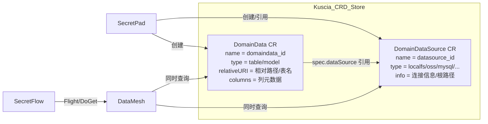

**绑定规则**：

1. `DomainData.spec.dataSource = <datasource_id>` 是实际的外键。
2. 创建 `DomainData` 时，KusciaAPI 会调用 `CheckDomainDataSourceExists` 校验该数据源是否已存在；不存在则返回错误。
3. `DomainDataSource` 可以独立存在，可被多个 `DomainData` 引用。
4. 实际存储路径/对象的解析需要两者共同决定：
   - `localfs`：`DomainDataSource.info.localfs.path + "/" + DomainData.relativeURI`
   - `oss`：`DomainDataSource.info.oss.prefix + "/" + DomainData.relativeURI`
   - `mysql/postgresql`：`DomainData.relativeURI` 作为表名
   - `odps`：`DomainDataSource.info.odps.project + DomainData.relativeURI`

### 1.3 总体架构

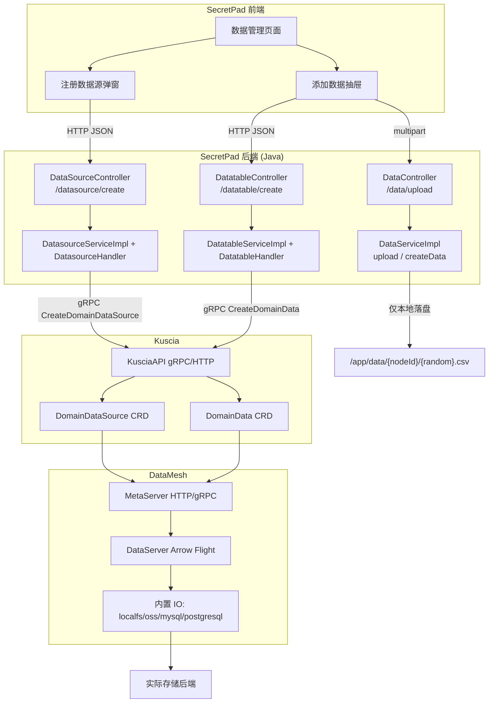

### 1.4 核心原则

1. **元数据与字节分离**：`CreateDomainData` / `CreateDomainDataSource` 只创建 CRD 元数据；原始字节由 SecretPad 后端提前落盘，或后续通过 DataMesh Flight 写入。
2. **先数据源、后数据表**：非 localfs 类型必须先注册 `DomainDataSource`，再创建引用它的 `DomainData`；localfs 类型复用 DataMesh 默认创建的 `default-data-source`。
3. **CSV 本地上传是"先落盘、后注册"的两阶段过程**：
   - `POST /api/v1alpha1/data/upload` 只把文件落到 SecretPad 后端本地磁盘，不上 Kuscia；
   - `POST /api/v1alpha1/datatable/create` 才使用上传返回的随机文件名作为 `relativeUri`，向 Kuscia 创建 `DomainData`。
4. **同一 CRD 多入口消费**：KusciaAPI 与 DataMesh MetaServer 操作同一套 K8s CRD，SecretPad 通过 KusciaAPI 管理，SecretFlow 通过 DataMesh 读取。

---

## 2. 数据源注册流程（DomainDataSource）

适用于 `OSS`、`MYSQL`、`ODPS`、`HTTP` 等外部存储：SecretPad 先把存储连接信息注册为 `DomainDataSource`，后续创建数据表时再引用它。

### 2.1 流程概览

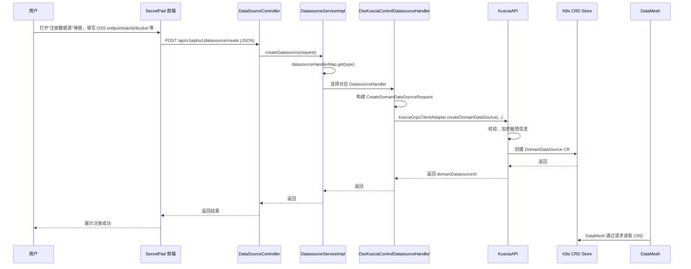

### 2.2 前端入口

- **文件**：`secretpad/frontend-src/apps/platform/src/modules/data-source-list/components/create-data-source/index.tsx`
- **组件**：`CreateDataSourceModal` 收集数据源名称、类型、连接信息、目标节点等。
- **服务**：`dataSourceService.addDataSource`（`data-source-list.service.ts`）调用 `DataSourceController.create`。
- **请求**：`POST /api/v1alpha1/datasource/create`。

### 2.3 后端处理

**Controller**：`secretpad/secretpad-web/src/main/java/org/secretflow/secretpad/web/controller/DataSourceController.java`

```java
public SecretPadResponse<String> create(
        @Valid @RequestBody CreateDatasourceRequest request) {
    return SecretPadResponse.success(datasourceService.createDatasource(request));
}
```

**Service**：`secretpad/secretpad-service/src/main/java/org/secretflow/secretpad/service/impl/DatasourceServiceImpl.java`

```java
@Override
public String createDatasource(CreateDatasourceRequest request) {
    // 策略模式：按数据源类型选择 handler
    return datasourceHandlerMap
            .get(DataSourceTypeEnum.valueOf(request.getType()))
            .createDatasource(request);
}
```

**Handler 实现**：

| 类型 | Handler 文件 |
| ------ | ------------- |
| OSS | `secretpad/secretpad-service/src/main/java/org/secretflow/secretpad/service/handler/datasource/OssKusciaControlDatasourceHandler.java` |
| MYSQL | `secretpad/secretpad-service/src/main/java/org/secretflow/secretpad/service/handler/datasource/MysqlKusciaControlDatasourceHandler.java` |
| ODPS | `secretpad/secretpad-service/src/main/java/org/secretflow/secretpad/service/handler/datasource/OdpsKusciaControlDatasourceHandler.java` |
| HTTP | 对应 HTTP 数据源 handler |

Handler 内部调用 `createDatasourceInKuscia`，通过 `KusciaGrpcClientAdapter.createDomainDataSource(...)` 发起 gRPC 调用。

### 2.4 Kuscia 侧创建 DomainDataSource CR

**gRPC 入口**：`kuscia/pkg/kusciaapi/handler/grpchandler/domaindata_source_handler.go`

```go
func (h *domainDataSourceHandler) CreateDomainDataSource(
    ctx context.Context,
    request *kusciaapi.CreateDomainDataSourceRequest) (*kusciaapi.CreateDomainDataSourceResponse, error) {
    return h.domainDataSourceService.CreateDomainDataSource(ctx, request), nil
}
```

**Service**：`kuscia/pkg/kusciaapi/service/domaindata_source.go`

- 请求校验；
- 对敏感信息（ak/sk、密码等）加密；
- 创建 `v1alpha1.DomainDataSource` CR。

CRD 类型：

```go
// kuscia/pkg/crd/apis/kuscia/v1alpha1/domaindatasource_types.go
type DomainDataSourceSpec struct {
    URI            string            `json:"uri"`
    Name           string            `json:"name"`
    Data           map[string]string `json:"data,omitempty"` // 加密后的连接信息
    Type           string            `json:"type"`           // localfs / oss / mysql / postgresql
    InfoKey        string            `json:"infoKey,omitempty"`
    AccessDirectly bool              `json:"accessDirectly,omitempty"`
}
```

### 2.5 DataMesh 默认数据源

DataMesh 启动时会确保每个 domain 存在默认本地数据源：

**文件**：`kuscia/pkg/datamesh/metaserver/service/operator.go`

```go
func (o *operatorService) registerDefaultDatasource() bool {
    _, err := o.conf.KusciaClient.KusciaV1alpha1().DomainDataSources(...).Get(..., common.DefaultDataSourceID, ...)
    if k8serrors.IsNotFound(err) {
        o.datasourceSvc.CreateDefaultDomainDataSource(context.Background())
    }
    ...
}
```

默认 localfs 路径：`/home/kuscia/var/storage/data`。

---

## 3. 数据表注册流程（DomainData）

### 3.1 LOCAL CSV 本地上传

#### 3.1.1 流程概览

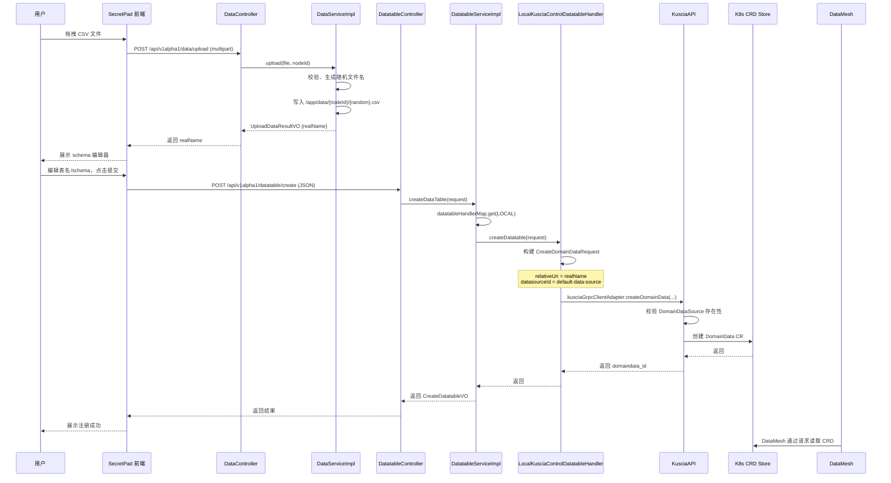

#### 3.1.2 前端组件与调用链

**入口页面与组件**：

| 文件 | 作用 |
| ------ | ------ |
| `secretpad/frontend-src/apps/platform/src/modules/data-manager/data-manager.view.tsx` | 数据管理页面，含“添加数据”按钮 |
| `secretpad/frontend-src/apps/platform/src/modules/data-table-add/add-data/add-data.view.tsx` | 选择数据源类型（LOCAL / OSS / ODPS / MYSQL / HTTP） |
| `secretpad/frontend-src/apps/platform/src/modules/data-table-add/component/upload-table/upload-table.view.tsx` | LOCAL 模式下的 CSV 上传与 schema 编辑 |
| `secretpad/frontend-src/apps/platform/src/modules/data-table-add/component/upload-table/util.ts` | CSV 解析工具（Papa.parse、jschardet） |

**组件树**：

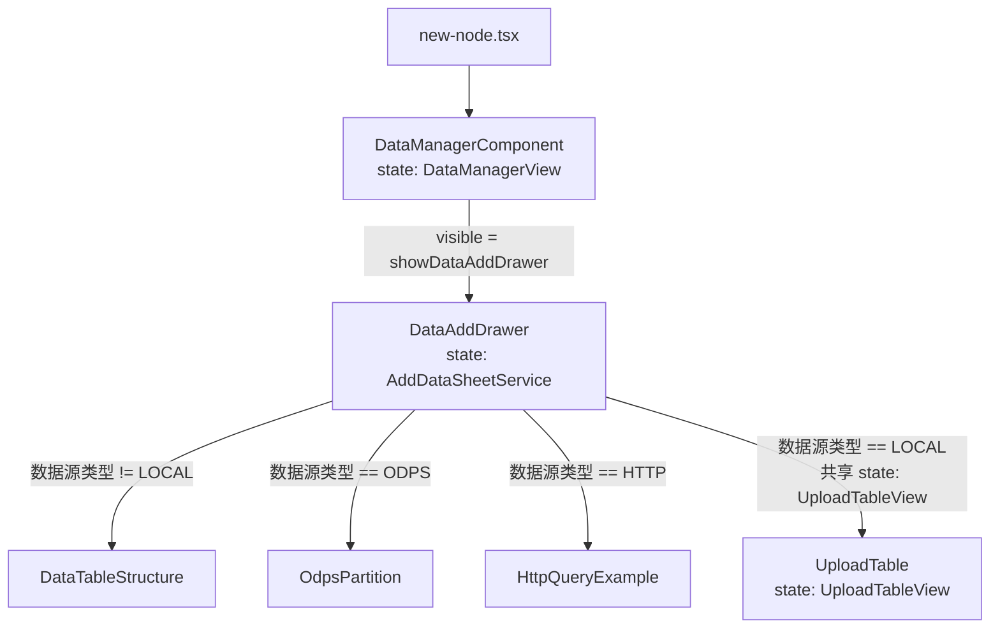

**LOCAL 上传两阶段时序**：

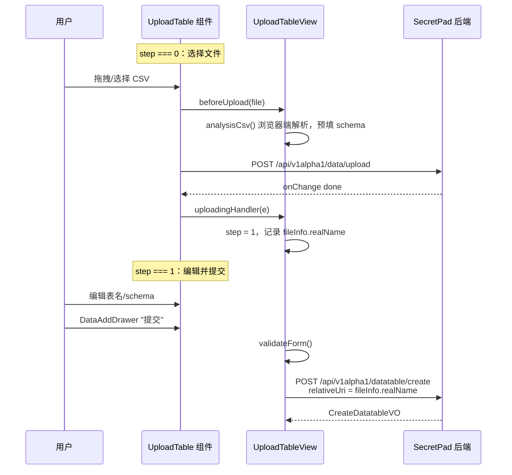

#### 3.1.3 后端 upload：仅本地落盘

**Controller**：`secretpad/secretpad-web/src/main/java/org/secretflow/secretpad/web/controller/DataController.java`

```java
@PostMapping(value = "/upload", consumes = MediaType.MULTIPART_FORM_DATA_VALUE)
public SecretPadResponse<UploadDataResultVO> upload(
        @RequestParam(value = "Node-Id") String nodeId,
        @RequestParam("file") MultipartFile file) {
    return SecretPadResponse.success(dataService.upload(file, nodeId));
}
```

**Service**：`secretpad/secretpad-service/src/main/java/org/secretflow/secretpad/service/impl/DataServiceImpl.java`

```java
public UploadDataResultVO upload(MultipartFile file, String nodeId) {
    checkDataPermissions(nodeId);
    String fileName = file.getOriginalFilename();
    fileNameCheck(fileName);          // 仅 .csv，不含路径分隔符
    nodeIdValidCheck(nodeId);         // nodeId 不含路径字符

    String dirPath = storeDir + nodeId + FILE_SEPETATOR;
    String randomFileName = getRandomFileName(fileName);  // 前缀_随机整数.csv
    File target = new File(dirPath + randomFileName);

    SafeFileUtils.checkPathInWhitelist(target, List.of(storeDir));
    createDirIfNotExist(dirPath);
    file.transferTo(target);
    FileUtils.removeBOMFromFile(dirPath + randomFileName);

    return UploadDataResultVO.builder()
            .name(fileName)
            .realName(randomFileName)
            .datasource(DEFAULT_DATASOURCE)         // "default-data-source"
            .datasourceType(DEFAULT_DATASOURCE_TYPE) // "localfs"
            .build();
}
```

**重要说明**：`upload` 接口**只负责本地落盘**，不会构造 `CreateDomainDataRequest`，也不会调用 Kuscia gRPC。此时 Kuscia 中尚不存在对应的 `DomainData` CR。

默认落盘路径：`/app/data/{nodeId}/{randomFileName}.csv`。

#### 3.1.4 后端 createDataTable：注册到 Kuscia

**Controller**：`secretpad/secretpad-web/src/main/java/org/secretflow/secretpad/web/controller/DatatableController.java`

```java
@PostMapping(value = "/create", consumes = "application/json")
public SecretPadResponse<CreateDatatableVO> createDataTable(
        @Valid @RequestBody CreateDatatableRequest req) {
    return SecretPadResponse.success(datatableService.createDataTable(req));
}
```

**Service**：`secretpad/secretpad-service/src/main/java/org/secretflow/secretpad/service/impl/DatatableServiceImpl.java`

```java
@Override
public CreateDatatableVO createDataTable(CreateDatatableRequest createDatatableRequest) {
    verifyRate();
    verifyNodes(createDatatableRequest);
    return datatableHandlerMap
            .get(DataSourceTypeEnum.valueOf(createDatatableRequest.getDatasourceType()))
            .createDatatable(createDatatableRequest);
}
```

**LOCAL 处理器**：`LocalKusciaControlDatatableHandler` 构建 `CreateDomainDataRequest`：

```java
private Domaindata.CreateDomainDataRequest buildCreateDomainDataRequest(
        String nodeId, CreateDatatableRequest request) {
    String domainDataId = genDomainDataId();  // UUIDUtils.random(8)

    return Domaindata.CreateDomainDataRequest.newBuilder()
            .setDomaindataId(domainDataId)
            .setDomainId(nodeId)
            .setName(request.getDatatableName())
            .setType("table")
            .setFileFormat(Common.FileFormat.CSV)
            .putAttributes("DatasourceType", request.getDatasourceType())
            .putAttributes("DatasourceName", request.getDatasourceName())
            .putAttributes(DomainDataConstants.NULL_STRS,
                    JsonUtils.toJSONString(request.getNullStrs()))
            .setDatasourceId(request.getDatasourceId())   // "default-data-source"
            .setRelativeUri(request.getRelativeUri())     // upload 返回的 realName
            .putAttributes("description", StringUtils.defaultString(request.getDesc()))
            .addAllColumns(columns)
            .build();
}
```

#### 3.1.5 upload 与 createDataTable 的关系

| 阶段 | 接口 | 处理类 | 是否调 Kuscia | 产生结果 |
|------|------|--------|---------------|----------|
| ① 上传 | `POST /api/v1alpha1/data/upload` | `DataController` → `DataServiceImpl` | 否 | 本地文件 `/app/data/{nodeId}/{random}.csv` + `realName` |
| ② 注册 | `POST /api/v1alpha1/datatable/create` | `DatatableController` → `DatatableServiceImpl` → `LocalKusciaControlDatatableHandler` | 是 | Kuscia `DomainData` CR |

**CSV 本地上传 = 先 `upload`（本地落盘） + 后 `createDataTable`（Kuscia 注册）**，两个接口缺一不可。

#### 3.1.6 createData 与 createDataTable 的区别

SecretPad 后端有两套 Service/Controller 都能把 LOCAL 数据资产注册到 Kuscia：

| 对比项 | `DataServiceImpl.createData` | `DatatableServiceImpl.createDataTable` |
| -------- | ------------------------------ | ---------------------------------------- |
| REST 路径 | `POST /api/v1alpha1/data/create` | `POST /api/v1alpha1/datatable/create` |
| 维护状态 | `@Deprecated(forRemoval = true)` | 当前正式接口 |
| 前端使用情况 | 早期版本，当前数据管理页面已不再调用 | 当前"添加数据"统一入口 |
| 数据源类型支持 | 仅 LOCAL/localfs | LOCAL、OSS、MYSQL、ODPS、HTTP |
| 内部分发 | 直接调 `DataManager.createData` | 通过 `datatableHandlerMap` 按类型选择 `DatatableHandler` |
| 最终效果 | 创建 Kuscia `DomainData` CR | 创建 Kuscia `DomainData` CR |

**为什么用 `createDataTable` 替代 `createData`**：

1. 策略模式统一处理多数据源，便于扩展；
2. 与数据表列表、详情、删除、TEE 推送等接口职责内聚；
3. `createData` 只保留 LOCAL 直调路径，已无法满足多数据源需求。

> **一句话总结**：`upload` 只落盘；`createData` 是旧的注册接口（已废弃）；`createDataTable` 是当前统一注册接口。

### 3.2 OSS/MYSQL/ODPS/HTTP 数据表注册

对于非 localfs 类型，用户通常先注册数据源（得到 `datasourceId`），再在"添加数据"时选择该数据源并填写相对路径/表名。

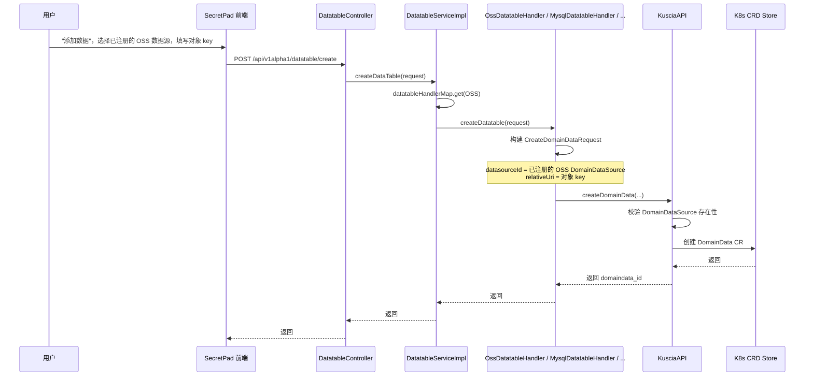

**关键差异**：

- `datasourceId` 指向之前创建的 `DomainDataSource` CR；
- `relativeUri` 是相对于该数据源的路径/对象名/表名；
- KusciaAPI 会校验 `DomainDataSource` 是否存在，不存在则报错。

---

## 4. Kuscia 侧处理

### 4.1 gRPC 服务定义

**Proto**：`kuscia/proto/api/v1alpha1/kusciaapi/domaindata.proto`

```proto
service DomainDataService {
  rpc CreateDomainData(CreateDomainDataRequest) returns (CreateDomainDataResponse);
  rpc UpdateDomainData(UpdateDomainDataRequest) returns (UpdateDomainDataResponse);
  rpc DeleteDomainData(DeleteDomainDataRequest) returns (DeleteDomainDataResponse);
  rpc DeleteDomainDataAndRaw(DeleteDomainDataRequest) returns (DeleteDomainDataResponse);
  rpc QueryDomainData(QueryDomainDataRequest) returns (QueryDomainDataResponse);
  rpc BatchQueryDomainData(BatchQueryDomainDataRequest) returns (BatchQueryDomainDataResponse);
  rpc ListDomainData(ListDomainDataRequest) returns (ListDomainDataResponse);
}
```

```proto
message CreateDomainDataRequest {
  RequestHeader header = 1;
  string domaindata_id = 2;
  string name = 3;
  string type = 4;            // table
  string relative_uri = 5;    // 上传返回的随机文件名 或 数据源下的相对路径
  string domain_id = 6;       // 节点 ID / namespace
  string datasource_id = 7;   // 引用 DomainDataSource 的 id
  map<string, string> attributes = 8;
  Partition partition = 9;
  repeated DataColumn columns = 10;
  string vendor = 11;
  FileFormat file_format = 12;// CSV
}
```

### 4.2 Handler 注册

**文件**：`kuscia/pkg/kusciaapi/bean/grpc_server_bean.go`

```go
kusciaapi.RegisterDomainDataServiceServer(server,
    grpchandler.NewDomainDataHandler(service.NewDomainDataService(s.config, s.cmConfigService)))
```

**Handler**：`kuscia/pkg/kusciaapi/handler/grpchandler/domaindata_handler.go`

```go
func (h *domainDataHandler) CreateDomainData(ctx context.Context, request *kusciaapi.CreateDomainDataRequest) (*kusciaapi.CreateDomainDataResponse, error) {
    return h.domainDataService.CreateDomainData(ctx, request), nil
}
```

**HTTP 端点**：`kuscia/pkg/kusciaapi/bean/http_server_bean.go`

```text
POST https://<kuscia-host>:8082/api/v1/domaindata/create
```

### 4.3 Service 创建 DomainData CR

**文件**：`kuscia/pkg/kusciaapi/service/domaindata_service.go`

1. **请求规范化**（normalization）：

```go
func (s domainDataService) normalizationCreateRequest(request *kusciaapi.CreateDomainDataRequest) {
    if request.Name == "" {
        uris := strings.Split(request.RelativeUri, "/")
        request.Name = uris[len(uris)-1]
    }
    if request.DomaindataId == "" {
        request.DomaindataId = common.GenDomainDataID(request.Name)
    }
    if request.DatasourceId == "" {
        request.DatasourceId = common.DefaultDataSourceID   // "default-data-source"
    }
    if request.Vendor == "" {
        request.Vendor = common.DefaultDomainDataVendor      // "manual"
    }
    request.RelativeUri = strings.TrimPrefix(request.RelativeUri, string(filepath.Separator))
}
```

2. **校验 DomainDataSource 存在性**：

```go
if len(request.DatasourceId) > 0 {
    kusciaErrorCode, msg := CheckDomainDataSourceExists(
        s.conf.KusciaClient, request.DomainId, request.DatasourceId)
    if pberrorcode.ErrorCode_SUCCESS != kusciaErrorCode {
        return &kusciaapi.CreateDomainDataResponse{
            Status: utils.BuildErrorResponseStatus(kusciaErrorCode, msg),
        }
    }
}
```

3. **构建并写入 DomainData CRD**：

```go
kusciaDomainData := &v1alpha1.DomainData{
    ObjectMeta: metav1.ObjectMeta{
        Name:        request.DomaindataId,
        Namespace:   request.DomainId,
        Labels: map[string]string{
            common.LabelDomainDataType:        request.Type,
            common.LabelDomainDataVendor:      request.Vendor,
            common.LabelInterConnProtocolType: "kuscia",
        },
        Annotations: map[string]string{
            common.InitiatorAnnotationKey: request.DomainId,
        },
    },
    Spec: v1alpha1.DomainDataSpec{
        RelativeURI: request.RelativeUri,
        Name:        request.Name,
        Type:        request.Type,
        DataSource:  request.DatasourceId,
        Attributes:  request.Attributes,
        Partition:   common.Convert2KubePartition(request.Partition),
        Columns:     common.Convert2KubeColumn(request.Columns),
        Vendor:      customVendor,
        Author:      request.DomainId,
        FileFormat:  common.Convert2KubeFileFormat(request.FileFormat),
    },
}

_, err := s.conf.KusciaClient.KusciaV1alpha1().DomainDatas(request.DomainId).Create(...)
```

**CRD 类型**：`kuscia/pkg/crd/apis/kuscia/v1alpha1/domaindata_types.go`

```go
type DomainDataSpec struct {
    RelativeURI string            `json:"relativeURI"`
    Author      string            `json:"author"`
    Name        string            `json:"name"`
    Type        string            `json:"type"`
    DataSource  string            `json:"dataSource"`
    Attributes  map[string]string `json:"attributes,omitempty"`
    Partition   *Partition        `json:"partitions,omitempty"`
    Columns     []DataColumn      `json:"columns,omitempty"`
    Vendor      string            `json:"vendor,omitempty"`
    FileFormat  string            `json:"fileFormat,omitempty"`
}
```

---

## 5. DataMesh 与实际存储

### 5.1 DataMesh 元数据入口

KusciaAPI 与 DataMesh 是**同一 CRD 存储的两个 API 入口**：

| 入口 | 用途 | 默认端口 |
| ------ | ------ | ---------- |
| KusciaAPI | 管理/元数据 API（SecretPad、脚本、管理员调用） | gRPC 8083 / HTTP 8082 |
| DataMesh MetaServer | 引擎/SDK 元数据 API | HTTP 8070 / gRPC 8071 |
| DataMesh DataServer | 实际字节读写（Arrow Flight） | gRPC/Flight 8071 |

**DataMesh 使用 DomainData 与 DomainDataSource 的方式**（请求时直接读取 CRD）：

- DataMesh MetaServer 提供 `DomainDataService` 和 `DomainDataSourceService` 两套接口，底层都操作同一套 K8s CRD。
- 当 SecretFlow 任务通过 DataMesh 读取数据时，DataMesh 会先根据 `domaindata_id` 查询 `DomainData`，再根据 `DomainData.spec.dataSource` 查询 `DomainDataSource`。
- 只有同时拿到两者，才能确定实际存储类型、连接信息和完整路径/对象/表名。

### 5.2 实际路径/对象解析

DataMesh 在读取或写入实际字节时，必须同时拿到 `DomainData` 和 `DomainDataSource`：

| 类型 | 路径/对象构造 | 依赖的 DomainDataSource 信息 | 实现文件 |
| ------ | -------------- | ------------------------------ | ---------- |
| `localfs` | `path.Join(localfs.Path, relativeURI)` | `DomainDataSource.info.localfs.path` | `dataio_localfile.go` |
| `oss` | `path.Join(oss.Prefix, relativeURI)`，使用 S3 SDK | `DomainDataSource.info.oss.{bucket,prefix,endpoint,ak,sk}` | `dataio_oss.go` / `oss_uploader.go` |
| `mysql` / `postgresql` | `relativeURI` 作为表名 | `DomainDataSource.info.database.{endpoint,user,password,database}` | `dataio_mysql.go` / `dataio_postgresql.go` |
| `odps` | `relativeURI` 作为表名（可带分区） | `DomainDataSource.info.odps.{endpoint,project,accessId,accessKey}` | 经 DataProxy 处理 |

### 5.3 本地文件路径构造

**文件**：`kuscia/pkg/datamesh/dataserver/io/builtin/dataio_localfile.go`

```go
func (fio *BuiltinLocalFileIO) Read(ctx context.Context, rc *utils.DataMeshRequestContext, w utils.RecordWriter) error {
    data, ds, err := rc.GetDomainDataAndSource(ctx)
    filePath := path.Join(ds.Info.Localfs.Path, data.RelativeUri)
    file, err := os.Open(filePath)
    ...
}

func (fio *BuiltinLocalFileIO) Write(ctx context.Context, rc *utils.DataMeshRequestContext, reader *flight.Reader) error {
    data, ds, err := rc.GetDomainDataAndSource(ctx)
    filePath := path.Join(ds.Info.Localfs.Path, data.RelativeUri)
    paths.EnsurePath(path.Dir(filePath), true)
    file, err := os.OpenFile(filePath, os.O_CREATE|os.O_RDWR|os.O_TRUNC, 0600)
    ...
}
```

示例：

```text
datasource localfs path = /home/kuscia/var/storage/data
relativeURI              = {randomFileName}.csv
final file path          = /home/kuscia/var/storage/data/{randomFileName}.csv
```

> 注意：在 SecretPad 后端本地部署模式下，SecretPad 的 `/app/data/{nodeId}/{random}.csv` 与 Kuscia 的 `/home/kuscia/var/storage/data/{random}.csv` 需要是同一路径（通过 volume 挂载对齐），否则 DataMesh 读不到文件。

### 5.4 CSV ↔ Arrow Flight 转换

**文件**：`kuscia/pkg/datamesh/dataserver/io/builtin/dataio.go`

读取 CSV 到 Flight 流：

```go
func DataProxyContentToFlightStreamCSV(data *datamesh.DomainData, r io.Reader, w utils.RecordWriter) error {
    colTypes, _ := utils.GenerateArrowColumnType(data)
    colNames := utils.GenerateArrowColumnNames(data)
    csvReader := csv.NewInferringReader(r,
        csv.WithColumnTypes(colTypes),
        csv.WithHeader(true),
        csv.WithNullReader(true, CSVDefaultNullValues...),
        csv.WithChunk(1024),
        csv.WithIncludeColumns(colNames),
    )
    ...
}
```

写入 Arrow Flight 流到 CSV：

```go
func FlightStreamToDataProxyContentCSV(data *datamesh.DomainData, w io.Writer, reader *flight.Reader) error {
    schema, _ := utils.GenerateArrowSchema(data)
    csvWriter := csv.NewWriter(w, reader.Schema(), csv.WithHeader(true), csv.WithNullWriter(CSVDefaultNullValue))
    for reader.Next() {
        csvWriter.Write(reader.Record())
    }
    ...
}
```

### 5.5 Arrow Flight 数据平面

**Proto**：`kuscia/proto/api/v1alpha1/datamesh/flightdm.proto`

```proto
enum ContentType {
  Table = 0;
  RAW   = 1;
  CSV   = 2;
}

message CommandDomainDataQuery {
  string domaindata_id = 1;
  repeated string columns = 2;
  ContentType content_type = 3;
  FileWriteOptions file_write_options = 4;
  string partition_spec = 5;
}

message CommandDomainDataUpdate {
  string domaindata_id = 1;
  CreateDomainDataRequest domaindata_request = 2;
  ContentType content_type = 3;
  FileWriteOptions file_write_options = 4;
  map<string, string> extra_options = 5;
  string partition_spec = 6;
}
```

**Flight Handler**：`kuscia/pkg/datamesh/dataserver/handler/handler.go`

- `GetFlightInfo`
- `DoGet`
- `DoPut`
- `DoAction`（元数据操作）

**IO 路由**：`kuscia/pkg/datamesh/dataserver/io/builtin/builtin.go`

```go
ioChannels: map[string]DataMeshDataIOInterface{
    common.DomainDataSourceTypeLocalFS:    NewBuiltinLocalFileIOChannel(),
    common.DomainDataSourceTypeOSS:        NewBuiltinOssIOChannel(),
    common.DomainDataSourceTypeMysql:      NewBuiltinMySQLIOChannel(),
    common.DomainDataSourceTypePostgreSQL: NewBuiltinPostgresqlIOChannel(),
}
```

### 5.6 Kuscia 与 DataMesh 之间的发送/接收接口

Kuscia 与 DataMesh 并不是两个独立的存储系统，而是**共享同一套 K8s CRD 元数据**，并通过 gRPC / Arrow Flight 暴露不同接口。下面分三层说明它们之间的“发送/接收”关系：元数据同步、数据平面读写、以及 SecretFlow 任务中的实际调用。

#### 5.6.1 元数据层：同一 CRD，两个 API 入口

| 操作 | KusciaAPI 入口 | DataMesh MetaServer 入口 | 底层 CRD | 典型调用方 |
| ------ | ---------------- | -------------------------- | ---------- | ------------ |
| 创建 DomainData | `DomainDataService/CreateDomainData` | `datamesh.DomainDataService/CreateDomainData` | `v1alpha1.DomainData` | KusciaAPI：SecretPad 后端（管理面）<br>DataMesh：SecretFlow 任务（数据面） |
| 查询 DomainData | `DomainDataService/QueryDomainData` | `datamesh.DomainDataService/QueryDomainData` | `v1alpha1.DomainData` | KusciaAPI：SecretPad 后端<br>DataMesh：SecretFlow 任务 / 客户端 |
| 创建 DomainDataSource | `DomainDataSourceService/CreateDomainDataSource` | `datamesh.DomainDataSourceService/CreateDomainDataSource` | `v1alpha1.DomainDataSource` | KusciaAPI：SecretPad 后端<br>DataMesh：SecretFlow 任务 |
| 查询 DomainDataSource | `DomainDataSourceService/QueryDomainDataSource` | `datamesh.DomainDataSourceService/QueryDomainDataSource` | `v1alpha1.DomainDataSource` | KusciaAPI：SecretPad 后端<br>DataMesh：SecretFlow 任务 / DataMesh IO |

**关键源码**：

- KusciaAPI gRPC 注册：`kuscia/pkg/kusciaapi/bean/grpc_server_bean.go`
- DataMesh gRPC 注册：`kuscia/pkg/datamesh/bean/grpc_server_bean.go`
- KusciaAPI DomainData Handler：`kuscia/pkg/kusciaapi/handler/grpchandler/domaindata_handler.go`
- DataMesh DomainData Handler：`kuscia/pkg/datamesh/metaserver/v1handler/grpchandler/raw_datamgr_handler.go`
- DataMesh DomainData Service：`kuscia/pkg/datamesh/metaserver/service/domaindata.go`

DataMesh 的 `domainDataService` 直接操作 `s.conf.KusciaClient.KusciaV1alpha1().DomainDatas(...).Get/Create/Patch/Delete`，这说明**DataMesh MetaServer 本质上就是 Kuscia CRD 的另一种封装**。

#### 5.6.2 数据平面：Arrow Flight 收发接口

DataMesh 的数据平面基于 Apache Arrow Flight，提供两类核心操作：

| 方向 | Flight 方法 | 调用方 → DataMesh | 功能 |
| ------ | ------------- | ------------------- | ------ |
| 读数据 | `GetFlightInfo` → `DoGet` | SecretFlow 任务 / 客户端 → DataMesh | 下载 DomainData 实际字节 |
| 写数据 | `GetFlightInfo` → `DoPut` | SecretFlow 任务 / 客户端 → DataMesh | 上传字节并创建/更新 DomainData |
| 元数据操作 | `DoAction` | SecretFlow 任务 / 客户端 → DataMesh | 创建/查询/更新/删除 DomainData 和 DomainDataSource |

**Flight 命令消息**（`kuscia/proto/api/v1alpha1/datamesh/flightdm.proto`）：

```proto
message CommandDomainDataQuery {
  string domaindata_id = 1;          // 要读取的 DomainData ID
  repeated string columns = 2;       // 指定列（可选）
  ContentType content_type = 3;      // Table / RAW / CSV
  FileWriteOptions file_write_options = 4;
  string partition_spec = 5;         // 分区过滤
}

message CommandDomainDataUpdate {
  string domaindata_id = 1;          // 要写入的 DomainData ID
  CreateDomainDataRequest domaindata_request = 2; // 若不存在则先创建
  ContentType content_type = 3;
  FileWriteOptions file_write_options = 4;
  map<string, string> extra_options = 5;
  string partition_spec = 6;
}
```

**Flight Handler 入口**：`kuscia/pkg/datamesh/dataserver/handler/handler.go`

```go
func (f *datameshFlightHandler) GetSchema(ctx context.Context, request *flight.FlightDescriptor) (*flight.SchemaResult, error) {
    // 根据 CommandGetDomainDataSchema 查询 DomainData 列信息并返回 Arrow Schema
}

func (f *datameshFlightHandler) GetFlightInfo(ctx context.Context, request *flight.FlightDescriptor) (fi *flight.FlightInfo, error) {
    // 解析 CommandDomainDataQuery/Update，生成 Ticket 返回给客户端
    return f.flightService.GetFlightInfo(ctx, msg)
}

func (f *datameshFlightHandler) DoAction(action *flight.Action, stream flight.FlightService_DoActionServer) error {
    // 分发 ActionCreateDomainDataRequest / ActionQueryDomainDataRequest 等元数据操作
}

func (f *datameshFlightHandler) DoGet(tkt *flight.Ticket, fs flight.FlightService_DoGetServer) error {
    return f.flightService.DoGet(tkt, fs)
}

func (f *datameshFlightHandler) DoPut(stream flight.FlightService_DoPutServer) error {
    return f.flightService.DoPut(stream)
}
```

**Action 操作实现**：`kuscia/pkg/datamesh/dataserver/service/action.go`

```go
type CustomAction interface {
    DoActionCreateDomainDataRequest(ctx context.Context, body []byte) (*flight.Result, error)
    DoActionQueryDomainDataRequest(ctx context.Context, body []byte) (*flight.Result, error)
    DoActionUpdateDomainDataRequest(ctx context.Context, body []byte) (*flight.Result, error)
    DoActionDeleteDomainDataRequest(ctx context.Context, body []byte) (*flight.Result, error)
    DoActionQueryDomainDataSourceRequest(ctx context.Context, body []byte) (*flight.Result, error)
}
```

#### 5.6.3 数据读写执行流程

**FlightIO 分发**：`kuscia/pkg/datamesh/dataserver/service/flight_io.go`

```go
func NewFlightIO(dd service.IDomainDataService, ds service.IDomainDataSourceService, configs []config.DataProxyConfig) *FlightIO {
    inIO := io.NewBuiltinIO()
    fs := FlightIO{
        dd: dd,
        ds: ds,
        ioMap: map[string]io.Server{
            common.DomainDataSourceTypeLocalFS:    inIO,
            common.DomainDataSourceTypeOSS:        inIO,
            common.DomainDataSourceTypeMysql:      inIO,
            common.DomainDataSourceTypePostgreSQL: inIO,
        },
        inIO: inIO,
    }
    // 外部 DataProxy 配置会覆盖某些类型的 ioMap
    for _, conf := range configs {
        exDp := io.NewExternalIO(&conf)
        for _, typ := range conf.DataSourceTypes {
            fs.ioMap[typ] = exDp
        }
    }
    return &fs
}
```

`GetFlightInfo` 根据请求构造 `DataMeshRequestContext`，缓存 ticket，返回 `FlightInfo`；`DoGet`/`DoPut` 再根据 ticket 从缓存取出上下文，调用对应 `io.Server`。

**内置 IO 实现**：`kuscia/pkg/datamesh/dataserver/io/builtin/builtin.go`

```go
func (d *IOServer) GetFlightInfo(ctx context.Context, reqCtx *utils.DataMeshRequestContext) (flightInfo *flight.FlightInfo, err error) {
    tickUUID := uuid.New().String()
    channel, ok := d.ioChannels[reqCtx.DataSourceType]
    ...
    d.cmds.Add(tickUUID, reqCtx, 10*time.Minute)  // 缓存请求上下文
    return utils.CreateDateMeshFlightInfo([]byte(tickUUID), channel.GetEndpointURI()), nil
}

func (d *IOServer) DoGet(tkt *flight.Ticket, fs flight.FlightService_DoGetServer) error {
    reqCtx := d.cmds.Get(string(tkt.Ticket)).(*utils.DataMeshRequestContext)
    ios := d.ioChannels[reqCtx.DataSourceType]
    return ios.Read(fs.Context(), reqCtx, w)  // 实际读取本地文件/OSS/MySQL/...
}

func (d *IOServer) DoPut(stream flight.FlightService_DoPutServer) error {
    reader, _ := flight.NewRecordReader(stream)
    desc := reader.LatestFlightDescriptor()
    reqCtx := d.cmds.Get(string(desc.Cmd)).(*utils.DataMeshRequestContext)
    ios := d.ioChannels[reqCtx.DataSourceType]
    return ios.Write(stream.Context(), reqCtx, reader)  // 实际写入本地文件/OSS/MySQL/...
}
```

#### 5.6.4 以 localfs 为例的收发函数

**文件**：`kuscia/pkg/datamesh/dataserver/io/builtin/dataio_localfile.go`

```go
// DataFlow: RemoteStorage(FileSystem/OSS/...) --> DataProxy --> Client
func (fio *BuiltinLocalFileIO) Read(ctx context.Context, rc *utils.DataMeshRequestContext, w utils.RecordWriter) error {
    data, ds, err := rc.GetDomainDataAndSource(ctx)
    filePath := path.Join(ds.Info.Localfs.Path, data.RelativeUri)
    file, err := os.Open(filePath)
    switch rc.GetTransferContentType() {
    case datamesh.ContentType_RAW:
        return DataProxyContentToFlightStreamBinary(data, file, w, fio.batchReadSize)
    case datamesh.ContentType_CSV, datamesh.ContentType_Table:
        return DataProxyContentToFlightStreamCSV(data, file, w)
    }
}

// DataFlow: Client --> DataProxy --> RemoteStorage(FileSystem/OSS/...)
func (fio *BuiltinLocalFileIO) Write(ctx context.Context, rc *utils.DataMeshRequestContext, reader *flight.Reader) error {
    data, ds, err := rc.GetDomainDataAndSource(ctx)
    filePath := path.Join(ds.Info.Localfs.Path, data.RelativeUri)
    file, err := os.OpenFile(filePath, os.O_CREATE|os.O_RDWR|os.O_TRUNC, 0600)
    switch rc.GetTransferContentType() {
    case datamesh.ContentType_RAW:
        return FlightStreamToDataProxyContentBinary(data, file, reader)
    case datamesh.ContentType_CSV, datamesh.ContentType_Table:
        return FlightStreamToDataProxyContentCSV(data, file, reader)
    }
}
```

#### 5.6.5 SecretFlow 任务中的典型调用链

以 SecretFlow 任务读取/写入 DomainData 为例：

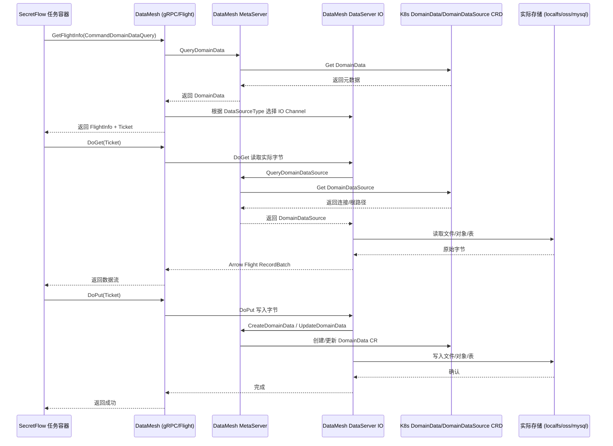

#### 5.6.6 关键收发接口函数索引

| 层级 | 文件 | 关键函数/接口 | 作用 |
| ------ | ------ | --------------- | ------ |
| DataMesh gRPC Server 注册 | `pkg/datamesh/bean/grpc_server_bean.go` | `RegisterDomainDataServiceServer`、`RegisterDomainDataSourceServiceServer`、`RegisterDomainDataGrantServiceServer`、`RegisterFlightServiceServer` | 注册元数据和 Flight 服务 |
| DataMesh 元数据 Handler | `pkg/datamesh/metaserver/v1handler/grpchandler/raw_datamgr_handler.go` | `CreateDomainData`、`QueryDomainData`、`UpdateDomainData`、`DeleteDomainData`、`QueryDomainDataSource`、`Create/Query/Update/DeleteDomainDataGrant` | gRPC 元数据 CRUD |
| DataMesh HTTP Handler | `pkg/datamesh/metaserver/v1handler/httphandler/domaindata/*.go` | `NewCreateDomainDataHandler`、`NewQueryDomainDataHandler`、`NewUpdateDomainDataHandler`、`NewDeleteDomainDataHandler` | HTTP REST 元数据 CRUD |
| DataMesh 元数据 Service | `pkg/datamesh/metaserver/service/domaindata.go` | `CreateDomainData`、`QueryDomainData`、`UpdateDomainData`、`DeleteDomainData` | 操作 DomainData CRD |
| DataMesh 元数据 Service | `pkg/datamesh/metaserver/service/domaindatasource.go` | `CreateDomainDataSource`、`QueryDomainDataSource` | 操作 DomainDataSource CRD |
| Flight Handler | `pkg/datamesh/dataserver/handler/handler.go` | `GetSchema`、`GetFlightInfo`、`DoAction`、`DoGet`、`DoPut` | Arrow Flight 入口 |
| Flight Action Service | `pkg/datamesh/dataserver/service/action.go` | `DoActionCreateDomainDataRequest`、`DoActionQueryDomainDataRequest`、`DoActionUpdateDomainDataRequest`、`DoActionDeleteDomainDataRequest`、`DoActionQueryDomainDataSourceRequest` | Flight Action 元数据操作 |
| Flight IO 分发 | `pkg/datamesh/dataserver/service/flight_io.go` | `GetFlightInfo`、`DoGet`、`DoPut` | 按数据源类型分发 |
| 内置 IO 路由 | `pkg/datamesh/dataserver/io/builtin/builtin.go` | `IOServer.GetFlightInfo`、`DoGet`、`DoPut` | localfs/oss/mysql/postgresql 读写 |
| localfs 读写 | `pkg/datamesh/dataserver/io/builtin/dataio_localfile.go` | `Read`、`Write` | 本地文件收发 |
| OSS 读写 | `pkg/datamesh/dataserver/io/builtin/dataio_oss.go` | `Read`、`Write` | OSS 对象收发 |
| MySQL 读写 | `pkg/datamesh/dataserver/io/builtin/dataio_mysql.go` | `Read`、`Write` | MySQL 表收发 |
| PostgreSQL 读写 | `pkg/datamesh/dataserver/io/builtin/dataio_postgresql.go` | `Read`、`Write` | PostgreSQL 表收发 |
| 请求上下文 | `pkg/datamesh/dataserver/utils/context.go` | `NewDataMeshRequestContext`、`GetDomainDataAndSource`、`GetDomainDataSource`、`GetTransferContentType` | 封装 DomainData + DomainDataSource 查询 |
| CSV/二进制转换 | `pkg/datamesh/dataserver/io/builtin/dataio.go` | `DataProxyContentToFlightStreamCSV`、`FlightStreamToDataProxyContentCSV`、`DataProxyContentToFlightStreamBinary`、`FlightStreamToDataProxyContentBinary` | Arrow RecordBatch 与文件格式互转 |

#### 5.6.7 KusciaAPI 修改 CRD 后，DataMesh 如何感知

一个常见的疑问是：KusciaAPI 更新 `DomainData` 后，是否需要向 DataMesh 发送一条通知？答案是**不需要**。KusciaAPI 与 DataMesh 之间**没有直接的 RPC 通知调用**，它们通过同一套 K8s CRD 存储实现元数据共享。DataMesh “看到” CRD 变更的方式有两种：

**1. 请求时直接读取 K8s apiserver（DataMesh MetaServer 当前实现）**

DataMesh 的 `domaindataService`、`domaindatasourceService` 等在每次处理 gRPC/HTTP/Flight 请求时，直接调用 `s.conf.KusciaClient.KusciaV1alpha1().DomainDatas(...).Get(...)` 或 `DomainDataSources(...).Get(...)`。因为 KusciaAPI 已经把修改写入了 K8s apiserver，所以 DataMesh 在下次请求时自然读到最新状态。

源码位置：

- `kuscia/pkg/datamesh/metaserver/service/domaindata.go`：`QueryDomainData`、`CreateDomainData`、`UpdateDomainData` 中均直接调用 `KusciaClient` 读写 CRD。
- `kuscia/pkg/datamesh/metaserver/service/domaindatasource.go`：`QueryDomainDataSource` 直接调用 `KusciaClient.KusciaV1alpha1().DomainDataSources(...).Get(...)`。

**2. K8s Informer/Watch 机制（Kuscia 平台控制器使用）**

除了请求时的直接读取，Kuscia 还使用 K8s informer/watch 机制异步感知 CRD 生命周期事件，并作出响应。例如 `pkg/controllers/domaindata/controller.go` 中的 `domaindata controller`：

- 创建 `SharedInformerFactory`：

  ```go
  kusciaInformerFactory := kusciainformers.NewSharedInformerFactory(kusciaClient, 10*time.Minute)
  ```

- 获取 `DomainData` 和 `DomainDataGrant` 的 Informer：

  ```go
  domaindataGrantInformer := kusciaInformerFactory.Kuscia().V1alpha1().DomainDataGrants()
  domaindataInformer := kusciaInformerFactory.Kuscia().V1alpha1().DomainDatas()
  ```

- 注册事件处理器，把 Add/Update/Delete 事件加入 workqueue：

  ```go
  _, _ = domaindataGrantInformer.Informer().AddEventHandler(cache.ResourceEventHandlerFuncs{
      AddFunc: func(obj interface{}) {
          queue.EnqueueObjectWithKey(obj, controller.domainDataGrantWorkqueue)
      },
      UpdateFunc: func(oldObj, newObj interface{}) {
          queue.EnqueueObjectWithKey(newObj, controller.domainDataGrantWorkqueue)
      },
      DeleteFunc: func(obj interface{}) {
          dd, ok := obj.(*v1alpha1.DomainDataGrant)
          if !ok {
              return
          }
          controller.domainDataGrantDeleteWorkqueue.Add(dd.Spec.Author + "/" + dd.Name)
      },
  })

  _, _ = domaindataInformer.Informer().AddEventHandler(cache.ResourceEventHandlerFuncs{
      UpdateFunc: func(oldObj, newObj interface{}) {
          queue.EnqueueObjectWithKey(newObj, controller.domainDataWorkqueue)
      },
      DeleteFunc: func(obj interface{}) {
          dd, ok := obj.(*v1alpha1.DomainData)
          if !ok {
              return
          }
          controller.domainDataDeleteWorkqueue.Add(dd.Spec.Author + "/" + dd.Name)
      },
  })
  ```

- Worker 从 workqueue 中取出 key，通过 Lister 读取缓存中的 CRD 并执行同步逻辑，例如把 `DomainDataGrant` 传播到目标 domain。

DataMesh 自身的启动入口 `kuscia/pkg/datamesh/commands/root.go` 也初始化了 informer 工厂：

```go
kusciaInformerFactory := informers.NewSharedInformerFactoryWithOptions(kusciaClient, 0)
kusciaInformerFactory.Start(ctx.Done())
kusciaInformerFactory.WaitForCacheSync(ctx.Done())
```

这是为后续扩展预留的基础设施；当前 DataMesh 元数据服务采用直接 apiserver 读取的方式，保证每次请求都能拿到最新 CRD。

**总结**

```text
KusciaAPI 更新 CRD ──→ 写入 K8s apiserver
                            │
                            ├─→ DataMesh 处理后续请求时直接 Get CRD（即时读取）
                            └─→ Kuscia Controller 通过 Informer/Watch 异步感知并执行副作用（如跨域授权传播）
```

KusciaAPI 与 DataMesh 之间不存在专门的“通知接口”；元数据一致性由共享的 K8s CRD store 保证，感知方式取决于各组件的实现策略。

#### 5.6.8 两个 `CreateDomainData` 的调用方区别

虽然 KusciaAPI 和 DataMesh 都提供 `CreateDomainData`，但**调用方和场景完全不同**。

**1. KusciaAPI `CreateDomainData` —— 管理面入口，主要由 SecretPad 后端调用**

- **gRPC 服务**：`kuscia.proto.api.v1alpha1.kusciaapi.DomainDataService/CreateDomainData`
- **端口**：`:8083`
- **调用方**：SecretPad 后端的各类 `*KusciaControlDatatableHandler`
  - `secretpad/secretpad-service/.../datatable/LocalKusciaControlDatatableHandler.java`
  - `secretpad/secretpad-service/.../datatable/OssKusciaControlDatatableHandler.java`
  - `secretpad/secretpad-service/.../datatable/MysqlKusciaControlDatatableHandler.java`
  - `secretpad/secretpad-service/.../datatable/OdpsKusciaControlDatatableHandler.java`
- **调用链**：

  ```text
  SecretPad 前端  ──POST /api/v1alpha1/datatable/create──→  SecretPad 后端
                                                               │
                                                               ▼
                                          *KusciaControlDatatableHandler
                                                               │
                                                               ▼
                                          KusciaGrpcClientAdapter.createDomainData(request, domainId)
                                                               │
                                                               ▼
                                          gRPC :8083  DomainDataService/CreateDomainData
  ```

- **典型场景**：用户在 SecretPad 前端点击“注册数据表”，后端把请求转发给 KusciaAPI，创建 `v1alpha1.DomainData` CR。

**2. DataMesh `CreateDomainData` —— 数据面入口，主要由 SecretFlow 任务调用**

- **gRPC 服务**：`kuscia.proto.api.v1alpha1.datamesh.DomainDataService/CreateDomainData`
- **端口**：`:8071`
- **调用方**：`secretflow/kuscia/datamesh.py`
- **调用链**：

  ```text
  SecretFlow 任务
       │
       ▼
  secretflow/kuscia/datamesh.py
       │
       ▼
  stub.CreateDomainData(CreateDomainDataRequest(...))
       │
       ▼
  gRPC :8071  datamesh.DomainDataService/CreateDomainData
  ```

- **典型场景**：SecretFlow 任务执行过程中或结束后，把输出数据写入存储并注册为 `DomainData` CR，供后续任务读取。

**3. 对比总结**

| 维度 | KusciaAPI `CreateDomainData` | DataMesh `CreateDomainData` |
| ------ | ------------------------------ | ------------------------------ |
| **服务端口** | `:8083` | `:8071` |
| **proto 包** | `kusciaapi` | `datamesh` |
| **典型调用方** | **SecretPad 后端** | **SecretFlow 任务** |
| **所属平面** | 管理面（用户手动注册） | 数据面（任务自动注册结果） |
| **请求中的 domain** | 显式带 `domain_id` | 不带 `domain_id`，使用 DataMesh 自身 namespace |
| **源码入口** | `kuscia/pkg/kusciaapi/service/domaindata_service.go` | `kuscia/pkg/datamesh/metaserver/service/domaindata.go` |

> 说明：KusciaAPI 作为对外管理 API，任何有权限的客户端都能调用；DataMesh 作为数据平面 API，通常只在 SecretFlow 任务容器内或本地测试代码中调用。

---

## 6. 关键接口汇总

### 6.1 SecretPad 前端 ↔ 后端

| 方法 | 路径 | 内容 | 说明 |
| ------ | ------ | ------ | ------ |
| POST | `/api/v1alpha1/datasource/create` | JSON：`CreateDatasourceRequest` | 注册数据源（DomainDataSource） |
| POST | `/api/v1alpha1/data/upload` | multipart/form-data，字段 `file`，header `Node-Id` | CSV 本地上传，仅落盘 |
| POST | `/api/v1alpha1/datatable/create` | JSON：`CreateDatatableRequest` | 注册数据表（DomainData），当前正式接口 |
| POST | `/api/v1alpha1/data/create` | JSON：`CreateDataRequest` | 旧版数据表注册，已废弃 |

### 6.2 SecretPad 后端 ↔ Kuscia

| 协议 | 地址 | 服务/方法 | 调用方 / 用途 |
|------|------|-----------|---------------|
| gRPC | `<kuscia>:8083` | `kuscia.proto.api.v1alpha1.kusciaapi.DomainDataService/CreateDomainData` | SecretPad 后端 `*KusciaControlDatatableHandler`，用户注册数据表 |
| gRPC | `<kuscia>:8083` | `kuscia.proto.api.v1alpha1.kusciaapi.DomainDataSourceService/CreateDomainDataSource` | SecretPad 后端 `*KusciaControlDatasourceHandler`，用户注册数据源 |

### 6.3 KusciaAPI 外部接口

| 协议 | 地址 | 路径/方法 | 调用方 / 用途 |
|------|------|-----------|---------------|
| HTTP | `:8082` | `POST /api/v1/domaindata/create` | 外部客户端 / 管理面 |
| gRPC | `:8083` | `DomainDataService/CreateDomainData` | SecretPad 后端 / 外部管理客户端 |

### 6.4 DataMesh 接口

| 协议 | 地址 | 路径/方法 | 调用方 / 用途 |
| ------ | ------ | ----------- | --------------- |
| HTTP | `:8070` | `POST /api/v1/datamesh/domaindata/create` | 外部客户端 / 测试 |
| gRPC | `:8071` | `kuscia.proto.api.v1alpha1.datamesh.DomainDataService/CreateDomainData` | SecretFlow 任务 `secretflow/kuscia/datamesh.py`，任务运行时注册结果数据 |
| Arrow Flight | `:8071` | `DoAction(ActionCreateDomainDataRequest)` / `DoGet` / `DoPut` | SecretFlow 任务 / 客户端，数据读写 |

---

## 7. 数据存储方式总结

| 组件 | 存储内容 | 存储介质 | 关键字段/路径 |
| ------ | ---------- | ---------- | --------------- |
| SecretPad 前端 | 用户输入、schema、上传结果 | 浏览器内存 / React state | `relativeUri`、`columns` |
| SecretPad 后端 | 本地 CSV 文件（由 `upload` 写入，不上 Kuscia） | 本地磁盘：`/app/data/{nodeId}/{random}.csv` | `secretpad.data.dir-path` |
| SecretPad 后端 | 项目-数据表关联、TEE 推送状态 | 关系型数据库（secretpad DB） | `project_datatable`、`tee_node_datatable_management` |
| KusciaAPI | DomainData 元数据 | Kubernetes CRD：`v1alpha1.DomainData` | namespace = `domainId`，name = `domaindataId`，`spec.dataSource` 引用 DomainDataSource |
| KusciaAPI | 数据源配置 | Kubernetes CRD：`v1alpha1.DomainDataSource` | name = `datasourceId`，包含 type、连接信息、根路径/前缀/数据库等 |
| KusciaAPI | 跨域授权 | Kubernetes CRD：`v1alpha1.DomainDataGrant` | 授权其他 domain 访问 |
| DataMesh | 同 KusciaAPI 的元数据 | 复用同一套 K8s CRD | 同时读取 DomainData + DomainDataSource |
| DataMesh | 实际文件内容 | localfs / oss / mysql / postgresql | 由 `DomainDataSource` 确定存储类型和连接，`DomainData.relativeURI` 确定具体对象/路径/表名 |

---

## 8. 完整时序图

### 8.1 CSV 本地上传注册完整时序

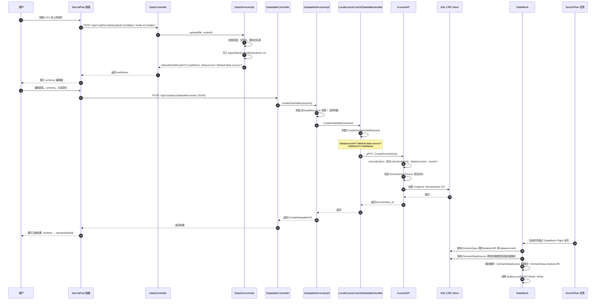

### 8.2 数据源注册完整时序

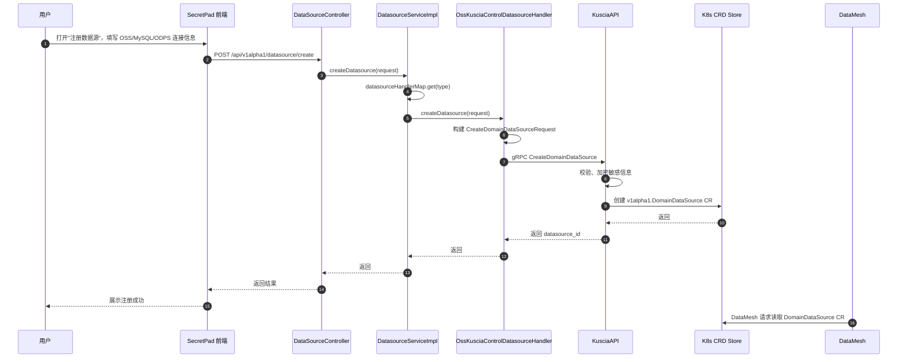

---

## 9. 关键源码文件索引

### SecretPad

| 用途 | 路径 |
| ------ | ------ |
| 前端数据管理页面 | `secretpad/frontend-src/apps/platform/src/modules/data-manager/data-manager.view.tsx` |
| 前端添加数据抽屉 | `secretpad/frontend-src/apps/platform/src/modules/data-table-add/add-data/add-data.view.tsx` |
| 前端 CSV 上传组件 | `secretpad/frontend-src/apps/platform/src/modules/data-table-add/component/upload-table/upload-table.view.tsx` |
| CSV 解析工具 | `secretpad/frontend-src/apps/platform/src/modules/data-table-add/component/upload-table/util.ts` |
| 前端数据源 API | `secretpad/frontend-src/apps/platform/src/services/secretpad/DataSourceController.ts` |
| 前端 Data API | `secretpad/frontend-src/apps/platform/src/services/secretpad/DataController.ts` |
| 前端 Datatable API | `secretpad/frontend-src/apps/platform/src/services/secretpad/DatatableController.ts` |
| 后端数据源 Controller | `secretpad/secretpad-web/src/main/java/org/secretflow/secretpad/web/controller/DataSourceController.java` |
| 后端上传/旧注册 Controller | `secretpad/secretpad-web/src/main/java/org/secretflow/secretpad/web/controller/DataController.java` |
| 后端数据表 Controller | `secretpad/secretpad-web/src/main/java/org/secretflow/secretpad/web/controller/DatatableController.java` |
| 数据权限 AOP | `secretpad/secretpad-web/src/main/java/org/secretflow/secretpad/web/aop/DataResourceAspect.java` |
| 数据源注册 Service | `secretpad/secretpad-service/src/main/java/org/secretflow/secretpad/service/impl/DatasourceServiceImpl.java` |
| 上传/下载/旧注册 Service | `secretpad/secretpad-service/src/main/java/org/secretflow/secretpad/service/impl/DataServiceImpl.java` |
| 数据表统一注册 Service | `secretpad/secretpad-service/src/main/java/org/secretflow/secretpad/service/impl/DatatableServiceImpl.java` |
| 旧版 DomainData 创建 Manager | `secretpad/secretpad-manager/src/main/java/org/secretflow/secretpad/manager/integration/data/DataManager.java` |
| LOCAL 数据表处理器 | `secretpad/secretpad-service/src/main/java/org/secretflow/secretpad/service/handler/datatable/LocalKusciaControlDatatableHandler.java` |
| OSS 数据源处理器 | `secretpad/secretpad-service/src/main/java/org/secretflow/secretpad/service/handler/datasource/OssKusciaControlDatasourceHandler.java` |
| MYSQL 数据源处理器 | `secretpad/secretpad-service/src/main/java/org/secretflow/secretpad/service/handler/datasource/MysqlKusciaControlDatasourceHandler.java` |
| ODPS 数据源处理器 | `secretpad/secretpad-service/src/main/java/org/secretflow/secretpad/service/handler/datasource/OdpsKusciaControlDatasourceHandler.java` |
| gRPC 通道提供者 | `secretpad/secretpad-api/client-java-kusciaapi/src/main/java/org/secretflow/secretpad/kuscia/v1alpha1/DynamicKusciaChannelProvider.java` |
| gRPC 适配器 | `secretpad/secretpad-api/client-java-kusciaapi/src/main/java/org/secretflow/secretpad/kuscia/v1alpha1/service/impl/KusciaGrpcClientAdapter.java` |

### Kuscia / DataMesh

| 用途 | 路径 |
| ------ | ------ |
| KusciaAPI gRPC 服务注册 | `kuscia/pkg/kusciaapi/bean/grpc_server_bean.go` |
| KusciaAPI HTTP 路由 | `kuscia/pkg/kusciaapi/bean/http_server_bean.go` |
| KusciaAPI DomainData Handler | `kuscia/pkg/kusciaapi/handler/grpchandler/domaindata_handler.go` |
| KusciaAPI DomainData Service | `kuscia/pkg/kusciaapi/service/domaindata_service.go` |
| KusciaAPI DomainDataSource Handler | `kuscia/pkg/kusciaapi/handler/grpchandler/domaindata_source_handler.go` |
| KusciaAPI DomainDataSource Service | `kuscia/pkg/kusciaapi/service/domaindata_source.go` |
| DataMesh 模块入口 | `kuscia/cmd/kuscia/modules/datamesh.go` |
| DataMesh 启动命令 | `kuscia/pkg/datamesh/commands/root.go` |
| DataMesh 配置 | `kuscia/pkg/datamesh/config/dmconfig.go` |
| DataMesh HTTP 路由 | `kuscia/pkg/datamesh/bean/http_server_bean.go` |
| DataMesh gRPC/Flight 注册 | `kuscia/pkg/datamesh/bean/grpc_server_bean.go` |
| DataMesh DomainData Service | `kuscia/pkg/datamesh/metaserver/service/domaindata.go` |
| DataMesh DomainDataSource Service | `kuscia/pkg/datamesh/metaserver/service/domaindatasource.go` |
| DataMesh 默认数据源注册 | `kuscia/pkg/datamesh/metaserver/service/operator.go` |
| DataMesh Flight Handler | `kuscia/pkg/datamesh/dataserver/handler/handler.go` |
| DataMesh Flight Action | `kuscia/pkg/datamesh/dataserver/service/action.go` |
| DataMesh Flight IO | `kuscia/pkg/datamesh/dataserver/service/flight_io.go` |
| 本地文件 IO | `kuscia/pkg/datamesh/dataserver/io/builtin/dataio_localfile.go` |
| CSV/二进制转换 | `kuscia/pkg/datamesh/dataserver/io/builtin/dataio.go` |
| OSS IO | `kuscia/pkg/datamesh/dataserver/io/builtin/dataio_oss.go` |
| DomainData CRD | `kuscia/pkg/crd/apis/kuscia/v1alpha1/domaindata_types.go` |
| DomainDataSource CRD | `kuscia/pkg/crd/apis/kuscia/v1alpha1/domaindatasource_types.go` |
| DomainDataGrant CRD | `kuscia/pkg/crd/apis/kuscia/v1alpha1/domaindatagrant_types.go` |
| KusciaAPI DomainData Proto | `kuscia/proto/api/v1alpha1/kusciaapi/domaindata.proto` |
| DataMesh DomainData Proto | `kuscia/proto/api/v1alpha1/datamesh/domaindata.proto` |
| DataMesh Flight Proto | `kuscia/proto/api/v1alpha1/datamesh/flightdm.proto` |

---

## 10. 补充说明

1. **DomainData 与 DomainDataSource 的绑定关系**：
   - `DomainData` 描述“哪张表/哪个文件”，`DomainDataSource` 描述“这个表/文件存在哪个存储后端、如何连接”。
   - `DomainData.spec.dataSource` 是引用 `DomainDataSource` 的外键，创建 DomainData 时 KusciaAPI 会校验该数据源是否存在。
   - CSV 本地上传复用 DataMesh 默认创建的 `default-data-source`（localfs）；OSS/MYSQL/ODPS 等类型需要先创建对应的 DomainDataSource，再创建引用它的 DomainData。

2. **元数据与字节分离**：`CreateDomainData` 只创建 CRD 元数据；实际 CSV 字节由 SecretPad 后端提前落盘，或后续通过 DataMesh `DoPut` 写入。

3. **localfs 路径对齐**：SecretPad 后端的文件目录需要与 Kuscia/DataMesh 的 `default-data-source` 本地路径对齐（通常通过容器 volume 挂载），否则 DataMesh 读不到文件。

4. **跨域授权**：若需将数据授权给其他 domain，会创建 `DomainDataGrant` CRD，由 `pkg/controllers/domaindata/controller.go` 同步到目标 domain。

5. **多数据源**：除 `LOCAL` 外，SecretPad 还支持 `OSS`、`ODPS`、`MYSQL`、`HTTP`，每种类型对应不同的 `DatatableHandler` 和 Kuscia `DomainDataSource` 配置。

6. **upload 与 createDataTable 的关系**：
   - `upload` 仅本地落盘，不上 Kuscia；
   - `createDataTable` 才是向 Kuscia 注册 DomainData 的正式接口；
   - 旧版 `createData` 已废弃，功能上等同于 `createDataTable` 的 LOCAL 分支。

---

## 11. 附录

### 11.1 本地文件系统默认路径

| 组件 | 默认路径 | 说明 |
| ------ | ---------- | ------ |
| SecretPad 上传目录 | `/app/data/{nodeId}/` | 通过 `secretpad.data.dir-path` 配置 |
| Kuscia 本地数据源 | `/home/kuscia/var/storage/data` | `default-data-source` 的 localfs path |
| DataMesh 实际读取 | `${localfs.Path}/${DomainData.relativeURI}` | 最终文件位置 |

### 11.2 默认端口

| 服务 | 默认端口 | 说明 |
| ------ | ---------- | ------ |
| SecretPad 前端 | `8000` | Umi dev |
| SecretPad HTTP | `8080` | 内部 HTTP |
| SecretPad HTTPS | `8443` | 对外 HTTPS |
| KusciaAPI HTTP | `8082` | 外部 REST |
| KusciaAPI gRPC | `8083` | 外部 gRPC |
| DataMesh HTTP | `8070` | 元数据 REST |
| DataMesh gRPC / Arrow Flight | `8071` | 元数据 gRPC + 数据平面 |

### 11.3 主要接口速查

| 协议 | 端点 | 用途 |
| ------ | ------ | ------ |
| HTTP | `POST /api/v1alpha1/data/upload` | SecretPad CSV 本地上传 |
| HTTP | `POST /api/v1alpha1/datatable/create` | SecretPad 注册数据表 |
| HTTP | `POST /api/v1alpha1/datasource/create` | SecretPad 注册数据源 |
| gRPC | `kusciaapi.DomainDataService/CreateDomainData` | 创建 DomainData |
| gRPC | `kusciaapi.DomainDataSourceService/CreateDomainDataSource` | 创建 DomainDataSource |
| gRPC | `datamesh.DomainDataService/CreateDomainData` | DataMesh 侧创建 DomainData |
| Flight | `DoGet(CommandDomainDataQuery)` | 读取数据 |
| Flight | `DoPut(CommandDomainDataUpdate)` | 写入数据 |

### 11.4 通信机制

1. **SecretPad 前端 ↔ 后端**：REST JSON，Umi 代理 `/api/*` 到 Spring Boot。
2. **SecretPad 后端 ↔ Kuscia**：gRPC（Java client 调用 Go server），可配置 TLS / mTLS / NOTLS。
3. **Kuscia 内部**：
   - gRPC 服务间调用；
   - Kubernetes CRD 作为统一元数据存储；
   - 跨 domain 经 Envoy 代理 + mTLS。
4. **Kuscia ↔ SecretFlow 任务**：SecretFlow 容器内通过 `kuscia.datamesh` 模块调用 DataMesh gRPC + Arrow Flight。
5. **SPU ↔ SPU（MPC 节点间）**：Kuscia 为每个 SecretFlow 任务分配 `spu` 端口并生成 `ClusterDefine`；SecretFlow 据此组装 `SPU cluster_def`，最终由 SPU runtime 创建 brpc link 完成点对点 MPC 通信。详见 [11.6 不同 SPU 之间是如何通信的](#116-不同-spu-之间是如何通信的)。

### 11.5 流程总结

整个“数据注册”过程可以分为两条主线：

1. **数据源注册**（`datasource/create`）：用户填写外部存储连接信息，SecretPad 后端调用 KusciaAPI `CreateDomainDataSource`，生成 `DomainDataSource` CR。
2. **数据表/文件注册**（`datatable/create`）：用户选择数据源并填写表/文件信息，SecretPad 后端调用 KusciaAPI `CreateDomainData`，生成引用该数据源的 `DomainData` CR。

对于最常用的 **CSV 本地上传** 场景，实际会分两步：

1. `data/upload`：前端把 CSV 上传到 SecretPad 后端本地磁盘；
2. `datatable/create`：前端用上传得到的 `realName` 作为 `relativeUri` 去 Kuscia 注册 `DomainData`。

之后 SecretFlow 任务通过 DataMesh 读取该 DomainData 时，DataMesh 会同时查询 `DomainData` 和 `DomainDataSource`，解析出完整路径/对象/表名，最终完成字节级读写。

### 11.6 不同 SPU 之间是如何通信的

#### 11.6.1 角色与起点

SPU（Secure Processing Unit）是 SecretFlow 中负责 MPC（安全多方计算）的执行引擎。一次联邦任务里，每个参与方都会启动一个 SecretFlow 容器（Pod），容器内部会初始化属于本方的 SPU runtime。不同 SPU runtime 之间需要建立点对点网络连接，才能协同完成密态计算。

SPU 之间的通信不是由 SecretFlow 任务自己去“发现”对端，而是由 Kuscia 在创建任务 Pod 时统一编排好网络拓扑，并以环境变量/配置文件的形式注入到每个容器中。SecretFlow 启动时读取这些配置，按图索骥建立连接。

#### 11.6.2 Kuscia 为 SPU 准备的网络配置

当 KusciaTask Controller 把一个 KusciaTask 调度成具体 Pod 时，会经历以下关键步骤（源码入口：`pkg/controllers/kusciatask/handler/pending_handler.go`）：

1. **解析 AppImage 端口定义**
   SecretFlow 的 AppImage 在 `deployTemplates[].spec.containers[].ports` 中声明了若干命名端口，其中与 SPU 直接相关的是：

   ```yaml
   - name: spu
     protocol: GRPC
     scope: Cluster
   - name: fed
     protocol: GRPC
     scope: Cluster
   ```

2. **分配端口**
   `PendingHandler.allocatePorts` 会为每个 domain 需要暴露的端口统一向 Kuscia 端口池申请实际端口号，并把结果写入 `KusciaTask.Status.AllocatedPorts`。例如 `spu` 这个命名端口在 alice 域可能被分配为 `30001`，在 bob 域被分配为 `30002`。

3. **生成 ClusterDefine / AllocatedPorts**
   - `generateParty` 为每个参与方生成 `proto.Party`，包含该方所有需要暴露的服务名（如 `spu`、`fed`）及对应的访问端点 `serviceName.{domainId}.svc[:port]`。
   - `fillPodClusterDefine` 为每个 Pod 生成 `proto.ClusterDefine`，标明：
     - `parties`：所有参与方列表；
     - `self_party_idx`：本方在列表中的下标；
     - `self_endpoint_idx`：本方 endpoint 下标。
   - `fillPodAllocatedPorts` 把端口名映射到实际分配的端口号，生成 `proto.AllocatedPorts`。

4. **注入容器环境变量/ConfigMap**
   最终 Kuscia 会把上述信息通过 ConfigMap 挂载到 `/work/kuscia/task-config.conf`：

   ```json
   {
     "task_id": "...",
     "task_input_config": "...",
     "task_cluster_def": "{ClusterDefine 的 JSON}",
     "allocated_ports": "{AllocatedPorts 的 JSON}",
     "task_progress_url": "..."
   }
   ```

   同时容器内也能看到如下环境变量：
   - `TASK_CLUSTER_DEFINE`
   - `ALLOCATED_PORTS`
   - `KUSCIA_DOMAIN_ID`

#### 11.6.3 SecretFlow 组装 SPU cluster_def

SecretFlow 容器启动入口 `python -m secretflow.kuscia.entry ./kuscia/task-config.conf` 会读取上述配置，最终调用 `secretflow.kuscia.sf_config.get_sf_cluster_config`：

1. 解析 `task_cluster_def` 得到每个参与方的服务列表。
2. 解析 `allocated_ports`，把本方的 `spu` 端口绑定到 `0.0.0.0:{port}`，作为监听地址。
3. 对于其他参与方，读取其 `spu` 服务端点，构造形如 `http://{serviceName}.{domainId}.svc[:port]` 的地址。
4. 将所有地址写入 `SFClusterConfig.public_config.spu_configs`。

示例（alice 容器内视角）：

| 参与方 | SPU 监听/连接地址 |
|--------|-------------------|
| alice（本方） | `0.0.0.0:30001` |
| bob（对端） | `http://task-xxx-bob-0-spu.bob.svc:30002` |

随后 `secretflow.component.core.config.extract_device_config` 会把 `SFClusterConfig` 进一步转换成 SPU 构造器需要的 `cluster_def`：

```python
cluster_def = {
    "nodes": [
        {"party": "alice", "address": "0.0.0.0:30001", "listen_address": ""},
        {"party": "bob",   "address": "http://task-xxx-bob-0-spu.bob.svc:30002", "listen_address": ""},
    ],
    "runtime_config": {
        "protocol": "SEMI2K",
        "field": "FM128",
        ...
    }
}
```

#### 11.6.4 SPU Runtime 建立 brpc link

SecretFlow 的 `SPU` 设备（`secretflow/device/device/spu.py`）拿到 `cluster_def` 后，会在每个参与方 Ray actor 内部初始化 `SPURuntime`：

1. `SPURuntime.__init__` 遍历 `cluster_def["nodes"]`，为每个节点调用 `spu.link.Desc.add_party(party, address)`。
2. 若配置中带有 `tls_opts`，则填充 `server_ssl_opts` / `client_ssl_opts`，并设置 `desc.enable_ssl = True`。
3. 若配置中带有 `link_desc`（如重试次数、超时、brpc 协议等），则通过 `_fill_link_desc_attrs` 设置到 `link.Desc`。
4. 最终调用 `spu.link.create_brpc(desc, rank)` 创建 brpc link。
   - rank 0 的节点在该端口上监听；
   - 所有节点根据 `desc` 中的地址主动去连接其他 rank。

SPU runtime 后续所有密态计算（share 交换、协议消息收发）都复用这一条 brpc link。

#### 11.6.5 跨域与域内路由

SPU 对端地址形如 `http://task-xxx-bob-0-spu.bob.svc:30002`，这里的 `.svc` 域名由 Kuscia 内置的 CoreDNS 解析：

- **域内（同一 Kuscia 实例内部）**：`.svc` 解析到对应 Pod/Service 的 ClusterIP，流量直接在内部转发。
- **跨域（alice 与 bob 分属不同 Kuscia）**：对端域名会被解析到 Kuscia Gateway（Envoy）的地址，由 Envoy 根据域名匹配、路由到对端 domain 的入口，再经过 mTLS 安全转发到目标 Pod。

Kuscia 在创建 KusciaTask 时已经通过 `PortAccessDomains` 限制只有该任务的参与方才能访问这些端口，因此 SPU 端口不会暴露给无关 domain。

#### 11.6.6 安全性：TLS / mTLS

SPU 通信链路的安全由两层保障：

1. **Kuscia 层**：跨 domain 流量默认经过 Envoy + mTLS，Gateway 之间互相校验证书，确保只有授权 domain 能接入。
2. **SPU 层**：`cluster_def` 支持为每个节点配置 `tls_opts`，可在 brpc 上开启端到端 TLS/SSL。

在本地非 Docker 开发模式（`KUSCIA_PROTOCOL=notls`）下，为了调试方便，这两层 TLS 通常都会关闭。

#### 11.6.7 时序图

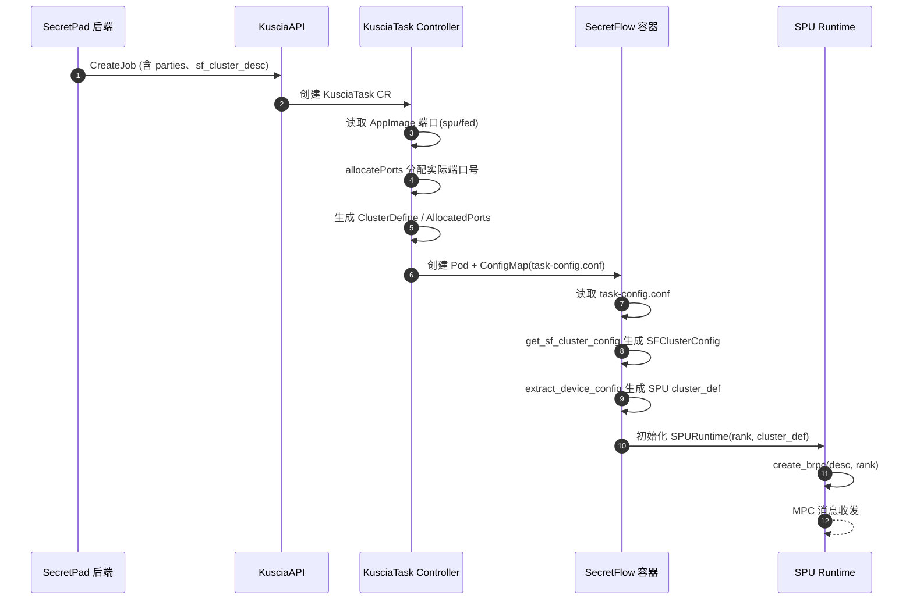

#### 11.6.8 关键源码索引

| 组件 | 文件 | 说明 |
| ------ | ------ | ------ |
| Kuscia AppImage | `scripts/templates/app_image.secretflow.yaml` | 声明 `spu`/`fed` 命名端口 |
| Kuscia 端口分配/ClusterDefine | `pkg/controllers/kusciatask/handler/pending_handler.go` | `allocatePorts`、`generateParty`、`fillPodClusterDefine` |
| SecretFlow 入口配置 | `secretflow/secretflow/kuscia/task_config.py` | 解析 `task_cluster_def`、`allocated_ports` |
| SecretFlow SFClusterConfig | `secretflow/secretflow/kuscia/sf_config.py` | 把 Kuscia 配置转成 `SFClusterConfig`，含 `spu_configs` |
| SecretFlow 设备配置抽取 | `secretflow/secretflow/component/core/config.py` | `extract_device_config` 生成 SPU `cluster_def` |
| SecretFlow SPU 设备 | `secretflow/secretflow/device/device/spu.py` | `SPU` / `SPURuntime` 初始化 brpc link |
| SecretFlow RayFed brpc | `secretflow/secretflow/distributed/fed/proxy/brpc_link/brpc_link.py` | RayFed 跨 silo 消息也走 brpc link |
| SPU 底层 link | spu 动态库 `spu.libspu.link` | `create_brpc`、`Desc` |

#### 11.6.9 与 RayFed 通信的区别

同一次任务里通常同时存在两种点对点通信：

| 维度 | SPU 间通信 | RayFed 跨 silo 通信 |
| ------ | ------------ | --------------------- |
| 用途 | MPC 协议消息、share 交换 | FedObject 跨节点传输、任务协调 |
| 端口名 | `spu` | `fed` |
| 底层库 | `spu.libspu.link`（brpc） | `secretflow.distributed.fed.proxy.brpc_link` |
| 配置来源 | `SFClusterConfig.public_config.spu_configs` | `SFClusterConfig.public_config.ray_fed_config` |
| 地址示例 | `http://task-xxx-bob-0-spu.bob.svc:30002` | `http://task-xxx-bob-0-fed.bob.svc:30003` |

两者都由 Kuscia 统一分配端口、生成 ClusterDefine，只是最终交给 SecretFlow 内部不同的子系统去创建链接。
