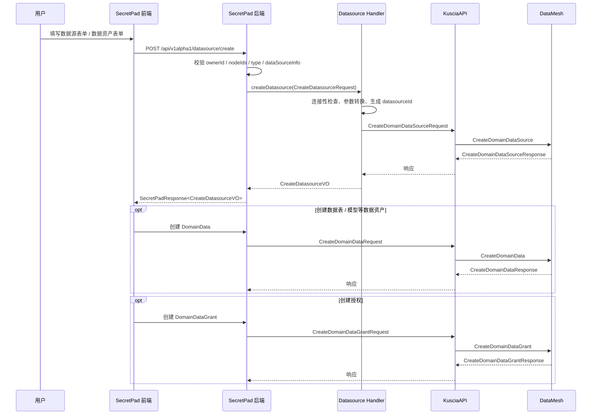
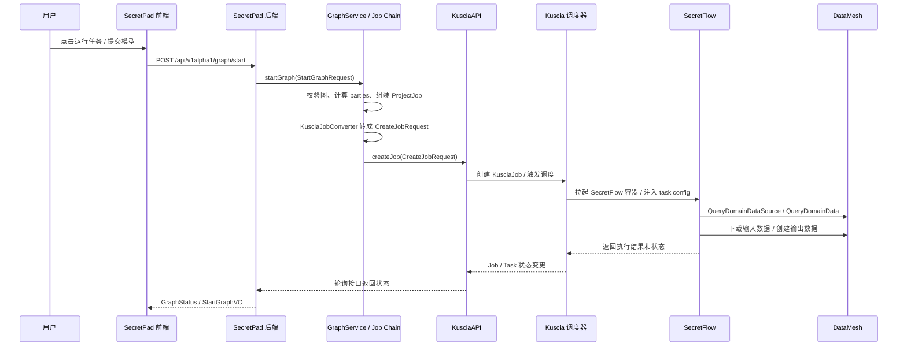

# 从secretpad前端到secretflow的完整数据流流程

本文档详细描述了从secretpad前端项目发起datamesh数据建立、联邦学习任务的完整数据流，从secretpad前端项目到secretpad后端项目，到kuscia项目到datamesh项目到secretflow项目的完整流程。

## 1. 整体架构概述

```
Frontend (React/AntD) -> Secretpad Backend (Spring Boot) -> Kuscia (Go) -> DataMesh (Go) -> SecretFlow (Python)
```

## 2. 数据流详细流程

### 2.1 前端发起数据上传和任务创建请求

#### 2.1.1 前端页面交互
- 用户在secretpad前端平台进行以下操作：
  1. 上传原始数据文件
  2. 创建DomainDataSource（数据源定义）
  3. 创建DomainData（数据表定义）
  4. 配置联邦学习任务参数
  5. 提交联邦学习任务

#### 2.1.2 前端API调用
- 前端位于：[/secretpad/frontend-src/apps/platform/src](file:///secretpad/frontend-src/apps/platform/src)
- API服务调用位于：[/secretpad/frontend-src/apps/platform/src/services/secretpad](file:///secretpad/frontend-src/apps/platform/src/services/secretpad)
- 前端通过HTTP/HTTPS向后端发起REST API请求，主要包括：
  - `/api/v1alpha1/datamesh/domaindatasource` - 创建数据源
  - `/api/v1alpha1/datamesh/domaindata` - 创建数据表
  - `/api/v1alpha1/job` - 创建联邦学习任务

### 2.2 Secretpad后端处理

#### 2.2.1 后端架构
- 项目结构：
  - [secretpad-web](file:///secretpad/secretpad-web) - Web API层
  - [secretpad-service](file:///secretpad/secretpad-service) - 业务逻辑层
  - [secretpad-persistence](file:///secretpad/secretpad-persistence) - 数据持久化层
  - [secretpad-common](file:///secretpad/secretpad-common) - 通用工具类

#### 2.2.2 API控制器
- 后端API控制器位于：[/secretpad/secretpad-web/src/main/java/org/secretflow/secretpad/web](file:///secretpad/secretpad-web/src/main/java/org/secretflow/secretpad/web)
- 主要控制器：
  - [DatameshController.java](file:///secretpad/secretpad-web/src/main/java/org/secretflow/secretpad/web/controller/v1alpha1/datamesh/DatameshController.java) - 处理数据网格相关请求
  - [JobController.java](file:///secretpad/secretpad-web/src/main/java/org/secretflow/secretpad/web/controller/v1alpha1/job/JobController.java) - 处理任务相关请求

#### 2.2.3 业务逻辑层
- 业务逻辑位于：[/secretpad/secretpad-service/src/main/java/org/secretflow/secretpad/service](file:///secretpad/secretpad-service/src/main/java/org/secretflow/secretpad/service)
- 关键服务：
  - [DatameshService.java](file:///secretpad/secretpad-service/src/main/java/org/secretflow/secretpad/service/datamesh/DatameshService.java) - 数据网格服务
  - [JobService.java](file:///secretpad/secretpad-service/src/main/java/org/secretflow/secretpad/service/job/JobService.java) - 任务服务

#### 2.2.4 与Kuscia的交互
- 后端通过Kuscia API与Kuscia进行交互
- 使用Kuscia提供的客户端库：[client-java-kusciaapi](file:///secretpad/secretpad-api/client-java-kusciaapi)
- 主要交互包括：
  - 创建DomainDataSource资源
  - 创建DomainData资源
  - 创建KusciaJob资源

### 2.3 Kuscia处理流程

#### 2.3.1 Kuscia架构
- 项目路径：[/kuscia](file:///kuscia)
- 核心组件：
  - Agent - 节点代理
  - DataMesh - 数据网格服务
  - Scheduler - 任务调度器
  - Controllers - CRD控制器

#### 2.3.2 自定义资源定义(CRD)
- Kuscia定义了多种CRD资源：
  - [KusciaJob](file:///kuscia/pkg/crd/apis/kuscia/v1alpha1/kusciajob_types.go) - 联邦学习任务定义
  - [KusciaTask](file:///kuscia/pkg/crd/apis/kuscia/v1alpha1/kusciatask_types.go) - 任务实例定义
  - [DomainData](file:///kuscia/pkg/crd/apis/kuscia/v1alpha1/domaindata_types.go) - 数据表定义
  - [DomainDataSource](file:///kuscia/pkg/crd/apis/kuscia/v1alpha1/domaindatasource_types.go) - 数据源定义

#### 2.3.3 DataMesh组件
- DataMesh路径：[/kuscia/pkg/datamesh](file:///kuscia/pkg/datamesh)
- 核心服务：
  - [domaindata.go](file:///kuscia/pkg/datamesh/metaserver/service/domaindata.go) - 数据管理服务
  - [domaindatasource.go](file:///kuscia/pkg/datamesh/metaserver/service/domaindatasource.go) - 数据源管理服务
  - [operator.go](file:///kuscia/pkg/datamesh/metaserver/service/operator.go) - 操作符服务

#### 2.3.4 任务调度流程
1. Secretpad后端创建KusciaJob CRD
2. Kuscia的Job Controller监听到新Job创建事件
3. Job Controller根据依赖关系创建相应的KusciaTask
4. KusciaTask Controller负责实际的任务执行

### 2.4 SecretFlow集成

#### 2.4.1 SecretFlow与Kuscia集成
- 集成代码路径：[/secretflow/secretflow/kuscia](file:///secretflow/secretflow/kuscia)
- 主要组件：
  - [entry.py](file:///secretflow/secretflow/kuscia/entry.py) - 入口点
  - [task_config.py](file:///secretflow/secretflow/kuscia/task_config.py) - 任务配置
  - [datamesh.py](file:///secretflow/secretflow/kuscia/datamesh.py) - 数据网格集成

#### 2.4.2 任务执行流程
1. Kuscia Task Controller启动SecretFlow容器
2. SecretFlow通过Kuscia提供的配置信息获取任务参数
3. 通过DataProxy与DataMesh交互，获取输入数据
4. 执行联邦学习算法
5. 将结果写回DataMesh或本地存储
6. 更新任务状态

#### 2.4.3 通信协议
- 使用gRPC进行组件间通信
- DataMesh提供gRPC接口：[domaindata.proto](file:///kuscia/proto/api/v1alpha1/datamesh/domaindata.proto)
- KusciaTask使用gRPC接口：[kuscia_task.proto](file:///kuscia/proto/api/v1alpha1/kusciatask/kuscia_task.proto)

### 2.5 端到端时序图

#### 2.5.1 数据源和数据资产创建时序



#### 2.5.2 联邦学习任务提交和执行时序



## 3. 接口和数据结构

### 3.1 API接口定义

#### 3.1.1 前端到后端接口
```
POST /api/v1alpha1/datamesh/domaindatasource - 创建数据源
POST /api/v1alpha1/datamesh/domaindata - 创建数据表
POST /api/v1alpha1/job - 创建联邦学习任务
GET /api/v1alpha1/job/{jobId} - 查询任务状态
```

#### 3.1.2 后端到Kuscia接口
- 使用Kubernetes API风格的CRD操作
- 主要资源类型：
  - KusciaJob
  - KusciaTask
  - DomainData
  - DomainDataSource

### 3.2 数据结构定义

#### 3.2.1 KusciaJob数据结构
```go
type KusciaJobSpec struct {
    FlowID         string               `json:"flowID,omitempty"`  // 流程ID
    Initiator      string               `json:"initiator"`         // 发起方
    ScheduleMode   KusciaJobScheduleMode `json:"scheduleMode,omitempty"` // 调度模式
    MaxParallelism *int                 `json:"maxParallelism,omitempty"` // 最大并行度
    Tasks          []KusciaTaskTemplate  `json:"tasks"`            // 任务模板列表
}
```

#### 3.2.2 KusciaTask数据结构
```go
type KusciaTaskSpec struct {
    Initiator       string      `json:"initiator"`        // 发起方
    TaskInputConfig string      `json:"taskInputConfig"`  // 任务输入配置
    ScheduleConfig  ScheduleConfig `json:"scheduleConfig,omitempty"` // 调度配置
    Parties         []PartyInfo    `json:"parties"`        // 参与方信息
}
```

#### 3.2.3 DomainData数据结构
```go
type DomainDataSpec struct {
    RelativeURI    string            `json:"relative_uri"`      // 相对URI
    Type           string            `json:"type"`              // 数据类型
    DatasourceId   string            `json:"datasource_id"`     // 数据源ID
    Vendor         string            `json:"vendor"`            // 供应商
    Columns        []*DataColumnSpec `json:"columns"`           // 列定义
    FileFormat     pbv1alpha1.FileFormat `json:"file_format"` // 文件格式
}
```

#### 3.2.4 任务配置数据结构
```python
@dataclass
class KusciaTaskConfig:
    task_id: str                    # 任务ID
    task_cluster_def: ClusterDefine # 集群定义
    task_allocated_ports: AllocatedPorts # 分配端口
    task_progress_url: str          # 进度上报URL
    sf_node_eval_param: NodeEvalParam # SF节点评估参数
    sf_cluster_desc: SFClusterDesc # SF集群描述
    sf_storage_config: Dict[str, StorageConfig] # SF存储配置
```

  ### 3.3 接口字段对照表

  #### 3.3.1 创建数据源请求 CreateDatasourceRequest

  对应 SecretPad 后端接口 `/api/v1alpha1/datasource/create`，模型在 [CreateDatasourceRequest.java](file:///secretpad/secretpad-service/src/main/java/org/secretflow/secretpad/service/model/datasource/CreateDatasourceRequest.java)。

  | 字段 | 类型 | 含义 | 去向 |
  |---|---|---|---|
  | ownerId | string | 数据源所属 owner 或节点上下文 | 用于权限校验和资源归属 |
  | nodeIds | List<string> | 需要创建同一逻辑数据源的节点列表 | DatasourceHandler 按节点循环创建 |
  | type | string | 数据源类型，如 OSS、MYSQL、ODPS | 决定路由到哪个 handler |
  | name | string | 数据源显示名 | 传给 Kuscia DataMesh |
  | dataSourceInfo | 多态对象 | 连接参数，按 type 反序列化 | 转成 Kuscia 的 info 字段 |

  #### 3.3.2 创建数据源响应 CreateDatasourceVO

  | 字段 | 类型 | 含义 |
  |---|---|---|
  | datasourceId | string | SecretPad 统一生成的数据源 ID |
  | failedRecord | Map<string, string> | 哪些节点失败，以及失败原因 |

  #### 3.3.3 Kuscia 创建数据源请求 CreateDomainDataSourceRequest

  | 字段 | 类型 | 含义 |
  |---|---|---|
  | header | RequestHeader | 请求头 |
  | domain_id | string | 当前域 ID，也就是节点 ID |
  | datasource_id | string | 数据源 ID |
  | type | string | oss / mysql / odps / localfs 等 |
  | name | string | 显示名 |
  | access_directly | bool | 是否直连数据源，通常为 false |
  | info | DataSourceInfo | 具体连接信息 |

  #### 3.3.4 Kuscia 创建数据源响应 CreateDomainDataSourceResponse

  | 字段 | 类型 | 含义 |
  |---|---|---|
  | status | Status | 0 表示成功，非 0 表示失败 |
  | data | CreateDomainDataSourceResponseData | 结果对象 |
  | data.datasource_id | string | 创建成功的数据源 ID |

  #### 3.3.5 DomainDataSource 对象

  | 字段 | 类型 | 含义 |
  |---|---|---|
  | datasource_id | string | 数据源唯一 ID |
  | name | string | 数据源名 |
  | type | string | 数据源类型 |
  | status | string | Available / Unavailable |
  | info | DataSourceInfo | 连接信息对象 |
  | info_key | string | 密钥引用型配置 |
  | access_directly | bool | 是否绕过 DataProxy |

  #### 3.3.6 创建数据资产请求 CreateDomainDataRequest

  | 字段 | 类型 | 含义 |
  |---|---|---|
  | header | RequestHeader | 请求头 |
  | domaindata_id | string | 数据资产 ID，空时由服务端生成 |
  | name | string | 数据资产名 |
  | type | string | table / model / rule / report / unknown |
  | relative_uri | string | 相对 datasource 的路径 |
  | datasource_id | string | 所属数据源 |
  | attributes | map<string,string> | 扩展属性 |
  | partition | Partition | 分区信息 |
  | columns | repeated DataColumn | 表结构，table 类型通常必填 |
  | vendor | string | 数据产生方 |
  | file_format | FileFormat | CSV / ORC / binary 等 |

  #### 3.3.7 创建数据资产响应 CreateDomainDataResponse / 查询响应 QueryDomainDataResponse

  | 字段 | 类型 | 含义 |
  |---|---|---|
  | status | Status | 调用状态 |
  | data.domaindata_id | string | 数据资产 ID |
  | data.name | string | 数据名 |
  | data.type | string | 数据类型 |
  | data.relative_uri | string | 逻辑路径 |
  | data.datasource_id | string | 所属数据源 |
  | data.attributes | map<string,string> | 扩展属性 |
  | data.columns | repeated DataColumn | 结构信息 |
  | data.vendor | string | 数据产生方 |
  | data.file_format | FileFormat | 文件格式 |
  | data.author | string | 归属作者 |

  #### 3.3.8 创建授权请求 CreateDomainDataGrantRequest

  | 字段 | 类型 | 含义 |
  |---|---|---|
  | header | RequestHeader | 请求头 |
  | domaindatagrant_id | string | 授权关系 ID |
  | domaindata_id | string | 被授权的数据资产 ID |
  | grant_domain | string | 被授权域 |
  | limit | GrantLimit | 授权限制 |
  | description | map<string,string> | 额外说明 |

  #### 3.3.9 GrantLimit 字段

  | 字段 | 类型 | 含义 |
  |---|---|---|
  | expiration_time | int64 | 过期时间 |
  | use_count | int32 | 使用次数限制 |
  | flow_id | string | 任务流 ID |
  | components | repeated string | 可用组件列表 |
  | initiator | string | 发起方 |
  | input_config | string | 输入配置 |

  #### 3.3.10 StartGraphRequest

  对应 `/api/v1alpha1/graph/start`，模型在 [StartGraphRequest.java](file:///secretpad/secretpad-service/src/main/java/org/secretflow/secretpad/service/model/graph/StartGraphRequest.java)。

  | 字段 | 类型 | 含义 |
  |---|---|---|
  | projectId | string | 项目 ID |
  | graphId | string | 图 ID |
  | breakpoint | boolean | 是否断点续跑 |
  | nodes | List<string> | 选择要启动的图节点 |

  #### 3.3.11 StartGraphVO

  | 字段 | 类型 | 含义 |
  |---|---|---|
  | jobId | string | 本次启动生成的作业 ID |

  #### 3.3.12 ProjectJob

  `ProjectJob` 是 SecretPad 内部承上启下的对象，后端先把图解析成它，再转 Kuscia Job。

  | 字段 | 类型 | 含义 |
  |---|---|---|
  | projectId | string | 项目 ID |
  | graphId | string | 图 ID |
  | name | string | 图或作业名 |
  | jobId | string | 内部生成的作业 ID |
  | fullNodes | List<GraphNodeInfo> | 完整图节点 |
  | edges | List<GraphEdge> | 完整图边 |
  | tasks | List<JobTask> | 参与执行的任务 |
  | maxParallelism | Integer | 最大并行度 |

  ##### JobTask 字段

  | 字段 | 类型 | 含义 |
  |---|---|---|
  | taskId | string | 任务 ID |
  | parties | List<string> | 参与方列表 |
  | status | GraphNodeTaskStatus | 节点状态 |
  | dependencies | List<string> | 依赖任务 |
  | node | GraphNodeInfo | 对应的图节点 |

  #### 3.3.13 Kuscia CreateJobRequest

  | 字段 | 类型 | 含义 |
  |---|---|---|
  | header | RequestHeader | 请求头 |
  | job_id | string | 作业 ID |
  | initiator | string | 发起方 |
  | max_parallelism | int32 | 最大并行度 |
  | tasks | repeated Task | 任务列表 |
  | custom_fields | map<string,string> | 自定义字段 |

  ##### Task 字段

  | 字段 | 类型 | 含义 |
  |---|---|---|
  | app_image | string | 运行镜像 |
  | parties | repeated Party | 任务参与方 |
  | alias | string | 别名 |
  | task_id | string | 任务 ID |
  | dependencies | repeated string | 依赖任务 |
  | task_input_config | string | 任务输入配置 |
  | priority | int32 | 优先级 |
  | schedule_config | ScheduleConfig | 调度配置 |
  | tolerable | bool | 失败是否容忍 |

  ##### Party 字段

  | 字段 | 类型 | 含义 |
  |---|---|---|
  | domain_id | string | 域 ID |
  | role | string | server / client |
  | resources | JobResource | 资源限制 |
  | bandwidth_limits | repeated BandwidthLimit | 带宽限制 |

  #### 3.3.14 Kuscia CreateJobResponse

  | 字段 | 类型 | 含义 |
  |---|---|---|
  | status | Status | 调用结果 |
  | data.job_id | string | 创建成功的 job_id |

  #### 3.3.15 SecretFlow 数据接口

  `secretflow/secretflow/kuscia/datamesh.py` 中最常用的几个函数可以理解为读写 DataMesh 的接口：

  | 函数 | 作用 |
  |---|---|
  | get_domain_data_source | 查询 DomainDataSource |
  | get_domain_data | 查询 DomainData |
  | create_domain_data_in_dm | 创建 DomainData |
  | get_file_from_dp | 通过 DataProxy 下载文件 |
  | put_file_to_dp | 通过 DataProxy 上传文件 |

## 4. 关键代码流程分析

### 4.1 前端数据上传流程
1. 用户在前端页面上传数据文件
2. 前端通过API服务调用后端
3. 后端将文件存储到指定位置
4. 创建DomainDataSource和DomainData资源

### 4.2 联邦学习任务创建流程
1. 前端提交任务配置
2. 后端验证任务参数
3. 创建KusciaJob CRD
4. Kuscia Job Controller监听并处理
5. 创建对应的KusciaTask
6. Kuscia Task Controller启动SecretFlow任务
7. SecretFlow执行联邦学习算法
8. 更新任务状态和结果

### 4.3 数据流转过程
1. 原始数据上传到DataProxy
2. 通过DataMesh创建DomainData资源
3. 任务执行时，SecretFlow通过DataProxy读取数据
4. 计算结果写回指定位置
5. 通过DataMesh更新结果状态

## 5. 安全和权限控制

### 5.1 数据安全
- 通过DomainDataGrant实现数据授权
- 数据访问控制基于RBAC模型
- 数据传输加密

### 5.2 任务安全
- 任务隔离机制
- 资源配额限制
- 网络策略控制

## 6. 监控和日志

### 6.1 任务监控
- 任务状态跟踪
- 资源使用情况
- 执行进度监控

### 6.2 日志收集
- 组件日志统一收集
- 任务执行日志
- 错误追踪

## 7. 总结

该架构实现了从前端用户界面到后端执行引擎的完整联邦学习工作流，通过Kuscia作为协调层，整合了DataMesh数据管理和SecretFlow计算引擎，提供了端到端的隐私计算解决方案。

## 8. 后端数据持久化详解

### 8.1 SecretPad后端的作用

先直接回答这几个问题：

1. **前端发起隐私计算任务时，后端不是“只做格式转换然后转发”**。
  - `GraphServiceImpl.startGraph()` 会先做图和节点校验、计算参与方、校验节点和路由健康度，然后生成内部 `ProjectJob`。
  - `JobPersistentHandler` 会先把任务历史和任务快照落到 SecretPad 本地数据库。
  - `KusciaJobConverter` 再把 `ProjectJob` 渲染成 Kuscia `CreateJobRequest`，同时生成每个节点的 `task_input_config` / `node_eval_param` 等执行参数。
  - 最后 `JobSubmittedHandler` 才调用 `jobManager.createJob(request)` 把任务提交到 Kuscia。

2. **后端会保存大量与隐私计算相关的数据**，并不只是临时转发。
  - 保存内容包括作业记录、任务记录、任务日志、图节点快照、Kuscia/SF 参数快照、结果索引、模型/报告/服务元数据等。

3. **不是“都保存在 Kuscia 中”**。
  - Kuscia 主要保存运行时编排对象，如 `KusciaJob`、`KusciaTask`、`DomainData`、`DomainDataSource`、`DomainDataGrant`。
  - SecretPad 主要保存业务视角的数据，如项目、图、任务历史、执行日志、结果索引、模型包、服务状态等。

4. **真正的计算输入/输出数据文件通常也不在 SecretPad 数据库里**。
  - SecretPad 数据库保存的是“索引和元数据”。
  - 真实的数据表、模型产物对应的底层文件或对象，通常通过 Kuscia DataMesh 挂接到底层存储或数据源；SecretPad 通过 `project_result.ref_id` 等字段引用这些产物。

从职责上看，SecretPad 后端承担了四类工作：

1. **业务逻辑处理**
  - 验证前端提交的图结构和参数
  - 计算任务参与方（parties）
  - 生成内部 `ProjectJob` 对象

2. **数据转换和适配**
  - 将前端的图结构转换为 `ProjectJob` 内部模型
  - 将 `ProjectJob` 转换为 Kuscia 的 `CreateJobRequest`
  - 处理不同计算模式（MPC/TEE）的差异

3. **状态管理和追踪**
  - 维护任务和作业的生命周期状态
  - 记录任务执行日志
  - 存储计算结果元数据

4. **数据持久化**
  - 在本地数据库中保存完整的任务历史
  - 存储图结构、节点配置、执行结果索引等

### 8.2 哪些数据保存在SecretPad后端数据库？

SecretPad后端使用关系型数据库（支持MySQL/SQLite）持久化以下核心数据：

#### 8.2.1 项目相关数据

| 数据表 | 实体类 | 说明 |
|--------|--------|------|
| project | ProjectDO | 项目基本信息（项目ID、名称、描述、计算模式、所有者等） |
| project_node | ProjectNodeDO | 项目与节点的关联关系 |
| project_graph | ProjectGraphDO | 图（DAG）的定义（图ID、名称、节点列表、边列表、最大并行度等） |
| project_graph_node | ProjectGraphNodeDO | 图中的节点详情（节点ID、算子类型、配置参数、输入输出等） |

#### 8.2.2 任务执行相关数据

| 数据表 | 实体类 | 说明 |
|--------|--------|------|
| project_job | ProjectJobDO | **联邦学习作业记录**（作业ID、项目ID、图ID、作业名称、状态、完成时间、错误信息、边信息等） |
| project_job_task | ProjectTaskDO | **任务实例记录**（任务ID、作业ID、参与方列表、任务状态、错误信息、节点配置快照等） |
| project_job_task_log | ProjectJobTaskLogDO | **任务执行日志**（日志ID、项目ID、作业ID、任务ID、日志内容、创建时间） |
| project_graph_node_kuscia_params | ProjectGraphNodeKusciaParamsDO | **Kuscia / SecretFlow 参数快照**（job_id、task_id、inputs、outputs、node_eval_param） |

**关键字段说明：**

- **ProjectJobDO** 包含：
  - `job_id`: 作业唯一标识
  - `project_id`: 所属项目
  - `graph_id`: 关联的图
  - `name`: 作业名称
  - `status`: 作业状态（RUNNING/SUCCEED/FAILED/STOPPED）
  - `finished_time`: 完成时间
  - `err_msg`: 错误信息
  - `edges`: 图的边结构（JSON格式）
  - `tasks`: 关联的任务列表（一对多关系）

- **ProjectTaskDO** 包含：
  - `task_id`: 任务唯一标识
  - `job_id`: 所属作业
  - `project_id`: 所属项目
  - `graph_node_id`: 对应的图节点ID
  - `parties`: 参与方列表（JSON数组）
  - `status`: 任务状态（INITIALIZED/RUNNING/SUCCEED/FAILED/STOPPED）
  - `err_msg`: 错误信息
  - `graph_node`: 节点配置快照（JSON格式，包含算子类型、参数等）
  - `extra_info`: 额外信息（如进度等）

- **ProjectGraphNodeKusciaParamsDO** 包含：
  - `project_id` / `graph_id` / `graph_node_id`: 对应图节点
  - `job_id` / `task_id`: 对应哪次实际执行
  - `inputs` / `outputs`: 本次任务渲染后的输入输出
  - `node_eval_param`: 渲染后的节点执行参数快照

这个表很关键，它说明后端不仅知道“有一个任务被提交了”，还把**提交给 Kuscia / SecretFlow 的关键执行参数快照**保存了下来，便于重跑、审计和排障。

#### 8.2.3 数据资产相关数据

| 数据表 | 实体类 | 说明 |
|--------|--------|------|
| project_datatable | ProjectDatatableDO | 数据表注册信息（数据表ID、名称、数据源ID、Schema、分区信息等） |
| project_graph_domain_datasource | ProjectGraphDomainDatasourceDO | 图中节点可见的数据源映射（项目、图、节点域与数据源ID/名称的关系） |
| project_result | ProjectResultDO | 计算结果元数据索引（结果类型、所属节点、`ref_id` 引用的产物ID、job_id、task_id） |
| project_read_data | ProjectReadDataDO | 读取数据的缓存内容 |

其中 `project_result` 更像“结果目录”而不是结果文件本体：

- `kind` 标识结果类型，例如 `FedTable`、`Model`、`Rule`、`Report`
- `ref_id` 通常引用底层产物 ID，例如 DomainData ID
- `job_id` / `task_id` 把产物和某次具体执行关联起来

#### 8.2.4 模型和产出物相关数据

| 数据表 | 实体类 | 说明 |
|--------|--------|------|
| project_model | ProjectModelDO | 训练得到的模型元数据 |
| project_model_pack | ProjectModelPackDO | 模型打包信息（模型ID、名称、描述、统计信息、服务ID等） |
| project_model_serving | ProjectModelServingDO | 模型服务部署信息（serving_id、发起方、servingInputConfig、参与方 endpoint、服务状态、错误信息等） |
| project_rule | ProjectRuleDO | 规则引擎的规则定义 |
| project_report | ProjectReportDO | 报告内容（报告文本/结构化内容） |
| project_fed_table | ProjectFedTableDO | 联邦表定义 |

这里也要区分“元数据”和“实体内容”：

- `project_model`、`project_model_pack`、`project_model_serving` 主要保存模型和服务的业务元数据
- 真正的模型文件、模型导出产物、联邦表文件通常仍落在 Kuscia DataMesh 所管理的数据资产里，SecretPad 通过结果表和业务表来引用它们
- `project_report` 属于少数会直接把报告内容保存在本地数据库中的对象

#### 8.2.5 调度和审批相关数据

| 数据表 | 实体类 | 说明 |
|--------|--------|------|
| project_schedule_job | ProjectScheduleJobDO | 定时调度作业记录 |
| project_approval_config | ProjectApprovalConfigDO | 审批配置（投票ID、发起方、参与方、审批类型等） |
| vote_request | VoteRequestDO | 投票请求记录 |
| vote_invite | VoteInviteDO | 投票邀请记录 |

### 8.3 Kuscia中保存的数据

Kuscia作为底层编排引擎，主要使用 Kubernetes CRD（Custom Resource Definition）存储运行时编排数据：

#### 8.3.1 Kuscia CRD资源

| 资源类型 | 说明 | 存储位置 |
|----------|------|----------|
| KusciaJob | 联邦学习作业定义（包含任务模板、参与方、调度配置等） | Kubernetes etcd |
| KusciaTask | 具体任务实例（包含任务输入配置、参与方信息、调度配置等） | Kubernetes etcd |
| DomainData | 数据资产定义（数据表元数据、列定义、文件格式等） | Kubernetes etcd |
| DomainDataSource | 数据源定义（数据源类型、连接信息、访问方式等） | Kubernetes etcd |
| DomainDataGrant | 数据授权关系（授权域、使用限制、过期时间等） | Kubernetes etcd |

#### 8.3.2 Kuscia数据存储特点

- **运行时导向**：Kuscia 的 CRD 主要服务于运行时编排、调度和数据资产注册
- **分布式**：存储在Kubernetes集群的etcd中，支持高可用
- **声明式**：采用Kubernetes的声明式API，描述期望状态
- **事件驱动**：通过Controller监听资源变化触发相应操作

还要再区分两层：

1. **Kuscia / DataMesh 元数据层**
  - `KusciaJob`、`KusciaTask`、`DomainData`、`DomainDataSource` 等对象保存在 Kubernetes etcd 中

2. **底层数据文件层**
  - 真实训练数据、导出模型、联邦表文件等通常位于底层存储或外部数据源中，例如本地文件系统、对象存储、数据库等
  - DataMesh 负责把这些底层数据资产抽象成 `DomainData` / `DomainDataSource`
  - 因此“数据在 Kuscia 中”更准确地说是“**数据资产定义和运行时引用在 Kuscia/DataMesh 中，真实文件在底层存储中**”

### 8.4 数据流向对比

``mermaid
graph TB
    A[前端提交任务] --> B[SecretPad后端]
    B --> C{数据处理}
    C --> D[保存到后端数据库]
    C --> E[转发到Kuscia]
    
    D --> F[ProjectJobDO]
    D --> G[ProjectTaskDO]
    D --> H[ProjectJobTaskLogDO]
    D --> I[ProjectResultDO]
    
    E --> J[Kuscia CRD]
    J --> K[KusciaJob]
    J --> L[KusciaTask]
    J --> M[DomainData]
    J --> N[DomainDataSource]
    
    K --> O[Kubernetes etcd]
    L --> O
    M --> O
    N --> O
    
    style D fill:#90EE90
    style O fill:#FFB6C1
```

### 8.5 数据持久化时机

#### 8.5.1 任务创建时（JobPersistentHandler）

当用户点击"运行"按钮时，链路上至少有两步关键处理，不是一个 handler 里全做完：

**第一步：`JobPersistentHandler` 先落本地库**

```java
// 1. 设置任务初始状态
job.getTasks().forEach(task -> {
    GraphNodeTaskStatus status = componentService.isSecretpadComponent(task.getNode()) 
        ? GraphNodeTaskStatus.SUCCEED 
        : GraphNodeTaskStatus.INITIALIZED;
    task.setStatus(status);
});

// 2. 转换为DO对象并保存
ProjectJobDO jobDO = ProjectJob.toDO(job);

// 3. 为SecretFlow组件创建成功日志
jobDO.getTasks().forEach((k, v) -> {
    if (v.getStatus().equals(GraphNodeTaskStatus.SUCCEED)) {
        projectJobTaskLogRepository.saveAll(
            Lists.newArrayList(
                ProjectJobTaskLogDO.taskStartLog(v),
                ProjectJobTaskLogDO.taskSucceedLog(v)
            ));
    }
});

// 4. 保存到数据库
projectJobRepository.save(jobDO);
```

**第二步：`JobSubmittedHandler` 再提交 Kuscia**

```java
Job.CreateJobRequest request = jobConverter.converter(job);
jobManager.createJob(request);
```

**此时保存的数据：**
- ✅ ProjectJobDO（作业基本信息）
- ✅ ProjectTaskDO（每个任务的初始状态、参与方、节点配置）
- ✅ ProjectJobTaskLogDO（任务启动和完成日志）
- ✅ ProjectGraphNodeKusciaParamsDO（渲染后的 inputs/outputs/node_eval_param 参数快照）
- ✅ KusciaJob CRD（Kubernetes中）

#### 8.5.2 任务执行过程中

- **状态更新**：JobManager监听Kuscia任务状态变化，更新ProjectTaskDO的status字段
- **日志收集**：实时收集任务日志并保存到ProjectJobTaskLogDO
- **进度更新**：更新ProjectTaskDO的extra_info中的progress字段

#### 8.5.3 任务完成后

- **结果记录**：保存计算结果元数据到ProjectResultDO
- **产出物注册**：如果是模型/规则/报告，保存到对应表
- **状态标记**：更新ProjectJobDO和ProjectTaskDO为最终状态（SUCCEED/FAILED）

### 8.6 为什么需要两端存储？

#### 8.6.1 SecretPad后端数据库的价值

1. **历史追溯**
   - 永久保存所有任务执行历史
   - 支持任务重跑、断点续传
   - 便于审计和问题排查

2. **业务查询**
   - 快速查询项目的任务列表
   - 统计分析（成功率、耗时等）
   - 结果展示和下载

3. **解耦设计**
   - 不依赖Kubernetes集群的可用性
   - 即使Kuscia重启，历史记录仍在
   - 支持多租户隔离

4. **性能优化**
   - 避免频繁查询Kubernetes API
   - 本地数据库查询更快
   - 支持复杂查询和聚合

#### 8.6.2 Kuscia CRD的价值

1. **编排执行**
   - Kubernetes原生的任务调度
   - 自动重试、故障恢复
   - 资源管理和隔离

2. **分布式协调**
   - 多节点间的任务协调
   - 参与方之间的同步
   - 分布式锁和一致性

3. **弹性伸缩**
   - 根据负载自动扩缩容
   - 容器化的任务执行环境
   - 资源配额管理

### 8.7 数据一致性保障

#### 8.7.1 事务管理

SecretPad后端使用Spring的事务管理确保数据一致性：

```java
@Transactional
@Override
public StartGraphVO startGraph(StartGraphRequest request) {
    // 1. 验证图和节点
    ProjectGraphDO graphDO = ownerCheck(request.getProjectId(), request.getGraphId());
    
    // 2. 计算参与方
    Map<String, Set<String>> parties = findParties(...);
    
    // 3. 生成ProjectJob
    ProjectJob projectJob = ProjectJob.genProjectJob(graphDO, selectedNodes, parties);
    
    // 4. 执行JobChain（包含持久化和Kuscia调用）
    jobChain.proceed(projectJob);
    
    return new StartGraphVO(projectJob.getJobId());
}
```

#### 8.7.2 补偿机制

- **失败回滚**：如果Kuscia创建失败，数据库事务回滚
- **状态同步**：定期从Kuscia同步任务状态到本地数据库
- **异常处理**：捕获异常并记录详细错误信息

### 8.8 总结

| 维度 | SecretPad后端数据库 | Kuscia (Kubernetes) |
|------|-------------------|---------------------|
| **数据类型** | 业务数据、历史记录、参数快照、结果索引 | 运行时编排、任务定义、数据资产定义 |
| **存储介质** | MySQL/SQLite | etcd |
| **持久性** | 长期保存 | 主要面向运行时和资源管理 |
| **用途** | 查询、审计、统计、展示 | 调度、执行、协调 |
| **查询性能** | 高（支持复杂查询） | 中（K8s API限制） |
| **可靠性** | 高（独立于K8s） | 依赖K8s集群 |
| **数据量** | 累积增长 | 相对较小 |

**结论**：SecretPad 后端不是简单的转发层。它负责校验、组装、参数渲染、持久化、状态追踪和结果索引；Kuscia 负责运行时编排和数据资产注册；真实输入输出文件通常位于 DataMesh 所连接的底层存储中。三者共同构成完整的隐私计算执行链路。

## 9. 常见问题（Q&A）

### 9.1 后端是否只是做格式转换并转发？

**不是。**
SecretPad 后端在把任务提交给 Kuscia 之前，会执行图/节点校验、参与方（parties）计算、路由健康检查、输入输出渲染、依赖解析、节点参数快照持久化等操作；任务提交后还会通过 `watchJob` 监听 Kuscia 事件，并把状态、错误、进度、结果元数据同步回本地数据库。详见 [8.1 SecretPad后端的作用](#81-secretpad后端的作用) 和 [8.5 数据持久化时机](#85-数据持久化时机)。

### 9.2 后端是否保存隐私计算相关数据？

**会保存。**
SecretPad 后端不仅临时转发请求，还会持久化作业记录、任务记录、任务日志、渲染后的 Kuscia / SecretFlow 参数快照、结果索引、模型/规则/报告/联邦表元数据等。详见 [8.2 哪些数据保存在SecretPad后端数据库](#82-哪些数据保存在secretpad后端数据库)。

### 9.3 隐私计算数据是否都保存在 Kuscia 中？

**不是。**
Kuscia 主要保存运行时编排对象和数据资产定义，例如 `KusciaJob`、`KusciaTask`、`DomainData`、`DomainDataSource`、`DomainDataGrant` 等；SecretPad 保存项目、图、作业历史、任务快照、结果目录等面向业务与 UI 的元数据。真正的训练数据、模型文件等底层数据通常位于 DataMesh 连接的底层存储（OSS / 本地文件系统 / 数据库等）中。详见 [8.3 Kuscia中保存的数据](#83-kuscia中保存的数据)。

### 9.4 哪些数据保存在后端数据库中？

SecretPad 后端数据库主要保存以下与隐私计算相关的业务元数据：

| 类别 | 数据表（对应实体） | 说明 |
|------|-------------------|------|
| 项目/图 | `project`、`project_graph`、`project_graph_node` | 项目基本信息、DAG 图定义、节点配置 |
| 作业/任务 | `project_job`、`project_job_task`、`project_job_task_log` | 作业记录、任务实例、执行日志 |
| 参数快照 | `project_graph_node_kuscia_params` | 渲染后提交给 Kuscia / SecretFlow 的参数快照 |
| 数据资产/结果 | `project_datatable`、`project_result`、`project_fed_table`、`project_model`、`project_rule`、`project_report`、`project_read_data` | 数据表注册信息、结果索引、模型/规则/报告/联邦表元数据 |
| 调度/审批 | `project_schedule_job`、`project_approval_config`、`vote_request`、`vote_invite` | 定时调度记录、审批与投票记录 |

具体字段和用途说明见 [8.2 哪些数据保存在SecretPad后端数据库](#82-哪些数据保存在secretpad后端数据库)。
