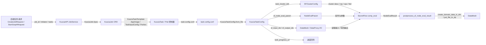

# Kuscia如何将任务转化为对SecretFlow的调用

本文档详细描述了Kuscia如何将从后端传来的各种任务转化为对SecretFlow的调用，涵盖任务解析、资源配置、容器启动和执行流程等关键环节。

## 1. 整体架构概览

```
Secretpad Backend -> Kuscia (KusciaJob CRD) -> Kuscia Controllers -> SecretFlow Container
```

Kuscia作为一个隐私计算任务协调平台，通过以下组件实现任务到SecretFlow的转化：
- KusciaJob/KusciaTask CRD：任务定义和状态管理
- Job Controller：任务编排和依赖管理
- Task Controller：任务执行和容器管理
- AppImage：定义SecretFlow容器镜像
- DataMesh：数据访问和管理

## 2. 任务传递机制

### 2.1 任务定义转换
当Secretpad后端需要执行联邦学习任务时，它会创建一个[KusciaJob](file:///Users/charles/Documents/code/workspace/kuscia/pkg/crd/apis/kuscia/v1alpha1/kusciajob_types.go)资源，例如：

```yaml
apiVersion: kuscia.secretflow/v1alpha1
kind: KusciaJob
metadata:
  name: federated-learning-job
spec:
  initiator: alice
  scheduleMode: Strict
  tasks:
  - alias: task-psi
    taskID: psi-task-001
    dependencies: []
    kusciaTaskTemplateRef: psi-template
  - alias: task-train
    taskID: train-task-001
    dependencies: ["task-psi"]
    kusciaTaskTemplateRef: train-template
```

### 2.2 任务解析过程
1. **Job Controller**监听到新的KusciaJob创建
2. 根据依赖关系解析任务执行顺序
3. 为每个任务创建对应的[KusciaTask](file:///Users/charles/Documents/code/workspace/kuscia/pkg/crd/apis/kuscia/v1alpha1/kusciatask_types.go)资源
4. Task Controller接管具体的任务执行

## 3. KusciaTask到SecretFlow容器的映射

### 3.1 KusciaTask规范
每个KusciaTask定义了如何执行一个具体的任务：

```go
type KusciaTaskSpec struct {
    Initiator       string      `json:"initiator"`        // 发起方
    TaskInputConfig string      `json:"taskInputConfig"`  // 任务输入配置
    ScheduleConfig  ScheduleConfig `json:"scheduleConfig,omitempty"` // 调度配置
    Parties         []PartyInfo    `json:"parties"`        // 参与方信息
}
```

### 3.2 参与方信息定义
`PartyInfo`定义了每个参与方的配置：

```go
type PartyInfo struct {
    DomainID    string        `json:"domainID"`      // 参与方域ID
    AppImageRef string        `json:"appImageRef"`   // 应用镜像引用
    Role        string        `json:"role,omitempty"` // 角色
    Template    PartyTemplate `json:"template,omitempty"` // 模板配置
}
```

### 3.3 AppImage与SecretFlow镜像
`AppImageRef`指向预定义的[AppImage](file:///Users/charles/Documents/code/workspace/kuscia/pkg/crd/apis/kuscia/v1alpha1/appimage_types.go)，其中包含SecretFlow容器的详细配置：

```go
type AppImageSpec struct {
    Image       string          `json:"image"`           // 镜像地址
    Entrypoints []AppEntrypoint `json:"entrypoints"`     // 入口点
    Resources   AppResources    `json:"resources"`       // 资源定义
}
```

## 4. 任务执行流程详解

### 4.1 任务解析与准备阶段

1. **Task Controller监听**：Task Controller监听到新的KusciaTask创建
2. **配置解析**：解析`TaskInputConfig`，提取SecretFlow所需参数
3. **集群定义构建**：根据参与方信息构建`ClusterDefine`，用于SecretFlow多节点通信

### 4.2 SecretFlow集群配置生成

Task Controller生成SecretFlow集群配置，包括：

- **SFClusterDesc**：定义参与方信息、通信端口等
- **NodeEvalParam**：定义具体要执行的组件及其参数
- **StorageConfig**：定义数据存储配置

这些配置会被序列化并通过环境变量或配置文件传递给SecretFlow容器。

### 4.3 容器启动与参数传递

#### 4.3.1 Pod创建
Task Controller为每个参与方创建Pod，Pod模板中包含：

```yaml
spec:
  containers:
  - name: secretflow-task
    image: secretflow-image:latest
    env:
    - name: KUSCIA_TASK_ID
      value: "task-id-001"
    - name: KUSCIA_TASK_CONFIG
      valueFrom:
        secretKeyRef:
          name: task-config-secret
          key: config.json
    command: ["/opt/secretflow/entrypoint.sh"]
    args: ["--task-config", "$(KUSCIA_TASK_CONFIG)"]
```

#### 4.3.2 SecretFlow入口点
SecretFlow通过[kuscia/entry.py](file:///Users/charles/Documents/code/workspace/secretflow/secretflow/kuscia/entry.py)作为入口点，该脚本负责：

1. 解析从Kuscia传递的任务配置
2. 初始化SecretFlow运行环境
3. 设置多方通信通道
4. 加载和执行指定的组件

### 4.4 任务执行过程

#### 4.4.1 配置加载
SecretFlow入口点从环境变量或配置文件中加载：
- `task_cluster_def`：集群定义，包含所有参与方的信息
- `allocated_ports`：分配的端口信息
- `sf_node_eval_param`：要执行的节点参数
- `sf_cluster_desc`：集群描述信息

#### 4.4.2 通信初始化
根据`ClusterDefine`初始化多方通信：
- 建立SPU（Secure Processing Unit）通信
- 设置RayFed通信通道
- 初始化各参与方间的网络连接

#### 4.4.3 组件执行
根据`NodeEvalParam`执行具体的隐私计算组件：
- 数据预处理组件（如PSI）
- 模型训练组件（如线性回归、树模型）
- 评估组件
- 其他分析组件

## 5. 数据访问机制

### 5.1 DataMesh集成
SecretFlow通过DataMesh访问数据：

1. **DomainData映射**：将DataMesh中的DomainData映射为SecretFlow可识别的数据格式
2. **数据代理**：通过DataProxy访问实际数据源
3. **权限验证**：确保只有授权的参与方可以访问相应数据

### 5.2 数据访问代码示例
在SecretFlow中，通过以下方式访问DataMesh数据：

```python
from secretflow.kuscia.datamesh import get_domain_data, get_file_from_dp

# 获取DomainData定义
domain_data = get_domain_data(task_conf, domaindata_id)

# 从DataProxy获取实际文件
file_path = get_file_from_dp(task_conf, domain_data.relative_uri)
```

## 6. 任务状态管理

### 6.1 状态同步
- SecretFlow执行过程中会定期更新任务进度
- 通过Kuscia提供的进度上报接口更新KusciaTask状态
- Task Controller监控Pod状态并同步到KusciaTask.status

### 6.2 状态定义
KusciaTask状态包括：
- `TaskPending`：任务待处理
- `TaskRunning`：任务正在执行
- `TaskSucceeded`：任务成功完成
- `TaskFailed`：任务执行失败
- `TaskCancelled`：任务被取消

## 7. 资源管理与调度

### 7.1 资源分配
- Kuscia根据任务需求分配CPU、内存等资源
- 通过QoS保证关键任务的资源供应
- 支持资源预留和生命周期管理

### 7.2 容器编排
- 支持多实例并行执行
- 处理任务依赖关系
- 实现容错和恢复机制

## 8. 错误处理与恢复

### 8.1 错误检测
- 监控容器健康状态
- 检测任务执行异常
- 处理网络连接问题

### 8.2 恢复机制
- 自动重试失败的任务
- 状态回滚和一致性保证
- 异常情况下的资源清理

## 9. 关键转换代码分析

### 9.1 KusciaTask到Pod的转换
在Task Controller中，[convert_kuscia_task_to_pod](file:///Users/charles/Documents/code/workspace/kuscia/pkg/controllers/kusciatask/pod_builder.go#L82-L82)函数负责将KusciaTask规范转换为Kubernetes Pod定义：

```go
func (builder *podBuilder) buildPod() (*corev1.Pod, error) {
    // 构建Pod模板
    pod := &corev1.Pod{
        ObjectMeta: metav1.ObjectMeta{
            Name: builder.taskID,
            Labels: map[string]string{
                common.LabelKusciaTask: builder.taskID,
            },
        },
        Spec: corev1.PodSpec{
            Containers: []corev1.Container{
                {
                    Name:  "secretflow",
                    Image: builder.appImage,
                    Env:   builder.buildEnvVars(),
                    Args:  builder.buildArgs(),
                },
            },
        },
    }
    return pod, nil
}
```

### 9.2 任务配置序列化
Kuscia将任务配置序列化为JSON格式，传递给SecretFlow容器：

```go
taskConfig := map[string]interface{}{
    "task_id": builder.taskID,
    "task_cluster_def": clusterDefJson,
    "allocated_ports": allocatedPortsJson,
    "task_input_config": taskInputConfig,
    "task_progress_url": progressUrl,
}
```

### 9.3 SecretFlow入口点解析
SecretFlow入口点解析来自Kuscia的配置：

```python
def main():
    task_config_json = os.environ.get('KUSCIA_TASK_CONFIG')
    task_conf = KusciaTaskConfig.from_json(json.loads(task_config_json))
    
    # 初始化SecretFlow环境
    sf.init(
        address=task_conf.sf_cluster_desc.ray_head_addr,
        num_cpus=task_conf.sf_cluster_desc.cpus_per_ray_process,
        log_to_driver=True,
    )
    
    # 执行具体任务
    result = comp_eval(
        op_name=task_conf.sf_node_eval_param.op,
        sf_cluster_desc=task_conf.sf_cluster_desc,
        input=task_conf.sf_node_eval_param.inputs,
        output=task_conf.sf_node_eval_param.outputs,
        params=task_conf.sf_node_eval_param.attrs,
    )
```

### 9.4 任务字段从后端到SecretFlow的映射图

下面这张图把一条任务从后端提交到SecretFlow执行的字段流向串起来，重点看每一层“谁生成、谁消费、谁再转发”。



#### 9.4.1 字段逐层对照

| 源头字段 | Kuscia 中间对象 | SecretFlow 运行对象 | 作用 |
|---|---|---|---|
| `CreateJobRequest.job_id` | `KusciaJob.metadata.name` | `KusciaTaskConfig.task_id` | 统一标识一条作业链 |
| `CreateJobRequest.initiator` | `KusciaJob.Spec.Initiator` | `task_cluster_def.self_party_idx` / 当前 party | 指定发起域 |
| `CreateJobRequest.max_parallelism` | `KusciaJob.Spec.MaxParallelism` | 并发执行限制 | 控制同一作业可并行的任务数 |
| `Task.app_image` | `KusciaTaskTemplate.AppImage` | `python -m secretflow.kuscia.entry` 所属镜像 | 决定实际运行的 SecretFlow 镜像 |
| `Task.task_input_config` | `task-config.conf.task_input_config` | `KusciaTaskConfig.sf_node_eval_param` / `sf_cluster_desc` / `sf_storage_config` | 决定执行什么、怎么执行 |
| `Task.parties` | `KusciaTaskTemplate.Parties` | `KusciaTaskConfig.task_cluster_def.parties` | 决定有哪些参与方 |
| `Task.dependencies` | `KusciaTaskTemplate.Dependencies` | 控制任务启动顺序 | 决定先后依赖 |
| `Task.schedule_config` | `KusciaTaskTemplate.ScheduleConfig` | 任务超时、资源保留、重试间隔 | 影响调度与恢复 |
| `task-config.conf.task_cluster_def` | `ClusterDefine` | `SFClusterConfig.desc` | 提供 SecretFlow 集群拓扑 |
| `task-config.conf.allocated_ports` | `AllocatedPorts` | `SFClusterConfig.public_config` | 提供 SPU / Fed / Inference 地址 |
| `task-config.conf.task_progress_url` | webhook 配置 | `SFClusterConfig.public_config.webhook_config` | 把执行进度回传给 Kuscia |
| `task-config.conf.sf_input_ids` | DataMesh 输入映射 | `preprocess_sf_node_eval_param` | 把 DomainData 转成 DistData |
| `task-config.conf.sf_output_ids` | DataMesh 输出映射 | `postprocess_sf_node_eval_result` | 把计算结果登记成 DomainData |
| `task-config.conf.sf_datasource_config` | 每个 party 的数据源 ID | `get_domain_data_source` | 找到当前 party 对应的数据源 |
| `sf_node_eval_param` | 节点参数 JSON | `comp_eval` 入参 | 定义组件与参数 |

#### 9.4.2 这张图怎么读

这条链路里最关键的三次“翻译”是：

1. 后端把业务任务翻译成 Kuscia 能理解的 `CreateJobRequest`；
2. Kuscia 把 `CreateJobRequest` 翻译成 `task-config.conf` 和 `KusciaTaskConfig`；
3. SecretFlow 把 `KusciaTaskConfig` 翻译成 `SFClusterConfig`、`NodeEvalParam` 和最终的 `comp_eval` 调用。

如果你在排查问题，最有效的切入点也是这三层：

- 看后端有没有把 `task_input_config` 传对；
- 看 `task-config.conf` 有没有把 cluster / ports / input ids 写对；
- 看 SecretFlow 有没有在 `preprocess_sf_node_eval_param` 里把输入和输出正确落到 DataMesh。

## 10. 总结

Kuscia通过CRD机制、控制器模式和容器编排技术，将上层应用的任务请求转化为对SecretFlow的精确调用。这种架构实现了：

1. **解耦合**：上层应用无需关心SecretFlow的具体实现细节
2. **标准化**：统一的任务定义和执行接口
3. **可扩展**：支持不同类型的任务和算法
4. **可靠性**：完善的错误处理和状态管理机制

通过这种转换机制，Kuscia为隐私计算提供了一个强大的任务调度和执行平台，使开发者能够专注于算法本身，而无需处理底层的基础设施和分布式协调问题。