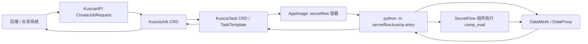
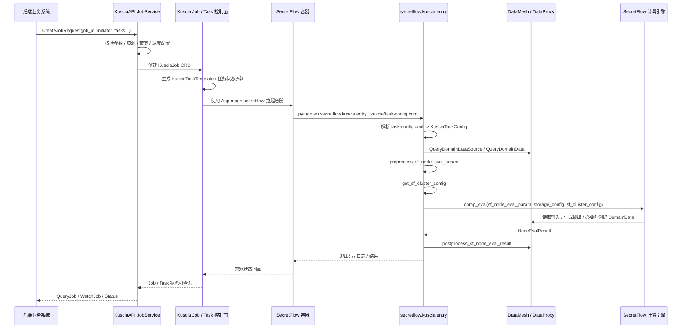

# Kuscia 如何把后端任务转成 SecretFlow 调用

这篇文档只讲一件事：后端把任务交给 Kuscia 之后，Kuscia 是怎样一步一步把“任务定义”变成“运行 SecretFlow 的容器和进程”的。

这里把路径拆成四层：

1. 后端通过 KusciaAPI 提交 `CreateJobRequest`；
2. Kuscia 把请求落成 `KusciaJob` / `KusciaTaskTemplate` 等 CRD 对象；
3. 调度器和控制器把任务变成实际运行的 Pod / 容器；
4. SecretFlow 读取 Kuscia 注入的 `task-config.conf`，再去调用 DataMesh / DataProxy，最后执行 `comp_eval`。

## 1. 一眼看懂全链路

最重要的认知是：Kuscia 并不是直接“调用一个 Python 函数”去运行 SecretFlow，而是先把任务编排成 CRD 和 AppImage，再通过容器启动命令把 SecretFlow 的入口程序跑起来。

## 2. 端到端时序图

## 3. Kuscia 接到后端任务后做了什么

后端发来的任务在 Kuscia 里最常见的形态就是 [CreateJobRequest](kuscia/proto/api/v1alpha1/kusciaapi/job.proto)。Kuscia 的服务入口在 [pkg/kusciaapi/service/job_service.go](kuscia/pkg/kusciaapi/service/job_service.go)。

### 3.1 CreateJobRequest 的转换逻辑

`job_service.go` 的 `CreateJob` 会先做校验，然后把 `request.Tasks` 转成 `v1alpha1.KusciaTaskTemplate`，最后生成 `v1alpha1.KusciaJob` 并写入 Kubernetes CRD。

关键步骤是：

- 把每个 `Task` 的 `Parties` 转成 `v1alpha1.Party`；
- 把 CPU / Memory / Bandwidth 解析成 `ResourceRequirements`；
- 把 `ScheduleConfig` 转成 `KusciaJobSpec` 里的调度配置；
- 把 `CustomFields` 转成 `labels`；
- 把 `job_id`、`initiator`、`max_parallelism`、`tasks` 写到 `KusciaJob.Spec`。

### 3.2 真实写入的 CRD

最终创建的是这样的对象：

- `KusciaJob`：作业级别对象；
- `KusciaTaskTemplate`：作业里每个任务模板；
- `KusciaTask`：任务实际运行时的对象；
- `KusciaTaskSummary`：任务汇总视图；
- `KusciaJobStatus` / `KusciaTaskStatus`：状态回写和查询依据。

`QueryJob` 又会从 CRD 反向拼回 `QueryJobResponse`，把 `KusciaJob.Spec.Tasks` 转成 API 层看到的 `TaskConfig`，所以同一份任务定义能在 API、CRD 和运行态之间来回映射。

## 4. Kuscia 如何把任务落成可执行容器

Kuscia 真正把任务变成运行中的 SecretFlow，不是通过“函数调用”，而是通过 AppImage 模板和容器启动命令。

### 4.1 AppImage 模板

SecretFlow 的应用镜像模板在 [scripts/templates/app_image.secretflow.yaml](kuscia/scripts/templates/app_image.secretflow.yaml)。其中最关键的部分有两个：

- `configTemplates.task-config.conf`：Kuscia 渲染出的任务配置文件；
- `deployTemplates` 里的容器命令：`python -m secretflow.kuscia.entry ./kuscia/task-config.conf`。

这意味着 Kuscia 在创建 SecretFlow 容器时，会把任务配置文件挂到 `/work/kuscia/task-config.conf`，然后用 Python 模块方式启动 SecretFlow 入口。

### 4.2 task-config.conf 里有什么

Kuscia 注入给容器的 `task-config.conf` 在模板里是一个 JSON，核心字段如下：

| 字段 | 含义 |
|---|---|
| task_id | 当前任务 ID |
| task_input_config | 任务输入配置，里面放 SecretFlow 节点参数 |
| task_cluster_def | Kuscia 为当前任务准备的集群定义 |
| task_progress_url | 进度上报地址 |
| allocated_ports | 当前任务分到的端口 |

这份配置文件是 SecretFlow 运行时的入口参数，后面的 `task_config.py` 会把它解析成强类型对象。

## 5. SecretFlow 是怎么被真正启动的

SecretFlow 的入口在 [secretflow/secretflow/kuscia/entry.py](secretflow/secretflow/kuscia/entry.py)。真正的主函数逻辑是：

1. 读取 `task-config.conf`；
2. 解析成 `KusciaTaskConfig`；
3. 连接 DataMesh；
4. 取出当前任务对应的数据源；
5. 预处理 `sf_node_eval_param`；
6. 构造 `SFClusterConfig`；
7. 执行 `comp_eval`；
8. 后处理输出并写回 DataMesh。

### 5.1 task_config.py 解析了什么

`KusciaTaskConfig` 的定义在 [secretflow/secretflow/kuscia/task_config.py](secretflow/secretflow/kuscia/task_config.py)。它是整个运行链路的中枢对象。

| 字段 | 类型 | 作用 |
|---|---|---|
| task_id | str | 当前任务 ID |
| task_cluster_def | ClusterDefine | 当前任务的集群拓扑 |
| task_allocated_ports | AllocatedPorts | Kuscia 分配给当前任务的端口 |
| task_progress_url | str | 进度上报地址 |
| sf_node_eval_param | NodeEvalParam | SecretFlow 节点评估参数 |
| sf_cluster_desc | SFClusterDesc | SecretFlow 集群描述 |
| sf_storage_config | Dict[str, StorageConfig] | 存储配置 |
| sf_input_ids | List[str] | 输入数据资产 ID |
| sf_input_partitions_spec | List[str] | 输入分区说明 |
| sf_output_ids | List[str] | 输出数据资产 ID |
| sf_output_uris | List[str] | 输出 URI |
| sf_output_partitions_spec | List[str] | 输出分区说明 |
| sf_datasource_config | Dict[str, Dict] | 每个 party 的数据源配置 |
| table_attrs | List[TableAttr] | 表结构信息 |

### 5.2 sf_config.py 如何拼出 SecretFlow 集群配置

[secretflow/secretflow/kuscia/sf_config.py](secretflow/secretflow/kuscia/sf_config.py) 的 `get_sf_cluster_config` 把 Kuscia 的任务上下文翻译成 SecretFlow 能理解的 `SFClusterConfig`。

它主要做了三件事：

1. 用 `allocated_ports` 拼出当前节点自己的 `spu` / `fed` / `inference` 地址；
2. 用 `task_cluster_def.parties` 里其他节点的 service endpoint 组出跨域地址；
3. 把 `task_progress_url` 塞进 `webhook_config`，让任务状态能回传。

这一步的本质是把 Kuscia 的“运行时网络拓扑”翻译成 SecretFlow 的“计算拓扑”。

## 6. SecretFlow 到底怎么读数据、算数据、写结果

### 6.1 先读 DataMesh

`entry.py` 在执行前会先调用 [secretflow/secretflow/kuscia/datamesh.py](secretflow/secretflow/kuscia/datamesh.py) 里的 `get_domain_data_source`，拿到当前 party 对应的数据源信息。

如果 `datasource.access_directly` 为 `false`，就会创建 DataProxy 客户端，走间接访问；如果是 `true`，则直接把 `localfs` 或 `oss` 之类的存储配置交给 SecretFlow。

### 6.2 preprocess_sf_node_eval_param 做了什么

`preprocess_sf_node_eval_param` 是整个“把任务变成 SecretFlow 调用参数”的核心。

它做了这些事：

- 校验输入分区和输出分区数量是否匹配；
- 按 `sf_input_ids` 把输入 `DomainData` 转成 SecretFlow 的 `DistData`；
- 按 `sf_output_uris` 写入输出 URI；
- 如果组件是 `model/model_export`，还会走模型导出专用逻辑；
- 当数据源不是 direct access 时，通过 DataProxy 下载输入数据。

换句话说，Kuscia 给 SecretFlow 的不是“原始任务字符串”，而是一份已经把数据源、输入、输出、分区、模型导出路径都整理好的 `NodeEvalParam`。

### 6.3 comp_eval 才是真正的计算入口

`entry.py` 最终调用的是 `comp_eval(sf_node_eval_param, storage_config, sf_cluster_config)`。

这里可以把 `comp_eval` 理解成 SecretFlow 组件执行器：

- `sf_node_eval_param` 决定“算什么”；
- `storage_config` 决定“数据从哪里读、往哪里写”；
- `sf_cluster_config` 决定“在什么网络和参与方拓扑里算”。

### 6.4 postprocess_sf_node_eval_result 做了什么

计算完成后，`postprocess_sf_node_eval_result` 会把输出写回 DataMesh：

- 先把 `NodeEvalResult` 里的输出 `DistData` 转成 `DomainData`；
- 再调用 `create_domain_data_in_dm` 在 DataMesh 中创建输出数据资产；
- 如果不是 direct access，还会把实际文件通过 DataProxy 上传到对应数据源位置。

也就是说，SecretFlow 的输出并不是“内存里的结果”就结束了，它会被显式登记成 DataMesh 中的新 `DomainData`，这样后续别的任务还能继续引用。

## 7. DataMesh 在这个链路里到底做什么

DataMesh 相关接口在 [secretflow/secretflow/kuscia/datamesh.py](secretflow/secretflow/kuscia/datamesh.py) 里对应得很清楚：

| 函数 | 作用 |
|---|---|
| create_domain_data_source_service_stub | 建立 DomainDataSourceService stub |
| get_domain_data_source | 查询数据源 |
| create_domain_data_service_stub | 建立 DomainDataService stub |
| get_domain_data | 查询数据资产 |
| create_domain_data_in_dm | 创建数据资产 |
| create_dm_flight_client | 创建 DataProxy 客户端 |
| get_file_from_dp | 从 DataProxy 下载文件 |
| put_file_to_dp | 通过 DataProxy 上传文件 |

这说明 Kuscia / SecretFlow 这一层并不是“只看任务”，它还同时在管理数据源和数据资产。

## 8. 后端任务字段是怎么一路传到 SecretFlow 的

下面这张表按字段流向把链路串起来。

| 源头 | 字段 / 对象 | 中间层 | 终点 |
|---|---|---|---|
| 后端请求 | `CreateJobRequest.job_id` | `KusciaJob.metadata.name` | 任务 ID |
| 后端请求 | `CreateJobRequest.initiator` | `KusciaJob.Spec.Initiator` | 作业发起方 |
| 后端请求 | `CreateJobRequest.max_parallelism` | `KusciaJob.Spec.MaxParallelism` | 作业并发度 |
| 后端请求 | `Task.app_image` | `KusciaTaskTemplate.AppImage` | SecretFlow 镜像 |
| 后端请求 | `Task.task_input_config` | `KusciaTaskTemplate.TaskInputConfig` | `task-config.conf` 里的 `task_input_config` |
| 后端请求 | `Task.parties` | `KusciaTaskTemplate.Parties` | 节点运行拓扑 |
| 后端请求 | `Task.schedule_config` | `KusciaTaskTemplate.ScheduleConfig` | 任务超时 / 资源保留 / 重试间隔 |
| 后端请求 | `Task.dependencies` | `KusciaTaskTemplate.Dependencies` | 任务依赖图 |
| Kuscia 运行态 | `task-config.conf.task_cluster_def` | `KusciaTaskConfig.task_cluster_def` | `SFClusterConfig` |
| Kuscia 运行态 | `task-config.conf.allocated_ports` | `KusciaTaskConfig.task_allocated_ports` | `SFClusterConfig` 里的地址映射 |
| Kuscia 运行态 | `task_input_config.sf_node_eval_param` | `KusciaTaskConfig.sf_node_eval_param` | `preprocess_sf_node_eval_param` |
| Kuscia 运行态 | `task_input_config.sf_input_ids` | `KusciaTaskConfig.sf_input_ids` | SecretFlow 输入数据 |
| Kuscia 运行态 | `task_input_config.sf_output_ids` | `KusciaTaskConfig.sf_output_ids` | SecretFlow 输出数据 |
| SecretFlow 运行态 | `NodeEvalParam` | `comp_eval` | 组件执行 |
| SecretFlow 运行态 | `NodeEvalResult` | `postprocess_sf_node_eval_result` | DataMesh 输出登记 |

## 9. 关键判断：direct access 和 DataProxy 两条路径

SecretFlow 不是永远都通过 DataProxy 读写数据。是否直连由 `DomainDataSource.access_directly` 决定。

### 9.1 access_directly = true

这种情况下，`get_storage_config` 会直接把 `localfs` 或 `oss` 信息转换成 SecretFlow 的 `StorageConfig`。

也就是说，SecretFlow 直接对底层存储读写。

### 9.2 access_directly = false

这种情况下，`get_storage_config` 会先创建一个本地临时工作目录，真正文件传输走 DataProxy：

- 输入：`get_file_from_dp`
- 输出：`put_file_to_dp`

这条路径更像“通过中间代理完成数据搬运”，也是很多联邦任务的默认路径。

## 10. 你读代码时最应该盯住的几个入口

如果你想按源码回放一遍，顺序建议是：

1. [kuscia/pkg/kusciaapi/service/job_service.go](kuscia/pkg/kusciaapi/service/job_service.go)
2. [kuscia/scripts/templates/app_image.secretflow.yaml](kuscia/scripts/templates/app_image.secretflow.yaml)
3. [secretflow/secretflow/kuscia/task_config.py](secretflow/secretflow/kuscia/task_config.py)
4. [secretflow/secretflow/kuscia/sf_config.py](secretflow/secretflow/kuscia/sf_config.py)
5. [secretflow/secretflow/kuscia/entry.py](secretflow/secretflow/kuscia/entry.py)
6. [secretflow/secretflow/kuscia/datamesh.py](secretflow/secretflow/kuscia/datamesh.py)

如果只想抓住“转换”本身，就重点看这条链：

`CreateJobRequest` -> `KusciaJob` -> `KusciaTaskTemplate` -> `task-config.conf` -> `KusciaTaskConfig` -> `SFClusterConfig` / `NodeEvalParam` -> `comp_eval` -> `DomainData` 回写。

## 11. 小结

Kuscia 和 SecretFlow 之间并不是单纯的“RPC 调用关系”，而是一条非常明确的任务编排链：

- Kuscia 接收后端任务，并把它规范化为 CRD；
- Kuscia 通过 AppImage 把 SecretFlow 以容器方式拉起；
- SecretFlow 读取 Kuscia 注入的任务配置；
- SecretFlow 再通过 DataMesh / DataProxy 获取数据并执行计算；
- 结果写回 DataMesh，Kuscia 再把状态暴露给上层系统。

这也是为什么在排查问题时，不能只看后端请求，也不能只看 Python 入口，必须把 `CreateJobRequest`、`task-config.conf`、`KusciaTaskConfig`、`SFClusterConfig` 和 DataMesh 这几层一起看。