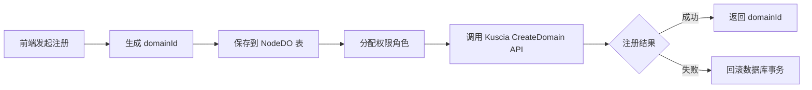

# SecretPad 后端设计文档

> 文档版本：基于当前仓库代码生成  
> 适用仓库：`/home/charles/code/secretpad`  
> 技术栈：Spring Boot 3.3.5 + Java 17 + Maven + gRPC/protobuf + SQLite/MySQL

---

## 1. 项目概述

SecretPad 是一个基于 [Kuscia](https://www.secretflow.org.cn/zh-CN/docs/kuscia/) 框架的隐私计算 Web 平台，提供隐私数据智能与机器学习的可视化能力。后端负责：

- 节点、数据、项目、授权关系的管理；
- DAG（有向无环图）式建模与任务编排；
- 通过 gRPC 与 Kuscia 控制面交互，下发 SecretFlow / SCQL / TrustedFlow / Serving 任务；
- 任务状态同步、日志、结果、模型与周期调度；
- 多租户权限、投票审批、数据同步等企业级能力。

---

## 2. 系统架构

### 2.1 组网模式

SecretPad 支持两种 Kuscia 组网模式：

| 模式 | 说明 | 适用场景 |
|------|------|----------|
| **中心化（master）** | 多个 Lite 节点共享一个 Master 控制面，由控制面统一调度资源与任务 | 大型机构内部节点互联，降低运维成本 |
| **P2P（autonomy）** | 每个 Autonomy 节点拥有独立控制面，节点实例与控制面位于同一子网 | 小型机构或对安全性要求高的场景 |

配置项 `secretpad.platform-type` 与 `secretpad.deploy-mode` 共同决定平台行为：

- `CENTER` / `EDGE` / `AUTONOMY`：平台角色；
- `MPC` / `TEE` / `ALL-IN-ONE`：计算模式。

### 2.2 Kuscia Domain 架构详解

#### 2.2.1 Domain ID 核心概念

**Domain ID（域标识符）** 是 Kuscia 框架中用于唯一标识参与方节点的核心身份凭证，具有以下关键特性：

| 维度 | 说明 |
|------|------|
| **身份标识** | 每个参与隐私计算的机构/节点都有一个唯一的 domainId，格式为字符串（最多 63 个字符，仅包含小写字母、数字和 `-`） |
| **信任边界** | domainId 定义了一个独立的信任域，包含该节点的数据、任务、权限和证书体系 |
| **通信寻址** | 在多方协作时，通过 domainId 来识别和路由消息到正确的节点 |
| **数据隔离** | 不同 domainId 之间的数据默认隔离，需要通过授权（Grant）才能跨域访问 |
| **证书绑定** | 每个 domainId 关联一套独立的 TLS 证书和 Token，用于安全通信 |

#### 2.2.2 多 Domain 应用场景

##### **场景一：多方安全计算（MPC）联盟**

```
┌─────────────┐         ┌──────────────┐         ┌─────────────┐
│  domain:    │         │   domain:    │         │  domain:    │
│  alice      │◄───────►│ kuscia-system│◄───────►│  bob        │
│  (医院A)    │  加密通信 │  (中心节点)   │  加密通信 │  (医院B)    │
└─────────────┘         └──────────────┘         └─────────────┘
     ↓                        ↓                        ↓
  私有病历数据            任务调度中心              私有检验数据
     │                        │                        │
     └────────────────────────┼────────────────────────┘
                              ↓
                    联合建模（不暴露原始数据）
```

**典型应用案例：**
- 🏥 **医疗联合建模**：多家医院（alice、bob、charlie...）在不共享原始病历的情况下联合训练疾病预测模型
- 🏦 **金融风控联盟**：多家银行共同构建反欺诈模型，但各自保留客户交易数据
- 🛒 **跨企业营销**：电商平台与广告商合作分析用户行为，保护用户隐私
- 🎓 **教育评估**：多所学校联合分析学生学习效果，不泄露学生个人信息

##### **场景二：P2P 去中心化网络**

```
┌──────────┐        ┌──────────┐        ┌──────────┐
│ domain:  │◄──────►│ domain:  │◄──────►│ domain:  │
│ node-A   │  直连  │ node-B   │  直连  │ node-C   │
└──────────┘        └──────────┘        └──────────┘
   P2P 对等节点，无中心节点，节点间直接 gRPC 通信
```

**特点：**
- 节点间直接通信，无需中心节点中转
- 适合完全去中心化的协作场景
- 每个节点既是服务提供者也是消费者
- 通过 NodeRoute 建立双向通信通道

##### **场景三：多租户隔离**

```
同一个物理基础设施上运行多个逻辑隔离的 domain：
- domain: tenant-1-dept-a    （租户1 - 部门A）
- domain: tenant-1-dept-b    （租户1 - 部门B）
- domain: tenant-2-company-x （租户2 - 公司X）
```

**用途：**
- 企业内部不同部门的数据隔离
- SaaS 平台的多租户架构
- 测试环境与生产环境隔离

#### 2.2.3 Domain 注册与管理机制

##### **静态配置（启动引导）**

`application.yaml` 中预定义的初始节点列表作为"种子节点"：

```yaml
kuscia:
  nodes:
    # 中心节点（Master）
    - domainId: ${NODE_ID:kuscia-system}
      mode: master
      host: ${KUSCIA_API_ADDRESS:root-kuscia-master}
      port: ${KUSCIA_API_PORT:8083}
      protocol: ${KUSCIA_PROTOCOL:tls}
      cert-file: config/certs/client.crt
      key-file: config/certs/client.pem
      token: config/certs/token

    # 参与方节点 Alice
    - domainId: alice
      mode: lite
      host: ${KUSCIA_API_LITE_ALICE_ADDRESS:root-kuscia-lite-alice}
      port: ${KUSCIA_API_PORT:8083}
      protocol: ${KUSCIA_PROTOCOL:tls}
      cert-file: config/certs/alice/client.crt
      key-file: config/certs/alice/client.pem
      token: config/certs/alice/token
```

##### **动态注册（运行时扩展）**

**CENTER 模式动态注册流程：**

```java
// NodeManager.createNode() 方法
@Transactional
public String createNode(CreateNodeParam param) {
    // 步骤 1: 生成新的 domainId（符合命名规范）
    String nodeId = genDomainId();
    
    // 步骤 2: 将节点信息保存到数据库（NodeDO 表）
    NodeDO nodeDO = NodeDO.builder()
        .controlNodeId(nodeId)
        .nodeId(nodeId)
        .name(param.getName())
        .mode(param.getMode())
        .netAddress(nodeId + ":1080")
        .type(DomainTypeEnum.normal.name())
        .build();
    nodeRepository.save(nodeDO);
    
    // 步骤 3: 分配权限角色
    SysUserPermissionRelDO permission = new SysUserPermissionRelDO();
    permission.setUserType(PermissionUserTypeEnum.NODE);
    permission.setTargetType(PermissionTargetTypeEnum.ROLE);
    permission.setUpk(new UPK(nodeId, RoleCodeConstants.EDGE_NODE));
    permissionRelRepository.save(permission);
    
    // 步骤 4: 【关键】通过 gRPC 调用 Kuscia API 动态创建域
    DomainOuterClass.CreateDomainRequest request = 
        DomainOuterClass.CreateDomainRequest.newBuilder()
            .setDomainId(nodeId)
            .setAuthCenter(
                DomainOuterClass.AuthCenter.newBuilder()
                    .setAuthenticationType("Token")
                    .setTokenGenMethod("UID-RSA-GEN")
                    .build()
            )
            .build();
    
    // 调用 Kuscia Master 节点的 CreateDomain API
    kusciaGrpcClientAdapter.createDomain(request);
    
    return nodeId;
}
```

**P2P/AUTONOMY 模式动态注册流程：**

```java
// NodeManager.createP2pNode() 方法
@Transactional
public String createP2pNode(CreateNodeParam param) {
    String nodeId = param.getDstNodeId();
    
    // 步骤 1: 保存节点信息到数据库
    NodeDO nodeDO = NodeDO.builder()
        .controlNodeId(nodeId)
        .nodeId(nodeId)
        .netAddress(param.getNetAddress())
        .masterNodeId(param.getMasterNodeId())
        .instId(param.getInstId())
        .build();
    nodeRepository.save(nodeDO);
    
    // 步骤 2: 创建或更新机构（Inst）
    createInst(param.getInstId(), param.getInstName());
    
    // 步骤 3: 通过源节点向目标节点发起域创建请求
    DomainOuterClass.CreateDomainRequest request = 
        DomainOuterClass.CreateDomainRequest.newBuilder()
            .setDomainId(nodeId)
            .setAuthCenter(
                DomainOuterClass.AuthCenter.newBuilder()
                    .setAuthenticationType("Token")
                    .setTokenGenMethod("RSA-GEN")
                    .build()
            )
            .setRole("partner")
            .setCert(param.getCertText())  // P2P 需要交换证书
            .build();
    
    // 通过源节点的 Kuscia 代理创建目标域
    DomainOuterClass.CreateDomainResponse response = 
        kusciaGrpcClientAdapter.createDomain(request, param.getSrcNodeId());
    
    if (response.getStatus().getCode() != 0) {
        throw SecretpadException.of(NodeErrorCode.NODE_CREATE_ERROR, 
            "node create fail in kuscia: " + response.getStatus().getMessage());
    }
    
    return nodeId;
}
```

##### **配置文件 vs 动态注册对比**

| 特性 | application.yaml（静态配置） | 数据库 + Kuscia API（动态注册） |
|------|-----------------------------|-------------------------------|
| **作用** | 初始节点引导，系统启动时加载 | 运行时节点管理，持久化存储 |
| **修改时机** | 部署前预配置 | 运行时通过前端/API 动态添加 |
| **生效方式** | 需重启应用 | 立即生效，无需重启 |
| **适用场景** | 固定基础设施节点（中心节点、种子节点） | 业务参与方节点（医院、银行等） |
| **持久化** | YAML 文件存储 | SQLite/MySQL 数据库存储 |
| **推荐做法** | 仅配置中心节点和预置节点 | 所有业务节点通过 API 注册 |

**最佳实践建议：**

✅ **application.yaml 中只配置：**
- 中心节点（master）
- 固定的基础设施节点
- 开发/测试环境的预置节点

✅ **通过前端/API 动态注册：**
- 业务参与方节点（如新的医院、银行）
- 临时测试节点
- 弹性扩容的节点

❌ **不建议的做法：**
- 每次新增参与方都修改 YAML 并重启服务
- 在 YAML 中硬编码大量业务节点

#### 2.2.4 Domain 间通信机制

##### **CENTER 模式通信拓扑**

```
所有 Lite 节点通过 Master 节点进行通信：

alice ──────┐
            ├──► kuscia-system (Master) ──► 任务调度 & 状态同步
bob   ──────┘         │
                      ▼
                 charlie (新加入节点)
```

- Lite 节点之间不直接通信
- 所有任务提交、状态查询、数据传输都经过 Master
- Master 维护全局节点列表和路由表

##### **P2P 模式通信拓扑**

```
节点间通过 NodeRoute 建立直连通道：

alice ◄══════► bob
  ║              ║
  ║              ║
  ╚══════► charlie

双向箭头表示建立了双向 NodeRoute
```

- 节点间直接 gRPC 通信，延迟更低
- 需要在数据库中维护 `NodeRouteDO` 记录
- 通过 `NodeRouteManager.createNodeRoute()` 建立双向通道

##### **通信安全机制**

| 安全层 | 实现方式 |
|--------|----------|
| **传输加密** | TLS 1.2+，每个 domainId 有独立的客户端证书和服务端证书 |
| **身份认证** | Token 认证 + RSA 密钥对签名 |
| **授权控制** | DomainDataGrantService 控制跨域数据访问权限 |
| **IP 过滤** | `ip.block` 配置禁止内网 IP 访问外部接口 |

#### 2.2.5 Domain 生命周期管理

##### **节点注册流程**



##### **节点删除流程**

```java
// NodeManager.deleteNode() 方法
@Transactional
public void deleteNode(String nodeId) {
    // 步骤 1: 检查是否为默认节点（不可删除）
    check(nodeId);
    
    // 步骤 2: 检查是否有正在运行的任务
    List<ProjectNodeDO> projectNodeList = projectNodeRepository.findByNodeId(nodeId);
    if (!CollectionUtils.isEmpty(projectNodeList)) {
        throw SecretpadException.of(NodeErrorCode.NODE_DELETE_ERROR, 
            "node have job running");
    }
    
    // 步骤 3: 检查是否有待审批的投票
    if (PlatformTypeEnum.AUTONOMY.equals(platformType)) {
        // P2P 模式下检查投票状态
        checkVoteStatus(nodeId);
    }
    
    // 步骤 4: 删除数据库记录
    nodeRepository.deleteById(nodeId);
    permissionRelRepository.deleteById(upk);
    nodeRouteRepository.deleteBySrcNodeId(nodeId);
    nodeRouteRepository.deleteByDstNodeId(nodeId);
    
    // 步骤 5: 调用 Kuscia API 删除域
    DomainOuterClass.DeleteDomainRequest request = 
        DomainOuterClass.DeleteDomainRequest.newBuilder()
            .setDomainId(nodeId)
            .build();
    kusciaGrpcClientAdapter.deleteDomain(request);
}
```

##### **节点状态管理**

| 状态 | 说明 | 触发条件 |
|------|------|----------|
| **Ready** | 节点就绪，可参与计算 | Kuscia HealthCheck 返回正常 |
| **NotReady** | 节点不可用 | 健康检查失败或网络断开 |
| **Pending** | 节点注册中 | 已提交注册请求，等待 Kuscia 确认 |

状态查询通过 `NodeManager.addNodeStatusByGrpcBatchQuery()` 批量调用 Kuscia `QueryNodeStatus` API 实现。

### 2.3 后端分层架构

```
┌─────────────────────────────────────────────────────────────────┐
│                    secretpad-web                                │
│   Spring Boot 可执行模块：REST 控制器、安全拦截器、AOP、全局异常处理  │
└───────────────────────┬─────────────────────────────────────────┘
                        │ 依赖 DTO / VO / Request
┌───────────────────────▼─────────────────────────────────────────┐
│                    secretpad-service                            │
│   业务逻辑：项目、图、任务、审批、模型、数据、定时调度等             │
└───────────────────────┬─────────────────────────────────────────┘
                        │ 依赖 Manager 模型 DTO
┌───────────────────────▼─────────────────────────────────────────┐
│                    secretpad-manager                            │
│   外部集成管理层：Kuscia gRPC、节点路由、数据源、对象存储、ODPS 等   │
└───────────────────────┬─────────────────────────────────────────┘
                        │ JPA Entity / Converter
┌───────────────────────▼─────────────────────────────────────────┐
│                  secretpad-persistence                          │
│   数据持久化：JPA 实体、Spring Data 仓库、Flyway、数据同步监听器   │
└───────────────────────┬─────────────────────────────────────────┘
                        │ SQL
┌───────────────────────▼─────────────────────────────────────────┐
│                    secretpad-common                             │
│   公共层：DTO、枚举、错误码、异常、i18n、工具类、基础注解          │
└─────────────────────────────────────────────────────────────────┘

附加模块：
┌─────────────────┐ ┌───────────────────────┐ ┌───────────────────┐
│  secretpad-api  │ │  secretpad-scheduled  │ │       test        │
│ Kuscia/SecretPad│ │  Quartz 定时任务       │ │  集成测试 + JaCoCo │
│   gRPC 客户端    │ │                       │ │    覆盖率聚合      │
└─────────────────┘ └───────────────────────┘ └───────────────────┘
```

### 2.3 模块职责

| 模块 | 路径 | 核心职责 |
|------|------|----------|
| `secretpad-common` | `secretpad-common/src/main/java/org/secretflow/secretpad/common` | 共享常量、枚举、错误码、通用 DTO（`SecretPadResponse`、`UserContextDTO`）、异常（`SecretpadException`）、i18n、校验注解、工具类（`JsonUtils`、`ProtoUtils`、`UserContext`） |
| `secretpad-persistence` | `secretpad-persistence/.../persistence` | JPA 实体（`ProjectDO`、`ProjectGraphDO`、`NodeDO` 等）、仓库接口、属性转换器、数据同步监听器/生产者/缓冲、Flyway 迁移 |
| `secretpad-manager` | `secretpad-manager/.../manager/integration` | 外部集成抽象层，提供 `AbstractXxxManager` 基类与具体实现，负责调用 Kuscia/SecretFlow/SCQL/OSS/ODPS/MySQL |
| `secretpad-service` | `secretpad-service/.../service` | 业务逻辑接口与实现、图流水线、任务链、各类 Handler、数据同步消费者 |
| `secretpad-web` | `secretpad-web/.../web` | Spring Boot 入口：控制器、过滤器、拦截器、AOP 切面、初始化 Bean、OpenAPI 配置 |
| `secretpad-scheduled` | `secretpad-scheduled/.../scheduled` | Quartz 调度配置、`SecretpadJob`、调度服务 |
| `secretpad-api` | `secretpad-api/client-java-kusciaapi`、`client-java-secretpad` | Kuscia API gRPC 客户端适配器、动态 Channel 提供者、Mock Server、服务 Stub |
| `test` | `test/` | 集成测试与 JaCoCo 覆盖率聚合 |

---

## 3. 代码架构

### 3.1 分层代码结构

```
secretpad-web
├── controller          REST API 入口（按领域分组）
├── filter              Servlet Filter（登录/IP 拦截等）
├── interceptor         Spring 拦截器（LoginInterceptor）
├── aop                 接口/数据权限切面
├── exception           全局异常处理
├── init                启动初始化 Bean
└── config              OpenAPI、WebMvc、缓存等配置

secretpad-service
├── service             业务接口
├── impl                业务实现
├── model               各领域模型（common/project/graph/job/...）
├── handler             各类 Handler（JobHandler、VoteHandler 等）
├── converter           领域模型 ↔ DTO/Entity 转换器
├── listener            业务事件监听
└── util                业务工具

secretpad-manager
├── integration
│   ├── node            节点管理
│   ├── job             任务管理
│   ├── datatable       数据表管理
│   ├── datasource      数据源管理
│   ├── data            数据读写（OSS/ODPS/MySQL/HTTP）
│   ├── noderoute       节点路由
│   ├── serving         模型服务
│   └── kuscia          Kuscia gRPC 适配

secretpad-persistence
├── entity              JPA 实体
├── repository          Spring Data 仓库
├── converter           JPA 属性转换器
├── datasync            数据同步（监听器/生产者/缓冲/消费者）
└── listener            实体变更事件监听

secretpad-common
├── dto                 通用 DTO
├── enums               枚举
├── errorcode           错误码接口与枚举
├── exception           业务异常
├── i18n                国际化解析器
├── util                工具类
├── validator           自定义校验器
└── annotation          自定义注解
```

### 3.2 请求处理流程

```
Browser / 前端
      │
      ▼
POST /api/v1alpha1/graph/start
      │
      ▼
┌────────────────────────────────────────────┐
│ GraphController.startGraph()                │
│ @ApiResource + @DataResource 权限校验        │
│ 返回 SecretPadResponse<T>                   │
└────────────────────┬───────────────────────┘
                     │ StartGraphRequest
                     ▼
┌────────────────────────────────────────────┐
│ GraphServiceImpl.startGraph()               │
│ 1. 校验项目/图所有权                          │
│ 2. 构建 GraphParties、GraphContext(ThreadLocal)│
│ 3. 生成 ProjectJob                            │
└────────────────────┬───────────────────────┘
                     │ ProjectJob
                     ▼
┌────────────────────────────────────────────┐
│ JobChain.proceed(ProjectJob)                │
│ 1. JobPersistentHandler 持久化任务            │
│ 2. JobRenderHandler 渲染输入输出、剪枝          │
│ 3. JobSubmittedHandler 提交到 Kuscia          │
└────────────────────┬───────────────────────┘
                     │ CreateJobRequest (protobuf)
                     ▼
┌────────────────────────────────────────────┐
│ JobManager.createJob()                      │
│ AUTONOMY 模式下指定节点；否则使用当前 Kuscia stub │
└────────────────────┬───────────────────────┘
                     │ gRPC over TLS
                     ▼
┌────────────────────────────────────────────┐
│ KusciaGrpcClientAdapter                     │
│ DynamicKusciaChannelProvider 创建 JobService stub │
└────────────────────────────────────────────┘
```

---

## 4. 核心领域与业务模块

### 4.1 项目（Project）

- **Service**：`ProjectService` / `ProjectServiceImpl`
- **实体**：`ProjectDO`、`ProjectInstDO`、`ProjectNodeDO`、`ProjectDatatableDO`
- **能力**：创建/查询/删除项目、管理参与机构与节点、关联数据表、设置计算模式。

### 4.2 节点（Node）

- **Service**：`NodeService` / `NodeServiceImpl`
- **Manager**：`AbstractNodeManager` / `NodeManager`
- **实体**：`NodeDO`
- **能力**：节点注册、Token 刷新、状态维护、当前节点选择。

### 4.3 数据 / 数据表（Data / Datatable）

- **Service**：`DatatableService`、`DataService`
- **Manager**：`AbstractDatatableManager` / `DatatableManager`、`AbstractDataManager` / `DataManager`
- **实体**：`ProjectDatatableDO`、`FeatureTableDO`、`TeeNodeDatatableManagementDO`
- **数据源类型**：OSS、HTTP、LOCAL、ODPS、MySQL。
- **能力**：数据表注册、数据源配置、授权项目、加密上传 TEE、状态刷新。

### 4.4 图 / 流水线（Graph / Pipeline）

- **Service**：`GraphService` / `GraphServiceImpl`
- **实体**：`ProjectGraphDO`、`ProjectGraphNodeDO`、`ProjectGraphRepository`
- **能力**：DAG 图 CRUD、组件节点拖拽、边连接、配置保存、运行/停止/继续、输出与日志查询。

### 4.5 任务 / 作业（Job / Task）

- **Manager**：`AbstractJobManager` / `JobManager`
- **实体**：`ProjectJobDO`、`ProjectTaskDO`、`ProjectJobTaskLogDO`
- **任务链**：`JobChain` 按顺序调用 `JobPersistentHandler` → `JobRenderHandler` → `JobSubmittedHandler`。
- **状态同步**：`JobManager.startSync()` 通过 `WatchJobEvent` gRPC 流监听 Kuscia 事件，更新任务/任务状态、结果、模型、报告。

### 4.6 用户 / 权限 / 审批

- **Service**：`AuthService`、`UserService`、`NodeUserService`、`ApprovalService`、`MessageService`
- **实体**：`AccountsDO`、`TokensDO`、`SysUser*RelDO`、`SysResourceDO`、`SysRoleDO`
- **权限注解**：`@ApiResource`、`@DataResource`
- **切面**：`InterfaceResourceAspect`、`DataResourceAspect`
- **审批投票**：`VoteTypeHandler` 策略表、投票同步服务。

### 4.7 节点路由（Node Route）

- **Service**：`NodeRouterService`
- **Manager**：`AbstractNodeRouteManager` / `NodeRouteManager`
- **实体**：`NodeRouteDO`

### 4.8 模型 / 服务（Model / Serving）

- **Service**：`ModelManagementService`、`ModelExportService`、`KusciaServingService`
- **Manager**：`AbstractKusciaServingManager` / `KusciaServingManager`
- **实体**：`ProjectModelDO`、`ProjectModelPackDO`、`ProjectModelServingDO`

### 4.9 定时调度（Scheduled）

- **Service**：`ScheduledService`
- **实体**：`ProjectScheduleDO`、`ProjectScheduleJobDO`、`ProjectScheduleTaskDO`
- **调度器**：Quartz，配置 `spring.quartz.job-store-type=jdbc`。

---

## 5. 外部集成层（Manager 层）

### 5.1 Kuscia gRPC 客户端

- **适配器**：`org.secretflow.secretpad.kuscia.v1alpha1.service.impl.KusciaGrpcClientAdapter`
- **实现接口**：`DomainService`、`DomainRouteService`、`DomainDataService`、`DomainDataSourceService`、`DomainDataGrantService`、`HealthService`、`KusciaJobService`、`ServingService`、`CertificateService`
- **Channel 提供者**：`DynamicKusciaChannelProvider` 按 domainId 动态创建 gRPC stub。
- **拦截器**：`TokenAuthClientInterceptor`、`KusciaGrpcLoggingInterceptor`

### 5.2 Protobuf 来源

| 目录 | 用途 |
|------|------|
| `proto/kuscia/` | Kuscia API（Job、Domaindata、DomainRoute 等） |
| `proto/secretflow/` | SecretFlow 任务/流水线/组件定义 |
| `proto/scql/` | SCQL 任务配置 |
| `proto/secretflow_serving/` | Serving 配置 |

生成包路径包括 `org.secretflow.v1alpha1.kusciaapi`、`com.secretflow.spec.v1`、`org.secretflow.proto.kuscia` 等。

### 5.3 对象存储与数据源

- **OSS**：AWS SDK S3（`aws-java-sdk-s3`）。
- **ODPS**：`odps-sdk-core`。
- **MySQL**：JDBC。
- **工厂**：`OssClientFactory`。

---

## 6. 技术栈

| 层级 | 技术 | 版本 / 说明 |
|------|------|-------------|
| 框架 | Spring Boot | 3.3.5 |
| Java | OpenJDK | 17 |
| ORM | Spring Data JPA + Hibernate | Hibernate Community Dialects for SQLite |
| 默认数据库 | SQLite | 3.42.0.0，WAL 模式 |
| 可选数据库 | MySQL | 8.0.32 |
| 调度数据库 | H2 | 文件模式 |
| 迁移 | Flyway | 按 profile 区分 schema |
| 缓存 | EhCache 3（JCache）| `spring-boot-starter-cache` |
| gRPC / Protobuf | grpc-netty-shaded / grpc-protobuf / grpc-stub | gRPC 1.62.2，protobuf 3.25.5 |
| JSON | Jackson | 2.17.2 |
| 校验 | Jakarta Bean Validation / Hibernate Validator | — |
| API 文档 | SpringDoc OpenAPI | 2.1.0 |
| 定时任务 | Quartz | spring-boot-starter-quartz |
| 日志 | SLF4J + Logback | 访问日志 `/var/log/secretpad` |
| 工具库 | Lombok、Guava、Apache Commons、javatuples、okio | — |
| 对象存储 | AWS SDK S3 | 1.12.725 |
| 云日志 | 阿里云 SLS | 0.6.104 |
| JWT | Auth0 java-jwt | 4.3.0 |
| 监控 | Micrometer + Prometheus | actuator 暴露 health（prometheus 默认关闭） |
| 构建 | Maven | compiler 3.13.0，Surefire 3.0.0-M4 |
| 测试 | JUnit 5（Jupiter）| — |
| 覆盖率 | JaCoCo | 0.8.11 |

---

## 7. 关键设计模式

| 模式 | 使用场景 |
|------|----------|
| **抽象基类 / 模板方法** | `AbstractJobHandler<T>`、`AbstractJobManager`、`AbstractNodeManager`、`AbstractDatatableManager`、`AbstractDatasourceManager`、`AbstractNodeRouteManager`、`AbstractDataManager` |
| **职责链** | `JobChain` 串联 `JobPersistentHandler` → `JobRenderHandler` → `JobSubmittedHandler` |
| **转换器** | `KusciaJobConverter`、`KusciaTrustedFlowJobConverter`、`KusciaTeeDataManagerConverter`、`TaskConverter`、JPA 属性转换器 |
| **工厂** | `NodeDefAdapterFactory`、`KusciaApiChannelFactory`、`GrpcKusciaApiChannelFactory`、`CloudLogServiceFactory` |
| **策略 / Handler Map** | `ServiceConfiguration` 构建 `Map<VoteTypeEnum, VoteTypeHandler>`、`Map<DataSourceTypeEnum, DatasourceHandler>` 等 |
| **适配器** | `NodeDefAdapter` 实现（`BinningModificationsAdapter`、`ModelParamModificationsAdapter`） |
| **构建器** | Lombok `@Builder`、`GraphBuilder`、Quartz `JobBuilder`/`TriggerBuilder` |
| **仓库** | Spring Data JPA 仓库扩展 `BaseRepository` |
| **聚合根** | `BaseAggregationRoot` 扩展 `AbstractAggregateRoot`，实体可发布领域事件 |
| **观察者 / 事件监听** | `EntityChangeListener`（`@PostPersist`/`@PostUpdate`/`@PostRemove`）、`JobSyncErrorOrCompletedEventListener`、`KusciaRegisterListener`/`KusciaUnRegisterListener`、`DbChangeEventListener` |
| **ThreadLocal 上下文** | `GraphContext` 通过 `ThreadLocal<GraphContextBean>` 保存图执行状态 |

---

## 8. API 设计

### 8.1 REST 规范

- **基础路径**：`/api/v1alpha1`
- **响应包装**：所有接口返回 `SecretPadResponse<T>`，结构为 `{ status: { code, msg }, data: ... }`
- **权限注解**：
  - `@ApiResource(code = "...")`：接口级权限；
  - `@DataResource(field = "projectId", resourceType = PROJECT_ID)`：数据级权限。
- **全局异常**：`SecretpadExceptionHandler`（`@RestControllerAdvice`）统一处理业务异常、参数校验异常、未知异常。

### 8.2 主要控制器

| 控制器 | 职责 |
|--------|------|
| `AuthController` | 登录/登出 |
| `UserController` | 用户信息 |
| `ProjectController` / `P2PProjectController` | 项目 CRUD、任务 |
| `GraphController` | 图 CRUD、组件列表、运行/停止/状态/日志/输出 |
| `NodeController` / `P2pNodeController` / `InstController` | 节点/机构管理 |
| `DatatableController` / `DataSourceController` | 数据表/数据源 |
| `MessageController` / `ApprovalController` / `VoteSyncController` | 消息/审批/投票同步 |
| `NodeRouteController` | 节点路由 |
| `ModelManagementController` / `ModelExportController` | 模型管理/导出 |
| `ScheduledController` | 周期任务 |
| `CloudLogController` | 日志参与方 |
| `CenterDataSyncController` / `DataSyncController` | 中心化/P2P 数据同步 |

### 8.3 OpenAPI / Swagger

- 配置类：`SpringDocConfig`
- 安全方案：API Key `x-token` 请求头
- 生产环境 `springdoc.api-docs.enabled=false`，开发环境 `application-dev.yaml` 开启。

---

## 9. 安全与权限

### 9.1 认证

- **登录拦截器**：`LoginInterceptor` 校验 `x-token`，支持双端口：
  - `8080`：用户端口；
  - `9001`：内部 RPC 端口。
- **Token 管理**：`TokensDO` + JWT（`java-jwt`）。
- **账号锁定**：结合 Spring Cache + EhCache 实现失败次数锁定。

### 9.2 授权

- **接口权限**：`@ApiResource` + `InterfaceResourceAspect` + `DefaultApiResourceAuth`
- **数据权限**：`@DataResource` + `DataResourceAspect` + `DataResourceInstAuth` / `DataResourceProjectAuth`
- **IP 拦截**：`application.yaml` 配置 `ip.block`，默认禁止内网 IP。

### 9.3 传输安全

- Kuscia API 默认 TLS（`kusciaapi.protocol: tls`）。
- 服务端 HTTPS：配置 `server.ssl.enabled=true`，使用 JKS 证书。

---

## 10. 数据持久化

### 10.1 默认配置（SQLite）

```yaml
spring.jpa.database-platform: org.hibernate.community.dialect.SQLiteDialect
spring.datasource.default.driver-class-name: org.sqlite.JDBC
spring.datasource.default.jdbc-url: jdbc:sqlite:./db/secretpad.sqlite
```

### 10.2 MySQL 配置

通过注释掉的示例配置切换，需修改方言、驱动、连接池。

### 10.3 迁移脚本

| 目录 | 用途 |
|------|------|
| `config/schema/center/` | 中心化模式 |
| `config/schema/edge/` | 边缘模式 |
| `config/schema/p2p/` | P2P 模式 |
| `config/schema/quartz/` | Quartz 表结构 |
| `config/schemamysql/` | MySQL DDL/DML |

### 10.4 核心实体

- 项目：`ProjectDO`、`ProjectInstDO`、`ProjectNodeDO`、`ProjectDatatableDO`
- 图：`ProjectGraphDO`、`ProjectGraphNodeDO`、`ProjectGraphNodeKusciaParamsDO`、`ProjectGraphDomainDatasourceDO`
- 任务：`ProjectJobDO`、`ProjectTaskDO`、`ProjectJobTaskLogDO`
- 节点：`NodeDO`、`NodeRouteDO`
- 数据：`FeatureTableDO`、`TeeNodeDatatableManagementDO`
- 用户权限：`AccountsDO`、`TokensDO`、`SysResourceDO`、`SysRoleDO`、`SysRoleResourceRelDO`、`SysUserPermissionRelDO`
- 审批投票：`VoteRequestDO`、`VoteInviteDO`
- 调度：`ProjectScheduleDO`、`ProjectScheduleJobDO`、`ProjectScheduleTaskDO`
- 模型：`ProjectModelDO`、`ProjectModelPackDO`、`ProjectModelServingDO`

---

## 11. 任务调度与状态同步

### 11.1 任务提交

1. 前端调用 `/api/v1alpha1/graph/start`；
2. `GraphServiceImpl` 构建 `ProjectJob`；
3. `JobChain` 依次持久化、渲染、转换；
4. `KusciaJobConverter`（或 `KusciaTrustedFlowJobConverter`）生成 `Job.CreateJobRequest`；
5. `JobManager.createJob()` 通过 `KusciaGrpcClientAdapter` 调用 Kuscia。

### 11.2 状态同步

- `JobManager.startSync()` / `startSync(nodeId)` 开启 gRPC `WatchJobEvent` 流；
- `StreamObserver<Job.WatchJobEventResponse>` 更新 `ProjectJobDO`、`ProjectTaskDO`、结果、模型、报告、联邦表；
- 完成/错误时发布 `JobSyncErrorOrCompletedEvent`。

### 11.3 周期调度

- Quartz 调度器：`secretpad-scheduled` 模块；
- 数据存储于 H2（`spring.datasource.quartz`）；
- 调度任务与图执行复用同一套 Job 提交链路。

---

## 12. 数据同步（Data Sync）

- 配置项 `data.sync` 列出需要同步的实体类；
- `EntityChangeListener` 监听实体增删改；
- 数据通过 Buffer/Producer 发送至对端；
- 消费端更新本地数据库，实现中心-边缘/P2P 间数据一致性。

---

## 13. 国际化（i18n）

- 配置目录：`config/i18n/`
- 文件：`secretpad.json`、`secretflow.json`、`scql.json`、`trustedflow.json`、`secretpad_tee.json`
- 解析器：`MessageResolver` / `LocaleMessageResolver`
- 默认 locale：`zh_CN`，可被 `Accept-Language` 请求头覆盖。

---

## 14. 构建与部署

### 14.1 Maven 构建

```bash
# 运行测试
make test          # mvn clean test

# 构建可执行 JAR（可集成前端 dist）
make build         # ./scripts/build/build.sh true

# 构建 Docker 镜像
make image         # 先 build，再 build_image.sh

# 打包 all-in-one
make pack          # ./scripts/pack/pack_allinone.sh linux/amd64
```

- 根 `pom.xml` 使用 `dependencyManagement` 统一版本；
- `secretpad-web` 通过 `spring-boot-maven-plugin` 输出 `../target/secretpad.jar`。

### 14.2 Docker

- `build/Dockerfiles/anolis.Dockerfile`：基于 `secretpad-base-lite:0.3` 的生产镜像，暴露 `80`、`8080`、`9001`；
- `build/Dockerfiles/lite.Dockerfile`：基础镜像（OpenJDK 17 + Anolis OS）。

### 14.3 关键脚本

| 脚本 | 用途 |
|------|------|
| `scripts/build/build.sh` | 构建 JAR，可选集成前端 dist |
| `scripts/build/build_image.sh` | 多平台 Docker 镜像 |
| `scripts/pack/pack_allinone.sh` | All-in-one tar.gz 包 |
| `scripts/install.sh` / `scripts/deploy/secretpad.sh` | 部署脚本 |
| `scripts/cert/gen_secretpad_serverkey.sh` | 服务端证书 |
| `scripts/cert/init_kusciaapi_certs.sh` | Kuscia API 证书 |
| `scripts/user/register_account.sh` | 账号注册 |
| `scripts/update_components.sh` | 组件更新 |

---

## 15. 配置说明

### 15.1 主要配置文件

| 文件 | 说明 |
|------|------|
| `config/application.yaml` | 主配置（SQLite、H2、SSL、Kuscia 节点、组件镜像） |
| `config/application-dev.yaml` | 开发环境，开启 OpenAPI |
| `config/application-edge.yaml` | 边缘节点部署 |
| `config/application-p2p.yaml` | P2P 部署 |
| `config/application-test.yaml` | 测试环境 |
| `config/server.jks` | SSL 密钥库 |

### 15.2 核心配置项

```yaml
server:
  http-port: 8080            # 用户端口
  http-port-inner: 9001      # 内部 RPC 端口
  port: 443                  # HTTPS 端口
  ssl.enabled: true

spring:
  datasource.default: jdbc:sqlite:./db/secretpad.sqlite
  datasource.quartz: jdbc:h2:./db/secretpadQuartz.mv.db
  jpa.database-platform: org.hibernate.community.dialect.SQLiteDialect
  cache.jcache.config: classpath:ehcache.xml

flyway.default.locations: filesystem:./config/schema/center

kuscia.nodes:                 # Kuscia 节点列表（master/lite）
  - domainId: kuscia-system
    mode: master
    host: root-kuscia-master
    port: 8083
    protocol: tls

secretpad:
  deploy-mode: ALL-IN-ONE     # MPC / TEE / ALL-IN-ONE
  platform-type: CENTER       # CENTER / EDGE / AUTONOMY
  auth.enabled: true
  upload-file.max-file-size: -1
  data.dir-path: /app/data/
  datasync.center: true
  datasync.p2p: false
```

---

## 16. 总结

SecretPad 后端采用 **Maven 多模块 + 分层架构 + Manager 集成层** 的设计：

1. **secretpad-common** 提供跨模块复用的 DTO、异常、i18n、工具类；
2. **secretpad-persistence** 通过 JPA + Flyway 统一数据访问与迁移；
3. **secretpad-manager** 抽象 Kuscia/数据源的集成细节；
4. **secretpad-service** 承载核心业务逻辑与编排；
5. **secretpad-web** 暴露 REST API、安全、AOP、全局处理；
6. **secretpad-scheduled** 提供 Quartz 周期调度；
7. **secretpad-api** 封装 gRPC/protobuf 客户端。

整体设计强调：

- **职责分离**：Web / Service / Manager / Persistence 四层边界清晰；
- **可扩展性**：通过抽象基类、Handler 链、策略映射支持新组件/数据源/投票类型；
- **可部署性**：默认 SQLite + H2 嵌入式数据库，支持容器化一键部署；
- **安全性**：TLS 传输、JWT 认证、接口/数据权限、IP 拦截。


## 17. 隐私计算任务的调度路由机制

根据代码分析，**任务提交到哪个 Kuscia 进行调度取决于部署模式**：

---

### **1. CENTER（中心化）模式**

#### **调度流程：**

```
┌──────────┐      ┌──────────────┐      ┌──────────────┐
│ Alice    │      │   SecretPad  │      │   Bob        │
│ (参与方)  │      │  (Edge节点)  │      │  (参与方)     │
└────┬─────┘      └──────┬───────┘      └──────┬───────┘
     │                   │                      │
     │  1.发起请求        │                      │
     ├──────────────────►│                      │
     │                   │                      │
     │                   │  2.构建 CreateJobRequest
     │                   │     initiator = "alice"
     │                   │                      │
     │                   │  3.调用 Kuscia API    │
     │                   ├─────────────────────►│
     │                   │  currentStub()       │
     │                   │                      │
     │                   │                      ▼
     │                   │              ┌──────────────┐
     │                   │              │ kuscia-system│
     │                   │              │   (Master)   │
     │                   │              └──────┬───────┘
     │                   │                     │
     │                   │                     │ 4.调度 SecretFlow
     │                   │                     │    在 alice 和 bob 上执行
     │                   │                     ▼
     │                   │              ┌──────────────┐
     │                   │              │  SecretFlow  │
     │                   │              │  隐私计算引擎 │
     │                   │              └──────────────┘
```


#### **关键代码逻辑：**

```java
// JobManager.java - 第 713-729 行
@Override
public void createJob(Job.CreateJobRequest request) {
    Job.CreateJobResponse response;
    
    if (PlatformTypeEnum.AUTONOMY.equals(getPlaformType())) {
        // P2P 模式：发送到 initiator（发起方）的 Kuscia
        response = kusciaGrpcClientAdapter.createJob(request, request.getInitiator());
    } else {
        // CENTER/EDGE 模式：发送到当前节点的 Kuscia（通常是 Master）
        response = kusciaGrpcClientAdapter.createJob(request);
    }
    
    // ... 错误处理
}
```
```java
// KusciaGrpcClientAdapter.java - 第 348-350 行
@Override
public Job.CreateJobResponse createJob(Job.CreateJobRequest request) {
    // 使用 currentStub() - 连接到配置的默认 Kuscia 节点
    return dynamicKusciaChannelProvider.currentStub(
        JobServiceGrpc.JobServiceBlockingStub.class
    ).createJob(request);
}
```


#### **CENTER 模式特点：**

✅ **任务提交目标**：`kuscia-system`（Master 节点）  
✅ **调度者**：Master 节点的 Kuscia 控制面  
✅ **执行者**：Alice 和 Bob 的 Lite 节点  
✅ **优势**：集中管理、统一调度、状态同步简单

---

### **2. AUTONOMY（P2P）模式**

#### **调度流程：**

```
┌──────────┐                          ┌──────────┐
│ Alice    │                          │   Bob    │
│ (参与方)  │                          │ (参与方)  │
│          │                          │          │
│ ┌──────┐ │                          │ ┌──────┐ │
│ │Kuscia│ │                          │ │Kuscia│ │
│ │(自主)│ │                          │ │(自主)│ │
│ └──┬───┘ │                          │ └──┬───┘ │
└────┼─────┘                          └────┼─────┘
     │                                     │
     │  1. Alice 发起请求                   │
     │                                     │
     │  2. 提交到 Alice 自己的 Kuscia       │
     │     createJob(request, "alice")     │
     │     ↓                               │
     │  ┌──────────┐                       │
     │  │ Alice's  │                       │
     │  │  Kuscia  │                       │
     │  └────┬─────┘                       │
     │       │                             │
     │       │ 3.通过 NodeRoute            │
     │       │   跨域调用 Bob 的 Kuscia     │
     │       ├────────────────────────────►│
     │       │                             │
     │       │ 4.协调双方执行 SecretFlow    │
     │       ▼                             ▼
     │  ┌──────────┐                  ┌──────────┐
     │  │SecretFlow│                  │SecretFlow│
     │  │ on Alice │                  │ on Bob   │
     │  └──────────┘                  └──────────┘
```


#### **关键代码逻辑：**

```java
// KusciaGrpcClientAdapter.java - 第 398-400 行
@Override
public Job.CreateJobResponse createJob(Job.CreateJobRequest request, String domainId) {
    // 使用 createStub(domainId) - 动态连接到指定 domainId 的 Kuscia
    return dynamicKusciaChannelProvider.createStub(
        domainId,  // 这里是 "alice"
        JobServiceGrpc.JobServiceBlockingStub.class
    ).createJob(request);
}
```


#### **P2P 模式特点：**

✅ **任务提交目标**：`initiator`（发起方，如 Alice）的 Kuscia  
✅ **调度者**：发起方的 Kuscia 控制面  
✅ **执行者**：Alice 和 Bob 各自运行 SecretFlow  
✅ **通信方式**：通过 `NodeRoute` 建立的双向 gRPC 通道  
✅ **优势**：去中心化、无单点故障、数据主权清晰

---

### **3. 核心对比总结**

| 维度 | CENTER 模式 | AUTONOMY (P2P) 模式 |
|------|------------|---------------------|
| **任务提交到** | `kuscia-system` (Master) | `request.getInitiator()` (发起方) |
| **调度器** | Master 节点的 Kuscia | 发起方的 Kuscia |
| **gRPC Stub** | `currentStub()` - 默认连接 | `createStub(domainId)` - 动态连接 |
| **代码路径** | `createJob(request)` | `createJob(request, domainId)` |
| **SecretFlow 执行** | Master 调度到各 Lite 节点 | 发起方协调各参与方执行 |
| **适用场景** | 企业内部、统一管控 | 跨机构协作、数据主权敏感 |

---

### **4. 实际示例**

假设 Alice 和 Bob 要联合训练一个机器学习模型：

#### **CENTER 模式：**
```bash
# 1. Alice 通过 SecretPad Web 界面发起任务
# 2. SecretPad (Edge) 构建任务请求
CreateJobRequest {
    jobId: "job-123"
    initiator: "alice"
    parties: ["alice", "bob"]
    tasks: [...]
}

# 3. 提交到 Master 节点
POST to kuscia-system:8083/api/v1/job/create

# 4. Master 调度 SecretFlow 在 alice 和 bob 上执行
# 5. 结果返回给 SecretPad
```


#### **P2P 模式：**
```bash
# 1. Alice 通过 SecretPad Web 界面发起任务
# 2. SecretPad 构建任务请求（相同结构）
CreateJobRequest {
    jobId: "job-123"
    initiator: "alice"
    parties: ["alice", "bob"]
    tasks: [...]
}

# 3. 提交到 Alice 自己的 Kuscia
POST to alice-kuscia:8083/api/v1/job/create

# 4. Alice 的 Kuscia 通过 NodeRoute 联系 Bob 的 Kuscia
# 5. 双方协调执行 SecretFlow
# 6. 结果汇总到 Alice
```


---

### **5. 回答您的问题**

> **参与方 Alice 跟 Bob 都有对应的 Kuscia，可以发起隐私计算请求，那用来调度的话，发到谁的 Kuscia 上最终来调度 SecretFlow？**

**答案：**

1. **CENTER 模式**：无论谁发起，都发送到 **`kuscia-system`（Master 节点）**的 Kuscia，由 Master 统一调度 SecretFlow 在各参与方执行。

2. **P2P/AUTONOMY 模式**：发送到 **发起方（initiator）**的 Kuscia。如果 Alice 发起，就发送到 Alice 的 Kuscia；如果 Bob 发起，就发送到 Bob 的 Kuscia。发起方的 Kuscia 负责协调其他参与方执行 SecretFlow。

这种设计确保了：
- ✅ CENTER 模式下集中管控，便于运维和监控
- ✅ P2P 模式下数据主权清晰，没有中心依赖
- ✅ 两种模式都能正确完成多方隐私计算任务