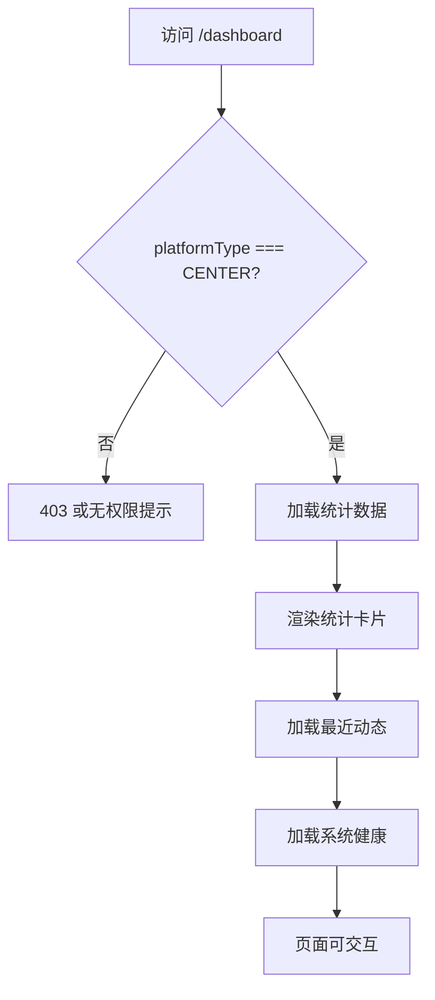

# 02 Dashboard

## 页面：/dashboard

### 需求背景
为 CENTER 平台管理员提供全局概览，快速掌握平台规模、最近动态和系统健康。

### 页面流程



### 低保真原型

```textn+------------------------------------------------------------------+
|  Dashboard                                          [刷新]         |
+------------------------------------------------------------------+
|  +----------+  +----------+  +----------+  +----------+          |
|  | Projects |  |  Nodes   |  |DataTables|  |  Graphs  |          |
|  |   128    |  |   12     |  |   356    |  |   89     |          |
|  |  ↑ 12%   |  |   —      |  |  ↑ 5%    |  |  ↑ 8%    |          |
|  +----------+  +----------+  +----------+  +----------+          |
+------------------------------------------------------------------+
|  +------------------------+    +------------------------------+  |
|  | Recent Projects        |    | Recent Nodes                 |  |
|  | - 反欺诈联邦建模        |    | - alice (Healthy)            |  |
|  | - 广告联合统计          |    | - bob   (Healthy)            |  |
|  | - 医疗数据 TEE 计算     |    | - tee   (Warning)            |  |
|  | [查看全部 →]            |    | [查看全部 →]                 |  |
|  +------------------------+    +------------------------------+  |
|  +--------------------------------------------------------------+|
|  | System Health                                                ||
|  | CPU 45%  ████████░░░░  | Memory 60%  ██████████░░  |          ||
|  | Disk 75% ██████████████░ | Network OK  ●            |          ||
|  +--------------------------------------------------------------+|
+------------------------------------------------------------------+
```

### 元素说明

| 元素 | 类型 | 说明 |
|---|---|---|
| 统计卡片 | Statistic Card | 4 张，显示 Projects/Nodes/DataTables/Graphs 数量 |
| 刷新按钮 | Icon Button | 手动刷新全部数据 |
| 最近项目 | List Card | 最近 5 个项目，含名称、创建时间 |
| 最近节点 | List Card | 最近 5 个节点，含名称、状态 |
| 系统健康 | Progress + Status | CPU/内存/磁盘进度条，网络状态 |

### 字段说明

| 字段 | 来源 | 说明 |
|---|---|---|
| Projects 数量 | `/index` 或统计接口 | 项目总数 |
| Nodes 数量 | 统计接口 | 注册节点数 |
| DataTables 数量 | 统计接口 | 数据表总数 |
| Graphs 数量 | 统计接口 | 训练流总数 |
| CPU/Memory/Disk | 系统监控接口 | 使用率百分比 |
| Network | 健康检查接口 | OK / Warning / Error |

### 交互说明

| 操作 | 反馈 |
|---|---|
| 点击统计卡片 | 跳转对应列表页 |
| 点击最近项目/节点 | 跳转详情/项目空间 |
| 点击刷新 | 重新加载全部数据 |
| 指标异常 | 高亮或标红，Hover 显示详情 |

### 异常与边界

| 场景 | 处理 |
|---|---|
| 统计接口失败 | 卡片显示“--”，提供重试 |
| 最近动态为空 | 显示空态“暂无最近动态” |
| 系统指标超过阈值 | CPU>80% 标红，提示告警 |

### 权限说明
- 仅 `platformType === CENTER` 可访问。
- CENTER 下的 EDGE 子账号不可见此页。
