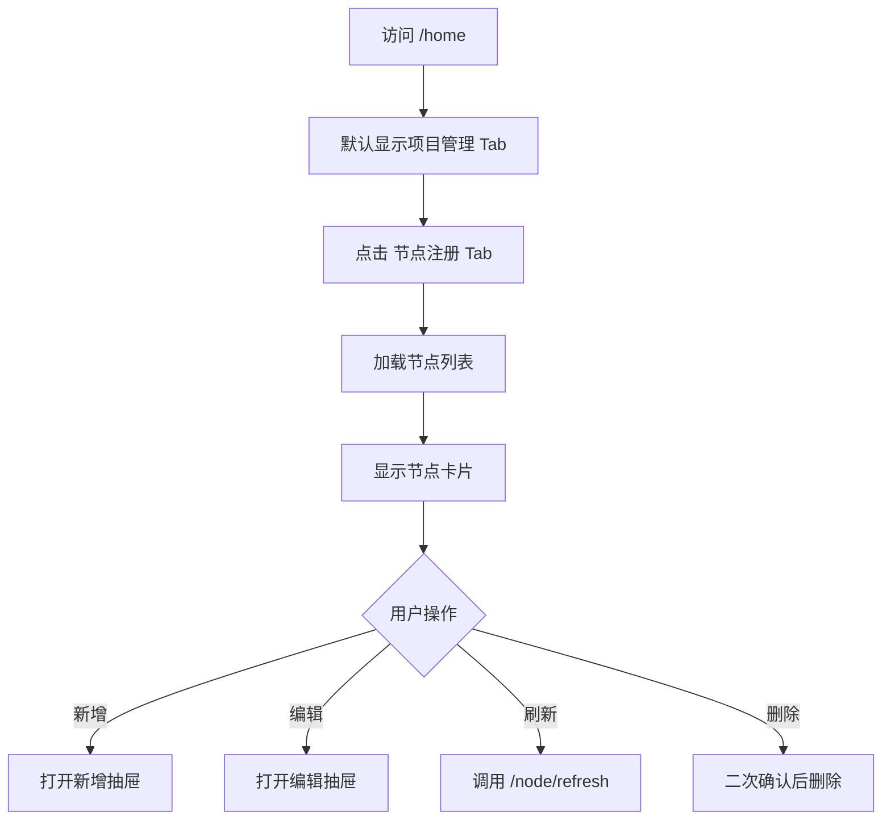

# 03 节点管理

## 3.1 页面：Center 节点注册（/home?tab=node-management）

### 需求背景
CENTER 管理员集中管理已注册的 Kuscia 节点，包括新增、编辑地址、刷新状态、删除。

### 页面流程



### 低保真原型

```textn+------------------------------------------------------------------+
|  首页：节点注册 | 项目管理                                        |
+------------------------------------------------------------------+
|  节点注册                                    [新增节点] [刷新]      |
|  [搜索节点...]  [计算模式 ▼]                                      |
+------------------------------------------------------------------+
|  +------------------------+  +------------------------+          |
|  | [MPC]                  |  | [TEE]                  |          |
|  | 节点 ID: alice         |  | 节点 ID: tee           |          |
|  | 名称: Alice 节点        |  | 名称: TEE Hub          |          |
|  | 地址: 127.0.0.1:8083   |  | 地址: 127.0.0.1:8085   |          |
|  | 状态: Healthy          |  | 状态: Healthy          |          |
|  | [编辑] [删除]          |  | [编辑] [删除]          |          |
|  +------------------------+  +------------------------+          |
+------------------------------------------------------------------+
```

### 元素说明

| 元素 | 类型 | 说明 |
|---|---|---|
| Tab 切换 | Tabs | 节点注册 / 项目管理 |
| 搜索框 | Input | 按节点 ID/名称过滤 |
| 计算模式过滤 | Select | 全部 / MPC / TEE / MPC&TEE |
| 节点卡片 | Card | 显示节点关键信息与操作 |
| 新增节点 | Primary Button | 打开新增抽屉 |
| 刷新 | Icon Button | 刷新所有节点状态 |
| 编辑 | Text Button | 打开编辑抽屉 |
| 删除 | Text Danger Button | 删除节点 |

### 新增/编辑节点抽屉

```textn+--------------------------------------------------+
|  新增节点                                 [X]      |
+--------------------------------------------------+
|  节点 ID *                                       |
|  [________________________]                      |
|  名称 *                                          |
|  [________________________]                      |
|  通讯地址 *                                      |
|  [________________________]                      |
|  节点类型 *                                      |
|  ( ) MPC    ( ) TEE    ( ) MPC & TEE            |
|  描述                                            |
|  [                                              ] |
|  证书                                            |
|  [                                              ] |
|  私钥                                            |
|  [                                              ] |
|                                                  |
|  [取消] [确定]                                   |
+--------------------------------------------------+
```

### 字段规则

| 字段 | 必填 | 规则 |
|---|---|---|
| 节点 ID | 是 | 唯一，长度 2-64，允许字母/数字/中划线/下划线 |
| 名称 | 是 | 长度 2-64 |
| 通讯地址 | 是 | 合法的 host:port 或 URL |
| 节点类型 | 是 | MPC / TEE / MPC&TEE |
| 描述 | 否 | 长度 0-256 |
| 证书 | 条件必填 | 部分类型需要 |
| 私钥 | 条件必填 | 部分类型需要 |

### 交互说明

| 操作 | 反馈 |
|---|---|
| 新增节点 | 表单校验通过后提交，成功后列表刷新 |
| 编辑通讯地址 | 保存后状态重新检测 |
| 刷新状态 | 单节点或批量刷新，显示 loading |
| 删除节点 | 二次确认，校验通过后删除 |

### 异常与边界

| 场景 | 处理 |
|---|---|
| 节点 ID 重复 | 表单校验提示 |
| 地址格式错误 | 表单校验提示 |
| 内置节点删除 | 禁用删除，Tooltip 说明 |
| 节点有运行中任务 | 删除失败，提示先停止任务 |

### 权限说明
- 仅 CENTER 平台可见。
- CENTER 下的 EDGE 子账号隐藏此 Tab。

---

## 3.2 页面：英文节点管理（/nodes）

### 需求背景
新增的中心节点管理页，字段更轻量，面向国际化用户。

### 低保真原型

```textn+------------------------------------------------------------------+
|  Nodes                                        [Add] [Refresh]      |
|  [Search...]                                                       |
+------------------------------------------------------------------+
|  Node ID | Name     | Address        | Type | Status  | Actions   |
|  --------|----------|----------------|------|---------|-----------|
|  alice   | Alice    | 127.0.0.1:8083 | MPC  | Healthy | Edit Del  |
|  bob     | Bob      | 127.0.0.1:8084 | MPC  | Healthy | Edit Del  |
|  tee     | TEE Hub  | 127.0.0.1:8085 | TEE  | Healthy | Edit Del  |
+------------------------------------------------------------------+
```

### 字段说明

| 字段 | 说明 |
|---|---|
| Node ID | 节点唯一标识 |
| Name | 显示名称 |
| Address | 通讯地址 |
| Type | MPC / TEE / TRUSTED |
| Status | Healthy / UnHealthy / Unknown |
| Actions | Edit / Delete |

### 业务规则
同 Center 节点注册。

---

## 3.3 页面：我的节点（/my-node）

### 需求背景
让机构管理员查看并维护当前机构所属节点的基本信息、实例状态和认证信息。

### 低保真原型

```textn+------------------------------------------------------------------+
|  我的节点                                          [切换节点 ▼]   |
+------------------------------------------------------------------+
|  +----------------------------------------------------------+    |
|  | 节点基础信息                          [编辑通讯地址]      |    |
|  | 节点 ID: alice                                            |    |
|  | 通讯地址: 127.0.0.1:8083       协议: mTLS                |    |
|  | 证书配置: 已配置                                          |    |
|  | 公钥: **************************************** [复制]      |    |
|  | 认证码: **************************************** [复制]    |    |
|  | Token: **************************************** [重新生成] |    |
|  +----------------------------------------------------------+    |
|  +----------------------------------------------------------+    |
|  | 节点实例列表                                              |    |
|  | HostName | 状态 | 系统版本 | 创建时间 | 最后心跳         |    |
|  | -------- | ---- | -------- | -------- | --------         |    |
|  | alice-1  | 在线 | v1.15.0  | ...      | 10s 前           |    |
|  +----------------------------------------------------------+    |
+------------------------------------------------------------------+
```

### 元素说明

| 元素 | 类型 | 说明 |
|---|---|---|
| 切换节点 | Select | AUTONOMY 模式下切换节点 |
| 节点基础信息 | Card | 展示节点 ID、地址、协议、证书状态 |
| 公钥/认证码/Token | Copyable Text | 一键复制，Token 支持重新生成 |
| 节点实例列表 | Table | 展示实例状态、版本、心跳 |

### 字段规则

| 字段 | 说明 |
|---|---|
| 通讯地址 | 可编辑，保存时校验格式 |
| Token | 重新生成后旧 Token 失效 |

### 交互说明

| 操作 | 反馈 |
|---|---|
| 编辑通讯地址 | 保存后刷新节点状态 |
| 复制公钥/认证码/Token | Toast 提示“已复制” |
| 重新生成 Token | 二次确认，成功后显示新 Token |
| 切换节点 | 重载全部数据 |

### 异常与边界

| 场景 | 处理 |
|---|---|
| Token 重新生成失败 | 提示错误，保留旧 Token |
| 地址保存失败 | 保留原地址，提示错误 |

### 权限说明
- 需要 URL 带 `ownerId` 或 `basic-node-auth`。
- AUTONOMY/EDGE/CENTER 中具备节点视角的账号可访问。
