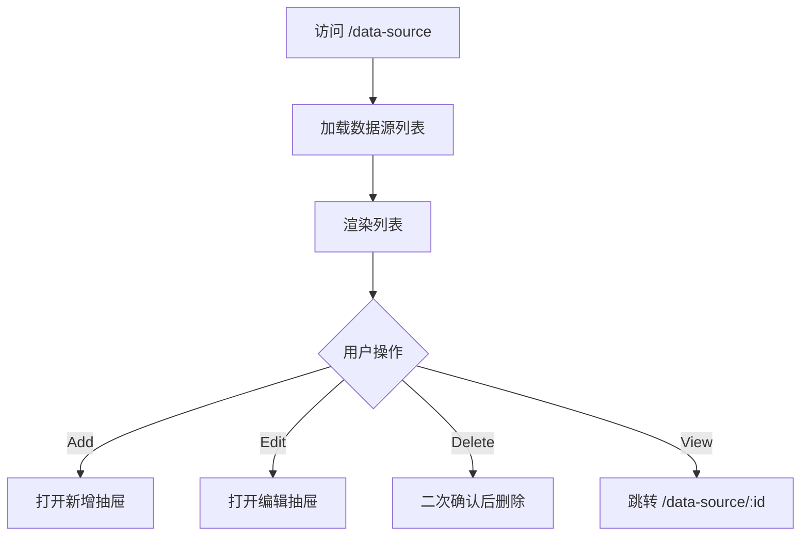

# 04 数据与数据源

## 4.1 页面：英文数据源管理（/data-source）

### 需求背景
CENTER 管理员集中管理多类型数据源，供数据表创建使用。

### 页面流程



### 低保真原型

```textn+------------------------------------------------------------------+
|  Data Sources                                 [Add] [Refresh]      |
|  [Search...]  [Type ▼]                                             |
+------------------------------------------------------------------+
|  Name    | Type  | Created      | Modified     | Definition | Act |
|  --------|-------|--------------|--------------|------------|-----|
|  mysql_1 | MySQL | 2024-01-15   | 2024-01-20   | {...}      | E D |
|  oss_1   | OSS   | 2024-01-10   | 2024-01-10   | {...}      | E D |
+------------------------------------------------------------------+
```

### 新增/编辑数据源抽屉

```textn+--------------------------------------------------+
|  Add Data Source                          [X]      |
+--------------------------------------------------+
|  Name *                                          |
|  [________________________]                      |
|  Type *                                          |
|  [Select            ▼]                           |
|  Definition (JSON) *                             |
|  +------------------------------------------+      |
|  | {                                        |      |
|  |   "host": "...",                         |      |
|  |   "port": 3306,                          |      |
|  |   "database": "..."                      |      |
|  | }                                        |      |
|  +------------------------------------------+      |
|                                                  |
|  [Cancel] [OK]                                   |
+--------------------------------------------------+
```

### 字段规则

| 字段 | 必填 | 规则 |
|---|---|---|
| Name | 是 | 节点内唯一，长度 2-64 |
| Type | 是 | OSS / ODPS / MySQL / HTTP / LOCAL |
| Definition | 是 | JSON 格式，根据类型校验必填字段 |

### 交互说明

| 操作 | 反馈 |
|---|---|
| 新增/编辑 | JSON 校验通过后提交，成功后刷新列表 |
| 删除 | 有关联数据表时禁用并提示 |
| 查看详情 | 跳转详情页展示完整 Definition |

### 权限说明
- 仅 CENTER 平台可见。

---

## 4.2 页面：英文数据表管理（/data-table）

### 需求背景
CENTER 管理员管理数据表元数据，包括创建、编辑、删除、查看 Schema。

### 低保真原型

```textn+------------------------------------------------------------------+
|  Data Tables                                  [Add] [Refresh]      |
|  [Search...]  [Node ▼]                                             |
+------------------------------------------------------------------+
|  Name    | Data Source | Node  | Description | Created    | Act   |
|  --------|-------------|-------|-------------|------------|-------|
|  user    | local_csv   | alice | 用户特征    | 2024-01-15 | Auth D|
|  order   | mysql_1     | bob   | 订单表      | 2024-01-14 | Auth D|
+------------------------------------------------------------------+
```

### 新增/编辑数据表抽屉

```textn+--------------------------------------------------+
|  Add Data Table                           [X]      |
+--------------------------------------------------+
|  Name *                                          |
|  [________________________]                      |
|  Data Source *                                   |
|  [Select            ▼]                           |
|  Node *                                          |
|  [Select            ▼]                           |
|  Description                                     |
|  [                                              ] |
|  Schema (JSON) *                                 |
|  +------------------------------------------+      |
|  | [                                       |      |
|  |   {"name":"id","type":"int"},            |      |
|  |   {"name":"age","type":"int"}            |      |
|  | ]                                       |      |
|  +------------------------------------------+      |
|                                                  |
|  [Cancel] [OK]                                   |
+--------------------------------------------------+
```

### 字段规则

| 字段 | 必填 | 规则 |
|---|---|---|
| Name | 是 | 节点内唯一，长度 2-64 |
| Data Source | 是 | 选择已注册数据源 |
| Node | 是 | 选择数据源归属节点 |
| Description | 否 | 长度 0-256 |
| Schema | 是 | JSON 数组，每项含 name、type、comment |

### 交互说明

| 操作 | 反馈 |
|---|---|
| 新增/编辑 | 校验通过后提交 |
| 删除 | 已授权项目时禁用删除 |
| 授权管理 | 打开授权抽屉 |

### 权限说明
- 仅 CENTER 平台可见。

---

## 4.3 页面：中文 Edge 数据源管理（/edge?tab=data-source）

### 需求背景
EDGE/AUTONOMY 用户在边缘节点注册数据源。

### 低保真原型

```textn+------------------------------------------------------------------+
|  Edge 工作台                                                         |
|  工作台 | 数据源管理 | 数据管理 | 合作节点 | 我的项目 | 结果管理   |
+------------------------------------------------------------------+
|  数据源管理                                          [注册数据源]   |
|  [类型 ▼] [状态 ▼] [搜索...]                                       |
+------------------------------------------------------------------+
|  名称      | 类型    | 状态      | 创建时间    | 操作              |
|  ---------|--------|----------|------------|------------------|
|  csv_local| LOCAL  | Available| 2024-01-15 | 查看 删除         |
|  mysql_1  | MySQL  | Available| 2024-01-14 | 查看 删除         |
+------------------------------------------------------------------+
```

### 业务规则
- 数据源类型：OSS / HTTP / ODPS / MYSQL / LOCAL。
- 删除前校验无关联数据表。

---

## 4.4 页面：中文 Edge 数据管理（/edge?tab=data-management、/node?tab=table）

### 需求背景
管理节点上的数据表，包括添加、授权、删除、刷新状态、加密上传 TEE。

### 低保真原型

```textn+------------------------------------------------------------------+
|  数据管理                                            [添加数据]     |
|  [搜索...] [状态 ▼] [数据源类型 ▼]                                  |
+------------------------------------------------------------------+
|  表名    | 数据源类型 | 已授权项目 | 所属节点 | 状态      | 操作   |
|  --------|-----------|-----------|---------|----------|--------|
|  user    | LOCAL     | 项目A      | alice   | Available| 授权 删|
|  order   | MySQL     | 项目A,B    | bob     | Available| 授权 删|
+------------------------------------------------------------------+
|  加密上传状态：上传中 / 成功 / 失败 / 重新上传                      |
+------------------------------------------------------------------+
```

### 授权管理抽屉

```textn+--------------------------------------------------+
|  授权管理                                 [X]      |
+--------------------------------------------------+
|  数据表：user                                      |
|                                                  |
|  已授权项目：                                      |
|  [✓] 项目 A                                       |
|  [ ] 项目 B                                       |
|  [✓] 项目 C                                       |
|                                                  |
|  [取消] [保存]                                    |
+--------------------------------------------------+
```

### 添加数据抽屉

```textn+--------------------------------------------------+
|  添加数据                                 [X]      |
+--------------------------------------------------+
|  数据源 *                                         |
|  [Select            ▼]                           |
|  数据表名称 *                                     |
|  [________________________]                      |
|  描述                                            |
|  [                                              ] |
|  Schema（自动识别/手动编辑）                      |
|  +------------------------------------------+      |
|  | ...                                     |      |
|  +------------------------------------------+      |
|                                                  |
|  [取消] [确定]                                   |
+--------------------------------------------------+
```

### 字段规则

| 字段 | 必填 | 规则 |
|---|---|---|
| 数据源 | 是 | 选择已注册数据源 |
| 数据表名称 | 是 | 节点内唯一 |
| 描述 | 否 | 长度 0-256 |
| Schema | 是 | 自动识别后允许手动修正 |

### 交互说明

| 操作 | 反馈 |
|---|---|
| 添加数据 | 打开抽屉，选择数据源后自动识别 Schema |
| 授权管理 | 勾选/取消项目，保存后调用 Kuscia Grant |
| 删除 | 已授权项目禁用删除 |
| 刷新状态 | 从 Kuscia 同步状态 |
| 加密上传到 TEE | 仅 LOCAL 类型可用，显示上传进度 |

### 异常与边界

| 场景 | 处理 |
|---|---|
| Schema 自动识别失败 | 提示手动填写 |
| 授权保存失败 | 回滚勾选状态或提示错误 |
| 上传 TEE 失败 | 显示失败原因，支持重试 |

### 权限说明
- EDGE 平台可见 `/edge?tab=data-management`。
- `/node?tab=table` 需要 `edge-auth`。
