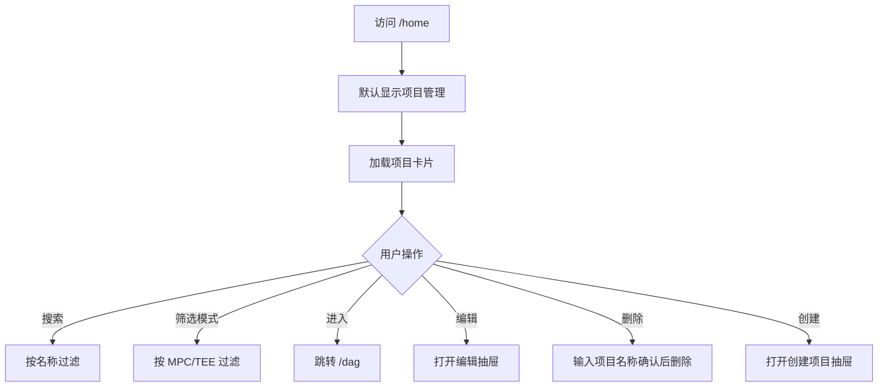

# 05 项目管理

## 5.1 页面：Center 项目列表（/home?tab=project-management）

### 需求背景
CENTER 管理员以卡片方式浏览和管理所有项目，快速进入项目空间。

### 页面流程



### 低保真原型

```textn+------------------------------------------------------------------+
|  首页：节点注册 | 项目管理                                        |
+------------------------------------------------------------------+
|  项目管理                                    [创建项目]            |
|  [搜索项目...]  [计算模式 ▼]                                      |
+------------------------------------------------------------------+
|  +----------------------+  +----------------------+              |
|  | 反欺诈联邦建模         |  | 广告联合统计         |              |
|  | [MPC 管道]            |  | [TEE 枢纽]           |              |
|  | 参与节点: 3           |  | 参与节点: 2          |              |
|  | 训练流: 5  任务: 12   |  | 训练流: 2  任务: 8   |              |
|  | 2024-01-15            |  | 2024-01-10           |              |
|  | [进入] [编辑] [删除]  |  | [进入] [编辑] [删除] |              |
|  +----------------------+  +----------------------+              |
+------------------------------------------------------------------+
```

### 元素说明

| 元素 | 类型 | 说明 |
|---|---|---|
| Tab 切换 | Tabs | 节点注册 / 项目管理 |
| 搜索框 | Input | 按项目名称搜索 |
| 计算模式过滤 | Select | 全部 / 管道 / 枢纽 |
| 项目卡片 | Card | 名称、模式标签、统计、操作 |
| 创建项目 | Primary Button | 打开创建项目抽屉 |
| 进入 | Primary Button | 跳转 `/dag?projectId=...` |
| 编辑 | Text Button | 打开编辑抽屉 |
| 删除 | Text Danger Button | 删除项目 |

### 创建/编辑项目抽屉

```textn+--------------------------------------------------+
|  创建项目                                 [X]      |
+--------------------------------------------------+
|  步骤 1：基础信息                                  |
|  项目名称 *                                       |
|  [________________________]                      |
|  项目描述                                         |
|  [                                              ] |
|  计算模式 *                                       |
|  ( ) MPC 管道      ( ) TEE 枢纽                   |
|  训练流模板                                       |
|  [Select            ▼]                           |
|                                                  |
|  [下一步]                                         |
|                                                  |
|  步骤 2：选择参与节点                               |
|  [✓] alice                                        |
|  [✓] bob                                          |
|  [ ] tee                                          |
|                                                  |
|  [上一步] [创建]                                  |
+--------------------------------------------------+
```

### 字段规则

| 字段 | 必填 | 规则 |
|---|---|---|
| 项目名称 | 是 | 唯一，长度 2-64 |
| 项目描述 | 否 | 长度 0-256 |
| 计算模式 | 是 | MPC 管道 / TEE 枢纽 |
| 训练流模板 | 否 | 选择后预置 DAG 节点 |
| 参与节点 | 是 | 至少选择 1 个，需与计算模式匹配 |

### 交互说明

| 操作 | 反馈 |
|---|---|
| 进入项目 | 跳转 `/dag?projectId=xxx` |
| 编辑 | 仅可修改名称/描述/参与节点（受后端限制） |
| 删除 | 弹窗要求输入项目名称确认 |
| 创建 | 成功后刷新列表，可选进入项目 |

### 异常与边界

| 场景 | 处理 |
|---|---|
| 项目名称重复 | 表单校验提示 |
| 计算模式与节点类型不匹配 | 表单校验提示 |
| 项目下有画布/任务 | 删除失败提示 |
| 项目已归档 | 隐藏编辑/删除入口 |

### 权限说明
- 仅 CENTER 平台可见。
- CENTER 下的 EDGE 子账号只能看到被授权项目。

---

## 5.2 页面：P2P 我的项目（/edge?tab=my-project）

### 需求背景
AUTONOMY/EDGE 用户管理自己发起或参与的项目，处理项目状态与授权进度。

### 低保真原型

```textn+------------------------------------------------------------------+
|  Edge 工作台                                                         |
|  工作台 | 数据源管理 | 数据管理 | 合作节点 | 我的项目 | 结果管理   |
+------------------------------------------------------------------+
|  我的项目                                                          |
|  [我发起的] [我处理的] [全部]   [状态 ▼] [计算模式 ▼] [搜索...]      |
+------------------------------------------------------------------+
|  +----------------------+  +----------------------+              |
|  | 医疗联合研究           |  | 广告联合统计         |              |
|  | [MPC 管道]            |  | [TEE 枢纽]           |              |
|  | 状态: 审核中          |  | 状态: 已通过          |              |
|  | 授权: 2/3 待通过      |  |                      |              |
|  | 参与机构: 3           |  | 参与机构: 2          |              |
|  | 训练流: 1  任务: 4    |  | 训练流: 2  任务: 8   |              |
|  | [进入] [编辑] [归档]  |  | [进入] [归档]        |              |
|  +----------------------+  +----------------------+              |
+------------------------------------------------------------------+
```

### 元素说明

| 元素 | 类型 | 说明 |
|---|---|---|
| Tab | Tabs | 我发起的 / 我处理的 / 全部 |
| 状态筛选 | Select | 全部 / 已归档 / 审核中 |
| 计算模式筛选 | Select | 全部 / 管道 / 枢纽 |
| 项目卡片 | Card | 名称、状态标签、授权进度、统计、操作 |
| 进入 | Primary Button | 跳转 `/dag` |
| 编辑 | Text Button | 仅发起方且未归档可编辑 |
| 归档 | Text Button | 发起归档审批 |

### 字段规则

| 字段 | 说明 |
|---|---|
| 状态 | 审核中 / 已通过 / 已归档 / 已拒绝 |
| 授权进度 | 已通过机构数 / 总机构数 |

### 交互说明

| 操作 | 反馈 |
|---|---|
| 进入 | 跳转项目空间 |
| 编辑 | 打开编辑抽屉 |
| 归档 | 发起归档投票，项目状态变为审核中 |

### 业务规则
- 仅项目发起方可编辑项目信息。
- 归档项目不可编辑。
- 项目创建后进入 `REVIEWING` 状态，所有受邀机构同意后变为 `APPROVED`。

### 权限说明
- 需要 `basic-node-auth` + `p2p-edge-center-auth`。
