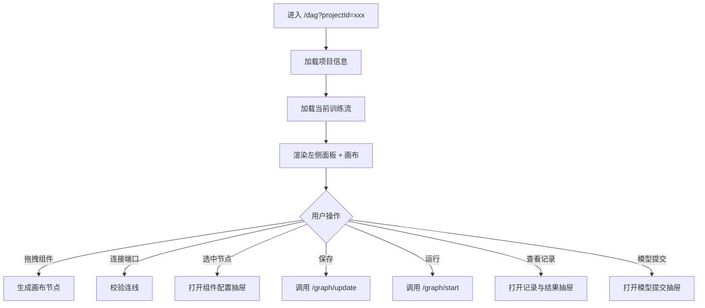

# 06 DAG 画布

## 页面：/dag（项目空间）

### 需求背景
提供可视化、交互式的隐私计算训练流编排环境，支持拖拽组件、配置参数、连接节点、运行调试与结果查看。

### 页面流程



### 低保真原型

```textn+------------------------------------------------------------------+
|  项目：反欺诈联邦建模    项目数据 | 模型训练 | 模型管理 | 周期任务  |
+------+------------------------------------------+------------------+
|      |                                          |                  |
| 左   |                                          | 右               |
| 侧   |           DAG 画布                        | 侧               |
| 面   |                                          | 抽屉             |
| 板   |    +---------+      +---------+         |                  |
|      |    | 读数据   |----->| 特征工程 |         |  组件：样本读取   |
| 训练流|    +---------+      +---------+         |  - 数据表: user  |
| 组件库|          |              |               |  - 列选择...     |
| 数据集|          v              v               |                  |
|      |    +---------+      +---------+         |  [保存] [取消]   |
|      |    | 联邦训练 |----->| 模型评估 |         |                  |
|      |    +---------+      +---------+         |                  |
|      |                                          |                  |
|      |  [保存] [运行] [停止] [撤销] [适应] [+/-]|                  |
+------+------------------------------------------+------------------+
```

### 顶部二级菜单

| 菜单 | 可见条件 | 说明 |
|---|---|---|
| 项目数据 | CENTER / AUTONOMY | 管理项目已授权数据表 |
| 模型训练 | CENTER / AUTONOMY | DAG 画布入口 |
| 模型管理 | CENTER / AUTONOMY，仅 MPC | 模型包生命周期管理 |
| 周期任务 | CENTER / AUTONOMY，仅 MPC | 定时调度管理 |

### 左侧面板

#### 训练流树
- 当前项目下所有训练流列表。
- 右键/操作：创建、重命名、复制、删除、导出。
- 当前训练流高亮。
- 非本方创建的训练流仅可查看。

#### 组件库
- 按分类目录树展示组件（数据读写、特征工程、统计、联邦学习、模型评估等）。
- 搜索框支持按组件名/中文名搜索。
- 拖拽组件到画布。
- Hover 显示组件文档说明。

#### 数据集
- 展示当前项目已授权的数据表。
- 拖拽数据表到画布，自动生成读数据节点。

### 画布区域

#### 节点
- 节点外观：图标 + 组件名 + 状态色环。
- 节点状态色：
  - 灰色：未运行
  - 蓝色：运行中
  - 绿色：成功
  - 红色：失败
  - 橙色：已停止
- 支持拖拽、缩放、多选、框选。

#### 连线
- 从输出端口拖拽到输入端口建立连接。
- 连接校验：数据类型匹配、禁止自环、禁止重复连接。
- 选中连线按 Delete 删除。

#### 顶部工具栏

| 按钮 | 功能 |
|---|---|
| 保存 | 持久化当前画布 |
| 运行 | 按选中节点拓扑运行 |
| 停止 | 停止当前运行中的作业 |
| 放大/缩小 | 画布缩放 |
| 适应屏幕 | 自动缩放到全部节点可见 |
| 撤销/重做 | 操作历史回退 |
| 高级配置 | 打开全局运行配置抽屉 |
| 周期任务 | 打开周期任务入口 |
| 模型提交 | 打开模型提交抽屉 |

### 右侧抽屉

#### 组件配置抽屉
- 组件类型、版本、ID。
- 参数表单：根据组件元数据动态渲染。
- 支持自定义渲染项（如分箱修改、线性模型参数）。
- 支持模板快速配置。

#### 记录与结果抽屉
- 展示当前训练流的执行记录列表。
- 点击记录查看 DAG 快照与节点输出。

#### 模型提交抽屉
- 选择要提交的模型组件。
- 显示提交进度。
- 退出时提示会中断提交进程。

#### 日志抽屉
- 查看任务/节点日志。
- 支持 SLS/ELK 等外部日志跳转。

### 字段规则

| 字段 | 说明 |
|---|---|
| 节点 ID | 自动生成，格式 `{codeName}_{maxIndex+1}` |
| 节点名称 | 默认组件名，可编辑 |
| 输入/输出 | 根据组件元数据渲染端口 |
| 参数 | 组件定义中的 attrs，按类型渲染 |

### 交互说明

| 操作 | 反馈 |
|---|---|
| 拖拽组件到画布 | 生成默认节点，自动分配 ID 与序号 |
| 连接节点 | 类型不匹配时连线失败并 Toast 提示 |
| 保存 | 成功/失败 Toast，失败保留编辑状态 |
| 运行 | 弹出确认，开始轮询任务状态 |
| 运行失败 | 失败节点红色高亮，抽屉展示错误日志 |
| 停止 | 停止后运行中节点变为 STOPPED |
| 双击节点 | 打开组件配置抽屉 |
| 框选 + Delete | 批量删除节点及其连线 |

### 异常与边界

| 场景 | 处理 |
|---|---|
| 画布加载失败 | 显示错误，提供重试 |
| 运行前校验失败 | 高亮问题节点，提示原因 |
| 运行中网络断开 | 恢复后重新轮询状态 |
| 保存冲突 | 提示画布已被他人修改，提供覆盖/刷新 |

### 业务规则
- 画布编辑权限受 `ProjectEditService` 控制，受平台类型、归档状态、训练流创建方影响。
- 只有已授权到项目的数据表才会出现在数据集面板。
- 运行前校验节点与路由健康。
- 选中节点运行只运行该节点及其上游依赖；未选中则运行整个画布。
- 内置组件（如读数据表）在 JobChain 中直接标记成功，不提交到 Kuscia。

### 权限说明
- 需要 `p2p-center-auth` + `component-wrapper`。
- 归档项目不可编辑画布。
- P2P 模式下非本方创建的训练流仅可查看。

---

## 关联页面

### 执行记录（/record）
- 展示某次执行后的 DAG 快照。
- 只读，不可编辑节点。
- 支持查看组件日志与输出。

### 模型提交（/model-submission）
- 从 DAG 画布跳转，选择模型组件打包提交。
- 提交过程中禁止关闭或刷新页面。

### 周期任务详情（/periodic-task-detail）
- 展示某次周期调度任务的执行结果 DAG。
- 只读。
