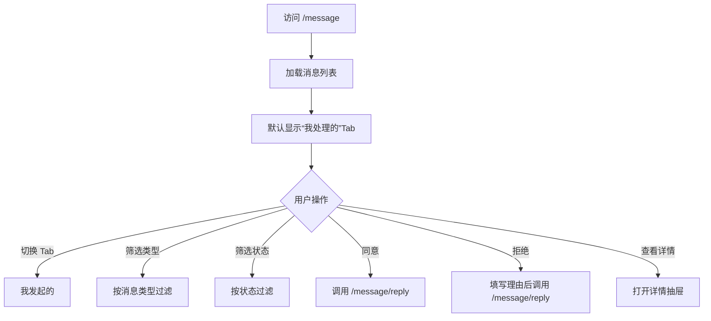

# 07 消息与审批

## 页面：/message

### 需求背景
集中展示项目邀约、数据授权、节点合作、TEE 下载、项目归档等需要用户处理的投票与通知，支持同意/拒绝操作。

### 页面流程



### 低保真原型

```textn+------------------------------------------------------------------+
|  消息中心                                          [未处理: 3]     |
|  [我处理的] [我发起的]                                             |
|  类型：[全部 ▼]  状态：[全部 ▼]  [搜索...]                          |
+------------------------------------------------------------------+
|  标题                  | 发起方 | 接收方 | 时间       | 状态 | 操作 |
|  ---------------------|--------|--------|-----------|------|------|
|  邀请你加入项目 A       | Alice  | Bob    | 2024-01-15| 待处理| 同意 拒绝 |
|  请求授权数据表 user    | Bob    | Alice  | 2024-01-14| 已同意| 查看 |
|  节点合作请求           | Alice  | Tee    | 2024-01-13| 已拒绝| 查看 |
|  TEE 结果下载审批       | Bob    | Alice  | 2024-01-12| 待处理| 同意 拒绝 |
+------------------------------------------------------------------+
```

### 元素说明

| 元素 | 类型 | 说明 |
|---|---|---|
| Tab | Tabs | 我处理的 / 我发起的 |
| 类型筛选 | Select | 项目邀约、项目归档、数据授权、节点合作、TEE 下载等 |
| 状态筛选 | Select | 全部 / 待处理 / 已处理 |
| 搜索框 | Input | 按标题/发起方搜索 |
| 消息列表 | Table | 标题、发起方、接收方、时间、状态、操作 |
| 同意 | Primary Button | 提交同意 |
| 拒绝 | Danger Button | 弹出拒绝理由输入 |
| 查看 | Text Button | 打开详情抽屉 |

### 消息详情抽屉

```textn+--------------------------------------------------+
|  消息详情                                 [X]      |
+--------------------------------------------------+
|  类型：项目邀约                                    |
|  发起方：Alice                                     |
|  接收方：Bob                                       |
|  时间：2024-01-15 10:00                            |
|  状态：待处理                                      |
|                                                  |
|  投票进度：                                        |
|  Alice    [已同意]                                 |
|  Bob      [待处理]                                 |
|  Charlie  [已同意]                                 |
|                                                  |
|  拒绝理由：                                        |
|  [                                              ] |
|                                                  |
|  [拒绝] [同意]                                    |
+--------------------------------------------------+
```

### 字段规则

| 字段 | 说明 |
|---|---|
| 标题 | 根据投票类型与资源生成 |
| 发起方 | 投票发起人所属机构/用户 |
| 接收方 | 当前用户/机构 |
| 状态 | 待处理 / 已同意 / 已拒绝 |
| 投票进度 | 各参与方状态 |
| 拒绝理由 | 拒绝时必填，长度 2-256 |

### 交互说明

| 操作 | 反馈 |
|---|---|
| 同意 | 提交签名回复，刷新列表与未处理数 |
| 拒绝 | 弹窗/抽屉填写理由后提交 |
| 查看详情 | 打开详情抽屉，展示投票进度 |
| 切换 Tab/筛选 | 列表重新加载 |

### 异常与边界

| 场景 | 处理 |
|---|---|
| 重复提交 | 按钮禁用，避免重复投票 |
| 投票已结束 | 隐藏操作按钮，仅可查看 |
| 签名验证失败 | 提示“投票信息校验失败” |

### 业务规则
- 未处理消息数显示在顶部 Header 铃铛上，实时或定时刷新。
- 项目创建投票需所有受邀机构同意，项目才变为 `APPROVED`。
- 任一机构拒绝则项目进入 `ARCHIVED` / `REJECTED`。
- 节点路由、数据授权、TEE 下载等投票有独立的 Handler 与状态机。

### 权限说明
- 需要 `basic-node-auth` + `p2p-edge-center-auth` + `component-wrapper`。
