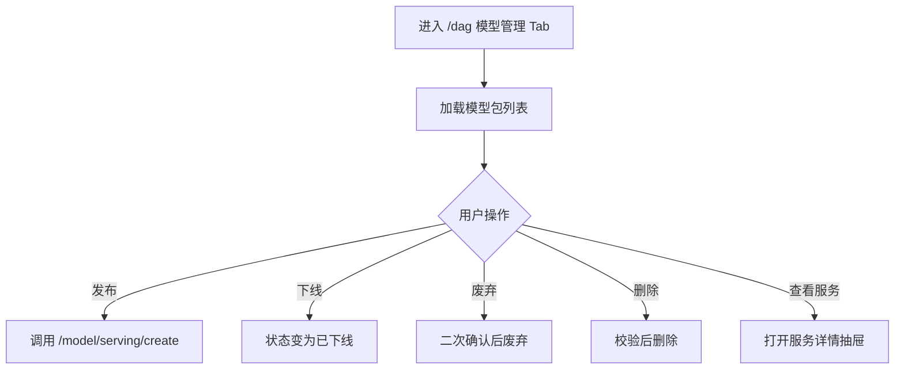

# 08 模型与结果

## 8.1 页面：模型管理（/dag → 顶部“模型管理”）

### 需求背景
展示当前项目下训练得到的模型包，支持发布、下线、废弃、删除等全生命周期管理。

### 页面流程



### 低保真原型

```textn+------------------------------------------------------------------+
|  模型管理                                                          |
|  [搜索...]  [状态 ▼]                                               |
+------------------------------------------------------------------+
|  Name        | ID | Description | Status   | Submit Time | Actions |
|  ------------|----|-------------|----------|-------------|---------|
|  联邦 LR     | m1 | 逻辑回归    | 已发布   | 2024-01-15  | 下线 废弃 删除 服务 |
|  XGB 反欺诈  | m2 | XGBoost     | 待发布   | 2024-01-14  | 发布 废弃 删除      |
|  NN 分类     | m3 | 神经网络    | 发布失败 | 2024-01-13  | 发布 废弃 删除      |
+------------------------------------------------------------------+
```

### 模型服务详情抽屉

```textn+--------------------------------------------------+
|  模型服务详情                             [X]      |
+--------------------------------------------------+
|  模型名称：联邦 LR                                 |
|  服务状态：已发布                                  |
|  访问地址：http://...                              |
|  资源配置：                                        |
|    内存：4G                                        |
|    CPU：2                                          |
|  模型路径：/model/m1                               |
|  特征配置：...                                     |
|  样本表：...                                       |
|                                                  |
|  [删除服务]                                       |
+--------------------------------------------------+
```

### 字段规则

| 字段 | 说明 |
|---|---|
| 模型名称 | 训练时指定或默认生成 |
| ID | 模型包唯一标识 |
| 描述 | 可编辑 |
| 状态 | 待发布 / 发布中 / 已发布 / 已下线 / 已废弃 / 发布失败 |
| 提交时间 | 模型提交到模型管理的时间 |

### 交互说明

| 操作 | 反馈 |
|---|---|
| 发布 | 状态变为“发布中”，成功后“已发布” |
| 下线 | 状态变为“已下线”，服务不可用 |
| 废弃 | 二次确认，状态变为“已废弃” |
| 删除 | 校验无服务后删除 |
| 查看服务 | 打开服务详情抽屉 |

### 业务规则
- P2P 模式下仅模型 owner 可发布。
- 已归档项目不可发布模型。
- 发布中的模型不可重复发布。

### 权限说明
- 需要 `p2p-center-auth` + `component-wrapper`。
- 受 `ProjectEditService` 控制编辑权限。

---

## 8.2 页面：结果管理（/edge?tab=result、/node?tab=result）

### 需求背景
让数据提供方或建模工程师查看节点上生成的各类结果产物，支持下载与重新获取。

### 低保真原型

```textn+------------------------------------------------------------------+
|  结果管理                                                          |
|  [搜索...]  [类型 ▼]  [来源项目 ▼]  [所属训练流 ▼]                  |
+------------------------------------------------------------------+
|  结果 ID | 类型 | 来源项目 | 训练流 | 节点 | 生成时间 | 状态 | 操作 |
|  --------|------|---------|--------|------|----------|------|------|
|  r_001   | 模型 | 项目A   | g1     | alice| 2024-01-15| 可用 | 下载 |
|  r_002   | 报告 | 项目A   | g1     | bob  | 2024-01-15| 可用 | 下载 |
|  r_003   | 表   | 项目B   | g2     | tee  | 2024-01-14| 可用 | 下载 |
+------------------------------------------------------------------+
```

### 结果详情抽屉

```textn+--------------------------------------------------+
|  结果详情                                 [X]      |
+--------------------------------------------------+
|  结果 ID：r_001                                    |
|  类型：模型                                        |
|  来源项目：反欺诈联邦建模                           |
|  所属训练流：g1                                    |
|  生成时间：2024-01-15 10:00                        |
|  状态：可用                                        |
|                                                  |
|  [DAG 快照预览]                                    |
|  +---------+      +---------+                     |
|  | 读数据  |----->| 联邦训练 |                     |
|  +---------+      +---------+                     |
|                                                  |
|  [下载]                                           |
+--------------------------------------------------+
```

### 字段规则

| 字段 | 说明 |
|---|---|
| 结果 ID | 系统自动生成 |
| 类型 | 规则 / 模型 / 表 / 报告 |
| 来源项目 | 产生该结果的项目 |
| 所属训练流 | 产生该结果的训练流 |
| 所属节点 | 结果存储节点 |
| 生成时间 | 结果产出时间 |
| 状态 | 可用 / 不可用 |

### 交互说明

| 操作 | 反馈 |
|---|---|
| 下载 | 浏览器触发下载，失败时提示 |
| 重新获取 | 从 Kuscia 重新拉取结果元数据 |
| 查看详情 | 打开结果详情抽屉，展示 DAG 快照 |

### 业务规则
- 下载受数据权限与数据源类型限制（如 ODPS 可能不支持直接下载）。
- TEE 结果下载需先完成 TEE 下载审批。
- 结果按来源项目和所属节点隔离展示。

### 权限说明
- EDGE 平台可见 `/edge?tab=result`。
- `/node?tab=result` 需要 `edge-auth`。
