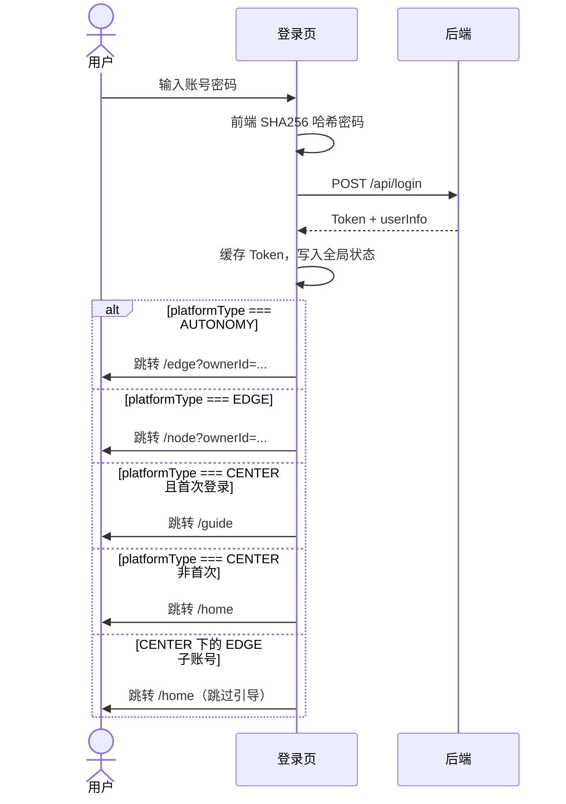
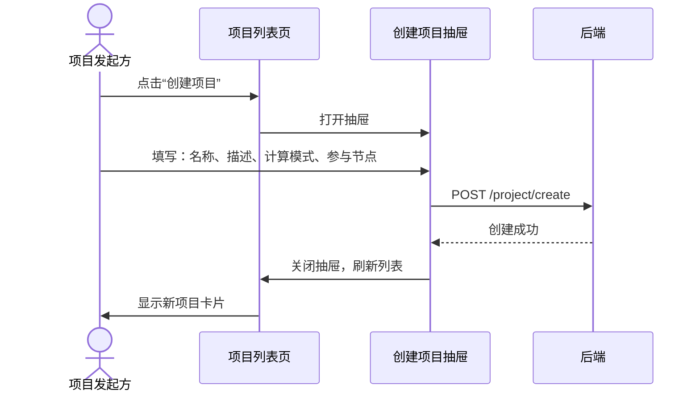
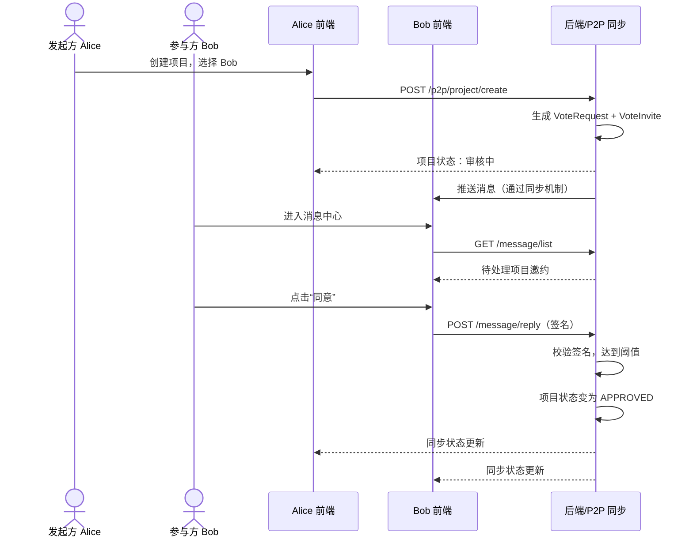
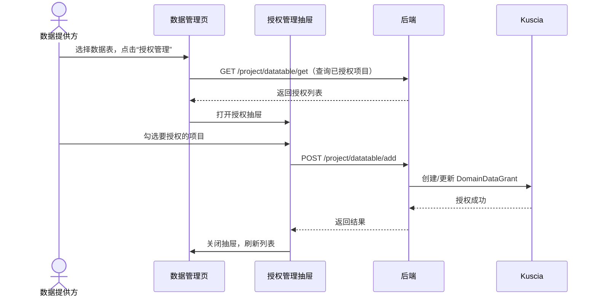
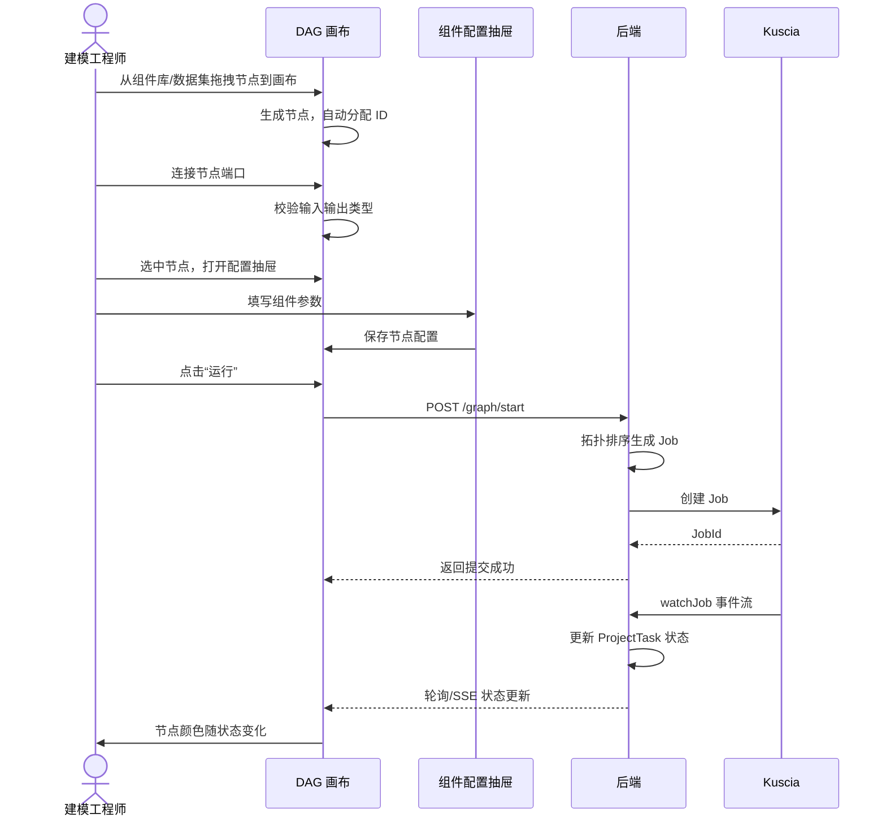
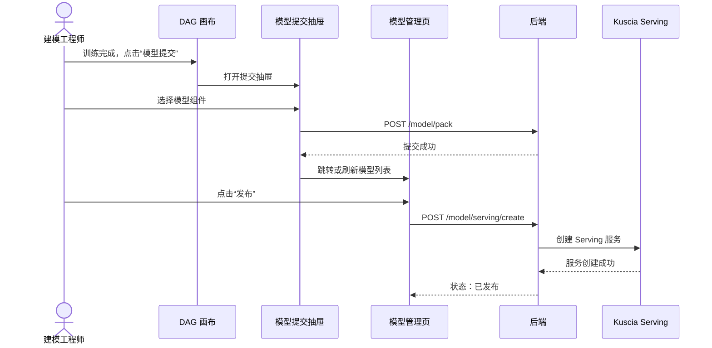
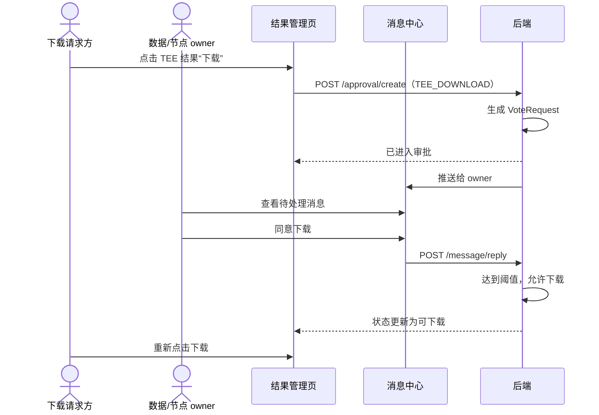

# 10 核心流程

> 本节用 Mermaid 时序图描述 SecretPad 前端最核心的跨页面业务流程。

## 10.1 登录与首页分流

## 10.2 创建项目（CENTER 模式）

## 10.3 P2P 项目创建与审批

## 10.4 数据授权到项目

## 10.5 DAG 编排与运行

## 10.6 模型提交与发布

## 10.7 TEE 结果下载审批

