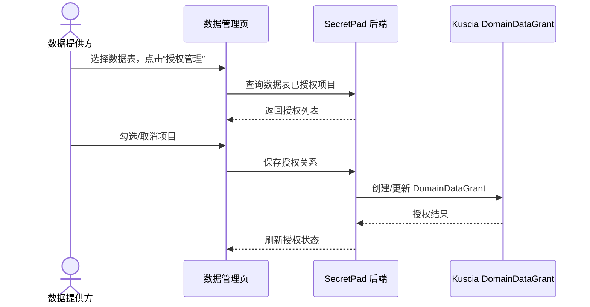

# 页面需求：数据源与数据管理

> 包含数据源管理、数据表管理、数据授权、加密上传 TEE。

## 一、数据源管理

### 1.1 中文 Edge 数据源列表（/edge?tab=data-source）

#### 页面目标
让 EDGE/AUTONOMY 用户注册并管理数据源，供后续创建数据表使用。

#### 主界面元素
- 类型过滤：OSS / HTTP / ODPS / MYSQL。
- 状态过滤。
- 数据源列表：名称、类型、状态、创建时间。
- 操作：注册、删除、查看详情。

#### 业务规则
- 数据源是数据表的“连接信息”，不直接存储数据内容。
- 删除数据源前需校验无关联数据表。

### 1.2 英文数据源管理（/data-source）

#### 页面目标
面向 CENTER 管理员的数据源列表，支持 JSON 定义展示与 CRUD。

#### 主界面元素
- 列表字段：Name、Type、Created Time、Modified Time、Definition JSON。
- 操作：Add / Edit / Delete / View Detail。

#### 新增/编辑数据源表单

| 字段 | 类型 | 必填 | 说明 |
|---|---|---|---|
| Name | Input | 是 | 数据源名称 |
| Type | Select | 是 | OSS / ODPS / MySQL / HTTP / LOCAL 等 |
| Definition | JSON Editor | 是 | 连接串、Bucket、表名等结构化定义 |

---

## 二、数据表管理

### 2.1 中文 Edge 数据管理（/edge?tab=data-management、/node?tab=table）

#### 页面目标
管理节点上的数据表，包括添加、授权、删除、刷新状态、加密上传 TEE。

#### 主界面元素
- 搜索：按表名过滤。
- 状态过滤：Available / UnAvailable。
- 数据表列表：表名、数据源类型、已授权项目、所属节点、状态、加密上传状态。
- 操作：添加数据、授权管理、删除、刷新状态、重新上传。

#### 操作与反馈

| 操作 | 反馈 |
|---|---|
| 添加数据 | 打开 `DataAddDrawer`，选择数据源并填写表元数据 |
| 授权管理 | 打开 `DataTableInfo` 抽屉，勾选要授权的项目 |
| 删除 | 已授权项目则禁用删除，提示先取消授权 |
| 刷新状态 | 从 Kuscia 同步最新 DomainData 状态 |
| 加密上传到 TEE | 仅 LOCAL 类型数据表可用，显示上传中/成功/失败 |

### 2.2 英文数据表管理（/data-table）

#### 主界面元素
- 列表字段：Name、Data Source ID、Node ID、Description、Created/Modified Time、Schema JSON。
- 操作：Add / Edit / Delete。

#### 新增/编辑数据表表单

| 字段 | 类型 | 必填 | 说明 |
|---|---|---|---|
| Name | Input | 是 | 数据表名称 |
| Data Source | Select | 是 | 关联数据源 |
| Node | Select | 是 | 所属节点 |
| Description | TextArea | 否 | 说明 |
| Schema | JSON Editor | 是 | 列名、类型、注释 |

---

## 三、数据授权流程

### 流程图

### 业务规则
- 数据表必须先授权到项目，才能在 DAG 画布的数据集面板中使用。
- 取消授权时，如果该数据表已被 DAG 节点引用，需要给出警告或禁止取消（视后端策略）。
- 已授权的数据表不可删除。

---

## 四、加密上传 TEE

### 页面目标
将本地数据表加密上传到 TEE 节点，供枢纽模式计算使用。

### 主界面元素
- 仅 LOCAL 类型数据表显示“上传”按钮。
- 上传进度/状态：上传中 / 成功 / 失败 / 重新上传。

### 业务规则
- 上传过程调用后端 `/datatable/pushToTee`。
- 上传失败后支持重试。
- 上传成功后数据表状态变为可用于 TEE 计算。
