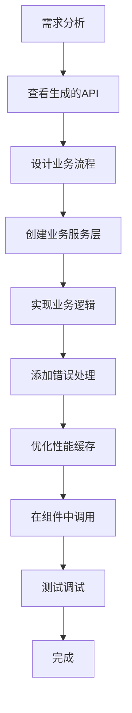

# 前端接口自动生成说明

## 📋 目录

- [概述](#概述)
- [什么是 Swagger 文档](#什么是-swagger-文档)
- [自动生成机制](#自动生成机制)
- [后端配置指南](#后端配置指南)
- [前端配置指南](#前端配置指南)
- [代码生成详解](#代码生成详解)
- [使用示例](#使用示例)
- [重新生成流程](#重新生成流程)
- [最佳实践](#最佳实践)
- [故障排查](#故障排查)
- [常见问题](#常见问题)

---

## 概述

SecretPad 项目采用前后端分离架构，通过 **Swagger/OpenAPI** 规范实现前端 API 客户端的自动生成。这种方式可以：

✅ **减少重复工作**：无需手动编写 API 请求代码  
✅ **保证类型安全**：TypeScript 类型定义与后端 DTO 保持一致  
✅ **提高开发效率**：接口变更后只需重新生成即可  
✅ **降低沟通成本**：标准化的 API 文档作为协作基础  

---

## 什么是 Swagger 文档

### 定义

**Swagger**（现称为 **OpenAPI Specification**）是一种用于描述 RESTful API 的标准化规范。它用机器可读的格式（JSON 或 YAML）详细描述 API 的所有信息：

- API 有哪些接口
- 每个接口的 URL 路径和 HTTP 方法
- 请求参数（类型、是否必填、示例值）
- 响应数据结构
- 认证方式
- 错误码说明

### 核心作用

1. **API 文档化**：自动生成可视化的 API 文档
2. **代码生成**：根据文档自动生成前后端代码
3. **在线测试**：直接在浏览器中测试接口
4. **团队协作**：前后端基于同一份文档开发

### 访问方式

在 SecretPad 项目中，启动后端服务后可以访问：

- **Swagger UI（可视化界面）**：`http://localhost:8080/swagger-ui.html`
- **OpenAPI JSON（机器可读）**：`http://localhost:8080/v3/api-docs`

---

## 自动生成机制

### 工作流程

```mermaid
graph LR
    A[Java Controller + Swagger注解] --> B[SpringDoc扫描]
    B --> C[生成Swagger JSON]
    C --> D[@umijs/openapi读取]
    D --> E[生成TypeScript代码]
    E --> F[前端调用API]
```

### 完整流程说明

#### 1️⃣ 后端开发阶段

后端开发者编写 Controller 并添加 Swagger 注解。在 Spring Boot 等后端框架中，Controller 是 MVC 架构中的核心组件，负责接收 HTTP 请求、调用业务逻辑、返回响应数据。：

```java
@Tag(name = "项目管理", description = "项目相关接口")
@RestController
@RequestMapping("/api/v1alpha1/project")
public class ProjectController {
    
    @Operation(summary = "创建项目")
    @PostMapping("/create")
    public SecretPadResponse<ProjectDTO> createProject(
        @Valid @RequestBody CreateProjectRequest request
    ) {
        return projectService.createProject(request);
    }
}
```
@RequestMapping("/api/v1alpha1/project")
作用：定义该控制器的基础路径
所有接口的完整 URL 前缀为 /api/v1alpha1/project
@Operation(summary = "创建项目")
来源：Swagger/OpenAPI
作用：为 API 文档添加操作说明，Swagger UI 中显示"创建项目"
@PostMapping("/create")
作用：映射 HTTP POST 请求到 /api/v1alpha1/project/create
等价于 @RequestMapping(value = "/create", method = RequestMethod.POST)
public SecretPadResponse<ProjectDTO> createProject(...)
返回类型：统一响应包装类 SecretPadResponse，泛型为 ProjectDTO
这是典型的前后端分离项目中的统一响应格式，通常包含 code、message、data 等字段

#### 2️⃣ 服务启动阶段

SpringDoc 自动扫描所有带注解的 Controller，生成 Swagger JSON 文档。

#### 3️⃣ 前端生成阶段

运行生成命令，`@umijs/openapi` 读取 Swagger JSON：

```bash
cd frontend-src/apps/platform
node config/openapi.config.js
```

#### 4️⃣ 代码生成结果

自动生成以下文件：

```
frontend-src/apps/platform/src/services/secretpad/
├── index.ts              # 汇总导出所有控制器
├── typings.d.ts          # TypeScript 类型定义
├── AuthController.ts     # 认证接口
├── ProjectController.ts  # 项目接口
├── NodeController.ts     # 节点接口
├── GraphController.ts    # DAG图接口
└── ...（共26个控制器文件）
```

#### 5️⃣ 前端使用阶段

导入生成的代码直接使用：

```typescript
import { ProjectController, API } from '@/services/secretpad';

const result = await ProjectController.createProject({
  projectId: 'proj-001',
  name: '测试项目',
});
```

---

## 后端配置指南

### 1. 添加依赖

在 `pom.xml` 中添加 SpringDoc 依赖：

```xml
<dependency>
    <groupId>org.springdoc</groupId>
    <artifactId>springdoc-openapi-starter-webmvc-ui</artifactId>
    <version>2.2.0</version>
</dependency>
```

### 2. 配置文件

在 `application.yaml` 中配置：

```yaml
springdoc:
  api-docs:
    path: /v3/api-docs
    enabled: true
  swagger-ui:
    path: /swagger-ui.html
    enabled: true
  info:
    title: SecretPad API
    version: 1.0.0
    description: 隐语开放平台 API 文档
```

### 3. Controller 注解规范

#### 基本注解

```java
import io.swagger.v3.oas.annotations.Operation;
import io.swagger.v3.oas.annotations.tags.Tag;
import io.swagger.v3.oas.annotations.Parameter;
import org.springframework.web.bind.annotation.*;

@Tag(name = "项目管理", description = "项目相关接口")
@RestController
@RequestMapping("/api/v1alpha1/project")
public class ProjectController {
    
    @Operation(
        summary = "创建项目",
        description = "创建一个新项目，需要指定项目ID和名称"
    )
    @PostMapping("/create")
    public SecretPadResponse<ProjectDTO> createProject(
        @Valid @RequestBody CreateProjectRequest request
    ) {
        // 业务逻辑
    }
    
    @Operation(summary = "查询项目列表")
    @PostMapping("/list")
    public SecretPadResponse<ListProjectResponse> listProject(
        @Valid @RequestBody ListProjectRequest request
    ) {
        // 业务逻辑
    }
}
```

#### DTO 类注解

```java
import io.swagger.v3.oas.annotations.media.Schema;
import lombok.Data;
import javax.validation.constraints.NotBlank;
import java.util.List;

@Data
@Schema(description = "创建项目请求")
public class CreateProjectRequest {
    
    @Schema(description = "项目ID", example = "proj-001", required = true)
    @NotBlank(message = "项目ID不能为空")
    private String projectId;
    
    @Schema(description = "项目名称", example = "隐私计算项目", required = true)
    @NotBlank(message = "项目名称不能为空")
    private String name;
    
    @Schema(description = "项目描述", example = "这是一个测试项目")
    private String description;
    
    @Schema(description = "参与节点ID列表")
    private List<String> nodeIds;
}
```

### 4. 常用注解对照表

| Java 注解 | 作用 | 示例 |
|----------|------|------|
| `@Tag` | 接口分组标签 | `@Tag(name = "项目管理")` |
| `@Operation` | 接口描述 | `@Operation(summary = "创建项目")` |
| `@Parameter` | 参数说明 | `@Parameter(description = "项目ID")` |
| `@Schema` | 数据模型说明 | `@Schema(description = "项目名称")` |
| `@ApiResponse` | 响应说明 | `@ApiResponse(responseCode = "200")` |
| `@RequestBody` | 请求体说明 | `@RequestBody(description = "请求参数")` |

### 5. 枚举类型处理

```java
@Schema(description = "项目状态")
public enum ProjectStatus {
    @Schema(description = "进行中") ACTIVE,
    @Schema(description = "已完成") COMPLETED,
    @Schema(description = "已归档") ARCHIVED
}
```

生成的 TypeScript 类型：

```typescript
type ProjectStatus = 'ACTIVE' | 'COMPLETED' | 'ARCHIVED';
```

---

## 前端配置指南

### 1. 安装依赖

确保已安装 `@umijs/openapi`：

```json
{
  "devDependencies": {
    "@umijs/openapi": "^1.10.0"
  }
}
```

### 2. 配置文件

创建 `frontend-src/apps/platform/config/openapi.config.js`：

```javascript
const { generateService } = require('@umijs/openapi');
const fs = require('fs');
const path = require('path');

// Swagger JSON 地址（开发环境指向本地，生产环境指向服务器）
const SWAGGER_JSON_PATH = process.env.SWAGGER_URL || 'http://localhost:8080/v3/api-docs';

// 生成的子目录名称
const SUB_DIR_NAME = 'secretpad';

// 输出目录路径
const DIR_PATH = path.resolve(__dirname, '../', 'src', 'services');

generateService({
  // Swagger 规范文件路径
  schemaPath: SWAGGER_JSON_PATH,
  
  // 生成的服务代码存放目录
  serversPath: DIR_PATH,
  
  // 项目子目录名称
  projectName: SUB_DIR_NAME,

  // 指定 HTTP 请求库
  requestLibPath: "import request from 'umi-request';",
}).then(() => {
  // 文件重命名处理（小驼峰转大驼峰）
  const not_rename_files = ['index.ts', 'typings.d.ts'];
  const files_dirs = path.resolve(DIR_PATH, SUB_DIR_NAME);
  const generatedFiles = fs.readdirSync(files_dirs);

  generatedFiles.forEach((fileName) => {
    if (not_rename_files.indexOf(fileName) < 0) {
      fs.renameSync(
        path.resolve(files_dirs, fileName),
        path.resolve(files_dirs, fileName.charAt(0).toUpperCase() + fileName.slice(1)),
      );
    }
  });
  
  console.log('✅ OpenAPI 服务代码生成完成！');
  console.log(`📁 生成位置: ${files_dirs}`);
});
```

### 3. 高级配置选项

```javascript
generateService({
  schemaPath: SWAGGER_JSON_PATH,
  serversPath: DIR_PATH,
  projectName: SUB_DIR_NAME,
  requestLibPath: "import request from 'umi-request';",
  
  // 自定义类型前缀
  typeNamePrefix: 'API.',
  
  // 是否生成 mock 数据
  mockFolder: './mock',
  
  // 过滤不需要生成的接口
  apiFilter: (api) => {
    // 只生成特定路径的接口
    return api.path.startsWith('/api/v1alpha1');
  },
  
  // 自定义函数命名规则
  functionNameConverter: (operationId, method, path) => {
    // 自定义转换逻辑
    return camelCase(operationId);
  },
  
  // 是否使用 hooks 形式
  hook: {
    enable: false,
  },
  
  // 错误处理配置
  errorThrower: true,
});
```

### 4. package.json 脚本

添加便捷的生成命令：

```json
{
  "scripts": {
    "gen:api": "node config/openapi.config.js",
    "gen:api:dev": "SWAGGER_URL=http://localhost:8080/v3/api-docs node config/openapi.config.js",
    "gen:api:prod": "SWAGGER_URL=https://api.secretpad.com/v3/api-docs node config/openapi.config.js"
  }
}
```

使用方式：

```bash
npm run gen:api
npm run gen:api:dev
npm run gen:api:prod
```

---

## 代码生成详解

### 生成规则

#### 1. Controller 映射规则

| 后端 Controller | 生成文件名 | 说明 |
|---|---|---|
| `AuthController` | `AuthController.ts` | 认证相关接口 |
| `ProjectController` | `ProjectController.ts` | 项目管理接口 |
| `NodeController` | `NodeController.ts` | 节点管理接口 |
| `GraphController` | `GraphController.ts` | DAG图执行接口 |
| `DataController` | `DataController.ts` | 数据上传下载接口 |
| `DatatableController` | `DatatableController.ts` | 数据表管理接口 |

**命名转换**：
- 原始生成：`authController.ts`（小驼峰）
- 项目规范：`AuthController.ts`（大驼峰）
- 通过 `fs.renameSync` 自动转换首字母大写

#### 2. 函数命名规则

| 后端方法 | HTTP方法 | 生成函数名 | 示例 |
|---|---|---|---|
| `createProject` | POST | `createProject` | `API.ProjectController.createProject()` |
| `listProject` | POST | `listProject` | `API.ProjectController.listProject()` |
| `getProject` | POST | `getProject` | `API.ProjectController.getProject()` |
| `updateProject` | POST | `updateProject` | `API.ProjectController.updateProject()` |
| `deleteProject` | POST | `deleteProject` | `API.ProjectController.deleteProject()` |

**特殊处理**：
- 同名方法不同参数：自动添加序号后缀（`listProject`, `listProject_1`）
- GET 请求：参数转换为 query string
- POST/PUT 请求：参数放在 JSON body 中

#### 3. TypeScript 类型生成

**请求参数类型**：

后端 Java DTO：
```java
public class CreateProjectRequest {
    private String projectId;
    private String name;
    private String description;
    private List<String> nodeIds;
}
```

生成的 TypeScript 类型：
```typescript
namespace API {
  interface CreateProjectRequest {
    projectId?: string;
    name?: string;
    description?: string;
    nodeIds?: string[];
  }
}
```

**响应数据类型**：

```typescript
namespace API {
  interface SecretPadResponse_ProjectDTO_ {
    status?: {
      code?: number;
      msg?: string;
    };
    data?: ProjectDTO;
  }
  
  interface ProjectDTO {
    projectId?: string;
    name?: string;
    description?: string;
    createTime?: string;
    updateTime?: string;
  }
}
```

**类型命名规则**：
- 格式：`SecretPadResponse_{DataType}_`
- 使用下划线包裹泛型类型，避免 TypeScript 语法冲突
- 嵌套类型会递归生成

### 生成的文件结构

#### 1. index.ts - 汇总导出

```typescript
// 自动生成的 index.ts
export * as AuthController from './AuthController';
export * as UserController from './UserController';
export * as NodeController from './NodeController';
export * as ProjectController from './ProjectController';
export * as GraphController from './GraphController';
export * as DataController from './DataController';
export * as DatatableController from './DatatableController';
export * as DataSourceController from './DataSourceController';

// 导出所有类型定义
export * as API from './typings';
```

**使用方式**：

```typescript
import { ProjectController, API } from '@/services/secretpad';

// 调用 API
const result = await ProjectController.createProject({
  projectId: 'proj-001',
  name: '测试项目',
});

// 使用类型
const params: API.CreateProjectRequest = {
  projectId: 'proj-001',
  name: '测试项目',
};
```

#### 2. typings.d.ts - 类型定义

```typescript
declare namespace API {
  // ========== 通用响应包装 ==========
  interface SecretPadResponse<T = any> {
    status?: {
      code?: number;
      msg?: string;
    };
    data?: T;
  }
  
  // ========== 用户相关类型 ==========
  interface LoginRequest {
    name?: string;
    passwordHash?: string;
  }
  
  interface UserContextDTO {
    userId?: string;
    username?: string;
    token?: string;
    role?: string;
  }
  
  // ========== 项目相关类型 ==========
  interface CreateProjectRequest {
    projectId?: string;
    name?: string;
    description?: string;
    nodeIds?: string[];
  }
  
  interface ProjectDTO {
    projectId?: string;
    name?: string;
    description?: string;
    createTime?: string;
    updateTime?: string;
    status?: string;
  }
  
  // ... 更多类型定义
}
```

#### 3. Controller.ts - 请求函数

```typescript
// ProjectController.ts 示例
import request from 'umi-request';

/**
 * 创建项目
 * @param body - 请求体参数
 * @param options - 额外配置选项
 * @returns Promise<API.SecretPadResponse_ProjectDTO_>
 */
export async function createProject(
  body?: API.CreateProjectRequest,
  options?: { [key: string]: any }
) {
  return request<API.SecretPadResponse_ProjectDTO_>('/api/v1alpha1/project/create', {
    method: 'POST',
    headers: {
      'Content-Type': 'application/json',
    },
    data: body,
    ...(options || {}),
  });
}

/**
 * 查询项目列表
 */
export async function listProject(
  body?: API.ListProjectRequest,
  options?: { [key: string]: any }
) {
  return request<API.SecretPadResponse_ListProjectResponse_>('/api/v1alpha1/project/list', {
    method: 'POST',
    headers: { 'Content-Type': 'application/json' },
    data: body,
    ...(options || {}),
  });
}

/**
 * 获取项目详情
 */
export async function getProject(
  body?: API.GetProjectRequest,
  options?: { [key: string]: any }
) {
  return request<API.SecretPadResponse_ProjectDTO_>('/api/v1alpha1/project/get', {
    method: 'POST',
    headers: { 'Content-Type': 'application/json' },
    data: body,
    ...(options || {}),
  });
}
```

**关键特性**：
- ✅ **泛型返回类型**：`request<T>()` 确保类型安全
- ✅ **可选参数**：`body?` 和 `options?` 都是可选的
- ✅ **headers 合并**：全局拦截器设置的 header 会与函数内 header 合并
- ✅ **options 透传**：支持运行时覆盖默认配置

---

## 使用示例

### 场景 1：基本 CRUD 操作

```typescript
import { ProjectController, API } from '@/services/secretpad';
import { message } from 'antd';

// 创建项目
const handleCreate = async () => {
  const params: API.CreateProjectRequest = {
    projectId: `proj-${Date.now()}`,
    name: '新项目',
    description: '项目描述',
    nodeIds: ['node-1', 'node-2'],
  };
  
  try {
    const { status, data } = await ProjectController.createProject(params);
    
    if (status?.code === 0) {
      message.success('创建成功');
      console.log('项目ID:', data?.projectId);
    } else {
      message.error(status?.msg || '创建失败');
    }
  } catch (error) {
    message.error('网络请求失败');
  }
};

// 查询项目列表
const handleList = async () => {
  const { status, data } = await ProjectController.listProject({
    pageNum: 1,
    pageSize: 10,
  });
  
  if (status?.code === 0 && data?.items) {
    setProjectList(data.items);
    setTotal(data.total);
  }
};

// 删除项目
const handleDelete = async (projectId: string) => {
  const { status } = await ProjectController.deleteProject({ projectId });
  
  if (status?.code === 0) {
    message.success('删除成功');
    handleList(); // 刷新列表
  }
};
```

### 场景 2：文件上传

```typescript
import { DataController } from '@/services/secretpad';

const handleUpload = async (file: File, nodeId: string) => {
  const formData = new FormData();
  formData.append('file', file);
  formData.append('nodeId', nodeId);
  
  const { status, data } = await DataController.upload(formData, {
    headers: {
      'Content-Type': 'multipart/form-data',
    },
  });
  
  if (status?.code === 0) {
    console.log('上传成功，文件名:', data?.fileName);
  }
};
```

### 场景 3：带额外配置

```typescript
import { GraphController } from '@/services/secretpad';

// 设置超时时间
const result = await GraphController.startGraph(
  { graphId: 'graph-001' },
  {
    timeout: 30000, // 30秒超时
    retryCount: 3,  // 重试3次
  }
);

// 自定义错误处理
try {
  await GraphController.startGraph({ graphId: 'graph-001' });
} catch (error) {
  if (error.response?.status === 401) {
    // 未授权，跳转登录
    history.push('/login');
  } else {
    message.error('启动失败');
  }
}
```

### 场景 4：批量操作

```typescript
import { NodeController } from '@/services/secretpad';

// 批量查询节点
const nodes = await Promise.all(
  nodeIds.map(id => 
    NodeController.getNode({ nodeId: id })
  )
);

// 过滤成功的结果
const validNodes = nodes
  .filter(res => res.status?.code === 0)
  .map(res => res.data);
```

---

## 重新生成流程

当后端 API 发生变更时，需要重新生成前端代码。

### 步骤 1：确保后端服务运行

```bash
# 检查后端是否正常
curl http://localhost:8080/v3/api-docs
```

### 步骤 2：更新配置（如需要）

如果后端地址变更，修改 `openapi.config.js`：

```javascript
const SWAGGER_JSON_PATH = 'http://new-server:8080/v3/api-docs';
```

或使用环境变量：

```bash
export SWAGGER_URL=http://new-server:8080/v3/api-docs
```

### 步骤 3：执行生成脚本

```bash
cd frontend-src/apps/platform
npm run gen:api
# 或
node config/openapi.config.js
```

### 步骤 4：验证生成结果

```bash
# 检查生成的文件
ls -la src/services/secretpad/

# 查看是否有编译错误
npm run type-check
# 或
tsc --noEmit
```

### 步骤 5：测试功能

```bash
# 启动前端开发服务器
npm run dev

# 在浏览器中测试新生成的接口
```

### 步骤 6：提交代码

```bash
git add src/services/secretpad/
git commit -m "chore: regenerate API client from latest swagger"
```

### 自动化建议

在 CI/CD 流程中自动检测变化：

```yaml
# .github/workflows/gen-api.yml
# 工作流名称：在 GitHub Actions 页面显示
name: Generate API Client

# 触发条件：什么时候自动执行这个工作流
on:
   push:
      paths:
         # 仅当 secretpad-web/ 目录下的文件有变更时触发
         # 这是后端代码目录，后端接口改动时自动触发前端代码生成
         - 'secretpad-web/**'

# 定义工作流中的任务
jobs:
   # 任务 ID：generate
   generate:
      # 运行环境：Ubuntu 最新版虚拟机
      runs-on: ubuntu-latest

      # 执行步骤（按顺序执行）
      steps:
         # 步骤1：拉取代码
         # 使用官方 checkout 动作，将仓库代码下载到工作目录
         - uses: actions/checkout@v2

         # 步骤2：启动后端服务
         # 在后台运行 Spring Boot 后端（& 表示后台运行）
         # 需要启动后端是因为生成 API 客户端时要访问 Swagger 文档接口
         - name: Start Backend
           run: mvn spring-boot:run &

         # 步骤3：等待后端启动完成
         # 等待 30 秒，确保后端完全启动、Swagger 文档可访问
         # 生产环境建议用 curl 轮询检测，而非固定 sleep
         - name: Wait for Backend
           run: sleep 30

         # 步骤4：生成前端 API 客户端代码
         # 进入前端项目目录，执行 npm 脚本生成接口代码
         # gen:api 通常调用 swagger-codegen 或 openapi-generator
         # 根据后端 Swagger 文档自动生成 TypeScript 接口定义和请求函数
         - name: Generate API Client
           run: |
              cd frontend-src/apps/platform
              npm run gen:api

         # 步骤5：提交生成的代码到仓库
         # 将自动生成的代码自动提交并推送，前端开发者直接拉取最新代码即可
         - name: Commit Changes
           run: |
              # 配置 Git 提交者信息（CI 机器人身份）
              git config user.name "CI Bot"
              git config user.email "ci@example.com"

              # 仅添加生成的 API 客户端目录
              git add frontend-src/apps/platform/src/services/secretpad/

              # 提交变更；如果没有变更则输出提示不报错（|| echo）
              git commit -m "chore: auto-generate API client" || echo "No changes"

              # 推送到当前分支，触发前端构建或通知开发者
              git push
```

---

## 最佳实践

### ⚠️ 注意事项

1. **不要手动修改生成的文件**
   - 每次重新生成会覆盖所有更改
   - 应该在生成的基础上再封装一层

2. **保持后端 Swagger 注解完整**
   - 确保 Controller 方法有正确的 `@Operation`、`@Parameter` 等注解
   - DTO 类要有完整的 `@Schema` 描述

3. **类型兼容性**
   - Java 的 `Long` 类型在 TypeScript 中可能是 `number` 或 `string`，需注意精度问题
   - 日期类型统一使用 ISO 8601 格式字符串

4. **枚举类型**
   - Java Enum 会转换为 TypeScript Union Type
   - 确保枚举值命名规范

5. **泛型处理**
   - 复杂的泛型类型可能无法完美转换
   - 需要手动补充类型定义时使用 TypeScript 的工具类型

---

## 基于自动生成代码的业务逻辑开发指南

### 核心原则

**分层架构设计**：

```
┌─────────────────────────────────┐
│   React 组件层 (Components)      │  ← UI 展示和用户交互
├─────────────────────────────────┤
│   业务服务层 (Business Service)  │  ← 业务逻辑编排、数据转换
├─────────────────────────────────┤
│   API 客户端层 (Generated API)   │  ← 自动生成的 HTTP 请求
└─────────────────────────────────┘
```

**关键理念**：
- ✅ **生成的 API 客户端**：只负责 HTTP 请求，不包含业务逻辑
- ✅ **业务服务层**：封装业务规则、错误处理、数据转换
- ✅ **组件层**：只关注 UI 展示和用户交互

---

### 实战步骤详解

#### 步骤 1：分析需求，确定业务流程

**场景示例**：实现一个"创建项目并自动添加默认节点"的功能

**业务流程**：
1. 用户填写项目基本信息
2. 调用 API 创建项目
3. 创建成功后，自动为项目添加 2 个默认节点
4. 显示成功提示并跳转到项目详情页
5. 如果任何一步失败，回滚并显示错误信息

---

#### 步骤 2：查看自动生成的 API

首先查看生成的 API 客户端，了解可用的接口：

```typescript
// 查看生成的 ProjectController.ts
import { ProjectController, NodeController, API } from '@/services/secretpad';

// 可用的接口：
// - ProjectController.createProject()
// - ProjectController.getProject()
// - NodeController.addNodeToProject()
// - ...
```

**检查类型定义**：

```typescript
// 查看 typings.d.ts 中的类型
interface CreateProjectRequest {
  projectId?: string;
  name?: string;
  description?: string;
  nodeIds?: string[];
}

interface AddNodeToProjectRequest {
  projectId?: string;
  nodeId?: string;
}
```

---

#### 步骤 3：创建业务服务层

创建独立的业务服务文件 `src/services/project.business.service.ts`：

```typescript
import { ProjectController, NodeController, API } from '@/services/secretpad';
import { message } from 'antd';
import { history } from 'umi';

/**
 * 项目业务服务层
 * 
 * 职责：
 * 1. 编排多个 API 调用
 * 2. 处理业务逻辑和错误
 * 3. 数据转换和验证
 * 4. 提供统一的业务接口给组件使用
 */
export class ProjectBusinessService {
  /**
   * 创建项目并添加默认节点
   * 
   * @param projectInfo - 项目基本信息
   * @param defaultNodes - 默认节点ID列表
   * @returns 创建的项目信息
   */
  static async createProjectWithDefaultNodes(
    projectInfo: Omit<API.CreateProjectRequest, 'nodeIds'>,
    defaultNodes: string[] = ['node-default-1', 'node-default-2']
  ): Promise<API.ProjectDTO | null> {
    try {
      // 第1步：创建项目
      const projectResult = await ProjectController.createProject({
        ...projectInfo,
        nodeIds: [], // 先不添加节点
      });

      // 检查创建结果
      if (projectResult.status?.code !== 0) {
        throw new Error(projectResult.status?.msg || '项目创建失败');
      }

      const project = projectResult.data;
      if (!project || !project.projectId) {
        throw new Error('项目创建成功但未返回项目信息');
      }

      // 第2步：批量添加默认节点
      const addNodePromises = defaultNodes.map(nodeId =>
        NodeController.addNodeToProject({
          projectId: project.projectId,
          nodeId: nodeId,
        })
      );

      const nodeResults = await Promise.all(addNodePromises);

      // 检查节点添加结果
      const failedNodes = nodeResults.filter(res => res.status?.code !== 0);
      if (failedNodes.length > 0) {
        console.warn('部分节点添加失败:', failedNodes);
        message.warning(`项目创建成功，但 ${failedNodes.length} 个节点添加失败`);
      }

      // 第3步：显示成功提示
      message.success('项目创建成功！');

      // 第4步：返回项目信息
      return project;

    } catch (error) {
      // 统一错误处理
      console.error('创建项目失败:', error);
      message.error(error.message || '创建项目失败，请重试');
      return null;
    }
  }

  /**
   * 删除项目前的确认和清理
   * 
   * @param projectId - 项目ID
   * @param forceDelete - 是否强制删除（包含运行中的任务）
   * @returns 是否删除成功
   */
  static async deleteProjectWithConfirm(
    projectId: string,
    forceDelete: boolean = false
  ): Promise<boolean> {
    try {
      // 第1步：如果不是强制删除，先检查项目状态
      if (!forceDelete) {
        const projectResult = await ProjectController.getProject({ projectId });
        
        if (projectResult.status?.code !== 0) {
          throw new Error('获取项目信息失败');
        }

        const project = projectResult.data;
        
        // 检查是否有运行中的任务
        if (project?.status === 'RUNNING') {
          const confirmed = await this.showConfirmDialog(
            '项目正在运行中',
            '项目中有正在运行的任务，确定要删除吗？这将停止所有任务。'
          );
          
          if (!confirmed) {
            return false;
          }
        }
      }

      // 第2步：执行删除
      const deleteResult = await ProjectController.deleteProject({ projectId });

      if (deleteResult.status?.code !== 0) {
        throw new Error(deleteResult.status?.msg || '删除失败');
      }

      message.success('项目删除成功');
      return true;

    } catch (error) {
      console.error('删除项目失败:', error);
      message.error(error.message || '删除项目失败');
      return false;
    }
  }

  /**
   * 批量查询项目列表并格式化数据
   * 
   * @param pageNum - 页码
   * @param pageSize - 每页数量
   * @param filters - 过滤条件
   * @returns 格式化后的项目列表
   */
  static async getFormattedProjectList(
    pageNum: number,
    pageSize: number,
    filters?: {
      status?: string;
      keyword?: string;
      createTimeStart?: string;
      createTimeEnd?: string;
    }
  ): Promise<{
    items: Array<API.ProjectDTO & {
      statusText: string;
      createTimeFormatted: string;
      nodeCount: number;
    }>;
    total: number;
  }> {
    try {
      // 第1步：调用 API 获取原始数据
      const result = await ProjectController.listProject({
        pageNum,
        pageSize,
        ...filters,
      });

      if (result.status?.code !== 0) {
        throw new Error(result.status?.msg || '查询失败');
      }

      // 第2步：数据转换和格式化
      const items = (result.data?.items || []).map(project => ({
        ...project,
        // 添加状态文本
        statusText: this.getProjectStatusText(project.status),
        // 格式化创建时间
        createTimeFormatted: this.formatDateTime(project.createTime),
        // 计算节点数量
        nodeCount: project.nodeIds?.length || 0,
      }));

      return {
        items,
        total: result.data?.total || 0,
      };

    } catch (error) {
      console.error('查询项目列表失败:', error);
      message.error('查询失败，请重试');
      return { items: [], total: 0 };
    }
  }

  /**
   * 辅助方法：获取状态文本
   */
  private static getProjectStatusText(status?: string): string {
    const statusMap: Record<string, string> = {
      'ACTIVE': '进行中',
      'COMPLETED': '已完成',
      'ARCHIVED': '已归档',
      'DELETED': '已删除',
    };
    return statusMap[status || ''] || '未知';
  }

  /**
   * 辅助方法：格式化日期时间
   */
  private static formatDateTime(dateStr?: string): string {
    if (!dateStr) return '-';
    try {
      const date = new Date(dateStr);
      return date.toLocaleString('zh-CN', {
        year: 'numeric',
        month: '2-digit',
        day: '2-digit',
        hour: '2-digit',
        minute: '2-digit',
      });
    } catch {
      return dateStr;
    }
  }

  /**
   * 辅助方法：显示确认对话框
   */
  private static showConfirmDialog(
    title: string,
    content: string
  ): Promise<boolean> {
    return new Promise((resolve) => {
      Modal.confirm({
        title,
        content,
        okText: '确定',
        cancelText: '取消',
        onOk: () => resolve(true),
        onCancel: () => resolve(false),
      });
    });
  }
}
```

---

#### 步骤 4：在 React 组件中使用业务服务

创建 React 组件 `src/pages/Project/CreateProject.tsx`：

```tsx
import React, { useState } from 'react';
import { Form, Input, Button, Card, message, Space } from 'antd';
import { useHistory } from 'umi';
import { ProjectBusinessService } from '@/services/project.business.service';
import type { API } from '@/services/secretpad';

/**
 * 创建项目页面组件
 * 
 * 职责：
 * 1. 收集用户输入
 * 2. 调用业务服务层
 * 3. 处理 UI 状态（加载、错误等）
 * 4. 页面跳转
 */
const CreateProject: React.FC = () => {
  const [form] = Form.useForm();
  const [loading, setLoading] = useState(false);
  const history = useHistory();

  /**
   * 处理表单提交
   */
  const handleSubmit = async (values: any) => {
    // 第1步：设置加载状态
    setLoading(true);

    try {
      // 第2步：准备参数
      const projectInfo: Omit<API.CreateProjectRequest, 'nodeIds'> = {
        projectId: values.projectId,
        name: values.name,
        description: values.description,
      };

      // 第3步：调用业务服务
      const project = await ProjectBusinessService.createProjectWithDefaultNodes(
        projectInfo,
        ['node-alice', 'node-bob'] // 默认节点
      );

      // 第4步：根据结果处理
      if (project) {
        // 成功：跳转到项目详情页
        history.push(`/project/detail/${project.projectId}`);
      }
      // 失败：业务服务层已经显示了错误提示

    } finally {
      // 第5步：清除加载状态
      setLoading(false);
    }
  };

  /**
   * 处理取消
   */
  const handleCancel = () => {
    history.back();
  };

  return (
    <Card title="创建新项目">
      <Form
        form={form}
        layout="vertical"
        onFinish={handleSubmit}
        initialValues={{
          projectId: `proj-${Date.now()}`,
        }}
      >
        <Form.Item
          label="项目ID"
          name="projectId"
          rules={[
            { required: true, message: '请输入项目ID' },
            { pattern: /^proj-[a-zA-Z0-9-]+$/, message: '项目ID格式不正确' },
          ]}
        >
          <Input placeholder="例如：proj-001" />
        </Form.Item>

        <Form.Item
          label="项目名称"
          name="name"
          rules={[{ required: true, message: '请输入项目名称' }]}
        >
          <Input placeholder="请输入项目名称" />
        </Form.Item>

        <Form.Item
          label="项目描述"
          name="description"
        >
          <Input.TextArea rows={4} placeholder="请输入项目描述" />
        </Form.Item>

        <Form.Item>
          <Space>
            <Button type="primary" htmlType="submit" loading={loading}>
              创建项目
            </Button>
            <Button onClick={handleCancel} disabled={loading}>
              取消
            </Button>
          </Space>
        </Form.Item>
      </Form>
    </Card>
  );
};

export default CreateProject;
```

---

#### 步骤 5：处理复杂业务场景

**场景：带审批流程的项目创建**

```typescript
/**
 * 高级业务服务：带审批流程的项目创建
 */
export class AdvancedProjectService {
  /**
   * 创建需要审批的项目
   * 
   * 流程：
   * 1. 验证用户权限
   * 2. 检查项目名称是否重复
   * 3. 创建待审批项目
   * 4. 发起审批流程
   * 5. 监听审批结果
   */
  static async createProjectWithApproval(
    projectInfo: API.CreateProjectRequest
  ): Promise<{ success: boolean; approvalId?: string }> {
    try {
      // 第1步：权限验证
      const currentUser = await UserService.getCurrentUser();
      if (!currentUser?.permissions?.includes('CREATE_PROJECT')) {
        throw new Error('您没有创建项目的权限');
      }

      // 第2步：名称唯一性检查
      const existingProjects = await ProjectController.listProject({
        pageNum: 1,
        pageSize: 1,
        keyword: projectInfo.name,
      });

      if (existingProjects.data?.items?.length > 0) {
        throw new Error(`项目名称 "${projectInfo.name}" 已存在`);
      }

      // 第3步：创建待审批项目
      const createResult = await ProjectController.createProject({
        ...projectInfo,
        status: 'PENDING_APPROVAL',
      });

      if (createResult.status?.code !== 0) {
        throw new Error(createResult.status?.msg);
      }

      const project = createResult.data;

      // 第4步：发起审批
      const approvalResult = await ApprovalController.createApproval({
        type: 'PROJECT_CREATE',
        resourceId: project?.projectId,
        approverIds: ['admin-1', 'admin-2'],
        reason: `申请创建项目：${projectInfo.name}`,
      });

      if (approvalResult.status?.code !== 0) {
        // 回滚：删除已创建的项目
        await ProjectController.deleteProject({
          projectId: project?.projectId,
        });
        throw new Error('发起审批失败');
      }

      message.success('项目创建申请已提交，等待审批');

      return {
        success: true,
        approvalId: approvalResult.data?.approvalId,
      };

    } catch (error) {
      console.error('创建项目失败:', error);
      message.error(error.message || '创建失败');
      return { success: false };
    }
  }

  /**
   * 轮询检查审批状态
   */
  static pollApprovalStatus(
    approvalId: string,
    onStatusChange: (status: string) => void,
    interval: number = 5000
  ): () => void {
    const timer = setInterval(async () => {
      try {
        const result = await ApprovalController.getApprovalStatus({
          approvalId,
        });

        const status = result.data?.status;
        onStatusChange(status);

        // 审批完成，停止轮询
        if (status === 'APPROVED' || status === 'REJECTED') {
          clearInterval(timer);
          
          if (status === 'APPROVED') {
            message.success('审批通过！');
          } else {
            message.error('审批被拒绝');
          }
        }

      } catch (error) {
        console.error('查询审批状态失败:', error);
      }
    }, interval);

    // 返回清理函数
    return () => clearInterval(timer);
  }
}
```

在组件中使用轮询：

```tsx
import React, { useEffect, useState } from 'react';
import { AdvancedProjectService } from '@/services/project.business.service';

const CreateProjectWithApproval: React.FC = () => {
  const [approvalStatus, setApprovalStatus] = useState<string>('PENDING');

  useEffect(() => {
    // 启动轮询
    const cleanup = AdvancedProjectService.pollApprovalStatus(
      'approval-123',
      (status) => {
        setApprovalStatus(status);
        
        // 审批通过，刷新页面
        if (status === 'APPROVED') {
          setTimeout(() => window.location.reload(), 2000);
        }
      }
    );

    // 组件卸载时清理
    return cleanup;
  }, []);

  return (
    <div>
      <p>审批状态：{approvalStatus}</p>
      {approvalStatus === 'PENDING' && <Spin tip="等待审批..." />}
    </div>
  );
};
```

---

#### 步骤 6：错误处理和重试机制

```typescript
/**
 * 带重试机制的业务服务
 */
export class ResilientProjectService {
  /**
   * 创建项目（带自动重试）
   * 
   * @param params - 创建参数
   * @param maxRetries - 最大重试次数
   * @param retryDelay - 重试延迟（毫秒）
   */
  static async createProjectWithRetry(
    params: API.CreateProjectRequest,
    maxRetries: number = 3,
    retryDelay: number = 1000
  ): Promise<API.ProjectDTO | null> {
    let lastError: Error | null = null;

    for (let attempt = 1; attempt <= maxRetries; attempt++) {
      try {
        console.log(`尝试创建项目 (${attempt}/${maxRetries})`);

        const result = await ProjectController.createProject(params);

        if (result.status?.code === 0) {
          message.success('项目创建成功');
          return result.data || null;
        }

        // 业务错误，不重试
        throw new Error(result.status?.msg || '创建失败');

      } catch (error) {
        lastError = error as Error;
        console.error(`第 ${attempt} 次尝试失败:`, error);

        // 如果是最后一次尝试，抛出错误
        if (attempt === maxRetries) {
          break;
        }

        // 等待后重试
        await this.delay(retryDelay * attempt); // 指数退避
      }
    }

    // 所有尝试都失败
    message.error(`创建失败：${lastError?.message}`);
    return null;
  }

  /**
   * 延迟函数
   */
  private static delay(ms: number): Promise<void> {
    return new Promise(resolve => setTimeout(resolve, ms));
  }
}
```

---

#### 步骤 7：数据缓存和优化

```typescript
/**
 * 带缓存的业务服务
 */
export class CachedProjectService {
  private static cache = new Map<string, {
    data: any;
    timestamp: number;
    ttl: number; // 存活时间
  }>();

  /**
   * 获取项目详情（带缓存）
   * 
   * @param projectId - 项目ID
   * @param ttl - 缓存时间（毫秒），默认 5 分钟
   */
  static async getProjectWithCache(
    projectId: string,
    ttl: number = 5 * 60 * 1000
  ): Promise<API.ProjectDTO | null> {
    const cacheKey = `project_${projectId}`;

    // 第1步：检查缓存
    const cached = this.cache.get(cacheKey);
    if (cached && Date.now() - cached.timestamp < ttl) {
      console.log('使用缓存数据');
      return cached.data;
    }

    // 第2步：缓存失效或未命中，从 API 获取
    try {
      const result = await ProjectController.getProject({ projectId });

      if (result.status?.code !== 0) {
        throw new Error(result.status?.msg);
      }

      const project = result.data;

      // 第3步：更新缓存
      this.cache.set(cacheKey, {
        data: project,
        timestamp: Date.now(),
        ttl,
      });

      return project || null;

    } catch (error) {
      console.error('获取项目详情失败:', error);
      return null;
    }
  }

  /**
   * 清除缓存
   */
  static invalidateCache(projectId?: string) {
    if (projectId) {
      this.cache.delete(`project_${projectId}`);
    } else {
      // 清除所有项目缓存
      for (const key of this.cache.keys()) {
        if (key.startsWith('project_')) {
          this.cache.delete(key);
        }
      }
    }
  }
}
```

---

### 完整示例：项目管理页面

创建一个完整的项目管理页面，展示如何使用业务服务层：

```tsx
import React, { useState, useEffect } from 'react';
import { Table, Button, Space, Modal, Input, Tag } from 'antd';
import { PlusOutlined, EditOutlined, DeleteOutlined } from '@ant-design/icons';
import { ProjectBusinessService } from '@/services/project.business.service';
import type { API } from '@/services/secretpad';
import type { ColumnsType } from 'antd/es/table';

const ProjectListPage: React.FC = () => {
  const [projects, setProjects] = useState<any[]>([]);
  const [total, setTotal] = useState(0);
  const [pageNum, setPageNum] = useState(1);
  const [pageSize, setPageSize] = useState(10);
  const [loading, setLoading] = useState(false);
  const [searchKeyword, setSearchKeyword] = useState('');

  // 加载项目列表
  const loadProjects = async () => {
    setLoading(true);
    try {
      const result = await ProjectBusinessService.getFormattedProjectList(
        pageNum,
        pageSize,
        searchKeyword ? { keyword: searchKeyword } : undefined
      );
      
      setProjects(result.items);
      setTotal(result.total);
    } finally {
      setLoading(false);
    }
  };

  // 初始加载
  useEffect(() => {
    loadProjects();
  }, [pageNum, pageSize]);

  // 删除项目
  const handleDelete = async (projectId: string) => {
    Modal.confirm({
      title: '确认删除',
      content: '确定要删除这个项目吗？此操作不可恢复。',
      onOk: async () => {
        const success = await ProjectBusinessService.deleteProjectWithConfirm(
          projectId,
          false
        );
        
        if (success) {
          loadProjects(); // 刷新列表
        }
      },
    });
  };

  // 表格列定义
  const columns: ColumnsType<any> = [
    {
      title: '项目ID',
      dataIndex: 'projectId',
      key: 'projectId',
    },
    {
      title: '项目名称',
      dataIndex: 'name',
      key: 'name',
    },
    {
      title: '状态',
      dataIndex: 'statusText',
      key: 'status',
      render: (text: string) => {
        const colorMap: Record<string, string> = {
          '进行中': 'green',
          '已完成': 'blue',
          '已归档': 'gray',
        };
        return <Tag color={colorMap[text] || 'default'}>{text}</Tag>;
      },
    },
    {
      title: '节点数',
      dataIndex: 'nodeCount',
      key: 'nodeCount',
    },
    {
      title: '创建时间',
      dataIndex: 'createTimeFormatted',
      key: 'createTime',
    },
    {
      title: '操作',
      key: 'action',
      render: (_, record) => (
        <Space>
          <Button
            icon={<EditOutlined />}
            size="small"
            onClick={() => handleEdit(record.projectId)}
          >
            编辑
          </Button>
          <Button
            icon={<DeleteOutlined />}
            size="small"
            danger
            onClick={() => handleDelete(record.projectId)}
          >
            删除
          </Button>
        </Space>
      ),
    },
  ];

  return (
    <div>
      <div style={{ marginBottom: 16 }}>
        <Space>
          <Input.Search
            placeholder="搜索项目"
            onSearch={(value) => {
              setSearchKeyword(value);
              setPageNum(1);
              loadProjects();
            }}
            style={{ width: 300 }}
          />
          <Button
            type="primary"
            icon={<PlusOutlined />}
            onClick={() => history.push('/project/create')}
          >
            新建项目
          </Button>
        </Space>
      </div>

      <Table
        columns={columns}
        dataSource={projects}
        rowKey="projectId"
        loading={loading}
        pagination={{
          current: pageNum,
          pageSize,
          total,
          onChange: (page, size) => {
            setPageNum(page);
            setPageSize(size);
          },
        }}
      />
    </div>
  );
};

export default ProjectListPage;
```

---

### 开发流程总结



### 关键要点

1. **职责分离**：
   - 生成的 API 客户端：只管 HTTP 请求
   - 业务服务层：处理业务逻辑
   - 组件层：负责 UI 展示

2. **错误处理**：
   - 在业务服务层统一处理
   - 组件层只关心成功/失败

3. **数据转换**：
   - 在业务服务层完成
   - 组件接收格式化好的数据

4. **可复用性**：
   - 业务服务可以被多个组件复用
   - 避免在组件中重复编写业务逻辑

5. **可测试性**：
   - 业务服务可以独立单元测试
   - 不依赖 UI 框架

---

### ✅ 推荐做法

#### 1. 封装业务层

在生成的 API 客户端之上再封装一层 service，隔离变化：

```typescript
// services/project.service.ts
import { ProjectController, API } from '@/services/secretpad';
import { message } from 'antd';

export class ProjectService {
  /**
   * 创建项目
   */
  static async createProject(params: API.CreateProjectRequest) {
    const { status, data } = await ProjectController.createProject(params);
    
    if (status?.code !== 0) {
      throw new Error(status?.msg || '创建失败');
    }
    
    message.success('创建成功');
    return data;
  }
  
  /**
   * 查询项目列表
   */
  static async listProjects(pageNum: number, pageSize: number) {
    const { status, data } = await ProjectController.listProject({
      pageNum,
      pageSize,
    });
    
    if (status?.code !== 0) {
      throw new Error(status?.msg || '查询失败');
    }
    
    return {
      items: data?.items || [],
      total: data?.total || 0,
    };
  }
  
  /**
   * 删除项目
   */
  static async deleteProject(projectId: string) {
    const { status } = await ProjectController.deleteProject({ projectId });
    
    if (status?.code !== 0) {
      throw new Error(status?.msg || '删除失败');
    }
    
    message.success('删除成功');
  }
}
```

**使用方式**：

```typescript
// 组件中直接使用
import { ProjectService } from '@/services/project.service';

const handleCreate = async () => {
  try {
    const project = await ProjectService.createProject({
      projectId: 'proj-001',
      name: '测试项目',
    });
    
    console.log('创建的项目:', project);
  } catch (error) {
    console.error('创建失败:', error.message);
  }
};
```

#### 2. 类型复用

优先使用生成的类型，避免重复定义：

```typescript
// ✅ 推荐：使用生成的类型
import { API } from '@/services/secretpad';

const params: API.CreateProjectRequest = {
  projectId: 'proj-001',
  name: '测试项目',
};

// ❌ 不推荐：重复定义
interface MyCreateProjectRequest {
  projectId: string;
  name: string;
}
```

#### 3. 错误统一处理

在全局拦截器中处理常见错误码：

```typescript
// app.ts
request.interceptors.response.use(async (response) => {
  const { status } = await response.clone().json();
  
  if (status.code === 202011602) {
    // 未授权，跳转登录
    history.push('/login');
  } else if (status.code !== 0) {
    // 其他错误，显示提示
    message.error(status.msg || '请求失败');
  }
  
  return response;
});
```

#### 4. 版本管理

为不同的后端版本维护不同的 API 客户端分支：

```bash
# 为 v1.0 版本打标签
git tag api-client-v1.0

# 为 v2.0 版本打标签
git tag api-client-v2.0

# 回退到某个版本
git checkout api-client-v1.0 -- src/services/secretpad/
```

#### 5. 文档同步

在 README 中说明如何生成 API 客户端：

```markdown
## API 客户端生成

当前端需要使用新的后端接口时：

1. 确保后端服务正在运行
2. 执行 `npm run gen:api`
3. 检查生成的代码是否正确
4. 提交代码

详见 [前端接口自动生成说明.md](./docs/前端接口自动生成说明.md)
```

---

## 故障排查

### 问题 1：生成失败，提示无法连接 Swagger URL

**错误信息**：
```
Error: connect ECONNREFUSED 127.0.0.1:8080
```

**解决方案**：

```bash
# 1. 检查后端服务是否运行
ps aux | grep java

# 2. 测试 Swagger 端点
curl http://localhost:8080/v3/api-docs

# 3. 如果后端在其他端口，修改配置
export SWAGGER_URL=http://localhost:9090/v3/api-docs

# 4. 或使用本地文件
curl http://localhost:8080/v3/api-docs > swagger.json
# 修改 openapi.config.js
const SWAGGER_JSON_PATH = './swagger.json';
```

### 问题 2：生成的类型不正确

**症状**：
```typescript
// 期望
interface User {
  id: number;
  name: string;
}

// 实际生成
interface User {
  id?: any;
  name?: any;
}
```

**解决方案**：

```java
// 1. 检查后端 DTO 是否有正确的 Jackson 注解
@JsonProperty("user_id")
private Long userId;

// 2. 确保字段类型明确
@Schema(type = "integer", format = "int64")
private Long userId;

// 3. 或在 TypeScript 中手动修正
type ManualFix = Omit<API.User, 'id'> & {
  id: number;
};
```

### 问题 3：函数名冲突

**症状**：
```
Error: Duplicate function name 'list'
```

**解决方案**：

```javascript
// 在 openapi.config.js 中自定义命名规则
functionNameConverter: (operationId, method, path) => {
  // 添加路径前缀避免冲突
  const prefix = path.split('/').filter(Boolean).join('_');
  return `${prefix}_${operationId}`;
}

// 生成结果：
// project_list
// node_list
// graph_list
```

### 问题 4：缺少某些接口

**症状**：
生成的文件中没有某个 Controller 的方法。

**解决方案**：

```java
// 1. 检查 Controller 是否有 @Tag 注解
@Tag(name = "项目管理", description = "项目相关接口")
@RestController
public class ProjectController { ... }

// 2. 检查方法是否有 @Operation 注解
@Operation(summary = "创建项目")
@PostMapping("/create")
public SecretPadResponse<ProjectDTO> createProject(...) { ... }

// 3. 检查 Swagger 配置是否扫描到该 Controller
// application.yaml
springdoc:
  packages-to-scan: org.secretflow.secretpad.web.controller

// 4. 查看 Swagger UI 确认接口是否存在
// http://localhost:8080/swagger-ui.html
```

### 问题 5：类型定义文件过大

**症状**：
`typings.d.ts` 文件超过 10000 行，IDE 卡顿。

**解决方案**：

```javascript
// 1. 拆分类型定义文件
generateService({
  // ... 其他配置
  splitApiTypes: true,  // 启用类型拆分
});

// 2. 只生成需要的接口
apiFilter: (api) => {
  // 排除内部接口
  return !api.path.startsWith('/internal');
}

// 3. 使用 TypeScript 项目引用
// tsconfig.json
{
  "references": [
    { "path": "./src/services/secretpad" }
  ]
}
```

### 问题 6：循环依赖

**症状**：
```
Error: Circular dependency detected
```

**解决方案**：

```typescript
// 1. 检查是否有相互引用的类型
// A 引用 B，B 又引用 A

// 2. 使用延迟导入
import type { B } from './B';  // 只导入类型

// 3. 重构类型定义，提取公共部分
interface CommonFields {
  id: string;
  createTime: string;
}

interface A extends CommonFields {
  // ...
}

interface B extends CommonFields {
  // ...
}
```

---

## 常见问题

### Q1: 为什么要使用自动生成，而不是手写 API 代码？

**A**: 
- ✅ **类型安全**：编译时就能发现类型错误
- ✅ **一致性**：前后端类型定义完全一致
- ✅ **效率高**：接口变更后只需重新生成
- ✅ **易维护**：减少重复代码，降低出错概率

### Q2: 后端没有 Swagger 注解怎么办？

**A**: 
- 方案 1：联系后端同事添加注解（推荐）
- 方案 2：手动编写 TypeScript 类型定义
- 方案 3：使用 Postman Collection 转换工具

### Q3: 可以同时支持多个后端版本吗？

**A**: 
可以，为每个版本生成独立的目录：

```javascript
// 生成 v1 版本
generateService({
  schemaPath: 'http://v1-server/v3/api-docs',
  projectName: 'secretpad-v1',
});

// 生成 v2 版本
generateService({
  schemaPath: 'http://v2-server/v3/api-docs',
  projectName: 'secretpad-v2',
});
```

使用时：

```typescript
import { ProjectController as ProjectV1 } from '@/services/secretpad-v1';
import { ProjectController as ProjectV2 } from '@/services/secretpad-v2';
```

### Q4: 如何处理鉴权 Token？

**A**: 
在全局拦截器中统一处理：

```typescript
// app.ts
request.interceptors.request.use((url, options) => {
  const token = localStorage.getItem('User-Token');
  
  return {
    url,
    options: {
      ...options,
      headers: {
        ...options.headers,
        'Authorization': `Bearer ${token}`,
      },
    },
  };
});
```

### Q5: 生成的代码可以自定义修改吗？

**A**: 
❌ **不建议**直接修改生成的文件，因为重新生成会被覆盖。

✅ **推荐做法**：
1. 在生成的基础上封装业务层
2. 如需扩展，创建单独的 helper 文件
3. 向后端反馈，调整 Swagger 注解

### Q6: 如何调试生成的代码？

**A**: 

```typescript
// 1. 打印请求参数
const params: API.CreateProjectRequest = { /* ... */ };
console.log('Request params:', params);

const result = await ProjectController.createProject(params);
console.log('Response:', result);

// 2. 使用浏览器 DevTools
// Network 面板查看实际发送的请求

// 3. 在 umi-request 中添加日志拦截器
request.interceptors.request.use((url, options) => {
  console.log('Request:', url, options);
  return { url, options };
});

request.interceptors.response.use(async (response) => {
  const data = await response.clone().json();
  console.log('Response:', data);
  return response;
});
```

### Q7: 性能有影响吗？

**A**: 
- ✅ 生成的代码与手写代码性能相同
- ✅ TypeScript 类型只在编译时检查，运行时零开销
- ✅ 可以使用代码分割按需加载

```typescript
// 按需加载
const ProjectController = await import('@/services/secretpad/ProjectController');
```

### Q8: 如何处理文件上传/下载？

**A**: 

```typescript
// 文件上传
const formData = new FormData();
formData.append('file', file);

await DataController.upload(formData, {
  headers: {
    'Content-Type': 'multipart/form-data',
  },
});

// 文件下载
const response = await DataController.download({ fileId: 'xxx' });
const blob = await response.blob();
const url = window.URL.createObjectURL(blob);
const a = document.createElement('a');
a.href = url;
a.download = 'filename.csv';
a.click();
```

---

## 总结

### 核心价值

✅ **提高开发效率**：无需手动编写重复的 API 调用代码  
✅ **保证类型安全**：TypeScript 类型定义与后端完全一致  
✅ **降低维护成本**：接口变更时只需重新生成  
✅ **促进团队协作**：标准化的 API 文档作为协作基础  

### 工作流程回顾

```
后端添加 Swagger 注解 
  ↓
启动服务生成 Swagger JSON
  ↓
前端运行生成命令
  ↓
自动生成 TypeScript 代码
  ↓
前端直接使用
```

### 快速开始

```bash
# 1. 确保后端服务运行
curl http://localhost:8080/v3/api-docs

# 2. 生成前端代码
cd frontend-src/apps/platform
npm run gen:api

# 3. 使用生成的代码
import { ProjectController } from '@/services/secretpad';
const result = await ProjectController.createProject({ /* ... */ });
```

### 相关资源

- [UmiJS OpenAPI 官方文档](https://umijs.org/plugins/plugin-openapi)
- [OpenAPI Specification](https://swagger.io/specification/)
- [SpringDoc 官方文档](https://springdoc.org/)
- [SecretPad 项目文档](../README.md)

---

**文档版本**: v1.0  
**最后更新**: 2024-01-01  
**维护者**: SecretPad 前端团队
