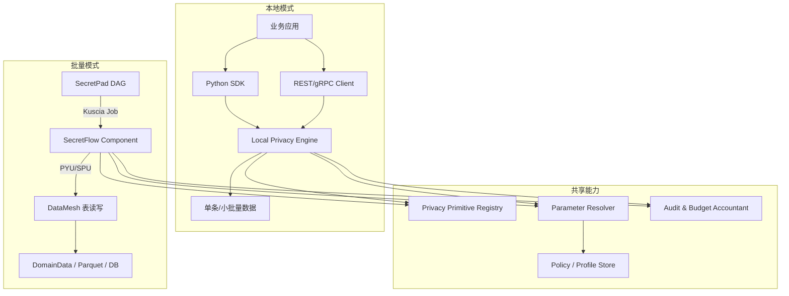
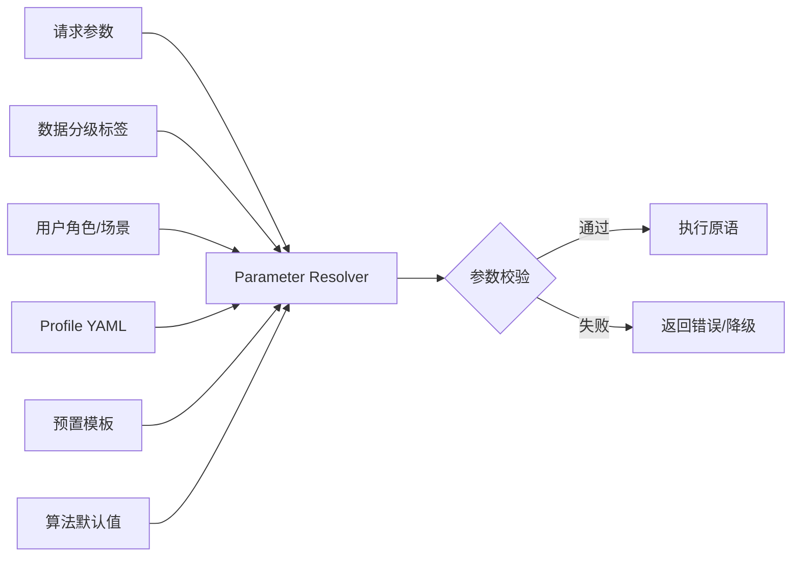

# 01 扩展设计方案

> 基于 `docs/algorithm/匿名脱敏等本地隐私保护原语与实现方案V1.md`，重点回答两个实现问题：
> 1. 如何同时支持“DataMesh 批量表处理”与“本地单条/小批量处理”两种操作对象？
> 2. 隐私处理参数如何设置、从哪里读取、如何治理？

## 1. 设计目标

- **统一原语抽象**：差分隐私（DP）、K-匿名、脱敏、查询混淆四种技术使用同一套 `PrivacyPrimitive` 抽象。
- **双模执行**：同一原语既能以 SecretFlow 组件方式跑在 DataMesh/Kuscia 上处理整表，也能以本地 SDK/函数方式被业务系统调用处理单条数据。
- **参数可治理**：参数来源可组合、可审计、可版本化；默认自动推荐，高级用户可手动覆盖。
- **多语言、多格式**：本地接口优先Java/go/Python，同时暴露 REST/gRPC 服务供 Java/Go/C++ 等语言调用；支持 JSON、dict、pandas、Apache Arrow、SQL 结果集。

## 2. 操作对象抽象

### 2.1 两种操作模式

| 维度 | 批量模式（Batch / DataMesh） | 本地模式（Local / SDK） |
|---|---|---|
| **操作对象** | DataMesh 中的表 / DomainData / 文件 | 单条记录 / 小批量记录 / 单个字段值 |
| **调用方** | SecretPad DAG、Kuscia Job、SCQL | 业务应用、微服务、医生工作站、大模型网关 |
| **执行位置** | Kuscia 容器 / PYU / SPU | 应用进程本地、本地 Agent、Sidecar |
| **数据格式** | DataFrame、Parquet、CSV、SQL Table | JSON、dict、pandas Series/DataFrame、Arrow RecordBatch、Protobuf |
| **典型场景** | 科研数据集脱敏出域、联邦学习预处理 | 实时查询结果脱敏、单患者记录 K-匿名、大模型查询混淆 |
| **性能要求** | 高吞吐、可分布式 | 低延迟（<100ms）、轻量 |
| **错误处理** | 任务级失败、日志回传 | 单请求失败、降级返回原值或错误码 |

### 2.2 统一输入输出抽象

无论批量还是本地，所有原语都遵循统一的 `PrivacyRequest` / `PrivacyResponse` 语义：

```protobuf
message PrivacyRequest {
  string primitive = 1;          // "dp" | "k_anonymity" | "sanitization" | "qol"
  string action = 2;             // "count" | "transform" | "mask" | "obfuscate" ...
  DataPayload input = 3;         // 统一数据载体
  ParameterBundle params = 4;    // 参数集合
  Context context = 5;           // 角色、场景、数据分级等上下文
}

message DataPayload {
  oneof data {
    string table_ref = 1;        // DataMesh 表引用，如 "domain://alice/user"
    bytes parquet_bytes = 2;     // 批量二进制
    string json_rows = 3;        // JSON 数组或单条对象
    bytes arrow_bytes = 4;       // Apache Arrow IPC
  }
  Schema schema = 5;
}
```

Python 侧对应一个更友好的接口：

```python
class PrivacyInput:
    """统一输入，自动识别数据格式"""
    def __init__(self, data, schema=None, format_hint='auto'):
        ...

class PrivacyResult:
    data: Any           # 与输入同格式
    proof: dict         # 隐私证明/审计信息
    params_used: dict   # 实际生效的参数
    warnings: list      # 告警，如隐私预算耗尽
```

### 2.3 本地函数接口设计

本地模式要求像调用普通函数一样简单。以 Python SDK 为例：

```python
from secretflow.privacy.local import dp_count, k_anonymize_record, mask_value, obfuscate_query

# 1. 单值脱敏
masked_phone = mask_value(
    field_name="mobile",
    value="13812345678",
    context="doctor_query"
)
# => "138****5678"

# 2. 单条记录 K-匿名泛化
anon_record = k_anonymize_record(
    record={"age": 28, "zipcode": "518057", "gender": "女", "disease": "胃癌"},
    qi_cols=["age", "zipcode", "gender"],
    hierarchies={...},
    k=5
)
# => {"age": "[20-30]", "zipcode": "518***", "gender": "*", "disease": "胃癌"}

# 3. 差分隐私统计
noisy_count = dp_count(
    values=[1, 0, 1, 1, 0, ...],   # 也可以是 pandas Series
    epsilon=1.0,
    mechanism="laplace"
)

# 4. 查询混淆
obfuscated_queries = obfuscate_query(
    "糖尿病患者最近三个月的用药趋势",
    num_dummies=3,
    domain="diabetes"
)
```

对于 Java/Go 等语言，通过本地 Agent 暴露的 REST/gRPC 调用同一套后端实现：

```java
PrivacyClient client = PrivacyClient.forEndpoint("http://127.0.0.1:8079");
MaskedValue result = client.mask("mobile", "13812345678", "doctor_query");
```

## 3. 双模架构



### 3.1 批量模式执行链

1. 用户在 SecretPad 画布拖拽 DP / K-Anon / 脱敏 / QOL 组件。
2. 组件读取 DataMesh 中的 `DomainData`（表引用）。
3. SecretFlow 在 PYU/SPU 中实例化对应 `PrivacyPrimitive`。
4. 参数通过组件配置 + 策略模板解析后传入。
5. 执行结果写回 DataMesh，并更新 Data Catalog 标签（如 `L2_K_ANON_K5`）。
6. 审计日志与隐私预算台账回写 SecretPad / Kuscia。

### 3.2 本地模式执行链

1. 业务应用调用 Python SDK 或发送 REST/gRPC 请求。
2. `Local Privacy Engine` 接收 `PrivacyRequest`。
3. 根据 `primitive` + `action` 路由到具体算法实例。
4. `Parameter Resolver` 结合请求参数、策略模板、数据分级标签解析最终参数。
5. 对单条/小批量数据执行处理。
6. 返回与输入格式一致的结果 + 审计摘要。

## 4. 隐私处理参数设计

### 4.1 参数来源优先级（从高到低）

```
1. 请求显式参数（Request Payload / SDK 入参）
2. 运行时上下文覆盖（数据分级标签、用户角色、查询用途）
3. 命名空间/项目级 Profile（YAML/JSON 配置文件）
4. 预置模板（医疗/金融/通用）
5. 算法默认值
```

### 4.2 自动 vs 手动

| 层级 | 设置方式 | 说明 |
|---|---|---|
| **默认自动** | 根据数据分级标签 + 场景模板自动选择 | 如 L3 诊疗记录 → K=5, L=2, T=0.2；L4 敏感病种 → K=10, ε=0.1 |
| **模板选择** | 用户在 UI/配置中选择行业模板 | 医疗科研、医保统计、跨院联邦、测试环境 |
| **手动微调** | 高级用户在组件配置面板或 SDK 中显式传入 | 适合算法专家，需校验合理性 |
| **强制策略** | 平台管理员通过 Policy 锁定某些字段/场景的参数 | 如基因数据禁止 DP 明文发布 |

### 4.3 参数配置文件结构

```yaml
# privacy-profile.yaml
version: "1.0"
namespace: "hospital_a"

templates:
  - name: medical_research
    description: 院内科研共享
    primitives:
      k_anonymity:
        k: 5
        l: 2
        t: 0.2
        max_depth: 10
        suppression_strategy: delete
      dp:
        epsilon: 1.0
        delta: 1e-5
        mechanism: laplace
        budget_pool: 10.0
      sanitization:
        default_engine: mask
        rules:
          - field_type: id_card
            context: static_research
            engine: hash
            params: { salt: "${SALT_RESEARCH}", output_length: 16 }

context_overrides:
  - conditions:
      sensitivity: L4
      purpose: cross_hospital
    override:
      k_anonymity.k: 10
      dp.epsilon: 0.1

forbidden:
  - sensitivity: L5
    primitives: [dp, sanitization]
    reason: 基因数据禁止明文出域
```

### 4.4 参数解析流程



### 4.5 参数校验规则

- **范围校验**：ε > 0，K ≥ 2，0 ≤ δ < 1，T ∈ (0, 1]。
- **隐私预算校验**：每次 DP 查询消耗预算，累积超过 `budget_pool` 时拒绝或熔断。
- **策略冲突校验**：如 L5 数据禁止 DP 明文发布；模板与手动参数冲突时按优先级覆盖并告警。
- **密钥依赖校验**：FPE/Hash 需要 `key_id` / `salt` 存在且可访问 KMS。

### 4.6 隐私预算台账

- 为每个数据集/用户/项目维护 `Privacy Accountant`。
- 支持 RDP（Rényi DP）组合定理，精确计算累积 ε。
- 提供查询接口：`GET /privacy/budget?namespace=xxx&dataset=yyy`。

## 5. 数据格式与编程语言

### 5.1 支持的数据格式

| 格式 | 批量模式 | 本地模式 | 说明 |
|---|---|---|---|
| pandas DataFrame | ✅ | ✅ | Python 首选 |
| Apache Arrow | ✅ | ✅ | 跨语言零拷贝 |
| JSON / JSON Lines | ✅ | ✅ | Web/微服务首选 |
| CSV / Parquet | ✅ | ⚠️ 不推荐 | 本地单条时开销大 |
| SQLAlchemy Result | ✅ | ❌ | 批量读取 |
| Protobuf | ✅ | ✅ | gRPC 传输 |

### 5.2 多语言支持路径

| 语言 | 接入方式 | 说明 |
|---|---|---|
| Python | 原生 SDK | 直接调用 `secretflow.privacy.local` |
| **Java** | **本地 SDK（函数库）** | 作为 Maven 依赖引入，直接实例化 `PrivacyClient` 调用；避免 Agent 并发与网络问题 |
| **Go** | **本地 SDK（函数库）** | 作为 Go module 引入，直接调用包函数；避免 Agent 并发与网络问题 |
| Rust / C++ | REST/gRPC 调用本地 Agent | Agent 可用 Python/Go 实现，轻量 Sidecar |
| JavaScript / TS | HTTP API | 前端实时脱敏展示 |
| Rust / C++ | gRPC + Arrow | 高性能本地处理 |

### 5.3 Java/Go SDK 与 Agent 的选型对比

考虑到 sfwork 后端技术栈以 Java/Go 为主，本地模式优先提供 **Java SDK** 与 **Go SDK**，可直接以函数库形式集成到实际业务应用，无需网络请求，也无需考虑 Agent 的并发与运维问题。

| 维度 | Java/Go SDK（函数库） | 本地 Agent（REST/gRPC） |
|---|---|---|
| 调用方式 | 进程内函数调用 | 本地网络调用 |
| 延迟 | 极低（μs ~ ms 级） | 较低（ms 级） |
| 并发 | 由业务应用自行管理，无跨进程开销 | 需要 Agent 端处理连接池、限流、并发 |
| 部署 | 随业务 JAR/二进制一起打包 | 独立进程/容器，需运维 |
| 适用场景 | Java/Go 后端业务直接集成 | 多语言、前端、不可引入 SDK 的遗留系统 |
| 数据安全 | 数据不出进程 | 数据通过 localhost 传输，需 TLS/mTLS 可选 |

### 5.4 本地 Agent 并发设计要点

若采用本地 Agent 模式，必须考虑：

- **连接池与 Keep-Alive**：业务应用复用 HTTP/2 或 gRPC 连接，避免频繁建连。
- **限流与熔断**：对 DP、K-匿名等计算密集型操作做 QPS/并发限制；隐私预算耗尽时快速失败。
- **请求隔离**：按 `namespace/project` 隔离请求上下文，防止参数与预算串扰。
- **线程/协程安全**：预算台账、配置缓存使用锁或原子操作。
- **健康检查与优雅关闭**：提供 `/health` 接口，支持 SIGTERM 优雅关闭。

Java/Go SDK 由于在同进程内执行，天然避免上述问题，由调用方线程模型直接复用。

### 5.5 本地 Agent 设计

```
┌─────────────────────────────────────────┐
│  Local Privacy Agent (Python/FastAPI)   │
│  ├─ REST API: /v1/mask, /v1/dp, ...     │
│  ├─ gRPC: PrivacyService                │
│  ├─ 参数缓存 & 策略热加载               │
│  ├─ 隐私预算本地台账                    │
│  └─ 审计日志本地落盘                    │
└─────────────────────────────────────────┘
```

## 6. 安全边界

- **本地模式不跨网络**：敏感数据不出进程/不出机器。
- **批量模式数据不出域**：通过 DataMesh / Kuscia 保证。
- **密钥隔离**：FPE Key、Salt、Token Vault 走 KMS/TEE，原语引擎只接收句柄。
- **审计不可抵赖**：每次调用记录 `who/when/what/params/proof`。

## 7. 关键设计决策

| 决策点 | 方案 | 理由 |
|---|---|---|
| 操作对象 | 批量 + 本地双模 | 覆盖平台级数据预处理与业务级实时处理 |
| 接口抽象 | `PrivacyRequest` / `PrivacyResponse` | 统一批量与本地语义，便于扩展新原语 |
| 参数来源 | 请求 > 上下文 > Profile > 模板 > 默认值 | 兼顾灵活性与治理 |
| 默认参数 | 按数据分级 + 场景模板自动推荐 | 降低普通用户使用门槛 |
| 多语言 | Python SDK + REST/gRPC Agent | 快速覆盖主流业务语言 |
| 隐私预算 | RDP + 本地/中心台账 | 支持可组合、可审计的预算管理 |
