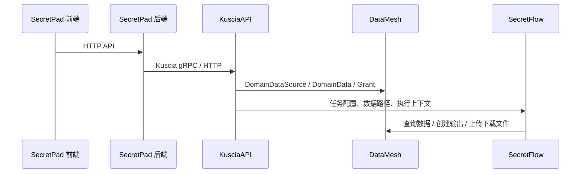

# SecretPad -> Kuscia -> DataMesh -> SecretFlow 数据流总览

> 这篇文档的目标不是讲部署，而是把“从 SecretPad 前端点按钮，到后端编排，再到 Kuscia / DataMesh / SecretFlow 执行”的完整链路串起来。
>
> 这里把两条经常混在一起的链路分开写：
> 1. 数据源 / 数据资产注册链路，也就是把一个节点可见的 DataMesh 资源创建出来；
> 2. 联邦学习任务链路，也就是把 DAG / 任务提交给 Kuscia 执行，并由 SecretFlow 真正跑起来。

## 1. 一句话理解全链路

SecretPad 前端只负责收集“用户想要什么”，SecretPad 后端负责把这些业务对象翻译成 Kuscia 能理解的 Job / DomainDataSource / DomainData / Grant，Kuscia 负责把这些资源下发到各个域并拉起运行环境，DataMesh 负责域内数据资源的元信息和授权，SecretFlow 负责读取这些资源并执行实际计算。

## 2. 先把几个核心对象对齐

| 层级 | 对象 | 作用 |
|---|---|---|
| SecretPad 前端 | `CreateDatasourceRequest` | 收集 ownerId、nodeIds、type、name、dataSourceInfo |
| SecretPad 后端 | `CreateDatasourceRequest` / `CreateDatasourceVO` | 验证并调用对应 datasource handler |
| Kuscia DataMesh | `DomainDataSource` | 节点侧的数据源连接信息 |
| Kuscia DataMesh | `DomainData` | 域内“逻辑数据资产”，例如一张表、一个模型、一个输出文件 |
| Kuscia DataMesh | `DomainDataGrant` | 把某个域数据授权给另一个域或某个任务使用 |
| SecretPad 任务编排 | `StartGraphRequest` | 选择项目内哪些图节点要启动 |
| SecretPad 任务编排 | `ProjectJob` | SecretPad 内部的作业中间态 |
| Kuscia Job | `CreateJobRequest` / `Task` / `Party` | Kuscia 实际执行的作业定义 |
| SecretFlow 执行 | `KusciaTaskConfig` / `sf_node_eval_param` | 单个任务节点的运行参数 |

## 3. 数据源 / DataMesh 数据建立流程

这里先讲最容易混淆的“数据源创建”。如果你在 SecretPad 前端点的是“新建数据源”，它对应的是 DataMesh 里的 `DomainDataSource`；如果你在后续注册的是具体表数据、模型产物，那还会继续进入 `DomainData` 和 `DomainDataGrant`。

### 3.1 前端到后端

前端数据源页面的入口在 [DataSourceService](../../frontend-src/apps/platform/src/modules/data-source-list/data-source-list.service.ts)；提交时会把表单整理成 `CreateDatasourceRequest`，然后调用后端接口。

后端入口是 [DataSourceController.create](../../secretpad-web/src/main/java/org/secretflow/secretpad/web/controller/DataSourceController.java)，接口路径是 `/api/v1alpha1/datasource/create`。真正的入参结构是 [CreateDatasourceRequest](../../secretpad-service/src/main/java/org/secretflow/secretpad/service/model/datasource/CreateDatasourceRequest.java)：

- `ownerId`：资源所属节点或实例上下文；
- `nodeIds`：需要创建同一逻辑数据源的节点列表；
- `type`：`OSS`、`MYSQL`、`ODPS` 等；
- `name`：显示名；
- `dataSourceInfo`：按 `type` 做 Jackson 多态反序列化的连接参数。

### 3.2 后端怎么处理

`DataSourceController.create` 只做一层转发，实际逻辑在 [DatasourceServiceImpl.createDatasource](../../secretpad-service/src/main/java/org/secretflow/secretpad/service/impl/DatasourceServiceImpl.java)。它先做节点校验，然后按数据源类型路由到不同的 `DatasourceHandler`：

- `OssKusciaControlDatasourceHandler`：OSS 数据源；
- `MysqlKusciaControlDatasourceHandler`：MySQL 数据源；
- `OdpsKusciaControlDatasourceHandler`：ODPS 数据源。

这一步里有两个很重要的事实：

1. SecretPad 不只是“保存一条配置”，它会先校验外部连接是否可达，比如 OSS endpoint、bucket，或者数据库连通性；
2. 真正落到域侧的数据源，不是直接写 SecretPad 自己的库，而是调用 Kuscia 的 DataMesh API 去创建 `DomainDataSource`。

### 3.3 SecretPad -> Kuscia DataMesh 的实际请求

以 OSS handler 为例，[OssKusciaControlDatasourceHandler](../../secretpad-service/src/main/java/org/secretflow/secretpad/service/handler/datasource/OssKusciaControlDatasourceHandler.java) 会把前端的 `CreateDatasourceRequest` 转成 Kuscia 的 `CreateDomainDataSourceRequest`：

- `domainId = nodeId`：哪个域创建这个数据源；
- `datasourceId`：SecretPad 生成的统一数据源 ID；
- `type`：`oss` / `mysql` / `odps`；
- `name`：显示名；
- `access_directly = false`：默认通过 DataProxy / DataMesh 访问；
- `info`：具体的连接信息，例如 `OssDataSourceInfo`、`DatabaseDataSourceInfo`、`OdpsDataSourceInfo`。

Kuscia 侧对应的 proto 定义在 [DomainDataSourceService](../../../kuscia/proto/api/v1alpha1/datamesh/domaindatasource.proto)。`DomainDataSource` 的关键字段是：

- `datasource_id`：数据源 ID；
- `name`：人类可读名称；
- `type`：`localfs`、`oss`、`mysql`、`postgresql` 等；
- `status`：`Available` / `Unavailable`；
- `info` / `info_key`：真正的数据源连接信息；
- `access_directly`：是否绕过 DataProxy。

### 3.4 如果你创建的是“表数据”而不只是“数据源”

Kuscia DataMesh 里，数据源只是底座。真正可被训练读取的“数据资产”是 `DomainData`。

`DomainData` 的 proto 在 [domaindata.proto](../../../kuscia/proto/api/v1alpha1/datamesh/domaindata.proto)，它比 `DomainDataSource` 更贴近“业务数据”本身：

- `domaindata_id`：数据资产 ID；
- `name`：数据名；
- `type`：`table`、`model`、`rule`、`report` 等；
- `relative_uri`：相对数据源的路径；
- `datasource_id`：挂在哪个数据源上；
- `columns`：表结构；
- `vendor`：数据产生方，例如 `secretflow`、`manual`；
- `file_format`：CSV / ORC / binary 等。

如果还涉及跨域授权，还会进入 `DomainDataGrant`。它的核心是 [GrantLimit](../../../kuscia/proto/api/v1alpha1/datamesh/domaindatagrant.proto)：

- `expiration_time`：过期时间；
- `use_count`：使用次数限制；
- `flow_id`：任务流 ID；
- `components`：组件列表；
- `initiator`：发起方；
- `input_config`：任务输入配置。

### 3.5 SecretFlow 侧怎么用 DataMesh

SecretFlow 的 Kuscia 适配代码在 [secretflow/kuscia/datamesh.py](../../../secretflow/secretflow/kuscia/datamesh.py)。它把 DataMesh 分成三类动作：

- `get_domain_data_source(...)`：查询数据源元信息；
- `create_domain_data_in_dm(...)`：创建 `DomainData`；
- `get_file_from_dp(...)` / `put_file_to_dp(...)`：通过 DataProxy 下载 / 上传文件。

也就是说，DataMesh 负责“资源和授权”，DataProxy 负责“文件搬运”。

## 4. 联邦学习任务执行流程

这里讲的是“真正跑训练”的路径，也就是 DAG 右上角运行或者类似的任务启动动作。

### 4.1 前端提交什么

前端任务提交入口在 [SubmissionDrawerService](../../frontend-src/apps/platform/src/modules/dag-model-submission/submission-service.ts) 和 DAG 运行相关页面。它最终调用后端的 `/api/v1alpha1/graph/start`。

提交体是 [StartGraphRequest](../../secretpad-service/src/main/java/org/secretflow/secretpad/service/model/graph/StartGraphRequest.java)：

- `projectId`：项目 ID；
- `graphId`：图 ID；
- `nodes`：要运行的图节点 ID 列表；
- `breakpoint`：是否断点续跑。

### 4.2 SecretPad 后端如何把图变成 Job

后端入口是 [GraphController.startGraph](../../secretpad-web/src/main/java/org/secretflow/secretpad/web/controller/GraphController.java)，进入 [GraphServiceImpl.startGraph](../../secretpad-service/src/main/java/org/secretflow/secretpad/service/impl/GraphServiceImpl.java) 以后，会做几件事：

1. 校验图归属和节点合法性；
2. 解析图中的边和节点，算出每个节点的参与方 `parties`；
3. 把上下文放进 `GraphContext`，包括是否断点、是否定时任务、是否 TEE 等；
4. 生成内部对象 `ProjectJob`。

`ProjectJob` 是 SecretPad 到 Kuscia 的中间层，它的核心字段在 [ProjectJob](../../secretpad-service/src/main/java/org/secretflow/secretpad/service/model/graph/ProjectJob.java)：

- `projectId`、`graphId`、`jobId`；
- `fullNodes`、`edges`：完整图结构；
- `tasks`：本次要执行的任务列表；
- `maxParallelism`：最大并行度。

每个 `JobTask` 又包含：

- `taskId`；
- `parties`；
- `dependencies`；
- `node`：具体图节点信息。

### 4.3 任务是怎么变成 Kuscia Job 的

`GraphServiceImpl.startGraph` 最后会把 `ProjectJob` 交给 job chain，具体落点是 [JobSubmittedHandler](../../secretpad-service/src/main/java/org/secretflow/secretpad/service/graph/chain/JobSubmittedHandler.java)。这里做的事情是：

- 把 `ProjectJob` 转成 `Job.CreateJobRequest`；
- 如果没有任务节点，直接记为成功；
- 如果是正常训练，就调用 `jobManager.createJob(request)`。

真正的转换逻辑在 [KusciaJobConverter](../../secretpad-service/src/main/java/org/secretflow/secretpad/service/graph/converter/KusciaJobConverter.java)。它会把每个 SecretPad 的 `JobTask` 转成 Kuscia 的 `Job.Task`：

- `taskId` / `alias`：任务标识；
- `app_image`：实际执行镜像；
- `parties`：参与域列表；
- `dependencies`：依赖任务；
- `task_input_config`：节点输入参数，序列化为 JSON 字符串。

这一步里还有一个很关键的映射：`KusciaJobConverter` 会通过 [ProjectGraphDomainDatasourceService](../../secretpad-service/src/main/java/org/secretflow/secretpad/service/ProjectGraphDomainDatasourceService.java) 给每个 party 找到对应的数据源 ID。也就是说，训练任务不是“只知道有节点”，而是会明确知道“每个节点该从哪个 DataMesh 数据源读数据”。

`ProjectGraphNodeKusciaParamsDO` 负责保存这个映射的痕迹，它存的是：

- `jobId` / `taskId`；
- `inputs` / `outputs`；
- `nodeEvalParam`。

这样后续看日志或回溯时，可以从项目图节点直接追到 Kuscia Task 参数。

### 4.4 Kuscia 侧如何接住这个 Job

Kuscia 的 Job proto 定义在 [job.proto](../../../kuscia/proto/api/v1alpha1/kusciaapi/job.proto)。`CreateJobRequest` 的关键字段是：

- `job_id`：作业 ID；
- `initiator`：发起域；
- `max_parallelism`：并行度；
- `tasks`：任务列表。

每个 `Task` 还包含：

- `app_image`；
- `parties`；
- `task_id`；
- `dependencies`；
- `task_input_config`；
- `priority`、`schedule_config`、`tolerable`。

Kuscia 的服务实现入口在 [job_service.go](../../../kuscia/pkg/kusciaapi/service/job_service.go)。它会先校验请求，再把 `CreateJobRequest` 转成 Kuscia 内部的任务模板和 K8s 相关资源，最终交给调度器和运行时。

### 4.5 SecretFlow 真正在哪里跑

Kuscia 把任务拉起来以后，真正执行计算的是 SecretFlow。入口在 [secretflow/kuscia/entry.py](../../../secretflow/secretflow/kuscia/entry.py)：

1. 读取 `KusciaTaskConfig`；
2. 创建到 DataMesh 的 gRPC channel；
3. 用 `get_domain_data_source(...)` 查询当前任务对应的数据源；
4. 调用 `preprocess_sf_node_eval_param(...)` 预处理节点参数；
5. 获取集群配置 `get_sf_cluster_config(...)`；
6. 调用 `comp_eval(...)` 真正执行组件；
7. 调用 `postprocess_sf_node_eval_result(...)` 处理输出。

这也是为什么在 SecretFlow 侧你能看到 `QueryDomainDataSource`、`CreateDomainData` 和 DataProxy 文件传输并存：

- 先查数据源和数据资产；
- 再把输入文件下载到本地；
- 运行完后把输出文件上传，并在 DataMesh 里登记新的 `DomainData`。

### 4.6 SecretFlow 如何读写 DataMesh

`secretflow/kuscia/datamesh.py` 把 DataMesh 操作拆成了三层：

- `create_domain_data_service_stub(channel)` 和 `create_domain_data_source_service_stub(channel)` 负责建立 stub；
- `get_domain_data(...)`、`get_domain_data_source(...)` 负责查询元数据；
- `create_domain_data_in_dm(...)` 负责在 DataMesh 中登记输出数据；
- `get_file_from_dp(...)`、`put_file_to_dp(...)` 负责真正的文件搬运。

你可以把它理解为：

- Kuscia 负责调度和权限边界；
- DataMesh 负责“这份数据是什么、谁能用”；
- DataProxy 负责“文件怎么传”；
- SecretFlow 负责“怎么计算”。

## 5. 如果你看到的是模型导出 / 打包

训练完成后，SecretPad 还有一条“模型导出”链路，它不等于训练执行本身，但经常和联邦学习任务一起出现。

前端调用的是 [ModelExportController](../../secretpad-web/src/main/java/org/secretflow/secretpad/web/controller/ModelExportController.java)，对应的请求体是 [ModelExportPackageRequest](../../secretpad-service/src/main/java/org/secretflow/secretpad/service/model/model/export/ModelExportPackageRequest.java)：

- `projectId`、`graphId`、`trainId`；
- `modelName`、`modelDesc`；
- `graphNodeOutPutId`；
- `modelPartyConfig`：每个参与方的模型数据源；
- `modelComponent`：模型由哪些图节点组成。

服务实现 [ModelExportServiceImpl](../../secretpad-service/src/main/java/org/secretflow/secretpad/service/impl/ModelExportServiceImpl.java) 会先定位最新训练任务，再结合各参与方的数据源映射，生成模型导出所需的 Kuscia 参数并提交作业。

这条链路的本质是：训练任务完成后，再把模型产物包装成一个新的作业或产物登记流程。

## 6. 建议的阅读顺序

如果你想从代码里重新走一遍，建议按这个顺序读：

1. [frontend-src/apps/platform/src/modules/data-source-list/data-source-list.service.ts](../../frontend-src/apps/platform/src/modules/data-source-list/data-source-list.service.ts)
2. [secretpad-web/src/main/java/org/secretflow/secretpad/web/controller/DataSourceController.java](../../secretpad-web/src/main/java/org/secretflow/secretpad/web/controller/DataSourceController.java)
3. [secretpad-service/src/main/java/org/secretflow/secretpad/service/handler/datasource/OssKusciaControlDatasourceHandler.java](../../secretpad-service/src/main/java/org/secretflow/secretpad/service/handler/datasource/OssKusciaControlDatasourceHandler.java)
4. [frontend-src/apps/platform/src/modules/dag-model-submission/submission-service.ts](../../frontend-src/apps/platform/src/modules/dag-model-submission/submission-service.ts)
5. [secretpad-web/src/main/java/org/secretflow/secretpad/web/controller/GraphController.java](../../secretpad-web/src/main/java/org/secretflow/secretpad/web/controller/GraphController.java)
6. [secretpad-service/src/main/java/org/secretflow/secretpad/service/graph/converter/KusciaJobConverter.java](../../secretpad-service/src/main/java/org/secretflow/secretpad/service/graph/converter/KusciaJobConverter.java)
7. [kuscia/proto/api/v1alpha1/kusciaapi/job.proto](../../../kuscia/proto/api/v1alpha1/kusciaapi/job.proto)
8. [secretflow/secretflow/kuscia/entry.py](../../../secretflow/secretflow/kuscia/entry.py)

如果你下一步想继续，我可以再把这篇文档扩成一张“请求-对象-接口-代码位置”的总表，或者单独画一张更细的时序图，把每个请求体字段和响应体字段都标出来。