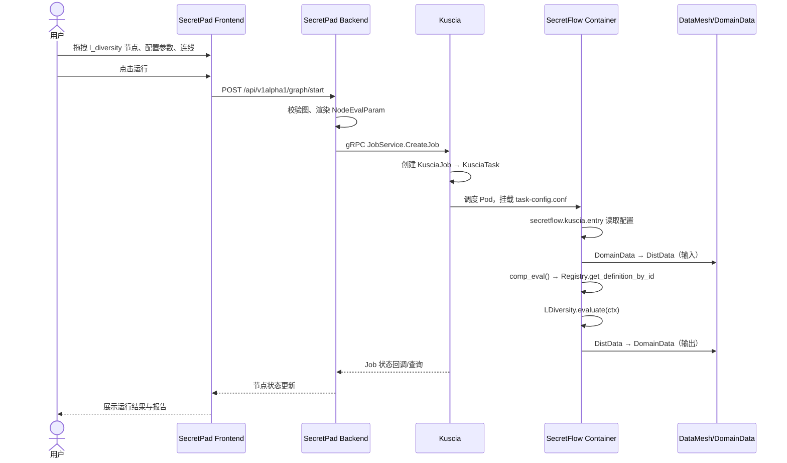

# SecretFlow `privacy` 组件二次开发 — 底层设计文档（LLD）

> **依据**：`docs/privacy-component-development-guide.md`、`docs/privacy-component-hld.md`  
> **目标**：给出可直接落地的文件、类、接口、代码片段与命令，使开发人员能够按文档生成完整代码并通过测试。  
> **示例组件**：`privacy/l_diversity:1.0.0`（L-多样性，k-匿名的自然扩展）  
> **版本**：1.0  
> **日期**：2026-07-08

---

## 1. 目标组件定义

### 1.1 组件标识

| 项 | 值 |
|---|---|
| `comp_id` | `privacy/l_diversity:1.0.0` |
| `codeName` | `privacy/l_diversity` |
| `domain` | `privacy` |
| `name` | `l_diversity` |
| `version` | `1.0.0` |

### 1.2 功能描述

在 `k-anonymity` 基础上进一步保证 **L-Diversity**：每个等价类（准标识符列组合相同的记录组）中敏感属性列的不同取值数不少于 `l`。对不满足 L-Diversity 的等价类进行抑制，最终输出匿名化后的 individual 表与执行报告。

### 1.3 输入输出

| 类型 | 名称 | `DistDataType` | 说明 |
|---|---|---|---|
| 输入 | `input_ds` | `sf.table.individual` | 单方样本表。 |
| 输出 | `output_ds` | `sf.table.individual` | 匿名化后的样本表。 |
| 输出 | `report` | `sf.report` | 包含 `k`、`l`、`is_l_diverse`、`suppression_count`、`equivalence_classes`、`min_diversity` 的报告。 |

### 1.4 配置属性

| 属性名 | 类型 | 默认值 | 约束 | 说明 |
|---|---|---|---|---|
| `k` | `int` | 无 | `[1, +∞)` | k-匿名最小等价类大小。 |
| `l` | `int` | 无 | `[1, +∞)` | 每个等价类敏感属性最小不同取值数。 |
| `qi_cols_json` | `str` | 无 | 非空 JSON 数组 | 准标识符列名列表。 |
| `sa_cols_json` | `str` | `"[]"` | JSON 数组 | 敏感属性列名列表。 |
| `suppression_rate` | `float` | `0.05` | `[0.0, 1.0]` | 最大可抑制行比例。 |
| `report_result` | `bool` | `true` | — | 是否输出报告。 |

---

## 2. 数据结构与接口定义

### 2.1 引用常量

```python
from secretflow.component.core import DistDataType

# 本组件使用到的 DistDataType
DistDataType.INDIVIDUAL_TABLE  # "sf.table.individual"
DistDataType.REPORT            # "sf.report"
```

### 2.2 算法层数据结构

```python
# secretflow/privacy/l_diversity/_metrics.py
from dataclasses import dataclass
from typing import List, Optional, Tuple

import pandas as pd


@dataclass
class LDiversityResult:
    """L-Diversity  anonymization result."""

    data: pd.DataFrame
    l: int
    is_l_diverse: bool
    suppression_count: int
    equivalence_classes: int
    min_diversity: int


def check_l_diversity(
    df: pd.DataFrame,
    qi_cols: List[str],
    sa_cols: Optional[List[str]],
    l: int,
) -> Tuple[bool, int, int]:
    """Return (is_l_diverse, equivalence_classes, min_diversity).

    If ``sa_cols`` is empty, min_diversity is defined as 0 and the table is
    considered trivially l-diverse.
    """
    if not qi_cols or df.empty:
        return True, 0, 0

    grouped = df.groupby(qi_cols)
    eq_classes = len(grouped)

    if not sa_cols:
        return True, eq_classes, 0

    min_diversity = float("inf")
    for _, group in grouped:
        diversity = group[sa_cols].nunique().min()
        if diversity < min_diversity:
            min_diversity = diversity

    return min_diversity >= l, eq_classes, int(min_diversity)
```

### 2.3 算法层主接口

```python
# secretflow/privacy/l_diversity/_transformer.py
class LDiversityTransformer:
    def __init__(
        self,
        k: int,
        l: int,
        qi_cols: List[str],
        sa_cols: Optional[List[str]] = None,
        suppression_rate: float = 0.05,
    ) -> None:
        ...

    def fit_transform(self, df: pd.DataFrame) -> LDiversityResult:
        """Fit and transform the DataFrame to satisfy l-diversity."""
        ...
```

---

## 3. SecretFlow 算法层实现

### 3.1 目录结构

```text
secretflow/secretflow/privacy/l_diversity/
├── __init__.py        # 对外暴露 LDiversityResult / check_l_diversity / LDiversityTransformer
├── _metrics.py        # L-Diversity 校验与结果结构
└── _transformer.py    # 算法主实现
```

### 3.2 `__init__.py`

```python
# Copyright 2024 Ant Group Co., Ltd.
#
# Licensed under the Apache License, Version 2.0 (the "License");
# you may not use this file except in compliance with the License.
# You may obtain a copy of the License at
#
#     http://www.apache.org/licenses/LICENSE-2.0
#
# Unless required by applicable law or agreed to in writing, software
# distributed under the License is distributed on an "AS IS" BASIS,
# WITHOUT WARRANTIES OR CONDITIONS OF ANY KIND, either express or implied.
# See the License for the specific language governing permissions and
# limitations under the License.

"""L-Diversity primitives built on top of k-anonymity."""

from secretflow.privacy.l_diversity._metrics import LDiversityResult, check_l_diversity
from secretflow.privacy.l_diversity._transformer import LDiversityTransformer

__all__ = [
    "LDiversityResult",
    "check_l_diversity",
    "LDiversityTransformer",
]
```

### 3.3 `_metrics.py`

```python
# Copyright 2024 Ant Group Co., Ltd.
#
# Licensed under the Apache License, Version 2.0 (the "License");
# you may not use this file except in compliance with the License.
# You may obtain a copy of the License at
#
#     http://www.apache.org/licenses/LICENSE-2.0
#
# Unless required by applicable law or agreed to in writing, software
# distributed under the License is distributed on an "AS IS" BASIS,
# WITHOUT WARRANTIES OR CONDITIONS OF ANY KIND, either express or implied.
# See the License for the specific language governing permissions and
# limitations under the License.

"""Metrics and result structure for L-Diversity."""

from dataclasses import dataclass
from typing import List, Optional, Tuple

import pandas as pd


@dataclass
class LDiversityResult:
    """Result of an L-Diversity anonymization run."""

    data: pd.DataFrame
    l: int
    is_l_diverse: bool
    suppression_count: int
    equivalence_classes: int
    min_diversity: int


def check_l_diversity(
    df: pd.DataFrame,
    qi_cols: List[str],
    sa_cols: Optional[List[str]],
    l: int,
) -> Tuple[bool, int, int]:
    """Check whether ``df`` satisfies l-diversity on ``sa_cols``.

    Returns:
        A tuple of (is_l_diverse, equivalence_classes, min_diversity).
    """
    if not qi_cols or df.empty:
        return True, 0, 0

    grouped = df.groupby(qi_cols)
    eq_classes = len(grouped)

    if not sa_cols:
        return True, eq_classes, 0

    min_diversity = float("inf")
    for _, group in grouped:
        diversity = group[sa_cols].nunique().min()
        if diversity < min_diversity:
            min_diversity = diversity

    return min_diversity >= l, eq_classes, int(min_diversity)
```

### 3.4 `_transformer.py`

```python
# Copyright 2024 Ant Group Co., Ltd.
#
# Licensed under the Apache License, Version 2.0 (the "License");
# you may not use this file except in compliance with the License.
# You may obtain a copy of the License at
#
#     http://www.apache.org/licenses/LICENSE-2.0
#
# Unless required by applicable law or agreed to in writing, software
# distributed under the License is distributed on an "AS IS" BASIS,
# WITHOUT WARRANTIES OR CONDITIONS OF ANY KIND, either express or implied.
# See the License for the specific language governing permissions and
# limitations under the License.

"""L-Diversity transformer using k-anonymity + suppression."""

from typing import List, Optional

import pandas as pd

from secretflow.privacy.k_anonymity import KAnonymityTransformer
from secretflow.privacy.l_diversity._metrics import LDiversityResult, check_l_diversity


class LDiversityTransformer:
    """Enforce L-Diversity on top of k-anonymity.

    The transformer first applies k-anonymity to the quasi-identifier columns,
    then suppresses equivalence classes that do not satisfy l-diversity on the
    sensitive attribute columns.

    Args:
        k: Minimum equivalence class size.
        l: Minimum number of distinct sensitive values per equivalence class.
        qi_cols: Quasi-identifier columns used for anonymization.
        sa_cols: Sensitive attribute columns to check diversity.
        suppression_rate: Maximum fraction of rows that may be suppressed.
    """

    def __init__(
        self,
        k: int,
        l: int,
        qi_cols: List[str],
        sa_cols: Optional[List[str]] = None,
        suppression_rate: float = 0.05,
    ):
        if k < 1:
            raise ValueError("k must be at least 1.")
        if l < 1:
            raise ValueError("l must be at least 1.")
        if not qi_cols:
            raise ValueError("qi_cols must not be empty.")

        self.k = k
        self.l = l
        self.qi_cols = list(qi_cols)
        self.sa_cols = list(sa_cols) if sa_cols else []
        self.suppression_rate = suppression_rate

    def fit_transform(self, df: pd.DataFrame) -> LDiversityResult:
        """Fit and transform the DataFrame to satisfy l-diversity.

        Args:
            df: Input pandas DataFrame.

        Returns:
            :class:`LDiversityResult` with anonymized data and metadata.
        """
        if not isinstance(df, pd.DataFrame):
            raise TypeError("Input must be a pandas DataFrame.")

        missing = set(self.qi_cols) - set(df.columns)
        if missing:
            raise ValueError(f"Missing QI columns: {missing}")

        # Step 1: apply k-anonymity.
        ka_transformer = KAnonymityTransformer(
            k=self.k,
            qi_cols=self.qi_cols,
            sa_cols=self.sa_cols,
            suppression_rate=self.suppression_rate,
        )
        ka_result = ka_transformer.fit_transform(df)
        anonymized = ka_result.data

        # Step 2: suppress equivalence classes failing l-diversity.
        extra_suppressed = 0
        if self.sa_cols:
            keep = pd.Series(True, index=anonymized.index)
            for _, group in anonymized.groupby(self.qi_cols):
                diversity = anonymized.loc[group.index, self.sa_cols].nunique().min()
                if diversity < self.l:
                    keep.loc[group.index] = False
            extra_suppressed = int((~keep).sum())
            anonymized = anonymized[keep].reset_index(drop=True)
        else:
            anonymized = anonymized.reset_index(drop=True)

        # Step 3: compute final metrics.
        is_l_diverse, eq_classes, min_diversity = check_l_diversity(
            anonymized, self.qi_cols, self.sa_cols, self.l
        )

        return LDiversityResult(
            data=anonymized,
            l=self.l,
            is_l_diverse=is_l_diverse,
            suppression_count=ka_result.suppression_count + extra_suppressed,
            equivalence_classes=eq_classes,
            min_diversity=min_diversity,
        )
```

---
## 4. SecretFlow 组件层实现

### 4.1 文件路径

```text
secretflow/secretflow/component/privacy/l_diversity.py
```

### 4.2 完整代码

```python
# Copyright 2024 Ant Group Co., Ltd.
#
# Licensed under the Apache License, Version 2.0 (the "License");
# you may not use this file except in compliance with the License.
# You may obtain a copy of the License at
#
#     http://www.apache.org/licenses/LICENSE-2.0
#
# Unless required by applicable law or agreed to in writing, software
# distributed under the License is distributed on an "AS IS" BASIS,
# WITHOUT WARRANTIES OR CONDITIONS OF ANY KIND, either express or implied.
# See the License for the specific language governing permissions and
# limitations under the License.

"""L-Diversity component for Kuscia dispatch."""

import logging
from typing import List

import pyarrow as pa
from secretflow_spec import VTable, VTableSchema

from secretflow.component.core import (
    Component,
    Context,
    DistDataType,
    Field,
    Input,
    Interval,
    Output,
    Reporter,
    VTableUtils,
    register,
)
from secretflow.privacy.l_diversity import LDiversityTransformer

from ._utils import (
    build_schema_from_input,
    dump_party_tables,
    get_self_party,
    load_party_table,
    make_empty_table_output,
    parse_json_attr,
)

logger = logging.getLogger(__name__)


def _apply_l_diversity(
    party_tbl: pa.Table,
    k: int,
    l: int,
    qi_cols: List[str],
    sa_cols: List[str],
    suppression_rate: float,
) -> tuple[pa.Table, dict]:
    """Apply l-diversity to a single party's table."""
    in_df = party_tbl.to_pandas()
    transformer = LDiversityTransformer(
        k=k,
        l=l,
        qi_cols=qi_cols,
        sa_cols=sa_cols or None,
        suppression_rate=suppression_rate,
    )
    result = transformer.fit_transform(in_df)
    out_df = result.data

    # Build schema: preserve input kinds for existing columns, new columns as FEATURE.
    out_schema = build_schema_from_input(VTableSchema([]), out_df)
    pa_schema = VTableUtils.to_arrow_schema(out_schema)
    out_tbl = pa.Table.from_pandas(out_df, schema=pa_schema, preserve_index=False)

    report = {
        "k": result.k,
        "l": result.l,
        "is_l_diverse": result.is_l_diverse,
        "suppression_count": result.suppression_count,
        "equivalence_classes": result.equivalence_classes,
        "min_diversity": result.min_diversity,
    }
    return out_tbl, report


@register(domain="privacy", version="1.0.0", name="l_diversity")
class LDiversity(Component):
    """Transform an individual table to satisfy l-diversity on top of k-anonymity.

    Quasi-identifier columns are generalized/suppressed while sensitive
    attribute columns are kept unchanged. Equivalence classes that do not
    contain at least ``l`` distinct sensitive values are suppressed.
    """

    k: int = Field.attr(
        desc="Minimum size of each equivalence class (k-anonymity).",
        bound_limit=Interval.closed(1, None),
    )
    l: int = Field.attr(
        desc="Minimum number of distinct sensitive attribute values per equivalence class.",
        bound_limit=Interval.closed(1, None),
    )
    qi_cols_json: str = Field.attr(
        desc='JSON list of quasi-identifier column names, e.g. ["age", "zipcode"].',
    )
    sa_cols_json: str = Field.attr(
        desc='JSON list of sensitive attribute column names, e.g. ["disease"].',
        default="[]",
    )
    suppression_rate: float = Field.attr(
        desc="Maximum fraction of rows that may be suppressed.",
        default=0.05,
        bound_limit=Interval.closed(0.0, 1.0),
    )
    report_result: bool = Field.attr(
        desc="Whether to output the anonymization summary report.",
        default=True,
    )

    input_ds: Input = Field.input(
        desc="Input individual table.",
        types=[DistDataType.INDIVIDUAL_TABLE],
    )
    output_ds: Output = Field.output(
        desc="Anonymized output table.",
        types=[DistDataType.INDIVIDUAL_TABLE],
    )
    report: Output = Field.output(
        desc="Anonymization report.",
        types=[DistDataType.REPORT],
    )

    def evaluate(self, ctx: Context):
        qi_cols = parse_json_attr(self.qi_cols_json)
        sa_cols = parse_json_attr(self.sa_cols_json) or []
        if not isinstance(qi_cols, list) or not qi_cols:
            raise ValueError("qi_cols_json must be a non-empty JSON list.")

        input_vtbl = VTable.from_distdata(self.input_ds)
        self_party = get_self_party(ctx)

        if self_party is not None and self_party not in input_vtbl.parties:
            # This party does not own the input data; produce empty placeholders.
            self.output_ds.data = make_empty_table_output(
                input_vtbl.type, self.output_ds.uri
            )
            self.report.data = Reporter(name="l_diversity").to_distdata()
            return

        if len(input_vtbl.parties) != 1:
            raise ValueError("l_diversity only supports individual tables.")

        party = self_party if self_party is not None else next(iter(input_vtbl.parties))
        input_schema = input_vtbl.parties[party].schema
        table_obj = load_party_table(ctx, party, input_vtbl)

        out_tbl, report = _apply_l_diversity(
            table_obj,
            self.k,
            self.l,
            qi_cols,
            sa_cols,
            self.suppression_rate,
        )
        out_df = out_tbl.to_pandas()
        out_schema = build_schema_from_input(input_schema, out_df)
        pa_schema = VTableUtils.to_arrow_schema(out_schema)
        table_obj = pa.Table.from_pandas(
            out_df, schema=pa_schema, preserve_index=False
        )

        dump_party_tables(ctx, input_vtbl, self.output_ds, {party: table_obj})
        reporter = Reporter(
            name="l_diversity", system_info=self.input_ds.system_info
        )
        if self.report_result:
            reporter.add_tab(
                {
                    "k": [report["k"]],
                    "l": [report["l"]],
                    "is_l_diverse": [report["is_l_diverse"]],
                    "suppression_count": [report["suppression_count"]],
                    "equivalence_classes": [report["equivalence_classes"]],
                    "min_diversity": [report["min_diversity"]],
                },
                name="summary",
            )
        self.report.data = reporter.to_distdata()
        logging.info(f"l-diversity finished: {report}")
```

### 4.3 关键实现说明

| 要点 | 说明 |
|---|---|
| 复用 `_utils` | `parse_json_attr`、`get_self_party`、`load_party_table`、`dump_party_tables`、`make_empty_table_output`、`build_schema_from_input` 均来自 `secretflow/component/privacy/_utils.py`，不重复造轮子。 |
| 非所有方占位 | 当 `self_party` 不在输入 `parties` 中时，直接输出空表占位与空报告。 |
| Schema 继承 | 输出 schema 基于输入 schema 重建；保留原列 kind，缺失列丢弃，新增列默认 `FEATURE`。 |
| 报告字段 | 所有指标统一放进 `summary` tab，便于前端展示。 |

---

## 5. 国际化（translation.json）

### 5.1 文件路径

```text
secretflow/secretflow/component/translation.json
```

### 5.2 新增条目

在 `translation.json` 中追加（如使用 `secretflow component get_translation` 自动生成，则可跳过手动编辑，缺省时回退到英文）：

```json
{
  ...,
  "privacy/l_diversity:1.0.0": {
    "privacy": "隐私计算",
    "l_diversity": "L-多样性",
    "Transform an individual table to satisfy l-diversity on top of k-anonymity.": "在 k-匿名基础上对样本表进行 L-多样性处理。",
    "1.0.0": "1.0.0",
    "k": "k-匿名最小等价类大小",
    "Minimum size of each equivalence class (k-anonymity).": "每个等价类至少包含的记录数。",
    "l": "L-多样性最小 distinct 值数",
    "Minimum number of distinct sensitive attribute values per equivalence class.": "每个等价类中敏感属性列的不同取值数至少为 l。",
    "qi_cols_json": "准标识符列",
    "JSON list of quasi-identifier column names, e.g. [\"age\", \"zipcode\"].": "用于匿名的准标识符列名 JSON 数组。",
    "sa_cols_json": "敏感属性列",
    "JSON list of sensitive attribute column names, e.g. [\"disease\"].": "需要保证多样性的敏感属性列名 JSON 数组。",
    "suppression_rate": "最大抑制比例",
    "Maximum fraction of rows that may be suppressed.": "允许被抑制记录的最大比例。",
    "report_result": "是否输出报告",
    "Whether to output the anonymization summary report.": "是否输出生成匿名化摘要报告。",
    "input_ds": "输入数据集",
    "Input individual table.": "输入单方样本表。",
    "output_ds": "输出数据集",
    "Anonymized output table.": "匿名化后的输出表。",
    "report": "报告",
    "Anonymization report.": "匿名化执行报告。"
  }
}
```

---

## 6. SecretFlow 测试

### 6.1 文件路径

```text
secretflow/tests/component/privacy/test_l_diversity.py
```

### 6.2 完整测试代码

```python
# Copyright 2024 Ant Group Co., Ltd.
#
# Licensed under the Apache License, Version 2.0 (the "License");
# you may not use this file except in compliance with the License.
# You may obtain a copy of the License at
#
#     http://www.apache.org/licenses/LICENSE-2.0
#
# Unless required by applicable law or agreed to in writing, software
# distributed under the License is distributed on an "AS IS" BASIS,
# WITHOUT WARRANTIES OR CONDITIONS OF ANY KIND, either express or implied.
# See the License for the specific language governing permissions and
# limitations under the License.

import json
import tempfile

import pandas as pd
import pyarrow.orc as orc
import pytest

from secretflow.component.core import (
    BufferedIO,
    DistDataType,
    Registry,
    build_node_eval_param,
    comp_eval,
    make_storage,
)
from secretflow_spec.v1.data_pb2 import (
    DistData,
    IndividualTable,
    StorageConfig,
    TableSchema,
)
from secretflow_spec.v1.report_pb2 import Report


def _check_report(dd, expected_tab_name):
    assert dd.type == str(DistDataType.REPORT)
    r = Report()
    dd.meta.Unpack(r)
    assert len(r.tabs) >= 1
    assert r.tabs[0].name == expected_tab_name


def _read_orc(storage, uri):
    bio = BufferedIO(storage.get_reader(uri))
    try:
        return orc.ORCFile(bio.native).read().to_pandas()
    finally:
        bio.close()


@pytest.fixture(scope="module")
def sf_local_storage():
    wd = tempfile.mkdtemp()
    storage_config = StorageConfig(
        type="local_fs", local_fs=StorageConfig.LocalFSConfig(wd=wd)
    )
    yield make_storage(storage_config), storage_config


def test_l_diversity_registered():
    assert Registry.get_definition_by_id("privacy/l_diversity:1.0.0") is not None


def _l_diversity_param(input_path, output_path, report_path):
    return build_node_eval_param(
        domain="privacy",
        name="l_diversity",
        version="1.0.0",
        attrs={
            "k": 2,
            "l": 2,
            "qi_cols_json": json.dumps(["age", "zip"]),
            "sa_cols_json": json.dumps(["disease"]),
            "suppression_rate": 0.05,
        },
        inputs=[
            DistData(
                name="input_data",
                type=str(DistDataType.INDIVIDUAL_TABLE),
                data_refs=[
                    DistData.DataRef(uri=input_path, party="alice", format="csv")
                ],
            )
        ],
        output_uris=[output_path, report_path],
    )


def _l_diversity_assert(storage, res):
    assert len(res.outputs) == 2
    assert res.outputs[0].type == str(DistDataType.INDIVIDUAL_TABLE)
    _check_report(res.outputs[1], "summary")
    out_df = _read_orc(storage, res.outputs[0].data_refs[0].uri)
    assert "disease" in out_df.columns
    assert len(out_df) >= 0


def test_l_diversity_component_sim(sf_local_storage):
    storage, storage_config = sf_local_storage
    input_path = "test_privacy/l_diversity/input.csv"
    output_path = "test_privacy/l_diversity/output.orc"
    report_path = "test_privacy/l_diversity/report"

    with storage.get_writer(input_path) as w:
        pd.DataFrame(
            {
                "age": [20, 21, 35, 36, 50, 51],
                "zip": ["518057", "518058", "518060", "518061", "518070", "518071"],
                "disease": ["A", "B", "A", "B", "C", "C"],
            }
        ).to_csv(w, index=False)

    param = _l_diversity_param(input_path, output_path, report_path)
    meta = IndividualTable(
        schema=TableSchema(
            features=["age", "zip", "disease"],
            feature_types=["float32", "str", "str"],
        )
    )
    param.inputs[0].meta.Pack(meta)

    res = comp_eval(
        param=param, storage_config=storage_config, cluster_config=None
    )
    _l_diversity_assert(storage, res)


@pytest.mark.mpc
def test_l_diversity_component(sf_production_setup_comp):
    storage_config, sf_cluster_config = sf_production_setup_comp
    self_party = sf_cluster_config.private_config.self_party
    storage = make_storage(storage_config)

    input_path = "test_privacy/l_diversity/input.csv"
    output_path = "test_privacy/l_diversity/output.orc"
    report_path = "test_privacy/l_diversity/report"

    if self_party == "alice":
        with storage.get_writer(input_path) as w:
            pd.DataFrame(
                {
                    "age": [20, 21, 35, 36, 50, 51],
                    "zip": [
                        "518057",
                        "518058",
                        "518060",
                        "518061",
                        "518070",
                        "518071",
                    ],
                    "disease": ["A", "B", "A", "B", "C", "C"],
                }
            ).to_csv(w, index=False)

    param = _l_diversity_param(input_path, output_path, report_path)
    meta = IndividualTable(
        schema=TableSchema(
            features=["age", "zip", "disease"],
            feature_types=["float32", "str", "str"],
        )
    )
    param.inputs[0].meta.Pack(meta)

    res = comp_eval(
        param=param,
        storage_config=storage_config,
        cluster_config=sf_cluster_config,
    )

    assert len(res.outputs) == 2
    assert res.outputs[0].type == str(DistDataType.INDIVIDUAL_TABLE)
    assert res.outputs[1].type == str(DistDataType.REPORT)
    if self_party == "alice":
        _check_report(res.outputs[1], "summary")
        out_df = _read_orc(storage, res.outputs[0].data_refs[0].uri)
        assert "disease" in out_df.columns
```

### 6.3 测试执行命令

```bash
cd /home/charles/code/sfwork/secretflow
source .venv/bin/activate

# sim 模式
python -m pytest tests/component/privacy/test_l_diversity.py -v

# MPC / production 模式
python -m pytest tests/component/privacy/test_l_diversity.py -v --env=prod
```

---
## 7. SecretPad 后端元数据刷新

### 7.1 原则

SecretPad 后端**不需要修改 Java 代码**，因为 `l_diversity` 仅使用已有的 `sf.table.individual` 和 `sf.report` 类型以及基础属性类型（int、float、str、bool）。只需重新生成并替换组件 catalog 与翻译文件。

### 7.2 生成命令

```bash
# 1. 确保 SecretFlow 环境已激活且包含最新代码
cd /home/charles/code/sfwork/secretflow
source .venv/bin/activate

# 2. 重新生成组件元数据
secretflow component inspect -a > /home/charles/code/sfwork/secretpad/config/components/secretflow.json

# 3. 重新生成翻译文件
secretflow component get_translation > /home/charles/code/sfwork/secretpad/config/i18n/secretflow.json
```

或使用项目脚本（如存在）：

```bash
cd /home/charles/code/sfwork/secretpad
bash scripts/update_components.sh <secretflow-image-tag>
```

### 7.3 验证 JSON 包含新组件

生成后检查 `secretpad/config/components/secretflow.json` 中是否包含：

```json
{
  "domain": "privacy",
  "name": "l_diversity",
  "version": "1.0.0",
  "desc": "Transform an individual table to satisfy l-diversity on top of k-anonymity.",
  "attrs": [
    {
      "name": "k",
      "desc": "Minimum size of each equivalence class (k-anonymity).",
      "type": "int",
      "lower_bound_enabled": true,
      "lower_bound": "1",
      "lower_bound_inclusive": true
    },
    {
      "name": "l",
      "desc": "Minimum number of distinct sensitive attribute values per equivalence class.",
      "type": "int",
      "lower_bound_enabled": true,
      "lower_bound": "1",
      "lower_bound_inclusive": true
    },
    {
      "name": "qi_cols_json",
      "desc": "JSON list of quasi-identifier column names, e.g. [\"age\", \"zipcode\"].",
      "type": "str"
    },
    {
      "name": "sa_cols_json",
      "desc": "JSON list of sensitive attribute column names, e.g. [\"disease\"].",
      "type": "str",
      "default_value": { "s": "[]" }
    },
    {
      "name": "suppression_rate",
      "desc": "Maximum fraction of rows that may be suppressed.",
      "type": "float",
      "default_value": { "f": 0.05 },
      "lower_bound_enabled": true,
      "lower_bound": "0.0",
      "lower_bound_inclusive": true,
      "upper_bound_enabled": true,
      "upper_bound": "1.0",
      "upper_bound_inclusive": true
    },
    {
      "name": "report_result",
      "desc": "Whether to output the anonymization summary report.",
      "type": "bool",
      "default_value": { "b": true }
    }
  ],
  "inputs": [
    {
      "name": "input_ds",
      "desc": "Input individual table.",
      "types": ["sf.table.individual"]
    }
  ],
  "outputs": [
    {
      "name": "output_ds",
      "desc": "Anonymized output table.",
      "types": ["sf.table.individual"]
    },
    {
      "name": "report",
      "desc": "Anonymization report.",
      "types": ["sf.report"]
    }
  ]
}
```

> 注：JSON 的具体字段结构以 `secretflow component inspect -a` 实际输出为准，上表为示意。

### 7.4 重启后端

```bash
cd /home/charles/code/sfwork/secretpad
mvn clean install -Dmaven.test.skip=true
# 重新启动 SecretPad 后端服务
```

---

## 8. SecretPad 前端修改

### 8.1 文件路径

```text
secretpad/frontend-src/apps/platform/src/modules/component-tree/component-tree-service.ts
secretpad/frontend-src/apps/platform/src/modules/component-tree/component-icon.tsx
```

### 8.2 `component-tree-service.ts` 修改

在 `convertToTree` 方法内：

1. `mergedDomainMap` 增加 `privacy` 映射。
2. `domainOrder` 数组增加 `'privacy'`。

```typescript
  convertToTree(mode: ComputeMode): ComponentTreeItem[] {
    const mergedDomainMap: { [key: string]: string } = {
      feature: '特征处理',
      preprocessing: '特征处理',
      postprocessing: '特征处理',
      read_data: '数据准备',
      data_prep: '数据准备',
      privacy: '隐私计算',   // <-- 新增
    };
    ...

    const domainOrder = [
      '数据准备',
      'data_filter',
      '特征处理',
      'privacy',            // <-- 新增
      'stats',
      'ml.train',
      'ml.predict',
      'ml.eval',
    ];
    ...
  }
```

如需在“隐私计算”分组内固定组件顺序，可在 `childrenOrder` 中追加：

```typescript
const childrenOrder: { [key: string]: string[] } = {
  数据准备: ['datatable', 'psi', 'train_test_split'],
  特征处理: [...],
  隐私计算: ['sanitization', 'k_anonymity', 'l_diversity', 'differential_privacy', 'query_obfuscation'], // 可选
};
```

### 8.3 `component-icon.tsx` 修改

```typescript
import {
  BulbFilled,
  CodeFilled,
  DatabaseFilled,
  FundFilled,
  LayoutFilled,
  PieChartFilled,
  SafetyOutlined,   // <-- 新增导入
} from '@ant-design/icons';

export const ComponentIcons: Record<string, React.ReactElement> = {
  default: <DatabaseFilled style={{ color: '#A1AABC' }} />,
  stats: <PieChartFilled style={{ color: '#A1AABC' }} />,
  preprocessing: <LayoutFilled style={{ color: '#A1AABC' }} />,
  feature: <LayoutFilled style={{ color: '#A1AABC' }} />,
  control: <CodeFilled style={{ color: '#A1AABC' }} />,
  'ml.train': <BulbFilled style={{ color: '#A1AABC' }} />,
  'ml.eval': <FundFilled style={{ color: '#A1AABC' }} />,
  privacy: <SafetyOutlined style={{ color: '#A1AABC' }} />,   // <-- 新增
};
```

### 8.4 自定义渲染器

`l_diversity` 使用的基础属性类型（int、float、str、bool）均能被默认渲染器处理，**无需**新增 custom renderer。

若后续出现需要特殊 UI 的属性（如可视化列选择器、树形规则编辑器），按以下步骤扩展：

1. 在 `secretpad/frontend-src/apps/platform/src/modules/component-config/config-item-render/custom-render/` 新建 renderer。
2. 在 `config-render-contribution.ts` 中注册该 renderer 与属性名的映射。
3. 在 `ComponentDef` 中通过自定义 protobuf 字段标识该属性类型。

---

## 9. Kuscia 集成

### 9.1 代码变更

**不需要修改 Kuscia 源码或 CRD。**

### 9.2 镜像/包要求

| 运行模式 | 要求 |
|---|---|
| **Docker / K8s 生产模式** | SecretFlow AppImage 必须包含新增组件代码。构建新镜像或更新挂载的 SecretFlow 包。 |
| **非 Docker 本地开发模式** | 只需保证本地 `secretflow` 包已安装最新代码（`pip install -e .`）。 |

### 9.3 本地验证入口

Kuscia 下发到容器的启动命令固定为：

```bash
python -m secretflow.kuscia.entry ./kuscia/task-config.conf
```

任务失败时，优先查看 Pod 日志确认 `comp_id` 与 Registry 查找结果：

```python
# 在容器内快速验证
python -c "from secretflow.component.core import Registry; print(Registry.get_definition_by_id('privacy/l_diversity:1.0.0'))"
```

---

## 10. 端到端执行时序



---

## 11. 构建、验证与上线 Checklist

| 阶段 | 步骤 | 命令/操作 |
|---|---|---|
| **开发** | 1. 实现算法层 | 编写 `secretflow/privacy/l_diversity/*` |
| | 2. 实现组件层 | 编写 `secretflow/component/privacy/l_diversity.py` |
| | 3. 补充国际化 | 编辑 `secretflow/component/translation.json` |
| | 4. 编写测试 | 编写 `tests/component/privacy/test_l_diversity.py` |
| **SecretFlow 验证** | 5. 检查注册 | `python -c "from secretflow.component.core import Registry; print(Registry.get_definition_by_id('privacy/l_diversity:1.0.0'))"` |
| | 6. 运行 sim 测试 | `python -m pytest tests/component/privacy/test_l_diversity.py -v` |
| | 7. 运行 MPC 测试 | `python -m pytest tests/component/privacy/test_l_diversity.py -v --env=prod` |
| **SecretPad 后端** | 8. 生成元数据 | `secretflow component inspect -a > secretpad/config/components/secretflow.json` |
| | 9. 生成翻译 | `secretflow component get_translation > secretpad/config/i18n/secretflow.json` |
| | 10. 构建后端 | `cd secretpad && mvn clean install -Dmaven.test.skip=true` |
| | 11. 重启后端 | 重新启动 secretpad.jar |
| **SecretPad 前端** | 12. 修改组件树映射 | `component-tree-service.ts` |
| | 13. 增加图标 | `component-icon.tsx` |
| | 14. 启动前端 | `pnpm --filter secretpad dev` |
| **端到端** | 15. 启动全链路 | `bash /home/charles/code/sfwork/scripts/run-all-no-docker.sh` |
| | 16. 界面验证 | 组件树出现“隐私计算/L-多样性”，可配置、连线、运行、查看报告 |

---

## 12. HLD → LLD 可追踪矩阵

| HLD 章节 | LLD 落地 |
|---|---|
| 6. 组件模型高层设计 | 第 2 节数据结构、第 4 节 `LDiversity` 类实现 |
| 7. 元数据流转 | 第 7 节 `secretflow component inspect/get_translation` |
| 8. 前端渲染 | 第 8 节 `component-tree-service.ts`、`component-icon.tsx` 修改 |
| 9. 执行链路 | 第 10 节时序图、第 4 节 `evaluate()` 实现 |
| 10. 多参与方与数据所有权 | 第 4 节非所有方空占位、第 6 节 MPC 测试 |
| 11. 安全设计 | 第 3/4 节输入校验、JSON 安全解析、日志脱敏 |
| 12. 变更范围总览 | 第 7/8/9 节分别说明后端、前端、Kuscia 变更 |
| 13. 测试策略 | 第 6 节测试代码与命令、第 11 节 Checklist |

---

## 13. 常见问题与风险

| 问题 | 原因 | 解决方案 |
|---|---|---|
| SecretPad 看不到新组件 | 未重新生成/替换 `secretflow.json` 或未重启后端 | 执行第 8 步并重启 |
| 前端组件树不显示 | `mergedDomainMap` / `domainOrder` 未加 `privacy` | 检查第 8.2 节修改 |
| 前端图标报错 | `component-icon.tsx` 缺少 `privacy` 图标 | 检查第 8.3 节修改 |
| Kuscia 报 `comp_id` 找不到 | SecretFlow 镜像/包未包含新组件 | 确认镜像或本地包已更新 |
| 输入类型不匹配 | DAG 连线类型与 `Field.input(types=...)` 不符 | 检查 `DistDataType.INDIVIDUAL_TABLE` |
| 非所有方输出为空 | 符合设计，非数据所有方不执行算法 | 参考第 4 节空占位逻辑 |
| L-Diversity 始终不满足 | `sa_cols` 列基数过低或 `l` 设置过高 | 调整参数或增加数据量 |

---

## 14. 附录：最小可运行代码目录

```text
secretflow/
  secretflow/privacy/l_diversity/
    ├── __init__.py
    ├── _metrics.py
    └── _transformer.py
  secretflow/component/privacy/
    ├── l_diversity.py
    └── _utils.py            # 已存在，复用
  secretflow/component/
    └── translation.json     # 追加 l_diversity 翻译条目
  tests/component/privacy/
    └── test_l_diversity.py

secretpad/
  config/
    ├── components/secretflow.json        # 重新生成
    └── i18n/secretflow.json              # 重新生成

secretpad/frontend-src/apps/platform/src/modules/component-tree/
  ├── component-tree-service.ts          # 修改
  └── component-icon.tsx                 # 修改

kuscia/
  # 无代码变更
```

---

> **说明**：本文档以 `privacy/l_diversity` 为示例组件。若实际开发其他隐私组件（如 `t_closeness`、`local_differential_privacy` 等），请保持相同的目录结构、组件层骨架、前端接入方式不变，仅替换算法实现、属性定义与翻译条目。
