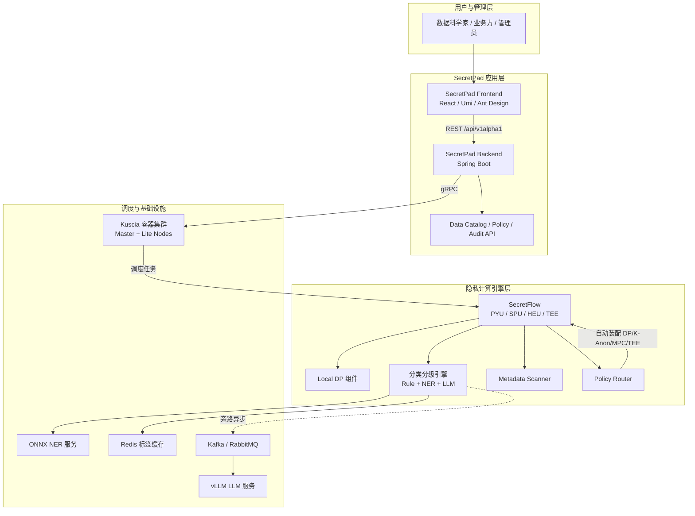
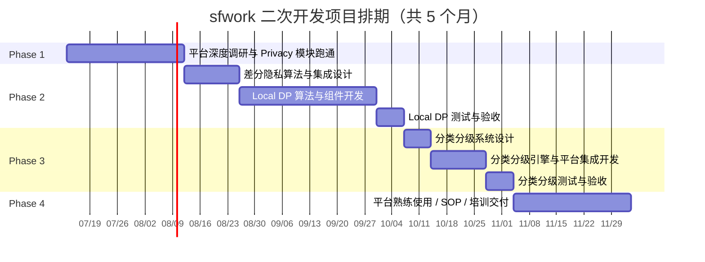
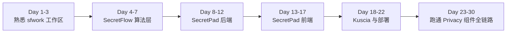
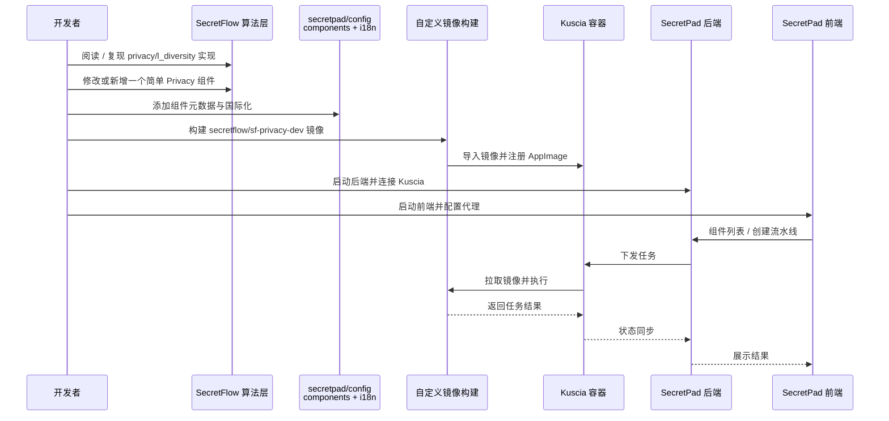
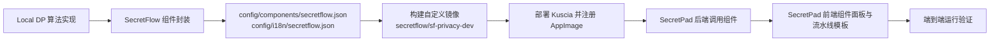
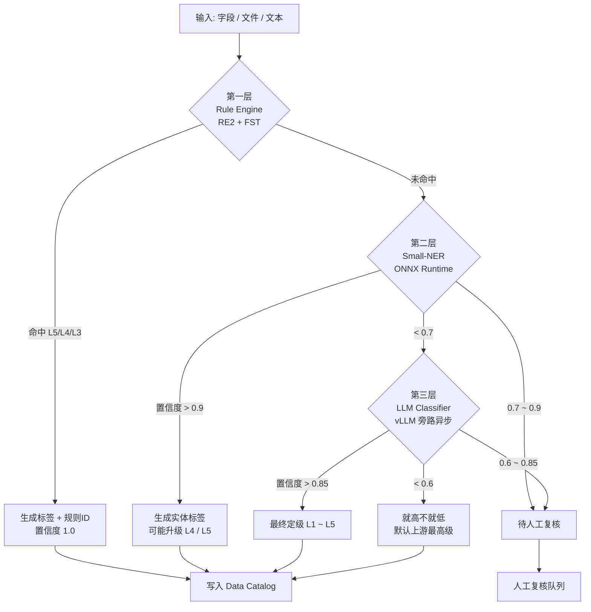
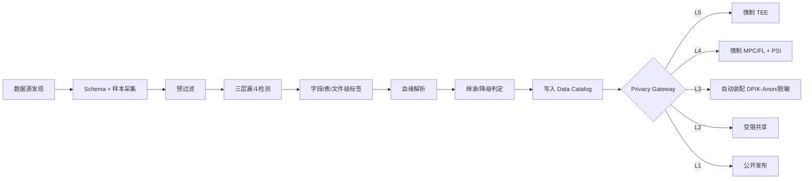
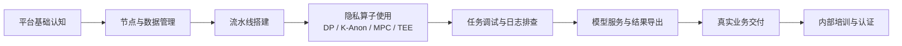
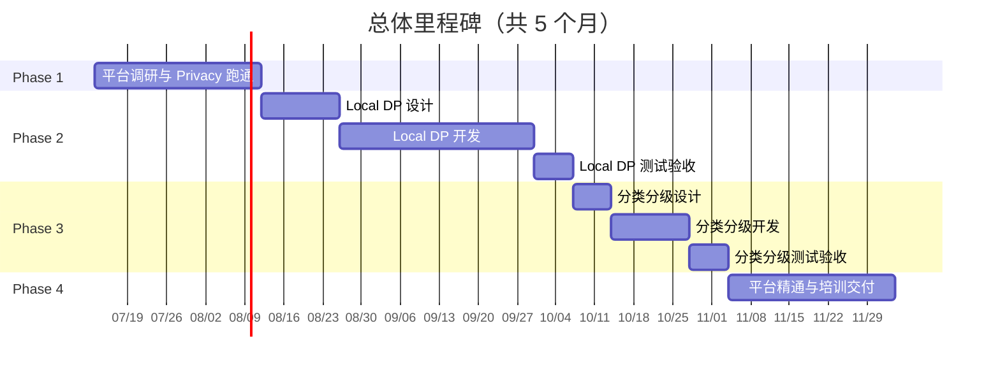
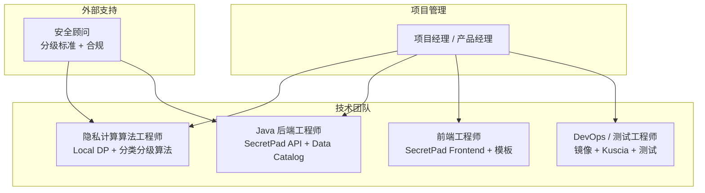

# sfwork 二次开发项目计划（顺序推进版）

> 基于 sfwork 工作区（Kuscia + SecretFlow + SecretPad + SecretPad Frontend）的二次开发项目计划。  
> 本计划采用**顺序推进、逐步深入**的策略：先通过 1 个月深度调研跑通完整链路，再依次开发本地差分隐私、数据安全分类分级，最终沉淀对现有联邦学习 / 安全多方计算平台的熟练使用。

---

## 1. 项目目标与总体策略

### 1.1 核心目标

| 顺序 | 阶段 | 目标 | 周期 |
|---|---|---|---|
| 1 | 平台深度调研与 Privacy 模块跑通 | 充分理解 SecretFlow 全栈架构（前端 / 后端 / Kuscia / 算法），并以简单 **Privacy** 组件为例跑通二次开发完整流程 | 1 个月 |
| 2 | 本地差分隐私模块开发 | 设计并实现 Local DP 算法，完成组件化、平台集成、镜像构建与端到端验证 | 2 个月 |
| 3 | 数据安全分类分级 | 设计并实现基于规则 + NER + LLM 的分类分级系统，集成到 SecretPad 治理体系 | 1 个月 |
| 4 | 精通联邦学习 / MPC 平台 | 沉淀 SOP、流水线模板、培训材料与实战 Lab，形成平台熟练使用与交付能力 | 1 个月 |

### 1.2 总体策略

- **先跑通，再深入**：第一阶段不追求功能复杂度，只要求对二次开发全链路有体感。
- **算法与平台集成并重**：每个功能模块都包含算法设计、组件实现、元数据注册、前后端集成、镜像构建、Kuscia 部署六个环节。
- **测试驱动**：每个阶段均设置设计评审、单元测试、集成测试、端到端验收四个质量门禁。
- **文档先行**：每个阶段同步输出对应文档，最终形成可交付的知识资产。

### 1.3 总体架构



---

## 2. 阶段总览



> 注：上图中日期仅为示意，实际启动时间可根据团队安排平移。

---

## 3. Phase 1：平台深度调研与 Privacy 模块跑通（1 个月）

### 3.1 阶段目标

- 全面了解 sfwork 工作区四大子项目的职责、交互方式与二次开发入口；
- 掌握 SecretFlow 组件开发规范、SecretPad 前后端扩展方式、Kuscia 镜像注册机制；
- 以现有简单 **Privacy** 模块（如 `privacy/l_diversity` 或 `privacy/differential_privacy`）为例，完整跑通“算法实现 → 组件注册 → 镜像构建 → Kuscia 部署 → 前端调用”全链路。

### 3.2 学习路径



### 3.3 调研内容

| 模块 | 调研重点 | 输出物 |
|---|---|---|
| **SecretFlow** | 组件基类、注册机制、`DistData`/`DomainData` 转换、`NodeEvalParam` 协议 | 源码阅读笔记 |
| **SecretPad 后端** | Spring Boot 多模块结构、JPA 实体、REST Controller、Kuscia gRPC 客户端、Flyway 迁移 | 接口与数据流图 |
| **SecretPad 前端** | Umi 4 路由、Valtio 状态、组件面板、流水线模板、DAG 画布 | 前端扩展点清单 |
| **Kuscia** | AppImage、DomainData、DomainRoute、Task 调度、端口映射、证书 | Kuscia 部署与调试手册 |
| **二次开发流程** | 自定义镜像构建、`config/components/*.json`、`config/i18n/*.json`、`dev-start.sh` | 可复用的开发清单 |

### 3.4 Privacy 模块跑通流程



### 3.5 任务清单

| 周次 | 任务 | 负责人 | 交付物 | 验收标准 |
|---|---|---|---|---|
| W1 | 环境搭建与源码通读 | 全栈 | 本地可运行环境 | `scripts/dev-start.sh` 一键启动成功 |
| W2 | SecretFlow 组件机制精读 | 算法 | 组件注册流程图 | 能独立解释 `Registry`、`Component`、`eval` 流程 |
| W2 | SecretPad 后端 API 与数据模型精读 | 后端 | 接口映射表 | 能新增一个简单 REST API |
| W3 | SecretPad 前端路由与组件面板精读 | 前端 | 前端扩展点清单 | 能新增一个前端页面并成功代理 |
| W3 | Kuscia 部署与镜像注册机制精读 | DevOps | Kuscia 调试手册 | 能手动导入镜像并查看 AppImage |
| W4 | 跑通 Privacy 模块全链路 | 全栈 | 可演示 Demo | 从 SecretPad 前端成功运行一个 Privacy 组件任务 |

### 3.6 本阶段主要工作

1. 搭建并熟悉 sfwork 开发环境，确保 `scripts/dev-start.sh` 可一键启动前后端与 Kuscia；
2. 系统阅读 SecretFlow 组件源码、SecretPad 后端代码、前端代码与 Kuscia 部署脚本，产出源码阅读笔记；
3. 梳理 SecretFlow 组件注册流程、SecretPad 数据流、Kuscia 镜像注册机制，形成可视化文档；
4. 以现有 `privacy/l_diversity` 或 `privacy/differential_privacy` 为例，完整跑通“算法修改 → 组件注册 → 镜像构建 → Kuscia 部署 → 前端调用”全链路；
5. 识别二次开发常见卡点（协议对齐、端口配置、证书生成、镜像导入、组件元数据同步），形成可复用开发清单与风险清单。

### 3.7 本阶段交付物

- 本地可运行的完整 sfwork 开发环境；
- 《sfwork 二次开发入门手册》初稿；
- SecretFlow 组件注册流程图、SecretPad 接口映射表、前端扩展点清单、Kuscia 调试手册；
- 可演示的 Privacy 组件二次开发 Demo；
- 后续三个阶段的开发清单、依赖关系与风险清单。

### 3.8 阶段验收

- [ ] 每位成员都能独立启动完整开发环境；
- [ ] 能清晰描述一次隐私计算任务从 SecretPad 前端到 Kuscia 容器执行的完整数据流；
- [ ] 完成一份《sfwork 二次开发入门手册》初稿。

---

## 4. Phase 2：本地差分隐私模块开发（2 个月）

### 4.1 阶段目标

- 设计并实现可在单节点本地执行的差分隐私组件；
- 完成算法组件化、SecretPad 集成、自定义镜像构建与端到端验证；
- 沉淀本地隐私处理模块的二次开发方法论，为后续分类分级奠定基础。

### 4.2 阶段拆分

| 子阶段 | 周期 | 重点 |
|---|---|---|
| 2.1 算法与集成设计 | 2 周 | Local DP 数学方案、敏感度策略、参数设计、平台集成接口 |
| 2.2 算法与组件开发 | 5 周 | SecretFlow 组件实现、SecretPad 前后端扩展、镜像构建 |
| 2.3 测试与验收 | 1 周 | 单元测试、集成测试、隐私预算验证、性能基线 |

### 4.3 Local DP 算法设计

#### 4.3.1 输入与参数

- **输入**：本地数据表（`VerticalTable` / `IndividualTable`）、列类型；
- **参数**：
  - `epsilon`：隐私预算 ε，默认 `1.0`；
  - `delta`：失败概率 δ，Gaussian 机制使用；
  - `mechanism`：`laplace` / `gaussian` / `none`；
  - `clip_lower` / `clip_upper`：数值列裁剪边界；
  - `sensitivity_mode`：`global` / `auto`。

#### 4.3.2 处理流程

```mermaid
flowchart TD
    A[输入本地数据表] --> B[按列识别数据类型]
    B --> C[数值列做 L1/L2 裁剪]
    C --> D{选择机制}
    D -->|laplace| E[注入 Laplace 噪声<br/>scale = Δf/ε]
    D -->|gaussian| F[注入 Gaussian 噪声<br/>σ² = 2Δf²·ln(1/δ)/ε²]
    D -->|none| G[仅裁剪，不加噪]
    E --> H[输出带噪数据表]
    F --> H
    G --> H
    H --> I[输出噪声统计报告<br/>均值/方差/实际 ε/δ]
```

### 4.4 Local DP 平台集成流程



### 4.5 任务清单

#### 4.5.1 设计阶段（2 周）

| 序号 | 任务 | 负责人 | 交付物 | 验收标准 |
|---|---|---|---|---|
| 2.1.1 | Local DP 算法设计 | 算法 | 算法设计文档 | 含敏感度分析、噪声公式、预算管理策略 |
| 2.1.2 | 平台集成方案设计 | 算法 + 后端 | 集成设计文档 | 明确组件参数、输入输出、SecretPad API 变更 |
| 2.1.3 | 前端交互设计 | 前端 + 产品 | 原型 | DP 参数配置、预览、报告展示 |

#### 4.5.2 开发阶段（5 周）

| 序号 | 任务 | 实现要点 | 参考目录 |
|---|---|---|---|
| 2.2.1 | Local DP 核心算法 | 实现裁剪、加噪、报告 | `secretflow/component/privacy/local_dp.py` |
| 2.2.2 | 组件注册 | `Registry` 注册、`__init__.py` | `secretflow/component/privacy/` |
| 2.2.3 | 单元测试 | 验证均值保留、ε-预算 | `tests/component/privacy/test_local_dp.py` |
| 2.2.4 | 组件元数据 | JSON 定义参数与输入输出 | `secretpad/config/components/secretflow.json` |
| 2.2.5 | 国际化 | 中英文组件名称与参数说明 | `secretpad/config/i18n/secretflow.json` |
| 2.2.6 | 前端模板 | DP 预处理流水线模板 | `secretpad-frontend/apps/platform/src/modules/template/` |
| 2.2.7 | 自定义镜像 | Dockerfile 自检 Local DP | `secretflow/docker/privacy-dev/Dockerfile` |
| 2.2.8 | Kuscia 部署验证 | 注册 AppImage、导入镜像 | `secretpad/scripts/install-kuscia-only.sh` |

#### 4.5.3 测试阶段（1 周）

| 序号 | 测试项 | 内容 | 通过标准 |
|---|---|---|---|
| 2.3.1 | 单元测试 | pytest 覆盖核心函数 | 核心函数覆盖率 ≥ 70% |
| 2.3.2 | 集成测试 | `dev-start.sh` 启动，运行 Local DP 流水线 | 任务成功 |
| 2.3.3 | 隐私验证 | 对比加噪前后分布、预算消耗 | 报告符合预期 |
| 2.3.4 | 性能测试 | 100 万行数据 Local DP 耗时 | 单节点 ≤ 5 分钟 |
| 2.3.5 | 组件注册测试 | 镜像内自检 Local DP 组件 | 通过 |

### 4.6 本阶段主要工作

1. 完成 Local DP 算法设计，明确敏感度计算、噪声机制（Laplace/Gaussian）、隐私预算管理策略；
2. 在 SecretFlow 中实现 `privacy/local_differential_privacy` 组件，覆盖裁剪、加噪、报告输出；
3. 为 Local DP 组件编写单元测试，验证均值保留、预算消耗与分布变化；
4. 在 SecretPad 中注册组件元数据与国际化，确保前端组件面板正确渲染；
5. 开发或复用前端流水线模板，支持用户配置 `epsilon`、`delta`、`mechanism` 等参数并查看噪声报告；
6. 更新 `secretflow/docker/privacy-dev/Dockerfile`，将 Local DP 组件与自检脚本打包进自定义镜像；
7. 部署 Kuscia 容器、注册 AppImage，完成后端 → Kuscia → 任务执行的端到端联调；
8. 执行单元测试、集成测试、隐私预算验证与性能基线测试。

### 4.7 本阶段交付物

- 《本地差分隐私算法设计》文档；
- 《本地差分隐私算法设计与集成手册》；
- SecretFlow `privacy/local_differential_privacy` 组件源码与单元测试；
- SecretPad 组件元数据（`config/components/secretflow.json`）与国际化（`config/i18n/secretflow.json`）；
- Local DP 流水线模板与前端噪声报告展示；
- 包含 Local DP 的自定义镜像 `secretflow/sf-privacy-dev:<version>`；
- 单元测试报告、集成测试报告、隐私预算验证报告与性能基线报告。

### 4.8 阶段验收

- [ ] Local DP 组件可在 SecretPad 前端拖拽使用；
- [ ] 加噪前后数据分布、隐私预算消耗可量化展示；
- [ ] 输出《本地差分隐私算法设计与集成手册》。

---

## 5. Phase 3：数据安全分类分级（1 个月）

### 5.1 阶段目标

- 基于 `docs/分类分级算法设计.md`，实现 L1–L5 五级分类分级系统；
- 完成三层漏斗检测引擎（Rule + Small-NER + LLM）、Data Catalog、Policy Router 的平台集成；
- 在 SecretPad 中提供资产目录、分级结果、规则管理、复核审批能力。

### 5.2 阶段拆分

| 子阶段 | 周期 | 重点 |
|---|---|---|
| 3.1 系统设计 | 1 周 | 五级矩阵、三层引擎、Data Catalog 模型、策略路由 |
| 3.2 引擎与平台开发 | 2 周 | Rule/NER/LLM 实现、Catalog/Policy API、前端页面 |
| 3.3 测试与验收 | 1 周 | 召回率、误报率、端到端场景、性能基线 |

### 5.3 五级分类与路由策略

| 等级 | 名称 | 典型数据 | 路由策略 |
|---|---|---|---|
| L1 | 公开级 | 公开统计 | 无限制 |
| L2 | 低风险 | 去标识化统计 | 联盟内受限共享 |
| L3 | 中风险 | PII / 基础诊疗 | DP / K-匿名 / 脱敏 |
| L4 | 高风险 | 敏感病种 / 高精度标识 | MPC / FL + PSI |
| L5 | 极高风险 | 基因 / 生物特征 | 强制 TEE |

### 5.4 三层漏斗检测引擎



### 5.5 分类分级执行流水线



### 5.6 任务清单

#### 5.6.1 设计阶段（1 周）

| 序号 | 任务 | 负责人 | 交付物 | 验收标准 |
|---|---|---|---|---|
| 3.1.1 | 五级分类矩阵细化 | 安全 + 算法 | 分类分级标准 V1.0 | 覆盖医疗/金融/通用 PII |
| 3.1.2 | 三层引擎接口设计 | 算法 + 后端 | 接口文档 | 明确 `RuleEngineManager` / `SmallNEREngine` / `LLMClassifier` |
| 3.1.3 | Data Catalog 数据模型设计 | 后端 | ER 图 | 含 Asset / SecurityTag / LineageEdge / ReviewTicket |
| 3.1.4 | 前端页面与审批流程设计 | 前端 + 产品 | 原型 | 资产目录、标签、复核、策略配置 |

#### 5.6.2 开发阶段（2 周）

| 序号 | 任务 | 实现要点 | 参考目录 |
|---|---|---|---|
| 3.2.1 | Rule Engine | RE2 正则 + FST 字典 | `secretflow/component/security/classification/rule_engine.py` |
| 3.2.2 | Small-NER 封装 | ONNX Runtime 推理、BIO 解码 | `secretflow/component/security/classification/small_ner.py` |
| 3.2.3 | LLM Classifier | vLLM 客户端、Prompt、JSON Schema | `secretflow/component/security/classification/llm_classifier.py` |
| 3.2.4 | Hybrid Router | 三层路由与人工复核队列 | `secretflow/component/security/classification/hybrid_router.py` |
| 3.2.5 | Metadata Scanner | 数据源适配、Schema 采样 | `secretflow/component/discovery/metadata_scanner.py` |
| 3.2.6 | Data Catalog | JPA 实体、REST API、版本冻结 | `secretpad-service` / `secretpad-persistence` |
| 3.2.7 | Policy Router | 策略匹配、计算图改写调用点 | `secretpad-service` |
| 3.2.8 | 前端页面 | 资产目录、标签详情、复核队列、策略配置 | `secretpad-frontend/apps/platform/src/pages/...` |
| 3.2.9 | 组件注册 | 元数据 + 国际化 | `secretpad/config/components/secretflow.json` |
| 3.2.10 | 自定义镜像 | 包含分类分级引擎与模型依赖 | `secretflow/docker/privacy-dev/Dockerfile` |

#### 5.6.3 测试阶段（1 周）

| 序号 | 测试项 | 内容 | 通过标准 |
|---|---|---|---|
| 3.3.1 | 规则引擎测试 | 身份证、手机号、ICD-10、基因文件头 | L5/L4 召回率 ≥ 99.9%，延迟 <1ms/字段 |
| 3.3.2 | NER 测试 | 医疗实体识别 | 5 类实体 F1 ≥ 70%，延迟 <50ms |
| 3.3.3 | LLM 测试 | JSON 输出合法性、复杂场景推断 | JSON 合法率 ≥ 95% |
| 3.3.4 | 端到端场景 | 结构化数据出域 / 出院小结 / 血缘继承 | 3 个场景通过 |
| 3.3.5 | 策略路由测试 | L5→TEE、L4→MPC、L3→DP/K-Anon | 计算图改写正确 |
| 3.3.6 | 性能测试 | 全库扫描吞吐 / 标签同步 | ≥1 万表/小时，<5s |

### 5.7 本阶段主要工作

1. 细化 L1–L5 五级分类矩阵，覆盖医疗、金融与通用 PII 场景；
2. 实现第一层 Rule Engine：基于 RE2 与 FST 的身份证、手机号、ICD-10、基因文件头等高速规则匹配；
3. 实现第二层 Small-NER：接入 `RaNER` 或 `UIE-medical-base` 的 ONNX 推理封装，识别 PII、敏感病种、基因暗示、用药记录；
4. 实现第三层 LLM Classifier：私有化 vLLM 旁路调用，输出结构化 JSON，处理复杂影像报告与跨段落推断；
5. 实现 Hybrid Router 与人工复核队列，按置信度路由并处理低置信标签；
6. 实现 Metadata Scanner 与 Data Catalog，支持标签写入、查询、版本冻结与血缘注册；
7. 实现 Policy Router，使 L1–L5 标签自动触发 DP / K-Anon / 脱敏 / MPC / TEE 算子装配；
8. 在 SecretPad 前端开发资产目录、标签详情、复核队列、策略配置、规则管理页面；
9. 完成组件注册、自定义镜像构建、Kuscia 部署与端到端场景验证。

### 5.8 本阶段交付物

- 《数据安全分类分级标准 V1.0》；
- 《数据安全分类分级系统设计与集成手册》；
- Rule Engine / Small-NER / LLM Classifier / Hybrid Router 源码与单元测试；
- Metadata Scanner、Data Catalog Client、Policy Router 源码；
- SecretPad Data Catalog / Policy / Audit API 与 Flyway 迁移脚本；
- SecretPad 前端资产目录、标签详情、复核队列、策略配置、规则管理页面；
- 分类分级组件元数据与国际化；
- 包含分类分级引擎的自定义镜像；
- 端到端场景测试报告与性能基线报告。

### 5.9 阶段验收

- [ ] 新接入数据源后 T+1 自动完成扫描并写入 Catalog；
- [ ] 前端可查看表级/字段级标签、血缘路径、复核状态；
- [ ] L3/L4/L5 标签可自动触发对应隐私算子装配；
- [ ] 输出《数据安全分类分级系统设计与集成手册》。

---

## 6. Phase 4：精通联邦学习 / 安全多方计算平台（1 个月）

### 6.1 阶段目标

- 将前三个阶段沉淀的平台使用经验转化为可复用资产；
- 建立标准操作流程（SOP）、可复用流水线模板、培训材料与实战 Lab；
- 使团队能够熟练使用现有联邦学习（FL）与安全多方计算（MPC）平台完成真实业务交付。

### 6.2 平台精通路线图



### 6.3 建设内容

| 类别 | 内容 | 交付物 |
|---|---|---|
| **SOP** | 节点接入、数据注册、样本对齐、组件配置、任务运行、日志排查、结果导出 | 《联邦学习平台使用手册》 |
| **模板库** | 横向联邦 LR / XGBoost、纵向联邦特征工程 + 训练、联邦评估、模型服务、Local DP 预处理、自动脱敏 | 6+ 流水线模板 |
| **实战 Lab** | 使用公开医疗/金融数据集完成端到端联邦学习项目 | 3+ 可运行 Lab |
| **培训体系** | 视频教程、PPT、在线测评、认证证书 | 培训材料包 |
| **最佳实践** | 参数调优、性能优化、故障排查、安全防护 | 《最佳实践与常见问题》 |

### 6.4 任务清单

| 周次 | 任务 | 负责人 | 交付物 | 验收标准 |
|---|---|---|---|---|
| W1 | 梳理平台核心操作流程 | 产品 + 算法 | SOP 初稿 | 覆盖节点/数据/任务/日志 |
| W2 | 开发流水线模板 | 前端 + 算法 | 6+ 模板 | 每个模板可一键导入运行 |
| W3 | 制作培训材料与 Lab | 产品 + 全栈 | PPT/视频/Lab | 通过内部试讲 |
| W4 | 培训交付与测评 | 产品 + 算法 | 测评报告 | 参训人员 80% 通过测评 |

### 6.5 本阶段主要工作

1. 梳理联邦学习 / MPC 平台从节点接入、数据注册、样本对齐、组件配置、任务运行到结果导出的完整操作流程；
2. 输出标准操作流程（SOP），明确每个步骤的操作命令、检查点与常见问题；
3. 基于前三个阶段沉淀的 Local DP、分类分级、隐私算子等能力，开发 6 个以上可复用流水线模板；
4. 准备 3 个以上实战 Lab，使用公开医疗/金融数据集完成端到端联邦学习项目；
5. 制作培训 PPT、视频教程、在线测评问卷与认证机制；
6. 组织至少 1 次内部培训，收集反馈并迭代 SOP、模板与培训材料；
7. 沉淀《最佳实践与常见问题》，覆盖参数调优、性能优化、故障排查、安全防护与合规审计。

### 6.6 本阶段交付物

- 《联邦学习平台使用手册》；
- 《最佳实践与常见问题》；
- 6 个以上 SecretPad 流水线模板（含横向 LR/XGB、纵向特征工程、Local DP 预处理、自动脱敏等）；
- 3 个以上可运行实战 Lab；
- 培训 PPT / 视频 / 在线测评问卷；
- 内部培训测评报告与认证记录。

### 6.7 阶段验收

- [ ] 完成《联邦学习平台使用手册》与《最佳实践与常见问题》；
- [ ] 6 个以上流水线模板可在 SecretPad 中导入并运行；
- [ ] 完成至少 1 次内部培训，参训人员通过率 ≥ 80%。

---

## 7. 里程碑与排期总表



| 里程碑 | 时间 | 关键交付 |
|---|---|---|
| M1：平台跑通 | Phase 1 结束 | 完整二次开发链路跑通、《sfwork 二次开发入门手册》 |
| M2：Local DP 设计完成 | Phase 2.1 结束 | 算法设计文档、集成方案、原型 |
| M3：Local DP 可用 | Phase 2.2 结束 | 组件注册、镜像构建、前端可用 |
| M4：Local DP 验收通过 | Phase 2.3 结束 | 测试报告、《本地差分隐私算法设计与集成手册》 |
| M5：分类分级设计完成 | Phase 3.1 结束 | 五级矩阵、接口/数据模型设计 |
| M6：分类分级可用 | Phase 3.2 结束 | 三层引擎 + Catalog + 前端可用 |
| M7：分类分级验收通过 | Phase 3.3 结束 | 端到端场景通过、《数据安全分类分级系统设计与集成手册》 |
| M8：平台精通交付 | Phase 4 结束 | SOP、模板库、培训材料、测评报告 |

---

## 8. 角色分工建议



| 角色 | 人数 | 主要职责 |
|---|---|---|
| 项目经理/产品经理 | 1 | 排期、验收、培训组织、SOP 沉淀 |
| 隐私计算算法工程师 | 1–2 | SecretFlow 组件、Local DP、分类分级引擎、模型选型 |
| Java 后端工程师 | 1 | SecretPad 扩展、Data Catalog、Policy API、Kuscia 集成 |
| 前端工程师 | 1 | 组件面板、流水线模板、资产目录、复核/策略页面 |
| DevOps/测试工程师 | 1 | 镜像构建、Kuscia 部署、测试、性能压测 |
| 安全顾问 | 0.5 | 五级分类标准、隐私预算策略、合规审计 |

---

## 9. 风险与应对

| 风险 | 影响 | 应对措施 |
|---|---|---|
| Phase 1 学习周期被拉长 | 高 | 明确每日学习目标，以 Privacy 组件跑通为硬截止；每天 30 分钟站会对齐 |
| Local DP 算法与平台集成脱节 | 高 | 设计阶段强制输出集成方案，开发中每两周做一次端到端联调 |
| Small-NER/LLM 推理延迟高 | 中 | 准备降级方案：Rule Engine 单独可用，NER 可切换 UIE-medical-base，LLM 可异步旁路 |
| 分类分级规则漏报/误报 | 中 | L5/L4 追求召回优先，L3 通过人工复核逐步降低误报；建立规则灰度机制 |
| Kuscia 端口/证书/镜像冲突 | 中 | 严格遵循 `application-dev.yaml` 与环境变量；每次部署前清理旧容器 |
| 前端组件元数据与后端不一致 | 中 | 统一维护 `config/components/*.json` 与 `i18n/*.json`；提交前 diff 检查 |
| 平台精通阶段流于文档 | 中 | 设置实战 Lab 与测评，要求参训人员必须完成 1 个端到端项目 |

---

## 10. 交付物清单

### 10.1 代码交付物

- SecretFlow 组件：
  - `privacy/local_differential_privacy`
  - `security/classification`（RuleEngineManager、SmallNEREngine、LLMClassifier、HybridRouter）
  - `discovery/metadata_scanner`
  - `security/policy_router`
- SecretPad 后端：Data Catalog / Policy / Audit API、Flyway 脚本；
- SecretPad 前端：资产目录、标签详情、复核队列、策略配置、规则管理、流水线模板、新手引导；
- 自定义镜像：`secretflow/sf-privacy-dev:<version>`。

### 10.2 文档交付物

- `docs/二次开发项目计划.md`（本文档）
- `docs/sfwork 二次开发入门手册.md`
- `docs/本地差分隐私算法设计.md`
- `docs/本地差分隐私算法设计与集成手册.md`
- `docs/数据安全分类分级系统设计与集成手册.md`
- `docs/联邦学习平台使用手册.md`
- `docs/最佳实践与常见问题.md`

### 10.3 培训交付物

- 平台使用培训 PPT/视频；
- 联邦学习实操 Lab（含示例数据）；
- 数据分类分级复核与策略配置演练；
- 平台熟练度测评问卷与认证机制。

---

## 11. 下一步行动

1. **本周内启动 Phase 1**：团队每人完成 `scripts/dev-start.sh` 环境启动，并通读 `privacy/l_diversity` 源码。
2. **制定每日学习计划**：按“SecretFlow → 后端 → 前端 → Kuscia → 跑通”的顺序，每天产出学习笔记。
3. **确定 Phase 2 的 Local DP 参数范围**：组织算法、产品、安全三方评审，明确 ε/δ 默认值与业务可接受误差。
4. **创建项目看板**：将四个阶段拆分为可跟踪的 Task，每周五进行阶段 Review。
5. **先做一个 2 周冲刺 Demo**：以跑通 Privacy 组件为目标，验证整个二次开发链路是否通畅。
