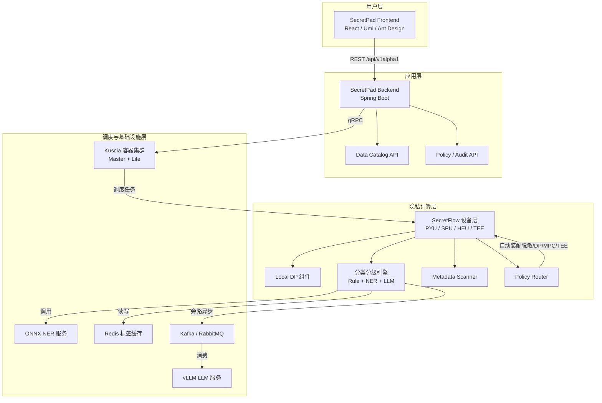
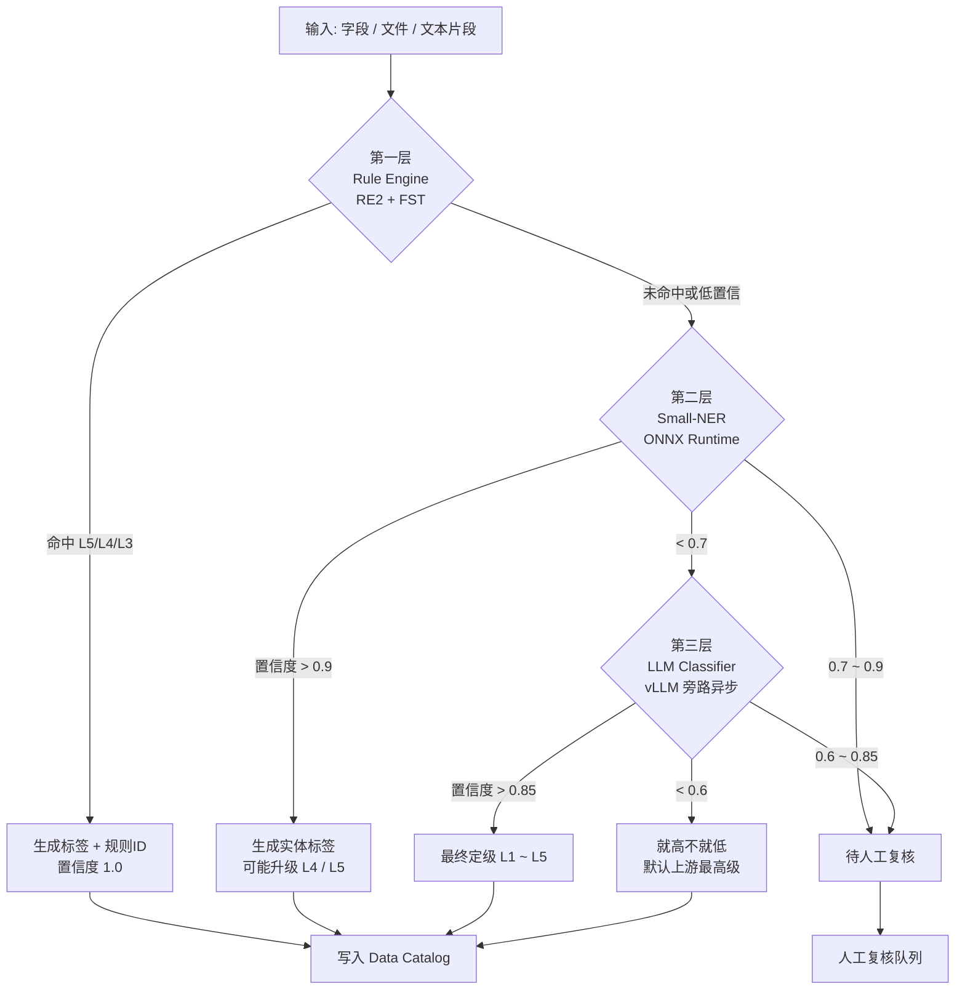
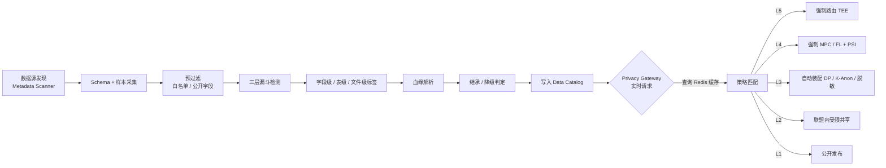
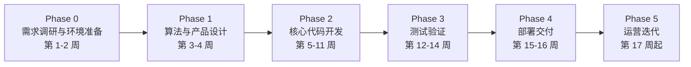

# sfwork 二次开发项目计划

> 基于 sfwork 工作区（Kuscia + SecretFlow + SecretPad + SecretPad Frontend）的二次开发项目计划。  
> 目标：在现有联邦学习平台基础上，完成**本地差分隐私**、**数据安全分类分级**、**平台熟练使用**三大能力建设，并可持续交付、可复用、可演示。

---

## 1. 项目背景与目标

### 1.1 项目背景

sfwork 是 SecretFlow 隐私计算生态的本地开发工作区，核心包含：

| 项目 | 技术栈 | 职责 |
|---|---|---|
| Kuscia | Go / Kubernetes / gRPC | 任务调度、节点通信、镜像管理 |
| SecretFlow | Python (JAX/NumPy/SPU/HEU) | 隐私计算算法与组件实现 |
| SecretPad | Java / Spring Boot | Web 管理后台、REST API、数据管理 |
| SecretPad Frontend | TypeScript / React / Umi | 前端界面、流水线画布、组件面板 |

当前工作区已完成：

- 自定义隐私计算镜像 `secretflow/sf-privacy-dev:1.15.0.dev-privacy` 的构建与注册；
- `privacy/l_diversity` 组件的成功集成与端到端验证；
- 前后端 + Kuscia 容器的本地开发联调通路已打通。

### 1.2 项目目标

1. **本地差分隐私（Local DP）**
   - 实现可在单节点本地执行的差分隐私组件，支持 Laplace / Gaussian 噪声注入；
   - 集成到 SecretPad 组件面板、流水线模板、自定义镜像；
   - 提供可配置的隐私预算（ε/δ）与敏感度计算策略。

2. **数据安全分类分级**
   - 建立五级分类标准（L1 公开 / L2 低风险 / L3 中风险 / L4 高风险 / L5 极高风险），覆盖医疗/金融/通用 PII 场景；
   - 实现**三层漏斗式检测引擎**：高速规则引擎（RE2/FST）+ 轻量医疗 NER（ONNX）+ 大模型语义判别器（vLLM 旁路异步）；
   - 构建 **Data Catalog**（数据资产目录）、**血缘继承引擎**、**人工复核队列**；
   - 实现**标签即策略（Tag-as-Policy）**：分类标签自动触发脱敏 / DP / K-匿名 / MPC / TEE 等隐私算子的装配与路由；
   - 在 SecretPad 中提供资产目录、分级结果、规则管理、复核审批、策略路由等治理能力。

3. **现有联邦学习平台熟练使用**
   - 沉淀标准操作流程（SOP）与最佳实践文档；
   - 提供可复用的联邦学习流水线模板（LR、XGB、神经网络、特征工程）；
   - 建立前端引导式教程与技能测评机制，降低新用户上手门槛。

> 数据安全分类分级的详细算法设计见 `docs/分类分级算法设计.md`。本计划将其工程化路径与 sfwork 工作区深度结合。

---

## 2. 总体技术路线

```text
需求分析 → 算法/产品设计 → 分层开发 → 单元/集成/E2E 测试 → 镜像构建 → Kuscia 部署 → 培训交付 → 持续迭代
```

### 2.1 关键技术决策

| 决策项 | 方案 | 理由 |
|---|---|---|
| 算法实现层 | SecretFlow Python 组件 | 与现有 `privacy/l_diversity` 对齐，复用组件注册与镜像机制 |
| 元数据与配置 | SecretPad `config/components/*.json` + `i18n/*.json` | 已有成熟的组件加载与国际化机制 |
| 数据分类分级引擎 | 独立 Python 引擎（Rule + NER + LLM）+ SecretFlow PYU 组件 + SecretPad Data Catalog | 符合 `docs/分类分级算法设计.md` 的三层漏斗与标签即策略架构 |
| 模型推理部署 | ONNX Runtime（Small-NER）+ vLLM（LLM）+ Kafka/RabbitMQ 旁路队列 | 低延迟、私有化、异步解耦 |
| 策略路由 | Privacy Gateway：Catalog 查询 + 计算图改写 + Kuscia/SecretFlow 调度 | 实时拦截请求并按标签路由到 TEE/MPC/DP/K-Anon |
| 平台教程 | 前端模板 + Markdown 文档 + 示例项目 | 不侵入核心代码，可独立迭代 |
| 部署方式 | Docker 容器化 + `scripts/dev-start.sh` | 与当前工作区保持一致，便于二次开发验证 |

### 2.2 总体架构



---

## 3. 主要功能模块详细设计

### 3.1 本地差分隐私（Local DP）

#### 3.1.1 功能定义

在数据不出域的前提下，对本地数据表添加符合差分隐私要求的噪声，生成可用于下游联邦学习或联合统计的脱敏数据。

#### 3.1.2 算法设计

1. **输入**：本地数据表（`VerticalTable` / `IndividualTable`）、列类型、预算参数。
2. **参数**：
   - `epsilon`：隐私预算 ε，默认 `1.0`；
   - `delta`：失败概率 δ，Gaussian 机制时使用；
   - `mechanism`：`laplace` / `gaussian` / `none`；
   - `clip_lower` / `clip_upper`：数值列裁剪边界；
   - `sensitivity_mode`：`global`（用户提供）/ `auto`（基于分位数估计）。
3. **处理流程**：
   - 按列识别数据类型（数值 / 类别 / 文本）；
   - 对数值列做 L1 / L2 裁剪；
   - 根据机制注入噪声：`Lap(Δf/ε)` 或 `N(0, 2Δf²·ln(1/δ)/ε²)`；
   - 输出带噪声的数据表与噪声统计报告（均值、方差、实际 ε/δ）。
4. **预算管理**（可选增强）：
   - 单表级别预算池，避免重复调用导致预算耗尽；
   - 与 `privacy/differential_privacy` 全局 DP 组件形成互补。

#### 3.1.3 代码实现范围

| 仓库 | 目录/文件 | 工作项 |
|---|---|---|
| secretflow | `secretflow/component/privacy/local_dp.py` | 实现 Local DP 组件核心逻辑 |
| secretflow | `secretflow/component/privacy/__init__.py` | 注册新组件 |
| secretflow | `tests/component/privacy/test_local_dp.py` | 单元测试 |
| secretpad | `config/components/secretflow.json` | 添加组件元数据 |
| secretpad | `config/i18n/secretflow.json` | 添加中英文国际化 |
| secretpad-frontend | `apps/platform/src/modules/template/...` | 可选：Local DP 快速模板 |
| secretflow | `docker/privacy-dev/Dockerfile` | 确保新组件打入自定义镜像 |

---

### 3.2 数据安全分类分级

详细设计来源：`docs/分类分级算法设计.md`。

#### 3.2.1 功能定义

对平台接入的数据集进行自动化、可配置的安全分类与分级，帮助数据所有者识别敏感字段、制定脱敏/访问策略，并支持分级审批与策略自动下发。

#### 3.2.2 五级分类标准矩阵

| 等级 | 名称 | 典型数据 | 自动化识别手段 | 下游计算路由策略 |
|---|---|---|---|---|
| **L1 公开级** | 公开运营/统计 | 年度门诊量、公开财务 | 白名单字典 | 无限制发布 |
| **L2 低风险** | 去标识化统计 | 科室运营、脱敏分布 | K-匿名/L-多样性通过 | 联盟内受限共享 |
| **L3 中风险** | PII / 基础诊疗 | 身份证、手机号、血常规 | 正则+校验和、字典、轻量 NER | DP 加噪（ε≤1.0）或 PII 掩码 |
| **L4 高风险** | 敏感病种 / 高精度标识 | HIV、精神病历、完整住院记录 | ICD-10 区间、NLP 敏感病种、多字段组合 | MPC/FL + PSI，禁止明文导出 |
| **L5 极高风险** | 基因/生物特征模板 | BAM/VCF/FASTQ、BRCA1/TP53 | 文件头魔数、基因字典、序列模式、LLM 推断 | 强制 TEE，远程证明，禁止联邦明文聚合 |

#### 3.2.3 三层漏斗式检测引擎

按**速度由快到慢、成本由低到高**逐级过滤：



1. **第一层：高速规则与字典引擎（Rule & Regex Engine）**
   - RE2 正则 + Double Array Trie / FST 字典；
   - 覆盖身份证、手机号、医保卡号、ICD-10 区间、基因字段名、BAM/VCF 文件头；
   - 目标：L3/L4/L5 的 **100% 召回**。

2. **第二层：轻量级医疗 NER（Small-NER）**
   - 推荐 `damo/nlp_raner_named-entity-recognition_chinese-base-cmeee` 或 `uie-medical-base`；
   - 导出 ONNX，ONNX Runtime 本地推理，单条 <50ms；
   - 识别 PII_NAME、PII_ID、SENSITIVE_DISEASE、GENOMIC_HINT、MEDICATION；
   - 同段落出现敏感病种 + PII 时升级为 L4；出现基因暗示时标记 L5 待确认。

3. **第三层：大模型语义判别器（LLM Classifier）**
   - 私有化部署 `Medical-Qwen3-14B` 或 `Baichuan-Med`，vLLM 服务化；
   - 旁路异步调用（Kafka/RabbitMQ），处理 OCR 影像报告、跨段落推断、罕见病推断；
   - 强制输出结构化 JSON：`final_level`、`confidence`、`reasoning`、`suggested_action`、`needs_human_review`。

#### 3.2.4 自动化执行流水线



1. **元数据发现（Metadata Discovery）**：扫描 MySQL/PostgreSQL/Hive/S3/HDFS/Kafka，采集 Schema + 前 1000 行 + 5% 随机样本；
2. **异步扫描与打标（Scanning & Tagging）**：预过滤 → 三层漏斗 → 字段级/表级/文件级标签；
3. **血缘与继承（Lineage & Inheritance）**：字段级血缘追踪，直接复制继承最高级，经 K-Anon/DP/脱敏白名单算子后可降级，聚合统计满足 K-匿名可降级；
4. **Data Catalog 注册中心**：存储 Asset、SecurityTag、LineageEdge，支持版本冻结、人工审计、标签查询；
5. **Privacy Gateway 策略联动**：请求级实时查询 Catalog 缓存 → 匹配策略 → 自动改写计算图并路由到 TEE/MPC/DP/K-Anon/脱敏。

#### 3.2.5 代码实现范围

| 仓库 | 目录/文件 | 工作项 |
|---|---|---|
| secretflow | `secretflow/component/security/classification/` | 分类分级引擎：RuleEngineManager、SmallNEREngine、LLMClassifier、HybridRouter |
| secretflow | `secretflow/component/discovery/metadata_scanner.py` | 元数据扫描器 PYU 组件 |
| secretflow | `secretflow/component/security/data_catalog.py` | Data Catalog 客户端与标签同步 |
| secretflow | `secretflow/component/security/policy_router.py` | 策略匹配与计算图改写 |
| secretflow | `secretflow/security/classification/rules*.yaml` | 规则与字典配置 |
| secretflow | `tests/component/security/test_classification_*.py` | 三层引擎与策略路由单元测试 |
| secretpad | 后端新增 `DataCatalogService`、`PolicyService`、`AuditService`、`ClassificationController` | Catalog/策略/审计 API |
| secretpad | 新增 JPA Entity：`AssetDO`、`SecurityTagDO`、`LineageEdgeDO`、`ReviewTicketDO`、`ClassificationRuleDO` | 持久化 |
| secretpad | `config/schema/center/VX__classification.sql` | Flyway 迁移脚本 |
| secretpad-frontend | 新增页面：数据资产目录、字段级标签、血缘图谱、复核队列、策略配置 | 前端 UI |
| secretpad | `config/components/secretflow.json` + `i18n/secretflow.json` | 注册扫描/脱敏/策略组件 |

---

### 3.3 联邦学习平台熟练使用

#### 3.3.1 目标

将团队对 SecretFlow / SecretPad / Kuscia 的使用经验沉淀为可复用资产，缩短新成员与业务方的上手周期。

#### 3.3.2 建设内容

1. **标准操作流程（SOP）**
   - 节点接入与授权；
   - 数据注册与样本对齐；
   - 组件选择与参数配置；
   - 任务运行、日志排查、结果导出。
2. **可复用流水线模板**
   - 横向联邦 LR；
   - 横向联邦 XGBoost；
   - 纵向联邦特征工程 + 训练；
   - 联邦评估与模型服务；
   - **新增**：Local DP 预处理模板、分类分级自动脱敏模板。
3. **前端引导式教程**
   - 登录后新手引导；
   - 创建第一个联邦学习项目 Wizard；
   - 关键页面 Tooltip / 视频弹窗。
4. **技能测评与认证**
   - 在线问卷 + 实操任务评分；
   - 平台使用熟练度报告。

#### 3.3.3 代码实现范围

| 仓库 | 目录/文件 | 工作项 |
|---|---|---|
| secretpad-frontend | `apps/platform/src/modules/template/pipeline-template-*.ts` | 新增联邦学习模板 |
| secretpad-frontend | `apps/platform/src/modules/guide/...` | 新手引导组件 |
| secretpad | 后端新增 `TemplateService` 扩展 | 模板分类、权限 |
| sfwork/docs | `docs/联邦学习平台使用手册.md` | SOP 文档 |
| sfwork/docs | `docs/最佳实践与常见问题.md` | 运维与调优指南 |

---

## 4. 详细工作计划



### Phase 0：需求调研与环境准备（第 1–2 周）

| 序号 | 任务 | 负责人 | 交付物 | 验收标准 |
|---|---|---|---|---|
| 0.1 | 明确三大功能的业务场景、合规要求、性能指标 | 产品经理 + 算法 | 需求规格说明书 | 评审通过 |
| 0.2 | 复现并掌握当前 sfwork 一键启动流程 | 全栈/后端 | 可运行的本地环境 | `scripts/dev-start.sh` 成功 |
| 0.3 | 学习现有 `privacy/l_diversity` 与 `privacy/differential_privacy` 源码 | 算法 | 源码阅读笔记 | 输出组件注册流程图 |
| 0.4 | 研读 `docs/分类分级算法设计.md`，明确五级标准与三层引擎 | 算法 + 后端 | 算法理解清单 | 能复述 L1–L5 路由策略 |
| 0.5 | Small-NER 与 LLM 选型及私有化部署可行性验证 | 算法 + DevOps | 选型报告 | ONNX/vLLM 本地可运行 |
| 0.6 | 梳理 SecretPad 数据管理、节点管理、流水线后端 API | 后端/前端 | 接口清单 | 输出 API 映射表 |
| 0.7 | 制定数据分级标准与规则初稿 | 安全/产品 | 分类分级标准 V1.0 | 评审通过 |

### Phase 1：算法与产品设计（第 3–4 周）

| 序号 | 任务 | 负责人 | 交付物 | 验收标准 |
|---|---|---|---|---|
| 1.1 | Local DP 算法设计：敏感度、噪声机制、预算管理 | 算法 | 算法设计文档 | 数学推导与伪代码 |
| 1.2 | 数据分类分级算法设计：五级矩阵、三层漏斗、Data Catalog、血缘继承、Policy Router | 算法 + 后端 | 分类分级设计文档 | 规则覆盖度 ≥ 90%，L5/L4 召回目标 ≥ 99.9% |
| 1.3 | SecretPad 后端数据模型与 API 设计（Catalog/Policy/Audit） | 后端 | API/DB 设计文档 | Swagger/ER 图 |
| 1.4 | 前端页面与交互设计（资产目录、标签、复核、策略、引导教程） | 前端 + 产品 | Figma/原型 | 评审通过 |
| 1.5 | 平台熟练度 SOP 与模板清单设计 | 产品 + 算法 | 模板清单 | 覆盖 4+ 典型场景 |

### Phase 2：核心代码开发（第 5–11 周）

#### 2.1 SecretFlow 算法层

| 序号 | 任务 | 实现要点 | 参考目录 |
|---|---|---|---|
| 2.1.1 | Local DP 组件开发 | 继承组件框架，实现 `execute`/`evaluate` | `secretflow/component/privacy/` |
| 2.1.2 | Local DP 单元测试 | 模拟数据验证 ε-差分隐私、均值保留 | `tests/component/privacy/` |
| 2.1.3 | 第一层 Rule Engine | RE2 正则 + FST 字典：身份证、手机号、ICD-10、基因文件头 | `secretflow/component/security/classification/` |
| 2.1.4 | 第二层 Small-NER | ONNX 推理封装（RaNER/UIE-medical-base）、BIO 解码、置信度 | `secretflow/component/security/classification/` |
| 2.1.5 | 第三层 LLM Classifier | vLLM 客户端、Prompt 模板、Pydantic JSON Schema、Kafka 旁路 | `secretflow/component/security/classification/` |
| 2.1.6 | Hybrid Router + Review Queue | 三层路由决策、人工复核工单 | `secretflow/component/security/classification/` |
| 2.1.7 | Metadata Scanner + Data Catalog Client | 数据源适配、Schema 采样、标签写入 | `secretflow/component/discovery/` |
| 2.1.8 | Lineage Engine + Policy Router | 血缘解析、继承规则、反识别触发、计算图改写 | `secretflow/component/security/classification/` |
| 2.1.9 | 分类分级单元测试 | 100+ 用例，覆盖医疗边界值 | `tests/component/security/` |
| 2.1.10 | 构建自定义镜像 | 更新 `docker/privacy-dev/Dockerfile`，加入 Rule/NER/LLM 依赖与自检 | `secretflow/docker/privacy-dev/` |

#### 2.2 SecretPad 后端

| 序号 | 任务 | 实现要点 | 参考目录 |
|---|---|---|---|
| 2.2.1 | Data Catalog 数据模型与 Flyway 脚本 | JPA Entity：`AssetDO`、`SecurityTagDO`、`LineageEdgeDO`、`ReviewTicketDO`、`ClassificationRuleDO` + `schema/center/VX__*.sql` | `secretpad-persistence` |
| 2.2.2 | Catalog / Policy / Audit Service & Controller | REST API：`/api/v1alpha1/datacatalog/*`、`/api/v1alpha1/policy/*`、`/api/v1alpha1/audit/*` | `secretpad-service`、`secretpad-web` |
| 2.2.3 | Privacy Gateway 集成 | 请求级 Catalog 缓存查询、策略匹配、计算图改写调用点 | `secretpad-service` |
| 2.2.4 | 注册 SecretFlow 新组件元数据 | 更新 `config/components/secretflow.json` + `i18n` | `secretpad/config/` |
| 2.2.5 | 模板管理接口扩展 | 支持模板分类、示例项目一键导入 | `secretpad-service` |
| 2.2.6 | 后端单元测试 | JUnit + Mockito | `secretpad-web/src/test/...` |

#### 2.3 SecretPad 前端

| 序号 | 任务 | 实现要点 | 参考目录 |
|---|---|---|---|
| 2.3.1 | 数据资产目录页面 | 表/文件列表、字段级标签、最高等级标识 | `apps/platform/src/pages/...` |
| 2.3.2 | 标签详情与血缘图谱 | 字段标签、置信度、来源引擎、血缘路径可视化 | 同上 |
| 2.3.3 | 复核队列 / 审计页面 | 待复核、已确认、双人复核、操作留痕 | 同上 |
| 2.3.4 | 策略配置页面 | L1–L5 路由策略、算子白名单、默认保守策略 | 同上 |
| 2.3.5 | 规则管理页面 | 规则增删改查、优先级、启用开关、ICD-10/字典管理 | 同上 |
| 2.3.6 | 新增组件面板国际化 | 确认 `privacy/local_dp`、`discovery/metadata_scanner` 等显示正常 | `config/i18n/secretflow.json` |
| 2.3.7 | 流水线模板扩展 | 新增 Local DP 预处理、自动脱敏、联邦学习模板 | `apps/platform/src/modules/template/` |
| 2.3.8 | 新手引导组件 | Wizard、Tooltip、帮助视频入口 | `apps/platform/src/modules/guide/` |
| 2.3.9 | 前端单元测试 | Jest + React Testing Library | 同模块 `__tests__` |

#### 2.4 模型与基础设施

| 序号 | 任务 | 实现要点 | 参考工具 |
|---|---|---|---|
| 2.4.1 | Small-NER 模型导出与 ONNX Runtime 服务 | `paddle2onnx` / ModelScope 导出，本地推理服务 | ONNX Runtime |
| 2.4.2 | LLM vLLM 服务部署 | 本地私有化部署，Guided Decoding 强制 JSON 输出 | vLLM、Docker |
| 2.4.3 | 消息队列 | Kafka / RabbitMQ 用于 LLM 旁路异步任务 | Kafka |
| 2.4.4 | 网关标签缓存 | Redis / etcd 缓存 Catalog 标签，TTL 5 秒 | Redis |
| 2.4.5 | 审计与监控 | 标签变更审计日志、模型推理延迟监控 | Prometheus/Grafana（可选） |

### Phase 3：测试验证（第 12–14 周）

| 序号 | 测试类型 | 内容 | 通过标准 |
|---|---|---|---|
| 3.1 | 单元测试 | SecretFlow pytest、后端 JUnit、前端 Jest | 核心模块覆盖率 ≥ 60% |
| 3.2 | Local DP 验证 | 对比加噪前后分布、ε 预算消耗、均值保留 | 报告符合预期 |
| 3.3 | 规则引擎测试 | 身份证号、手机号、ICD-10、BAM/VCF 头等边界用例 | L5/L4 召回率 ≥ 99.9%，延迟 <1ms/字段 |
| 3.4 | Small-NER 测试 | 医疗实体识别准确率、推理延迟 | 5 类实体 F1 ≥ 70%，延迟 <50ms |
| 3.5 | LLM 判别器测试 | JSON 输出合法性、复杂影像/罕见病推断 | JSON 合法率 ≥ 95% |
| 3.6 | 端到端分类分级场景 | 结构化数据出域、出院小结、血缘继承 | 3 个场景全部通过 |
| 3.7 | 策略路由测试 | L5→TEE、L4→MPC、L3→DP/K-Anon/脱敏 | 计算图自动改写正确 |
| 3.8 | 本地集成测试 | `dev-start.sh` 启动完整环境，运行 Local DP 与分类分级流水线 | 任务成功 |
| 3.9 | 性能测试 | 100 万行数据 Local DP / 全库扫描吞吐 / 标签同步 | 单节点 DP ≤ 5 分钟，扫描 ≥ 1 万表/小时，标签同步 <5s |
| 3.10 | 安全扫描 | 代码中无硬编码密钥、无敏感信息泄露 | gitleaks/手动检查通过 |

### Phase 4：部署交付（第 15–16 周）

| 序号 | 任务 | 操作要点 | 参考命令/脚本 |
|---|---|---|---|
| 4.1 | 构建并推送自定义镜像 | 包含 Local DP + 分类分级引擎 + NER/LLM 依赖 | `docker build -t <tag> secretflow/docker/privacy-dev/` |
| 4.2 | 部署 NER/LLM 推理服务 | ONNX Runtime、vLLM 容器化 | `docker compose` 或 Kuscia 部署 |
| 4.3 | 部署 Kuscia 集群 | 使用本地自定义镜像 | `cd secretpad && bash scripts/install-kuscia-only.sh master -P notls` |
| 4.4 | 部署 SecretPad 后端 | 编译 fat jar 并启动 | `mvn clean install -DskipTests` + `java -jar target/secretpad.jar` |
| 4.5 | 部署 SecretPad 前端 | 生产构建并配合 Nginx | `pnpm --filter secretpad build` |
| 4.6 | 用户培训 | 基于 SOP 与模板进行现场/线上培训 | `docs/联邦学习平台使用手册.md` |
| 4.7 | 交付文档 | 部署手册、运维手册、算法说明 | `docs/` 目录 |

### Phase 5：运营与持续迭代（第 17 周起）

| 序号 | 任务 | 内容 |
|---|---|---|
| 5.1 | 监控与告警 | 接入 Kuscia/SecretPad/NER/LLM 日志，监控任务失败率、推理延迟 |
| 5.2 | 规则库迭代 | 每月更新分类分级规则，覆盖新类型敏感数据 |
| 5.3 | 模型迭代 | 收集人工复核反馈，对 NER/LLM 进行 SFT 或 Prompt 优化 |
| 5.4 | 性能优化 | 针对大数据量 Local DP 做采样、并行化；优化扫描器吞吐 |
| 5.5 | 合规报告 | 自动生成数据资产分级分布报告、敏感数据流转报告 |
| 5.6 | 版本升级 | 跟随 SecretFlow/SecretPad 主版本更新自定义镜像 |

---

## 5. 角色分工建议

| 角色 | 人数 | 主要职责 |
|---|---|---|
| 项目经理/产品经理 | 1 | 需求管理、排期、验收、培训组织 |
| 隐私计算算法工程师 | 1–2 | Local DP、分类分级算法、NER/LLM 选型、SecretFlow 组件开发 |
| Java 后端工程师 | 1–2 | SecretPad Data Catalog / Policy / Audit API、数据模型、Kuscia 集成 |
| 前端工程师 | 1 | SecretPad Frontend 资产目录、复核、策略、模板、引导组件 |
| DevOps/测试工程师 | 1 | ONNX/vLLM 部署、Kafka/Redis、镜像构建、测试、性能压测 |
| 安全顾问 | 0.5 | 五级分类标准、隐私预算策略、合规审查、审计流程 |

---

## 6. 里程碑与排期

| 里程碑 | 时间 | 关键交付 |
|---|---|---|
| M1：环境就绪 | 第 2 周 | 全队可本地一键启动 sfwork；NER/LLM 选型完成 |
| M2：设计冻结 | 第 4 周 | Local DP、分类分级、前后端接口设计评审通过 |
| M3：Local DP 可用 | 第 7 周 | 组件注册成功、单节点流水线跑通 |
| M4：分类分级引擎可用 | 第 9 周 | 三层漏斗 + Data Catalog + 前端展示可用 |
| M5：策略路由闭环 | 第 11 周 | 标签自动触发 DP/K-Anon/MPC/TEE 路由，3 个场景通过 |
| M6：前端教程与模板 | 第 12 周 | 4+ 模板 + 新手引导上线 |
| M7：集成测试通过 | 第 14 周 | E2E 测试、性能/安全测试通过 |
| M8：生产部署与培训 | 第 16 周 | 镜像、文档、培训交付 |

**总体周期**：约 16 周（可根据团队规模与优先级调整）。

---

## 7. 风险与应对

| 风险 | 影响 | 应对措施 |
|---|---|---|
| SecretFlow 组件注册机制复杂 | 高 | 第 0 周深入研读 `l_diversity` 实现；复用已有 `Dockerfile` 与 `dev-start.sh` |
| 隐私预算参数选择不当导致结果失真 | 高 | 设计阶段明确业务可接受的误差范围；提供参数推荐与预览功能 |
| Small-NER 推理延迟 >50ms | 中 | 改用 UIE-medical-base / INT8 量化；仍不达标则降级为 Rule + LLM 两层 |
| LLM JSON 输出格式不稳定 | 中 | 启用 vLLM Guided Decoding 强制 JSON Schema；增加 Pydantic 后处理与失败回退 |
| 分类分级规则误报/漏报 | 中 | 引入置信度与人工复核；建立规则灰度与 A/B 评估机制；L5/L4 追求召回优先 |
| 血缘解析复杂（SQL/ETL 方言差异） | 中 | 先支持 `CREATE TABLE AS SELECT` / `INSERT INTO SELECT`，复杂 ETL 支持手动标注 |
| 大数据量下性能不达标 | 中 | 采用列采样、并行化、增量扫描；必要时使用 C++ 扩展或向量化 |
| Kuscia 端口/证书冲突 | 中 | 严格遵循 `application-dev.yaml` 与环境变量配置；文档化端口映射 |
| 前端组件元数据与后端不一致 | 中 | 统一在 `config/components/*.json` 和 `i18n/*.json` 维护；提交前做 diff 检查 |

---

## 8. 交付物清单

### 8.1 代码交付物

- SecretFlow 组件：
  - `privacy/local_differential_privacy`
  - `security/classification`（RuleEngineManager、SmallNEREngine、LLMClassifier、HybridRouter）
  - `discovery/metadata_scanner`
  - `security/data_catalog`
  - `security/policy_router`
- SecretPad 后端：Data Catalog / Policy / Audit API、数据模型、Flyway 脚本；
- SecretPad 前端：资产目录、标签详情、血缘图谱、复核队列、策略配置、规则管理、模板、新手引导；
- 自定义镜像：`secretflow/sf-privacy-dev:<version>`（含 Local DP + 分类分级引擎）；
- 推理服务镜像：ONNX Runtime NER、vLLM LLM。

### 8.2 文档交付物

- `docs/二次开发项目计划.md`（本文档）
- `docs/分类分级算法设计.md`（已存在）
- `docs/本地差分隐私算法设计.md`
- `docs/数据安全分类分级标准.md`
- `docs/联邦学习平台使用手册.md`
- `docs/部署与运维手册.md`
- `docs/最佳实践与常见问题.md`

### 8.3 培训交付物

- 平台使用培训 PPT/视频；
- 联邦学习实操 Lab（含示例数据）；
- 数据分类分级复核与策略配置演练；
- 平台熟练度测评问卷。

---

## 9. 下一步建议

1. **召开需求评审会**：确认 Local DP 的参数范围、五级分类标准、平台熟练度目标用户。
2. **分配环境账号**：确保每位开发人员都能运行 `bash scripts/dev-start.sh` 并看到完整界面。
3. **选型验证**：本周内完成 Small-NER（RaNER/UIE-medical-base）和 LLM（vLLM）的本地私有化部署 POC。
4. **创建项目看板**：按 Phase 0 → Phase 5 拆解任务，设置每周 Review。
5. **先做一个最小可用 Demo**：建议从 Local DP 组件开始，因为它与现有 `l_diversity` 最接近，能最快验证端到端通路；随后用 2 周冲刺完成 Rule Engine + Data Catalog 骨架。
